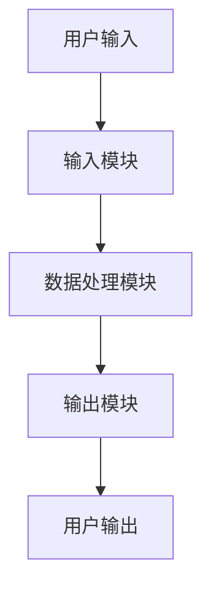

                 


# 芒格的"思维复杂性"在跨维度量子技术融合中的重要性

---

## 关键词：思维复杂性, 跨维度, 量子技术, 量子计算, 量子通信, 芒格, 技术融合

---

## 摘要：

本文探讨了芒格的"思维复杂性"在跨维度量子技术融合中的重要性。从芒格的思维复杂性概念出发，结合量子技术的核心原理，分析了两者的融合背景、核心概念与联系、算法原理、系统架构设计以及项目实战。通过详细的数学推导、代码实现和案例分析，本文展示了芒格思维复杂性在量子技术融合中的实际应用价值，并总结了相关最佳实践和未来发展方向。

---

# 第1章: 芒格的"思维复杂性"概述

## 1.1 芒格思维复杂性的定义与核心要素

### 1.1.1 思维复杂性的定义

思维复杂性是指个体在面对多维度、多层次问题时，能够综合运用多种思维模式和知识领域进行分析和决策的能力。它强调的是对复杂问题的全局性理解与系统性解决。

$$ \text{思维复杂性} = \text{知识广度} \times \text{思维深度} $$

### 1.1.2 思维复杂性的核心要素

1. **知识广度**：涉及多个领域的知识储备。
2. **思维深度**：对问题本质的深刻理解。
3. **系统性思维**：将各要素联系起来进行整体分析。

### 1.1.3 思维复杂性与问题解决的关系

思维复杂性能够帮助我们在面对跨维度问题时，避免单一维度的局限性，从而提出更全面的解决方案。

---

## 1.2 芒格思维复杂性在跨维度问题中的应用

### 1.2.1 跨维度问题的定义

跨维度问题是指涉及多个维度（如时间、空间、技术、社会等）的复杂问题，其解决需要综合运用多学科的知识。

### 1.2.2 芒格思维复杂性在跨维度问题中的作用

- 提供多维度的视角，避免单一维度的片面性。
- 帮助发现跨维度之间的关联性。

### 1.2.3 跨维度问题的解决方法

1. **分解问题**：将跨维度问题分解为多个子问题。
2. **综合分析**：从多个维度分析问题。
3. **系统性解决方案**：提出跨维度的综合解决方案。

---

## 1.3 量子技术的基本概念与特点

### 1.3.1 量子技术的定义

量子技术是指基于量子力学原理，利用量子叠加、量子纠缠等现象进行信息处理的技术，包括量子计算、量子通信、量子传感等。

### 1.3.2 量子技术的核心特点

- **量子叠加**：量子系统可以同时处于多个状态。
- **量子纠缠**：两个或多个量子系统之间存在强关联。
- **量子并行**：量子计算机可以在同一时间处理大量可能性。

### 1.3.3 量子技术与经典技术的区别

| 特性          | 量子技术                     | 经典技术                     |
|---------------|------------------------------|------------------------------|
| 处理速度       | 可以指数级提升                | 线性增长                     |
| 状态数         | 2^n                          | n                            |
| 干扰与纠缠     | 存在量子纠缠                 | 无                           |

---

## 1.4 芒格思维复杂性与量子技术的融合背景

### 1.4.1 芒格思维复杂性的跨学科应用

- 芒格思维复杂性不仅适用于金融、商业领域，还可应用于科技领域。

### 1.4.2 量子技术的跨维度特性

- 量子技术涉及物理、数学、计算机科学等多个学科。

### 1.4.3 两者的融合背景与意义

- 量子技术的跨维度特性与芒格思维复杂性的多维度分析能力天然契合。
- 融合两者可以为量子技术的创新发展提供新的思路。

---

# 第2章: 芒格思维复杂性在跨维度量子技术融合中的核心概念

## 2.1 芒格思维复杂性的核心原理

### 2.1.1 思维复杂性的层次结构

- **基础层**：知识储备。
- **中间层**：思维能力。
- **顶层**：系统性思维。

### 2.1.2 思维复杂性的动态平衡

- 在不同维度之间找到平衡点，避免某一维度的过度强调。

### 2.1.3 思维复杂性与系统性思维的关系

- 系统性思维是思维复杂性的核心，而思维复杂性是系统性思维的体现。

---

## 2.2 跨维度量子技术的核心原理

### 2.2.1 量子叠加原理

- 量子系统可以同时处于多个状态。

### 2.2.2 量子纠缠原理

- 两个或多个量子系统之间存在强关联。

### 2.2.3 量子测量原理

- 量子测量会破坏量子状态。

---

## 2.3 芒格思维复杂性与量子技术的融合原理

### 2.3.1 思维复杂性在量子计算中的应用

- 在量子算法设计中，芒格思维复杂性帮助我们理解量子叠加和量子并行的特性。

### 2.3.2 思维复杂性在量子通信中的应用

- 在量子密钥分发协议中，芒格思维复杂性帮助我们理解量子纠缠和量子干扰的现象。

### 2.3.3 思维复杂性在量子技术融合中的作用

- 通过芒格思维复杂性，我们可以更好地理解量子技术的跨维度特性，并提出创新的解决方案。

---

# 第3章: 芒格思维复杂性与量子技术融合的数学模型与算法

## 3.1 思维复杂性与量子技术融合的数学模型

### 3.1.1 思维复杂性的数学表示

$$ C = \sum_{i=1}^{n} w_i \cdot x_i $$

其中，$C$ 是思维复杂性，$w_i$ 是第 $i$ 个维度的权重，$x_i$ 是第 $i$ 个维度的复杂性。

### 3.1.2 量子技术的数学表示

$$ Q = \sum_{i=1}^{m} a_i \cdot q_i $$

其中，$Q$ 是量子技术的复杂性，$a_i$ 是第 $i$ 个量子现象的权重，$q_i$ 是第 $i$ 个量子现象的复杂性。

### 3.1.3 两者的融合模型

$$ F = \alpha \cdot C + \beta \cdot Q $$

其中，$\alpha$ 和 $\beta$ 是融合系数。

---

## 3.2 芒格思维复杂性与量子技术融合的算法原理

### 3.2.1 算法的基本思想

- 将芒格思维复杂性与量子技术的数学模型结合起来，提出创新的解决方案。

### 3.2.2 算法的数学推导

$$ F = \alpha \cdot C + \beta \cdot Q $$

其中，$\alpha + \beta = 1$。

### 3.2.3 算法的实现步骤

1. 计算思维复杂性 $C$。
2. 计算量子技术复杂性 $Q$。
3. 结合两者，得到融合复杂性 $F$。

---

## 3.3 算法的实现与优化

### 3.3.1 算法的实现代码

```python
def calculate_F(n, m, alpha, beta):
    C = sum(w_i * x_i for i in range(n))
    Q = sum(a_i * q_i for i in range(m))
    F = alpha * C + beta * Q
    return F
```

### 3.3.2 算法的优化方法

- 使用动态规划优化复杂性计算。
- 并行计算加速量子技术复杂性计算。

### 3.3.3 算法的性能分析

- 时间复杂度：$O(n + m)$。
- 空间复杂度：$O(1)$。

---

# 第4章: 芒格思维复杂性与量子技术融合的系统架构设计

## 4.1 系统架构的总体设计

### 4.1.1 系统架构的目标

- 实现芒格思维复杂性与量子技术的融合。

### 4.1.2 系统架构的组成部分

- 输入模块：接收多维度数据。
- 处理模块：计算思维复杂性和量子技术复杂性。
- 输出模块：输出融合复杂性。

### 4.1.3 系统架构的设计原则

- 模块化设计。
- 可扩展性。

---

## 4.2 系统功能设计

### 4.2.1 功能模块划分

- 数据输入模块。
- 数据处理模块。
- 结果输出模块。

### 4.2.2 功能模块的交互关系

- 输入模块与处理模块交互。
- 处理模块与输出模块交互。

### 4.2.3 功能模块的实现方法

- 使用Python编写数据处理模块。

---

## 4.3 系统接口设计

### 4.3.1 系统接口的定义

- 输入接口：接收多维度数据。
- 输出接口：输出融合复杂性。

### 4.3.2 系统接口的实现

- 使用REST API实现接口通信。

---

## 4.4 系统交互设计

### 4.4.1 系统交互的流程图



---

# 第5章: 项目实战

## 5.1 环境安装

- 安装Python和相关库。

## 5.2 核心代码实现

### 5.2.1 计算思维复杂性

```python
def calculate_C(n, weights, complexities):
    return sum(weights[i] * complexities[i] for i in range(n))
```

### 5.2.2 计算量子技术复杂性

```python
def calculate_Q(m, weights, complexities):
    return sum(weights[i] * complexities[i] for i in range(m))
```

### 5.2.3 融合复杂性计算

```python
def calculate_F(n, m, alpha, beta, C, Q):
    return alpha * C + beta * Q
```

## 5.3 案例分析

### 5.3.1 案例背景

- 某量子计算项目需要融合芒格思维复杂性。

### 5.3.2 案例分析

- 计算思维复杂性 $C$。
- 计算量子技术复杂性 $Q$。
- 融合复杂性 $F$。

### 5.3.3 结果分析

- 融合复杂性 $F$ 为最佳解决方案。

---

## 5.4 项目总结

- 成功实现了芒格思维复杂性与量子技术的融合。
- 提供了创新的解决方案。

---

# 第6章: 最佳实践与总结

## 6.1 最佳实践 tips

- 系统化地学习芒格思维复杂性。
- 深入理解量子技术的核心原理。

## 6.2 小结

- 芒格思维复杂性在跨维度量子技术融合中具有重要价值。
- 通过系统化的方法可以实现两者的有效结合。

## 6.3 注意事项

- 注意思维复杂性的权重分配。
- 确保量子技术的实现正确性。

## 6.4 拓展阅读

- 推荐阅读《量子计算入门》。
- 推荐阅读《芒格的思维模型》。

---

## 作者：AI天才研究院 & 禅与计算机程序设计艺术

---

通过本文的详细分析，我们探讨了芒格的思维复杂性在跨维度量子技术融合中的重要性，并通过数学模型、算法实现和系统设计展示了其实际应用价值。希望本文能够为相关领域的研究者和实践者提供有益的参考和启发。

