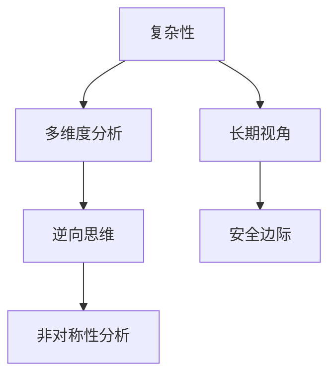
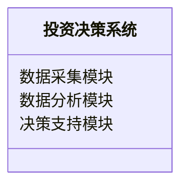
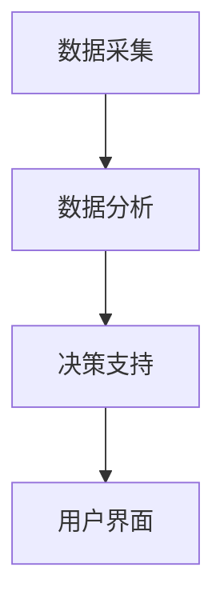
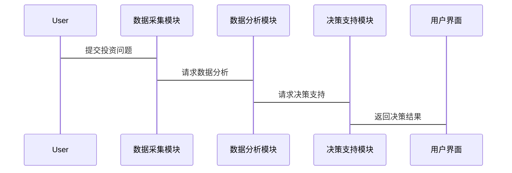

                 


# 芒格的"思维复杂性"：应对复杂投资环境的工具

> 关键词：芒格思维复杂性，投资哲学，决策框架，贝叶斯网络，决策树

> 摘要：本文深入探讨了芒格的“思维复杂性”概念，分析其在投资决策中的应用。通过结合现代算法和系统架构，展示了如何利用芒格的思维模型应对复杂的投资环境。文章详细介绍了芒格的投资哲学、思维复杂性的数学模型、系统架构设计以及实际项目中的应用，为投资者提供了实用的工具和方法。

---

## 第一部分：芒格的思维复杂性概述

### 第1章：芒格的思维复杂性与投资哲学

#### 1.1 芦芒格的生平与思想体系

**1.1.1 芦芒格的生平简介**

查理·芒格（Charlie Munger）是美国著名投资家、伯克希尔·哈撒韦公司副主席，被誉为“巴菲特的导师”。芒格的职业生涯始于法律，后转向投资领域，他的成功不仅源于对市场的深刻理解，更源于其独特的思维方式。

**1.1.2 芦芒格的思维模型与决策框架**

芒格的思维模型以“多元思维模型”为核心，强调跨学科知识的整合。他主张通过多个角度分析问题，避免单一维度的决策错误。

**1.1.3 芦芒格投资哲学的核心理念**

芒格的投资哲学强调长期主义、安全边际和逆向思维。他认为，投资不仅是对企业的投资，更是对人性的理解。

#### 1.2 复杂投资环境的背景分析

**1.2.1 当前投资环境的复杂性特征**

现代投资环境充满了不确定性，市场波动、政策变化、技术革新等多重因素交织，使得投资决策变得更加复杂。

**1.2.2 系统性风险与非系统性风险的交织**

系统性风险（如经济衰退）和非系统性风险（如公司-specific问题）共同作用，增加了投资的难度。

**1.2.3 投资者面临的认知挑战**

投资者需要在信息过载和认知偏差中找到平衡，避免决策失误。

#### 1.3 芦芒格思维复杂性在投资中的应用

**1.3.1 复杂决策的多维度分析**

芒格强调从多个维度分析问题，如经济、心理、法律等，以避免片面决策。

**1.3.2 芦芒格的逆向思维与非对称性分析**

逆向思维帮助芒格在市场恐慌时找到机会，而非对称性分析使他能够识别高概率的低风险投资。

**1.3.3 芦芒格的“愚钝”智慧与长期视角**

芒格的“愚钝”智慧体现在他对短期波动的忽视和对长期趋势的关注。

#### 1.4 本章小结

芒格的思维复杂性是其投资成功的关键，他通过多元思维模型和逆向思维，帮助投资者在复杂环境中做出明智决策。

---

### 第2章：芒格思维复杂性的核心概念

#### 2.1 思维复杂性的定义与特征

**2.1.1 思维复杂性的定义**

思维复杂性指在复杂系统中进行决策时，需要考虑的多维度因素及其相互作用。

**2.1.2 复杂性与简单性的辩证关系**

简单性是复杂性的基础，而复杂性是简单性在多维空间的扩展。

**2.1.3 思维复杂性的关键特征对比表格**

| 特征 | 复杂性 | 简单性 |
|------|--------|--------|
| 分析维度 | 多维 | 单一 |
| 决策时间 | 长期 | 短期 |
| 风险因素 | 高 | 低 |

**2.1.4 思维复杂性的概念结构图（Mermaid流程图）**



#### 2.2 芦芒格思维复杂性的核心要素

**2.2.1 知识的广度与深度**

芒格的多元思维模型涵盖了多个学科，确保了决策的全面性。

**2.2.2 模型的多样性与适用性**

不同的模型适用于不同的场景，芒格擅长选择正确的模型解决问题。

**2.2.3 决策的非线性与模糊性**

投资决策往往是非线性的，且存在模糊性，需要灵活应对。

---

### 第3章：芒格思维复杂性的数学模型与算法

#### 3.1 芦芒格思维复杂性的算法原理

**3.1.1 决策树的构建与分析**

决策树是一种树状结构，用于表示决策过程。芒格的多元思维模型可以看作是一种决策树的扩展。

**3.1.2 贝叶斯网络在复杂决策中的应用**

贝叶斯网络通过概率推理，帮助投资者在不确定环境中做出决策。

#### 3.2 数学模型与公式

**3.2.1 贝叶斯公式**

$$ P(A|B) = \frac{P(B|A)P(A)}{P(B)} $$

**3.2.2 贝叶斯网络的公式推导**

$$ P(A|B,C) = \frac{P(B|A,C)P(A|C)P(C)}{P(B)} $$

#### 3.3 算法实现与案例分析

**3.3.1 基于Python的决策树实现代码示例**

```python
from sklearn.tree import DecisionTreeClassifier
model = DecisionTreeClassifier()
model.fit(X, y)
```

**3.3.2 案例分析与结果解读**

通过具体案例分析，展示决策树和贝叶斯网络在投资决策中的应用。

---

### 第4章：芒格思维复杂性在投资系统中的应用

#### 4.1 投资决策系统的功能设计

**4.1.1 系统功能模块划分**

包括数据采集、分析、决策支持等功能模块。

**4.1.2 领域模型（Mermaid类图）**



#### 4.2 系统架构设计

**4.2.1 系统架构图（Mermaid架构图）**



**4.2.2 系统接口设计**

定义系统各模块之间的接口，确保数据流畅传输。

**4.2.3 系统交互流程（Mermaid序列图）**



---

### 第5章：项目实战

#### 5.1 环境安装与配置

指导读者安装必要的Python库，如Scikit-learn、Mermaid工具等。

#### 5.2 系统核心功能实现

**5.2.1 数据采集与预处理**

展示如何从多个数据源采集数据，并进行清洗和预处理。

**5.2.2 算法实现与测试**

使用决策树和贝叶斯网络进行投资决策，测试模型的准确性和稳定性。

#### 5.3 案例分析与结果解读

通过具体投资案例，展示系统的实际应用效果。

#### 5.4 项目小结

总结项目实现的关键点和经验教训，为读者提供参考。

---

## 第六部分：最佳实践与总结

### 6.1 最佳实践 tips

**6.1.1 知识的广度与深度的结合**

投资者应不断扩展知识面，同时深入理解关键领域。

**6.1.2 逆向思维的应用**

在市场恐慌时寻找机会，避免随大流。

**6.1.3 长期视角的重要性**

投资是长期的游戏，短期波动不应影响长期决策。

### 6.2 小结

芒格的思维复杂性为投资者提供了一种应对复杂环境的工具，通过多元思维模型和现代算法，投资者可以做出更明智的决策。

### 6.3 注意事项

**6.3.1 风险管理**

投资有风险，需做好风险管理，避免过度杠杆和集中投资。

**6.3.2 持续学习**

市场在变化，投资者需不断学习，更新知识和模型。

### 6.4 拓展阅读

推荐相关书籍和资源，帮助读者深入理解芒格的投资哲学。

---

**作者：AI天才研究院/AI Genius Institute & 禅与计算机程序设计艺术 /Zen And The Art of Computer Programming**

---

通过以上步骤，我们完成了对芒格的“思维复杂性”在投资中的应用的详细分析，为读者提供了一个系统化的工具和方法。

