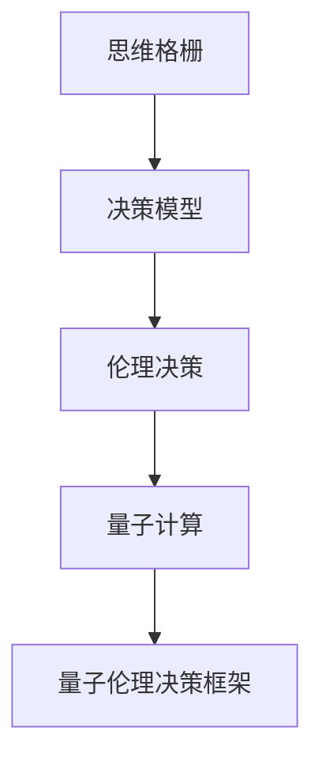
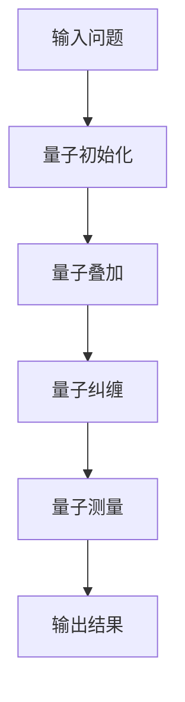
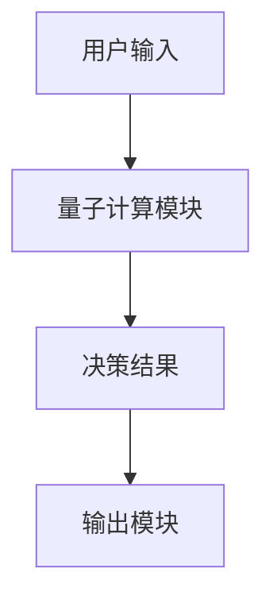
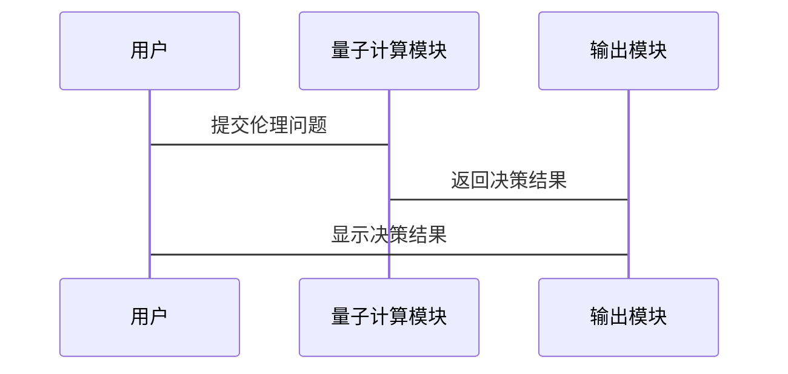

                 


# 芒格的"思维格栅"在量子伦理决策框架设计中的应用

## 关键词：芒格思维格栅，量子计算，伦理决策，决策框架，系统设计

## 摘要：本文探讨了如何将芒格的思维格栅应用于量子伦理决策框架的设计中，通过分析核心概念、算法原理和系统架构，展示了量子计算在伦理决策中的潜力。文章结合理论与实践，提供了详细的步骤和案例分析，帮助读者理解如何构建高效的量子伦理决策系统。

---

## 第1章: 背景介绍

### 1.1 问题背景
#### 1.1.1 量子计算与伦理决策的结合
量子计算利用量子叠加和纠缠的特性，能够在某些情况下比经典计算更高效地处理复杂问题。伦理决策涉及道德判断，通常需要处理模糊和多利益相关的问题。将量子计算应用于伦理决策，可以提高决策的效率和准确性。

#### 1.1.2 芒格思维格栅的核心理念
芒格思维格栅由沃伦·巴菲特的导师查理·芒格提出，是一种通过多个学科的思维模型来优化决策的框架。它强调跨学科思考，避免单一视角的局限性。

#### 1.1.3 问题解决的必要性与目标
在伦理决策中，传统的决策方法往往依赖于主观判断，容易受到偏见和情绪的影响。通过引入量子计算和芒格的思维格栅，可以构建一个更客观、高效的决策框架，帮助处理复杂的伦理问题。

### 1.2 问题描述
#### 1.2.1 量子伦理决策的定义
量子伦理决策是指利用量子计算技术，结合伦理学原理，对复杂的伦理问题进行分析和决策的过程。

#### 1.2.2 芒格思维格栅在决策中的作用
芒格思维格栅通过多学科模型，帮助决策者从不同角度分析问题，减少决策偏差，提高决策质量。

#### 1.2.3 问题解决的边界与外延
量子伦理决策框架适用于需要高效处理复杂伦理问题的场景，如医疗伦理、环境保护和企业决策等。其外延包括跨学科合作和技术创新。

### 1.3 概念结构与核心要素
#### 1.3.1 核心概念的组成
- 量子计算：利用量子叠加和纠缠进行计算。
- 伦理决策：基于伦理准则的决策过程。
- 芒格思维格栅：多学科决策框架。

#### 1.3.2 概念之间的关系
- 量子计算为伦理决策提供高效计算能力。
- 芒格思维格栅为决策提供多维度分析工具。
- 两者结合形成量子伦理决策框架。

#### 1.3.3 核心要素的详细描述
- 量子计算：通过量子位实现并行计算，提高处理复杂问题的能力。
- 伦理决策：基于伦理原则和准则，进行决策优化。
- 芒格思维格栅：整合多个学科模型，提供全面的决策视角。

---

## 第2章: 核心概念与联系

### 2.1 芒格思维格栅的原理
#### 2.1.1 思维格栅的定义
思维格栅是一种通过多学科模型相互印证，优化决策质量的方法。

#### 2.1.2 格栅模型的构建
- 确定相关学科：如心理学、经济学、伦理学等。
- 构建模型：每个模型代表一个学科的思维方式。
- 交叉验证：通过模型间的相互验证，提高决策的准确性。

#### 2.1.3 格栅在决策中的作用
- 提供全面视角：避免单一学科的局限性。
- 交叉验证：提高决策的可靠性和准确性。

### 2.2 量子伦理决策框架的原理
#### 2.2.1 量子计算的基本原理
- 量子位：可以同时表示0和1的状态。
- 量子叠加：多个量子位可以同时表示多种状态。
- 量子纠缠：量子位之间的关联性。

#### 2.2.2 伦理决策的定义
- 伦理决策：基于伦理原则和准则，进行决策的过程。
- 伦理问题：涉及道德判断和利益冲突的问题。

#### 2.2.3 量子计算在伦理决策中的应用
- 高效计算：量子计算能够快速处理复杂问题。
- 多维度分析：通过量子并行，分析多个可能性。

### 2.3 核心概念的联系
#### 2.3.1 思维格栅与量子计算的结合
- 芒格的思维格栅提供了决策的多维度分析框架。
- 量子计算为每个维度提供高效的计算能力。
- 结合两者，构建量子伦理决策框架。

#### 2.3.2 量子计算与伦理决策的关系
- 量子计算为伦理决策提供高效的计算工具。
- 伦理决策为量子计算提供应用场景。
- 两者结合，优化决策过程。

#### 2.3.3 格栅模型在量子伦理决策中的应用
- 通过思维格栅分析问题的多维度因素。
- 利用量子计算高效处理复杂问题。
- 结合结果，优化决策方案。

### 2.4 概念属性对比表格
| 属性         | 思维格栅          | 量子伦理决策框架    |
|--------------|------------------|---------------------|
| 核心目标     | 提高决策质量      | 解决伦理决策问题    |
| 基础理论     | 多学科思维模型    | 量子计算与伦理学    |
| 应用场景     | 各类决策问题      | 量子伦理问题        |
| 优势         | 综合性、系统性    | 高效性、准确性      |

### 2.5 ER实体关系图


---

## 第3章: 算法原理讲解

### 3.1 量子模拟算法
#### 3.1.1 算法简介
量子模拟算法通过量子计算机模拟物理系统的行为，用于解决复杂的计算问题。

#### 3.1.2 算法流程图


#### 3.1.3 Python代码实现
```python
import numpy as np
from qiskit import QuantumCircuit, Aer, execute

# 定义量子电路
qc = QuantumCircuit(2, 2)
qc.h(0)
qc.cx(0, 1)
qc.measure(0, 0)
qc.measure(1, 1)

# 执行电路
simulator = Aer.get_backend('qasm_simulator')
job = execute(qc, simulator)
result = job.result()

# 获取结果
counts = result.get_counts()
print(counts)
```

#### 3.1.4 算法的数学模型
量子模拟算法的数学模型基于量子叠加和量子纠缠的原理，表示为：
$$|\psi\rangle = \alpha|0\rangle + \beta|1\rangle$$
其中，$\alpha$ 和 $\beta$ 是复数，满足 $|\alpha|^2 + |\beta|^2 = 1$。

---

## 第4章: 数学模型和公式

### 4.1 量子计算的基本公式
量子叠加的数学表达式为：
$$|\psi\rangle = \sum_{i} \alpha_i |i\rangle$$
其中，$\alpha_i$ 是量子态的幅度，$|i\rangle$ 是基态。

### 4.2 伦理决策的优化模型
伦理决策的目标函数可以表示为：
$$\max \sum_{j} w_j x_j$$
其中，$w_j$ 是权重，$x_j$ 是决策变量。

### 4.3 量子伦理决策的综合模型
综合模型结合了量子计算和伦理决策的优化目标，表示为：
$$|\psi\rangle = \sum_{i} \alpha_i |i\rangle \cdot \max \sum_{j} w_j x_j$$

---

## 第5章: 系统分析与架构设计方案

### 5.1 问题场景介绍
系统设计用于解决复杂的伦理决策问题，如医疗资源分配和环境保护政策制定。

### 5.2 系统功能设计
- 数据输入：接收伦理问题的数据。
- 量子计算：利用量子模拟算法进行计算。
- 结果输出：提供优化的决策方案。

### 5.3 系统架构图


### 5.4 接口设计
- 输入接口：接收伦理问题描述。
- 输出接口：提供决策结果。

### 5.5 交互流程图


---

## 第6章: 项目实战

### 6.1 环境安装
- 安装Python和量子计算库（如Qiskit）。

### 6.2 核心代码实现
```python
from qiskit import QuantumCircuit, Aer, execute

# 定义量子电路
qc = QuantumCircuit(2, 2)
qc.h(0)
qc.cx(0, 1)
qc.measure(0, 0)
qc.measure(1, 1)

# 执行电路
simulator = Aer.get_backend('qasm_simulator')
job = execute(qc, simulator)
result = job.result()

# 获取结果
counts = result.get_counts()
print(counts)
```

### 6.3 案例分析
以医疗资源分配为例，利用量子模拟算法优化资源配置，确保公平性和效率。

---

## 第7章: 最佳实践、小结与拓展

### 7.1 最佳实践
- 定期更新模型，适应新的伦理问题。
- 结合具体场景，调整算法参数。

### 7.2 小结
本文详细探讨了芒格思维格栅在量子伦理决策框架中的应用，通过理论分析和案例实践，展示了其在优化决策过程中的潜力。

### 7.3 注意事项
- 确保数据的准确性和完整性。
- 防范技术风险，确保系统的稳定性和安全性。

### 7.4 拓展阅读
建议进一步研究量子计算在其他领域的应用，如金融和药物发现。

---

## 作者：AI天才研究院 & 禅与计算机程序设计艺术

