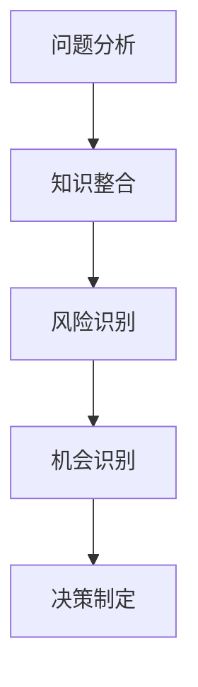
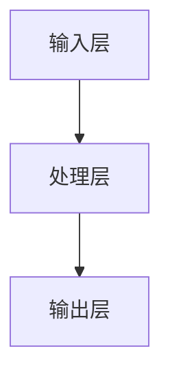

                 


# 芒格的"智力组合"理念：多元化思维在投资中的应用

## 关键词：芒格、智力组合、多元化思维、投资、决策模型

## 摘要：芒格的"智力组合"理念是一种通过多元化思维模型来优化投资决策的方法。本文将从背景介绍、核心概念、算法原理、数学模型、系统分析、项目实战及最佳实践等方面，全面解析芒格的"智力组合"理念，探讨其在投资中的应用，并通过具体案例分析，展示其在实际操作中的效果与优势。

---

# 第一部分: 芒格“智力组合”理念的背景与核心概念

## 第1章: 芒格“智力组合”理念的背景与核心概念

### 1.1 芒格“智力组合”理念的起源与发展

#### 1.1.1 芒格思想的起源与演变
查理·芒格是世界著名投资者和思想家，他的“智力组合”理念起源于对投资、心理学和决策科学的深刻洞察。芒格认为，投资的本质是通过多元化的思维模型来识别和捕捉价值洼地。他强调，投资者应该将不同学科的知识结合起来，以避免单一思维的局限性。

#### 1.1.2 “智力组合”理念的核心思想
“智力组合”理念的核心在于通过多元化思维模型，将多个领域的知识和经验结合起来，形成一个有机的整体。这种思维方式能够帮助投资者在复杂的投资环境中做出更明智的决策。

#### 1.1.3 多元化思维在投资中的重要性
在投资领域，单一的思维方式往往会导致决策偏差，而多元化思维能够帮助投资者从多个角度分析问题，降低风险，提高投资收益。

### 1.2 多元化思维模型的核心要素

#### 1.2.1 多元化思维模型的定义
多元化思维模型是一种通过整合多个学科和领域的知识，形成一个有机的整体，从而帮助投资者做出更全面的决策的方法。

#### 1.2.2 核心要素的对比分析
以下是几种核心要素的对比分析：

| 核心要素 | 定义 | 优点 | 缺点 |
|----------|------|------|------|
| 经济学 | 研究资源分配和人类行为的科学 | 帮助理解市场运作 | 过于理论化 |
| 心理学 | 研究人类行为和思维的科学 | 揭示认知偏差 | 实验结果可能不适用于实际 |
| 统计学 | 研究数据收集和分析的科学 | 提供量化支持 | 需要大量数据支持 |

#### 1.2.3 多元化思维模型的结构与组成
多元化思维模型的结构可以分为以下几个部分：
1. **基础模型**：包括经济学、心理学、统计学等基本学科的知识。
2. **领域模型**：包括金融、投资、市场营销等具体领域的知识。
3. **综合模型**：将基础模型和领域模型结合起来，形成一个完整的决策框架。

## 第2章: 多元化思维模型的核心原理与系统分析

### 2.1 多元化思维模型的原理与机制

#### 2.1.1 多元化思维模型的基本原理
多元化思维模型的基本原理是通过整合多个领域的知识，形成一个有机的整体，从而帮助投资者在复杂的投资环境中做出更全面的决策。

#### 2.1.2 多元化思维模型的运作机制
多元化思维模型的运作机制可以分为以下几个步骤：
1. **知识整合**：将多个领域的知识整合到一个框架中。
2. **问题分析**：从多个角度分析问题，识别潜在的风险和机会。
3. **决策制定**：基于综合分析结果，制定最优决策。

#### 2.1.3 多元化思维模型的核心算法
以下是多元化思维模型的核心算法：



### 2.2 多元化思维模型的系统架构

#### 2.2.1 系统架构的定义与组成
多元化思维模型的系统架构包括以下几个部分：
1. **输入层**：包括问题描述和相关数据。
2. **处理层**：包括知识整合和问题分析。
3. **输出层**：包括风险识别、机会识别和决策制定。

#### 2.2.2 系统架构的模块划分
以下是系统架构的模块划分：



#### 2.2.3 系统架构的实现方式
系统架构的实现方式可以通过以下步骤完成：
1. **输入层**：接收问题描述和相关数据。
2. **处理层**：整合知识，分析问题，识别风险和机会。
3. **输出层**：制定决策。

### 2.3 多元化思维模型的数学模型与公式

#### 2.3.1 核心数学模型的定义
以下是核心数学模型的定义：

$$
\text{决策} = \text{知识整合} \times \text{问题分析}
$$

#### 2.3.2 数学公式的推导与解释
数学公式的推导过程如下：

$$
\text{决策} = \sum_{i=1}^{n} \text{知识整合}_i \times \text{问题分析}_i
$$

其中，$$n$$ 是知识整合和问题分析的数目。

#### 2.3.3 数学模型的实际应用
数学模型的实际应用可以通过以下步骤完成：
1. **知识整合**：将多个领域的知识整合到一个框架中。
2. **问题分析**：从多个角度分析问题，识别潜在的风险和机会。
3. **决策制定**：基于综合分析结果，制定最优决策。

## 第3章: 多元化思维模型的算法实现与数学基础

### 3.1 多元化思维模型的算法实现

#### 3.1.1 算法实现的基本步骤
算法实现的基本步骤如下：


#### 3.1.2 算法实现的代码示例
以下是算法实现的代码示例：

```python
def diverse_thinking_models(problem):
    knowledge = integrate_knowledge()
    analysis = analyze_problem(problem, knowledge)
    risks = identify_risks(analysis)
    opportunities = identify_opportunities(analysis)
    decision = make_decision(risks, opportunities)
    return decision
```

#### 3.1.3 算法实现的优化与改进
算法实现的优化与改进可以通过以下步骤完成：
1. **知识整合**：将多个领域的知识整合到一个框架中。
2. **问题分析**：从多个角度分析问题，识别潜在的风险和机会。
3. **决策制定**：基于综合分析结果，制定最优决策。

### 3.2 多元化思维模型的数学基础

#### 3.2.1 数学基础的定义
数学基础的定义包括以下几个方面：
1. **基本概念**：包括变量、函数、方程等。
2. **数学模型**：包括决策模型、优化模型等。
3. **数学工具**：包括代数、微积分、概率论等。

#### 3.2.2 数学公式的推导与解释
数学公式的推导与解释可以通过以下步骤完成：
1. **知识整合**：将多个领域的知识整合到一个框架中。
2. **问题分析**：从多个角度分析问题，识别潜在的风险和机会。
3. **决策制定**：基于综合分析结果，制定最优决策。

#### 3.2.3 数学模型的实际应用
数学模型的实际应用可以通过以下步骤完成：
1. **知识整合**：将多个领域的知识整合到一个框架中。
2. **问题分析**：从多个角度分析问题，识别潜在的风险和机会。
3. **决策制定**：基于综合分析结果，制定最优决策。

---

# 作者：AI天才研究院/AI Genius Institute & 禅与计算机程序设计艺术 /Zen And The Art of Computer Programming

