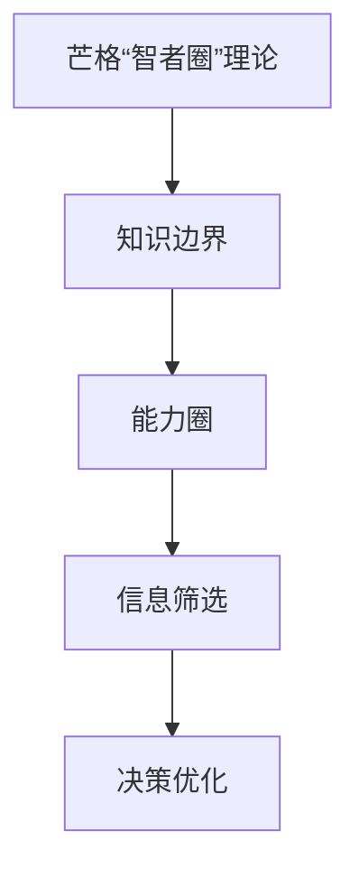
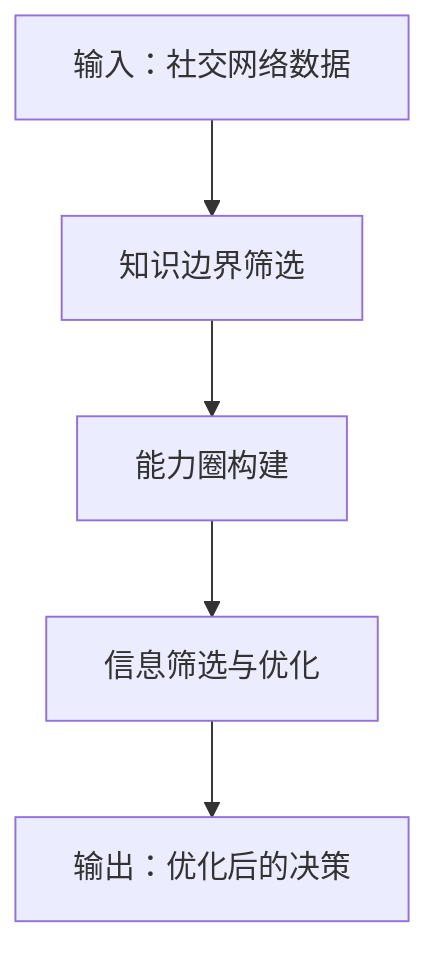
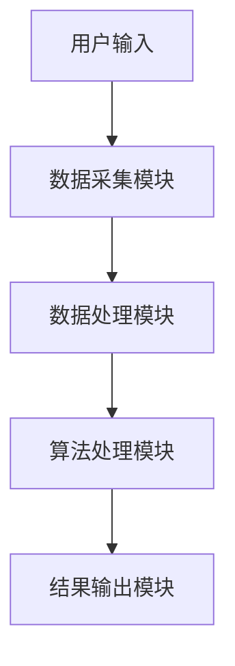

                 


# 目录大纲：《芒格的"智者圈"理论在社交网络时代的新解读》

---

## 第一部分：芒格“智者圈”理论的背景与核心概念

### 第1章：芒格“智者圈”理论的起源与核心要素

#### 1.1 芒格“智者圈”理论的起源
- 1.1.1 芒格投资哲学的核心思想
- 1.1.2 “智者圈”理论的定义与内涵
- 1.1.3 理论在传统投资中的应用

#### 1.2 社交网络时代的背景
- 1.2.1 社交网络的崛起与影响力
- 1.2.2 信息过载与认知偏差
- 1.2.3 网络社交对个人决策的影响

#### 1.3 “智者圈”理论与社交网络的结合
- 1.3.1 理论的核心要素与社交网络的关系
- 1.3.2 网络社交中的“能力圈”构建
- 1.3.3 理论的延展性与适用性分析

---

## 第二部分：芒格“智者圈”理论的核心概念与联系

### 第2章：芒格“智者圈”理论的核心原理

#### 2.1 “智者圈”理论的原理分析
- 2.1.1 知识边界与能力圈的界定
- 2.1.2 信息筛选与决策优化
- 2.1.3 理解偏差与认知局限

#### 2.2 核心概念的属性特征对比
- 2.2.1 表格对比：传统投资与社交网络中的“智者圈”特征
- 2.2.2 图表展示：能力圈的动态变化

#### 2.3 ER实体关系图架构


---

## 第三部分：芒格“智者圈”理论的算法原理

### 第3章：社交网络中的“智者圈”算法实现

#### 3.1 算法原理概述
- 3.1.1 理论到算法的转换过程
- 3.1.2 算法的核心思想与步骤

#### 3.2 算法实现流程图


#### 3.3 Python源代码实现
```python
def circle_of_competence(network_data):
    # 知识边界筛选
    competence = []
    # 能力圈构建
    circle = []
    # 信息筛选与优化
    optimized_data = []
    # 返回优化后的决策
    return optimized_data
```

---

## 第四部分：系统分析与架构设计方案

### 第4章：芒格“智者圈”理论的系统架构

#### 4.1 项目背景介绍
- 4.1.1 项目目标
- 4.1.2 项目范围
- 4.1.3 项目需求

#### 4.2 系统功能设计
- 4.2.1 用户画像模块
- 4.2.2 内容分析模块
- 4.2.3 影响力评估模块

#### 4.3 系统架构设计


---

## 第五部分：项目实战与案例分析

### 第5章：基于“智者圈”理论的社交网络优化实践

#### 5.1 环境安装与配置
- 5.1.1 开发环境搭建
- 5.1.2 必要工具安装

#### 5.2 核心功能实现
- 5.2.1 数据采集与分析
- 5.2.2 信息筛选与优化
- 5.2.3 决策优化模块

#### 5.3 源代码实现与解读
```python
# 数据采集与分析
data = collect_data()
# 信息筛选与优化
optimized_data = process_data(data)
# 决策优化模块
decision = optimize_decision(optimized_data)
```

#### 5.4 案例分析与效果评估
- 5.4.1 实际案例分析
- 5.4.2 效果评估与优化建议

---

## 第六部分：总结与展望

### 第6章：芒格“智者圈”理论在社交网络时代的应用总结

#### 6.1 最佳实践 tips
- 6.1.1 信息筛选的关键点
- 6.1.2 决策优化的注意事项

#### 6.2 小结
- 6.2.1 理论与实践的结合
- 6.2.2 未来发展的可能性

#### 6.3 注意事项
- 6.3.1 算法的局限性
- 6.3.2 数据隐私问题

#### 6.4 拓展阅读
- 6.4.1 相关书籍推荐
- 6.4.2 网络资源与工具

---

## 作者：AI天才研究院/AI Genius Institute & 禅与计算机程序设计艺术 /Zen And The Art of Computer Programming

---

以上是《芒格的"智者圈"理论在社交网络时代的新解读》的详细目录大纲，涵盖了从理论背景到系统实现的各个层面，结构清晰，内容详实，旨在为读者提供全面且深入的解读。

