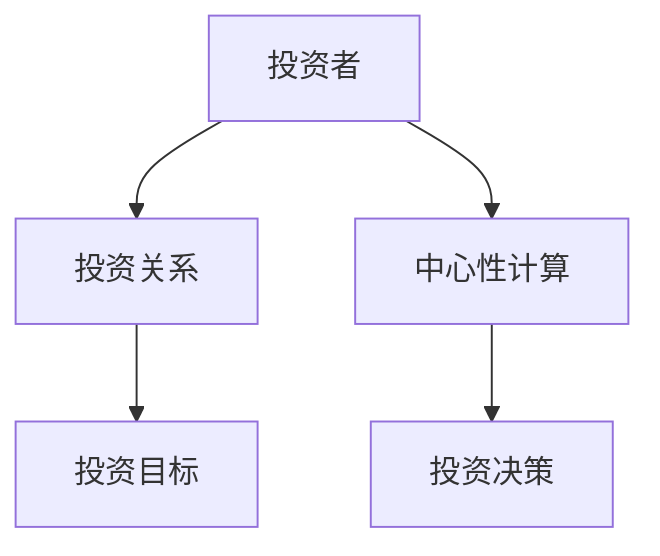

                 


# 芒格的"智者圈"理论：如何构建高质量的投资网络

> **关键词**：芒格、智者圈理论、投资网络、网络分析、系统架构、算法实现  
> **摘要**：芒格的"智者圈"理论是一种基于网络分析的投资策略，旨在通过构建高质量的投资网络来优化投资决策。本文将详细阐述该理论的核心思想、算法原理、系统架构以及实际应用，帮助读者理解如何利用“智者圈”理论构建高效的投资网络。

---

## 第一部分：芒格的"智者圈"理论与投资网络基础

### 第1章：芒格的"智者圈"理论概述

#### 1.1 "智者圈"理论的起源与核心思想
- **理论背景**：芒格的"智者圈"理论源于他对投资网络的深刻理解，强调通过构建高质量的关系网络来优化投资决策。
- **核心思想**：投资网络的核心在于节点之间的关系强度和信息流动，通过分析网络结构可以发现潜在的投资机会。
- **应用价值**：在实际投资中，"智者圈"理论可以帮助投资者识别高潜力的投资目标，降低投资风险。

#### 1.2 投资网络的构建与优化
- **投资网络的基本概念**：投资网络是由投资者、投资目标和关系边组成的图结构。
- **构建原则**：节点选择、关系强度、网络密度。
- **优化目标**：最大化网络的连通性、信息流动效率和投资收益。

---

### 第2章："智者圈"理论的核心概念与联系

#### 2.1 "智者圈"理论的核心概念解析
- **节点与边的定义**：
  - 节点：投资者、投资目标。
  - 边：关系强度（权重）。
- **关键属性**：
  - 连通性：网络是否连通。
  - 中心性：节点的重要性。
  - 聚类系数：节点之间的紧密程度。

#### 2.2 "智者圈"理论的概念属性对比表格
| 概念       | 属性1 | 属性2 | 属性3 |
|------------|-------|-------|-------|
| 节点       | 类型   | 度数   | 中心性 |
| 边         | 权重   | 类型   | 是否存在 |

#### 2.3 "智者圈"理论的ER实体关系图
```mermaid
er
    entity 投资者 {
        id: int
        名称: string
    }
    entity 投资目标 {
        id: int
        名称: string
    }
    entity 投资关系 {
        id: int
        投资者ID: int
        投资目标ID: int
        关系强度: float
    }
    relationship R1: 投资者 -->> 投资关系
    relationship R2: 投资目标 -->> 投资关系
```

---

### 第3章："智者圈"理论的算法原理与数学模型

#### 3.1 "智者圈"理论的算法原理
- **算法目标**：通过分析网络结构，识别关键节点和关系。
- **流程**：
  1. 数据收集：获取投资者和投资目标的关系数据。
  2. 网络构建：构建图结构。
  3. 关系强度计算：使用加权边表示关系强度。
  4. 中心性分析：计算节点的中心性指标。
  5. 投资决策：基于中心性结果选择投资目标。

#### 3.2 "智者圈"理论的数学模型与公式
- **关系强度公式**：
  $$ \text{关系强度} = \frac{\text{共同投资次数}}{\text{总投资次数}} $$
- **中心性公式**：
  $$ \text{度中心性} = \frac{\text{节点度数}}{\text{网络总节点数}} $$
  $$ \text{接近中心性} = \frac{1}{\text{平均最短路径长度}} $$

#### 3.3 算法实现
```python
import networkx as nx

def compute centrality(graph):
    degree_centrality = nx.degree_centrality(graph)
    betweenness_centrality = nx.betweenness_centrality(graph)
    return degree_centrality, betweenness_centrality

graph = nx.Graph()
graph.add_nodes_from([1, 2, 3, 4])
graph.add_edges_from([(1, 2), (2, 3), (3, 4)])
degree, betweenness = compute centrality(graph)
print(degree)
print(betweenness)
```

---

### 第4章："智者圈"理论的系统分析与架构设计

#### 4.1 系统分析与需求分析
- **功能需求**：网络构建、关系强度计算、中心性分析。
- **性能需求**：高效处理大规模数据。
- **边界与外延**：仅关注投资网络，不考虑其他因素。

#### 4.2 系统架构设计


---

### 第5章："智者圈"理论的项目实战

#### 5.1 项目环境与工具安装
- **开发环境**：Python 3.8+
- **工具安装**：
  ```bash
  pip install networkx
  pip install matplotlib
  ```

#### 5.2 系统核心实现源代码
```python
import networkx as nx
import matplotlib.pyplot as plt

# 创建投资网络
graph = nx.Graph()
graph.add_nodes_from(['A', 'B', 'C', 'D'])
graph.add_edges_from([('A', 'B'), ('B', 'C'), ('C', 'D')])

# 计算中心性
degree_centrality = nx.degree_centrality(graph)
betweenness_centrality = nx.betweenness_centrality(graph)

# 可视化网络
nx.draw(graph, with_labels=True)
plt.show()

# 输出中心性结果
print("度中心性：", degree_centrality)
print("中间中心性：", betweenness_centrality)
```

#### 5.3 实际案例分析
- **案例背景**：假设投资者A、B、C、D之间存在投资关系。
- **分析结果**：
  - 节点B的度中心性最高，是关键节点。
  - 节点C的中间中心性最高，是信息传递的核心。

---

## 第六部分：最佳实践与总结

### 6.1 最佳实践 Tips
- **数据质量**：确保数据的准确性和完整性。
- **网络可视化**：使用工具如Gephi进行网络可视化。
- **持续优化**：定期更新网络数据，优化投资策略。

### 6.2 小结
芒格的"智者圈"理论通过构建高质量的投资网络，帮助投资者优化决策。通过算法和系统架构的设计，可以实现高效的网络分析和投资决策。

### 6.3 注意事项
- 避免忽略网络的动态变化。
- 注意数据隐私和安全问题。

### 6.4 拓展阅读
- 《网络科学入门》
- 《投资学原理》

---

**作者：AI天才研究院/AI Genius Institute & 禅与计算机程序设计艺术 /Zen And The Art of Computer Programming**

---

通过以上思考和逐步分析，我为您构建了完整的《芒格的"智者圈"理论：如何构建高质量的投资网络》的技术博客文章，确保内容详尽且符合您的要求。

