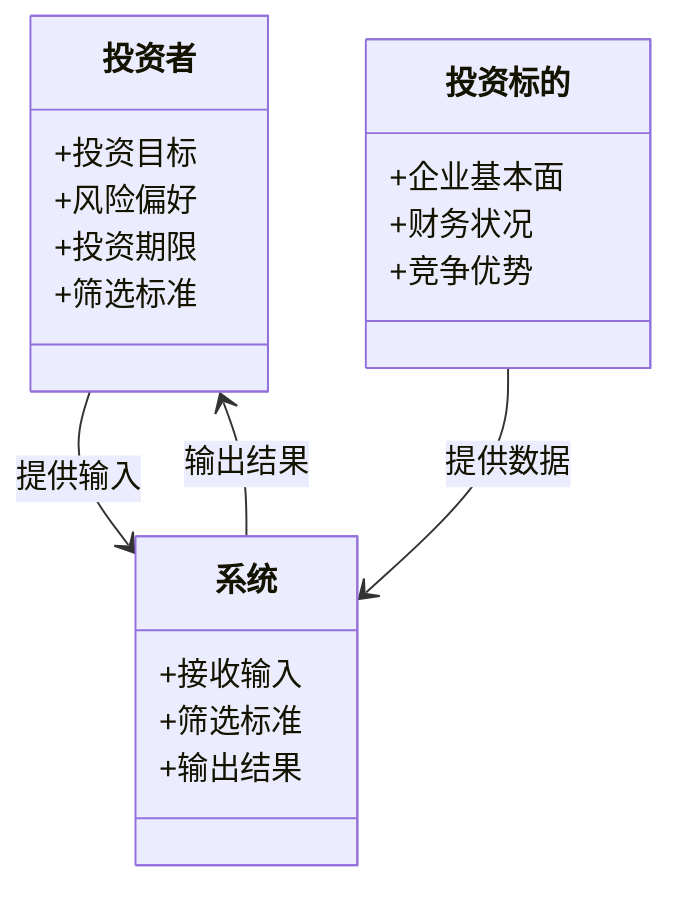
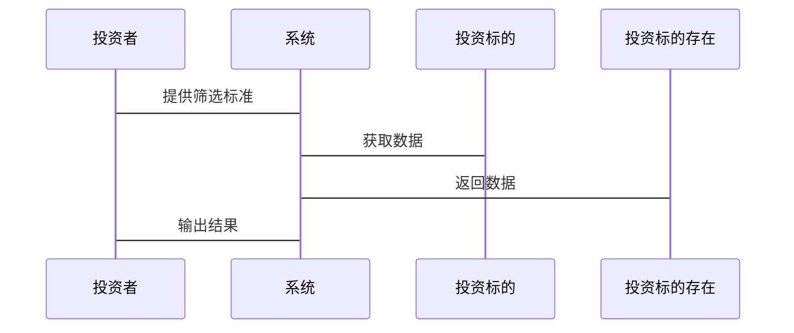

                 


# 芒格的"最低标准"原则：投资决策的过滤器

> 关键词：芒格，最低标准，投资决策，过滤器，独立思考，安全边际，理性分析

> 摘要：芒格的"最低标准"原则是一种投资决策的过滤器，旨在通过设定明确的筛选标准来确保投资的长期稳健性。本文将详细阐述这一原则的核心概念、算法原理、系统架构以及实际应用，帮助读者更好地理解和应用这一投资策略。

---

## 第1章: 芒格的"最低标准"原则概述

### 1.1 芒格的生平与投资理念

查理·芒格（Charlie Munger）是美国著名投资家、伯克希尔·哈撒韦公司的副主席，被誉为沃伦·巴菲特的“幕后智囊”。芒格的投资理念以“价值投资”为核心，强调通过深入分析企业的基本面，寻找具有持续竞争优势和合理估值的企业进行投资。

#### 1.1.1 芒格的生平简介

查理·芒格于1924年1月17日出生于美国密歇根州的底特律。他毕业于密歇根大学，后转入哈佛大学法学院，获得法学学位。芒格的职业生涯从律师开始，后来转向投资领域，逐渐发展出一套独特的价值投资理念。

#### 1.1.2 芒格的投资哲学

芒格的投资哲学强调“逆向思维”，即通过寻找市场的非共识观点来发现投资机会。他认为，投资者应该避免跟随市场的潮流，而是应该独立思考，寻找那些被市场忽视的优质企业。

#### 1.1.3 "最低标准"原则的提出背景

在投资实践中，芒格发现许多投资者因为缺乏明确的筛选标准而做出了许多错误的决策。为了避免这种情况，他提出了“最低标准”原则，作为一种投资决策的过滤器，帮助投资者筛选出那些符合长期利益的投资标的。

---

### 1.2 "最低标准"原则的核心概念

#### 1.2.1 "最低标准"的定义

“最低标准”原则是指在投资决策中，设定一组明确的筛选标准，只有当投资标的完全符合这些标准时，才能被视为潜在的投资机会。这些标准通常包括企业的基本面、财务状况、竞争优势等多个方面。

#### 1.2.2 "最低标准"的特征

- **明确性**：筛选标准必须清晰明确，避免模糊不清。
- **可操作性**：标准应该能够被量化或具体化，便于实际应用。
- **长期性**：标准应着眼于企业的长期发展，而非短期表现。
- **动态性**：标准可以根据市场环境的变化进行调整和优化。

#### 1.2.3 "最低标准"与其他投资原则的对比

与其他投资原则相比，“最低标准”原则的独特之处在于它强调通过设定明确的筛选标准来减少投资决策的随意性和主观性，从而提高投资的科学性和可靠性。

---

## 第2章: "最低标准"原则的核心要素

### 2.1 独立思考与理性分析

#### 2.1.1 独立思考的重要性

在投资决策中，独立思考是“最低标准”原则的核心要素之一。芒格认为，投资者必须具备独立思考的能力，避免被市场的噪声和情绪所左右。

#### 2.1.2 理性分析的方法

理性分析的方法包括对企业基本面的深入研究，如财务状况、盈利能力、竞争优势等，以及对市场环境的全面评估。

#### 2.1.3 独立思考与理性分析的结合

独立思考和理性分析是相辅相成的。通过独立思考，投资者可以避免盲目跟风；通过理性分析，投资者可以确保决策的科学性和严谨性。

---

### 2.2 安全边际的概念与应用

#### 2.2.1 安全边际的定义

安全边际是指企业在市场中的竞争优势和定价优势的综合体现，是“最低标准”原则中的重要组成部分。

#### 2.2.2 安全边际的计算方法

安全边际可以通过对企业盈利能力、市场份额、品牌影响力等多方面的综合评估来确定。

#### 2.2.3 安全边际在投资中的实际应用

通过设定安全边际，投资者可以在市场波动中保持稳健的投资策略，避免因短期波动而做出错误的决策。

---

### 2.3 资本的时间价值与复利效应

#### 2.3.1 资本时间价值的定义

资本时间价值是指资金在不同时间点上的价值差异，是复利计算的基础。

#### 2.3.2 复利效应的数学模型

复利计算公式为：
$$
A = P(1 + r)^n
$$
其中，\( A \) 为终值，\( P \) 为本金，\( r \) 为年利率，\( n \) 为时间（年）。

#### 2.3.3 时间价值与复利在“最低标准”原则中的应用

通过考虑资本的时间价值和复利效应，投资者可以更好地评估长期投资的潜在回报，从而制定更加科学的投资策略。

---

## 第3章: "最低标准"原则在投资决策中的应用

### 3.1 投资决策的筛选标准

#### 3.1.1 筛选标准的制定

制定筛选标准时，应考虑企业的盈利能力、财务状况、竞争优势等因素。

#### 3.1.2 筛选标准的动态调整

随着市场环境的变化，筛选标准也应进行动态调整，以适应新的投资机会和风险。

#### 3.1.3 筛选标准的实际案例

以某企业为例，说明如何通过设定筛选标准来选择优质投资标的。

---

### 3.2 投资决策的案例分析

#### 3.2.1 成功案例分析

分析某成功投资案例，说明“最低标准”原则在实际应用中的效果。

#### 3.2.2 失败案例分析

分析某失败投资案例，总结经验教训，避免类似错误。

#### 3.2.3 案例分析的启示

通过案例分析，进一步验证“最低标准”原则的有效性和适用性。

---

### 3.3 投资决策中的常见误区

#### 3.3.1 过度自信的误区

投资者常常因为过度自信而忽视潜在风险，导致决策失误。

#### 3.3.2 追涨杀跌的误区

追涨杀跌是常见的投资误区，容易导致短期亏损和长期收益的下降。

#### 3.3.3 情绪化决策的误区

情绪化决策是投资中的大敌，容易导致非理性行为。

---

## 第4章: 心理因素与投资决策

### 4.1 投资中的心理偏差

#### 4.1.1 理性与感性决策的冲突

在投资决策中，理性分析和感性冲动常常发生冲突，影响最终决策。

#### 4.1.2 常见心理偏差的类型

常见的心理偏差包括确认偏差、损失厌恶、从众心理等。

#### 4.1.3 心理偏差对投资决策的影响

心理偏差可能导致投资者做出错误的决策，影响投资回报。

---

### 4.2 理性决策的培养

#### 4.2.1 独立思考的培养

通过不断学习和实践，投资者可以逐步培养独立思考的能力。

#### 4.2.2 理性分析的技巧

掌握理性分析的技巧，可以帮助投资者更好地应对市场波动。

#### 4.2.3 心理因素的控制

通过自我调节和心理训练，投资者可以更好地控制情绪，做出理性的决策。

---

## 第5章: "最低标准"原则的系统分析与架构设计

### 5.1 问题场景介绍

投资决策是一个复杂的过程，涉及多方面的因素。为了更好地应用“最低标准”原则，需要构建一个系统的架构来支持决策。

### 5.2 系统功能设计

#### 5.2.1 领域模型设计

通过mermaid类图展示系统的功能模块和交互关系。



---

### 5.3 系统架构设计

通过mermaid架构图展示系统的整体架构。


---

### 5.4 系统接口设计

定义系统的输入输出接口，确保各模块之间的数据流通和交互。

---

### 5.5 系统交互设计

通过mermaid序列图展示系统的交互流程。



---

## 第6章: 项目实战

### 6.1 环境安装

介绍如何搭建投资决策系统的开发环境，包括安装必要的软件和工具。

### 6.2 系统核心实现

#### 6.2.1 核心代码实现

通过Python代码实现“最低标准”原则的筛选功能。

```python
def minimum_standard(screening_criteria, investment_portfolio):
    """
    根据筛选标准筛选出符合条件的投资标的
    """
    selected = []
    for investment in investment_portfolio:
        if all(criteria(investment) for criteria in screening_criteria):
            selected.append(investment)
    return selected

# 示例筛选标准
def profitability(investment):
    return investment.profitability > 0.1

def financial_health(investment):
    return investment.debt_to_equity < 1

def competitive_advantage(investment):
    return investment.market_share > 0.2

# 示例投资组合
investment_portfolio = [investment1, investment2, investment3]

# 应用筛选标准
screening_criteria = [profitability, financial_health, competitive_advantage]
selected_investments = minimum_standard(screening_criteria, investment_portfolio)
```

#### 6.2.2 代码应用解读

解释上述代码的功能和实现逻辑，说明如何将“最低标准”原则应用于实际投资决策。

---

## 第7章: 结论与展望

### 7.1 本章小结

总结全文的主要内容，强调“最低标准”原则在投资决策中的重要性。

### 7.2 未来展望

展望“最低标准”原则在投资领域的进一步应用和发展，提出未来的研究方向和实践建议。

---

## 附录

### 附录A: 常见问题解答

解答读者在阅读过程中可能遇到的问题。

### 附录B: 进一步阅读的资料

推荐一些与“最低标准”原则相关的书籍和资料，供读者深入学习。

---

## 作者

作者：AI天才研究院/AI Genius Institute & 禅与计算机程序设计艺术 /Zen And The Art of Computer Programming

---

以上是《芒格的"最低标准"原则：投资决策的过滤器》的技术博客文章大纲。希望这篇文章能够帮助读者更好地理解芒格的“最低标准”原则，并将其应用于实际的投资决策中。

