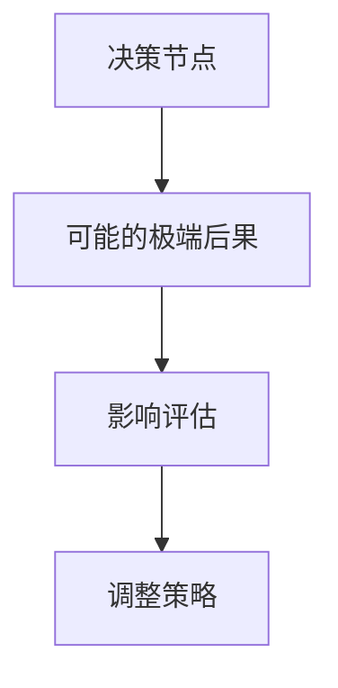
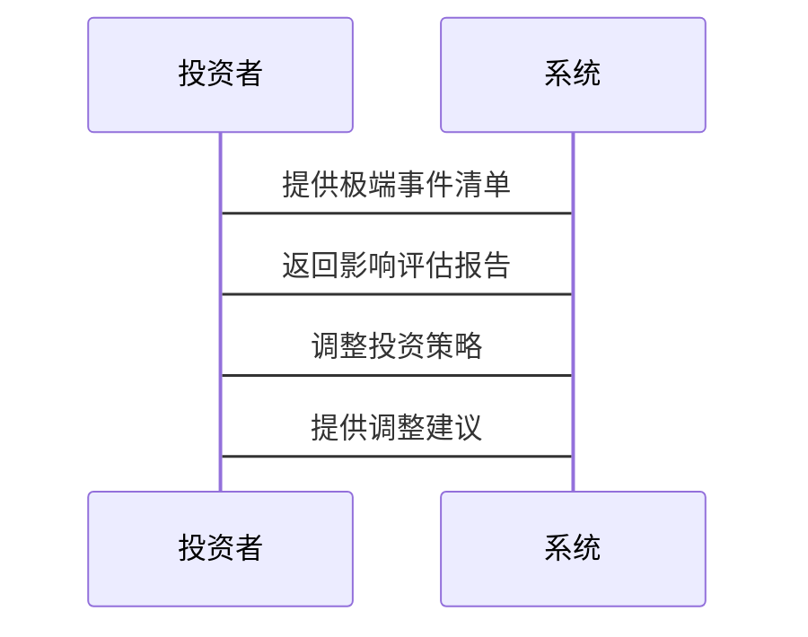

                 


# 芒格的"极端后果"思维：在投资决策中考虑最坏情况

> 关键词：芒格、极端后果思维、投资决策、风险管理、决策框架、概率论

> 摘要：芒格的"极端后果"思维是一种在投资决策中考虑最坏情况的策略，旨在通过分析潜在的极端负面结果来降低投资风险。本文将详细探讨这一思维模型的核心概念、算法原理、系统架构以及在实际投资中的应用，帮助读者更好地理解和应用这一策略。

---

## 第一部分: 背景介绍

### 1.1 芒格的"极端后果"思维是什么？

芒格的"极端后果"思维是一种投资决策方法，强调在决策过程中考虑可能的最坏情况，并评估其对整体投资组合的潜在影响。这种方法不同于传统的基于期望值的决策模型，而是更关注于潜在的极端负面结果。

### 1.2 为什么在投资中需要考虑极端后果？

1. **风险管理**：极端后果思维的核心在于识别和评估潜在的极端风险事件，从而在决策中避免或减轻这些风险的影响。
2. **决策质量**：通过考虑最坏情况，投资者可以更全面地评估决策的潜在后果，从而做出更明智的投资选择。
3. **心理因素**：极端后果思维有助于投资者在决策过程中克服心理偏差（如过度乐观），从而更理性地看待投资风险。

### 1.3 极端后果思维与其他决策模型的区别

| 模型 | 核心思想 | 优点 | 局限性 |
|------|----------|------|--------|
| 期望值模型 | 基于概率的期望值进行决策 | 简单易懂 | 忽视极端情况 |
| 极端后果思维 | 考虑最坏情况，评估其影响 | 降低风险 | 计算复杂 |

---

## 第二部分: 核心概念与联系

### 2.1 极端后果思维的核心概念

- **极端风险事件**：可能对投资组合造成重大负面影响的事件，例如市场崩盘、企业破产等。
- **影响评估**：评估极端事件对投资组合的潜在影响，包括财务损失、声誉损失等。
- **决策调整**：根据极端后果的评估结果，调整投资策略，以降低风险。

### 2.2 极端后果思维与决策树分析的联系



### 2.3 实际应用中的案例分析

- **案例1**：某科技公司在新产品发布会上出现重大技术故障，导致公司声誉受损，股价大幅下跌。
- **案例2**：某银行因市场崩盘导致资产严重缩水，面临破产风险。

---

## 第三部分: 算法原理

### 3.1 概率论与极端后果思维

概率论是极端后果思维的数学基础。通过计算极端事件发生的概率及其潜在影响，投资者可以更准确地评估风险。

#### 3.1.1 贝叶斯定理

$$ P(A|B) = \frac{P(B|A) \cdot P(A)}{P(B)} $$

其中：
- \( P(A|B) \)：在B发生的条件下，A发生的概率。
- \( P(B|A) \)：在A发生的条件下，B发生的概率。
- \( P(A) \)：A发生的先验概率。
- \( P(B) \)：B发生的先验概率。

### 3.2 决策树分析

决策树是一种用于分析决策问题的工具，可以帮助投资者清晰地看到不同决策路径的结果。

```mermaid
decisionTree
    root
    code_1
        if(市场崩盘)
            result(重大损失)
        else
            result(轻微损失)
    code_2
        if(新产品成功)
            result(收益增长)
        else
            result(收益下降)
```

### 3.3 算法实现

以下是一个简单的决策树分析的Python代码示例：

```python
def calculate_probability(outcome, probabilities):
    result = 0
    for event, prob in probabilities.items():
        if outcome == event:
            result = prob
            break
    return result

# 示例：计算某极端事件的概率
outcome = "市场崩盘"
probabilities = {
    "市场崩盘": 0.02,
    "经济衰退": 0.05,
    "正常市场": 0.93
}
print(calculate_probability(outcome, probabilities))
```

---

## 第四部分: 系统分析与架构设计

### 4.1 系统功能设计

- **输入**：潜在极端事件的清单、各事件的发生概率、事件对投资组合的影响程度。
- **输出**：极端事件对投资组合的潜在影响评估、调整后的投资策略。

### 4.2 系统架构设计


### 4.3 接口设计

- **API 输入**：投资者提供的极端事件清单和相关参数。
- **API 输出**：系统生成的影响评估报告和调整建议。

### 4.4 交互流程



---

## 第五部分: 项目实战

### 5.1 环境安装

- **工具**：Python 3.x，Jupyter Notebook，mermaid。

### 5.2 核心代码实现

```python
import numpy as np
import pandas as pd

def extreme_consequences_analysis(events, impact_matrix):
    # 计算每个事件的期望影响
    expected_impact = {}
    for event in events:
        impact = impact_matrix[event]
        expected_impact[event] = np.mean(impact)
    return expected_impact

# 示例数据
events = ["市场崩盘", "经济衰退", "新产品失败"]
impact_matrix = {
    "市场崩盘": [0.8, 0.9, 1.0],
    "经济衰退": [0.6, 0.7, 0.8],
    "新产品失败": [0.4, 0.5, 0.6]
}

# 调用函数
result = extreme_consequences_analysis(events, impact_matrix)
print(result)
```

### 5.3 案例分析与解读

- **案例分析**：某科技公司面临新产品失败的风险，通过极端后果思维分析，评估其对股价和公司声誉的影响，并制定相应的风险管理策略。

### 5.4 项目小结

通过实际案例分析，我们可以看到极端后果思维在投资决策中的实际应用价值。它可以帮助投资者更全面地评估风险，并制定更稳健的投资策略。

---

## 第六部分: 总结与展望

### 6.1 总结

芒格的"极端后果"思维是一种重要的投资决策方法，它通过考虑最坏情况，帮助投资者降低风险，做出更明智的投资决策。

### 6.2 展望

随着人工智能和大数据技术的发展，极端后果思维的应用将更加广泛和深入。未来的研究可以进一步结合这些技术，提高风险评估的准确性和效率。

---

## 作者

作者：AI天才研究院/AI Genius Institute & 禅与计算机程序设计艺术 /Zen And The Art of Computer Programming

