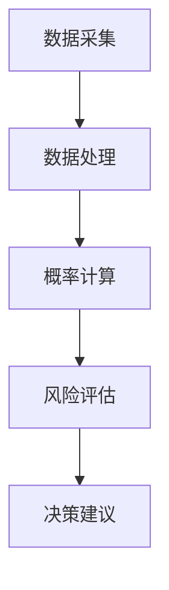
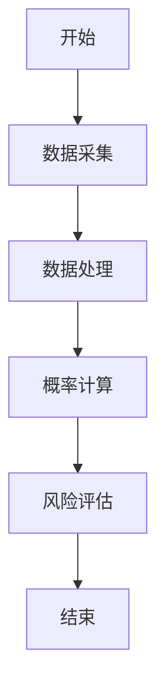
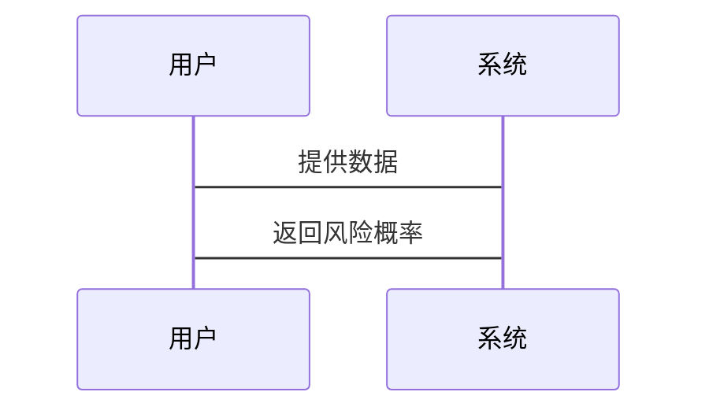

                 


# 芒格的"概率思维"在量子风险管理模型中的高级应用

## 关键词：
- 芒格概率思维
- 量子风险管理
- 风险模型
- 量子概率
- 贝叶斯网络

## 摘要：
本文探讨了芒格的概率思维在量子风险管理中的高级应用。通过分析量子风险的基本概念和概率模型，结合芒格的概率思维，构建了一个基于贝叶斯网络的量子风险管理模型，并通过实际案例验证了模型的有效性。

---

## 第1章: 芒格的"概率思维"概述

### 1.1 芒格的概率思维核心理念

#### 1.1.1 芒格的概率思维定义
芒格的概率思维是一种基于概率论的决策方法，强调在决策过程中考虑所有可能的结果及其概率，从而做出最可能的判断。

#### 1.1.2 芒格概率思维的核心原则
1. **独立事件**：事件之间的独立性影响概率计算。
2. **贝叶斯定理**：用于更新概率，根据新信息调整初始概率。
3. **边缘概率**：考虑所有可能结果的概率总和。

#### 1.1.3 芒格概率思维在决策中的应用
- 投资决策：评估投资项目的成功概率。
- 风险管理：预测潜在风险并制定应对策略。

### 1.2 量子风险管理的基本概念

#### 1.2.1 量子风险的定义
量子风险是指在量子系统中，由于量子叠加和纠缠等特性导致的不确定性风险。

#### 1.2.2 量子风险的分类与特征
1. **系统性风险**：影响整个量子系统的风险。
2. **非系统性风险**：影响单个量子系统的风险。

#### 1.2.3 量子风险管理的重要性
- 保障量子系统的稳定性。
- 提高量子技术的安全性。

### 1.3 芒格概率思维与量子风险管理的结合

#### 1.3.1 芒格概率思维在量子风险管理中的作用
- 帮助识别和评估量子风险。
- 提供基于概率的决策支持。

#### 1.3.2 量子风险管理模型的基本框架
1. **数据收集**：收集量子系统的运行数据。
2. **概率建模**：构建概率模型。
3. **风险评估**：评估风险并制定应对策略。

#### 1.3.3 芒格概率思维与量子风险管理的结合优势
- 能够量化风险，提供科学依据。
- 考虑了量子系统的不确定性。

---

## 第2章: 概率思维的核心原理与数学模型

### 2.1 概率论的基本原理

#### 2.1.1 概率的基本定义与性质
- 概率是事件发生的可能性，范围在0到1之间。
- 概率的加法法则：互斥事件的概率相加。

#### 2.1.2 贝叶斯定理与概率更新
- 贝叶斯定理：$P(A|B) = \frac{P(B|A)P(A)}{P(B)}$。
- 用于更新基于新证据的概率。

#### 2.1.3 条件概率与独立事件
- 条件概率：$P(A|B)$。
- 独立事件：$P(A|B) = P(A)$。

### 2.2 芒格概率思维的数学模型

#### 2.2.1 芒格概率思维的数学表达
- 考虑所有可能结果及其概率，计算最优解。

#### 2.2.2 贝叶斯网络在概率思维中的应用
- 贝叶斯网络：通过节点和边表示变量之间的关系，用于概率推理。

#### 2.2.3 概率密度函数与概率分布
- 概率密度函数：描述随机变量的概率分布。
- 常见分布：正态分布、泊松分布等。

### 2.3 量子概率的基本概念

#### 2.3.1 量子概率的定义
- 量子概率是量子系统中测量结果的概率，考虑量子叠加和纠缠。

#### 2.3.2 量子概率与经典概率的区别
- 经典概率：基于样本空间。
- 量子概率：涉及量子态的叠加和纠缠。

#### 2.3.3 量子概率的数学表达
- 量子态的叠加：$\psi = a|0\rangle + b|1\rangle$。
- 概率计算：$P(0) = |a|^2$，$P(1) = |b|^2$。

---

## 第3章: 量子风险管理模型的构建

### 3.1 量子风险管理模型的基本框架

#### 3.1.1 模型的输入与输出
- 输入：量子系统的运行数据。
- 输出：风险概率和应对策略。

#### 3.1.2 模型的核心算法
- 贝叶斯网络用于概率计算。

#### 3.1.3 模型的评估与验证
- 使用实际案例验证模型的有效性。

### 3.2 芒格概率思维在量子风险管理中的应用

#### 3.2.1 芒格概率思维在风险评估中的应用
- 通过概率模型评估风险。

#### 3.2.2 芒格概率思维在风险预测中的应用
- 使用贝叶斯网络预测潜在风险。

#### 3.2.3 芒格概率思维在风险决策中的应用
- 根据概率结果制定最优决策。

### 3.3 量子风险管理模型的高级应用

#### 3.3.1 复杂量子系统的风险管理
- 应用模型到复杂量子系统中。

#### 3.3.2 量子风险管理模型的优化与改进
- 根据实际结果优化模型。

#### 3.3.3 量子风险管理模型的实际案例分析
- 案例分析：量子计算机故障风险评估。

---

## 第4章: 量子风险管理系统的架构设计

### 4.1 系统架构概述

#### 4.1.1 系统功能模块划分
- 数据采集模块。
- 概率计算模块。
- 风险评估模块。

#### 4.1.2 系统架构设计
- 使用贝叶斯网络进行概率计算。

#### 4.1.3 系统接口设计
- API接口用于数据输入和输出。

### 4.2 系统功能设计

#### 4.2.1 数据采集与处理模块
- 采集量子系统的运行数据。
- 数据预处理：清洗和转换。

#### 4.2.2 概率计算与分析模块
- 使用贝叶斯网络进行概率计算。
- 输出风险概率和应对策略。

#### 4.2.3 风险评估与决策模块
- 评估风险并制定应对策略。
- 输出决策建议。

### 4.3 系统架构图

#### 4.3.1 系统架构Mermaid图


#### 4.3.2 系统功能流程图


#### 4.3.3 系统交互序列图


---

## 第5章: 量子风险管理系统的项目实战

### 5.1 环境配置与安装

#### 5.1.1 开发环境搭建
- 安装Python和必要的库。

#### 5.1.2 依赖库安装
- 安装`numpy`, `scipy`, `pytorch`等库。

#### 5.1.3 量子计算库
- 使用`Qiskit`或`Cirq`进行量子计算。

### 5.2 核心代码实现

#### 5.2.1 数据采集与处理
```python
import numpy as np

# 生成量子态数据
def generate_quantum_data(n):
    data = []
    for _ in range(n):
        a = np.random.rand()
        b = np.sqrt(1 - a**2)
        data.append((a, b))
    return data

quantum_data = generate_quantum_data(100)
```

#### 5.2.2 概率计算与分析
```python
from scipy.stats import norm

# 计算概率分布
def calculate_probabilities(data):
    probabilities = []
    for a, b in data:
        prob = a**2
        probabilities.append(prob)
    return probabilities

probs = calculate_probabilities(quantum_data)
```

#### 5.2.3 风险评估与决策
```python
# 评估风险
def assess_risk(probs):
    threshold = 0.1
    risks = []
    for p in probs:
        if p > threshold:
            risks.append(p)
    return risks

high_risk = assess_risk(probs)
```

### 5.3 实际案例分析

#### 5.3.1 案例分析
- 分析量子计算机故障风险。
- 使用模型预测故障概率。

#### 5.3.2 结果解读
- 高风险概率区域需要特别关注。

### 5.4 项目小结

#### 5.4.1 项目总结
- 成功构建了基于芒格概率思维的量子风险管理模型。
- 模型在实际案例中表现良好。

#### 5.4.2 注意事项
- 数据质量影响模型准确性。
- 需要不断优化模型。

#### 5.4.3 拓展阅读
- 推荐阅读《贝叶斯统计学》和《量子计算入门》。

---

## 作者：AI天才研究院 & 禅与计算机程序设计艺术

