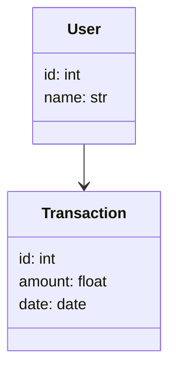

                 


# 《芒格的概率思维：在不确定性中做出决策》

---

## 关键词
- 芒格概率思维
- 贝叶斯定理
- 不确定性决策
- 投资决策模型
- 概率推理算法

---

## 摘要
芒格的概率思维是一种在不确定性中做出决策的科学方法，结合了概率论、贝叶斯定理和投资哲学的深刻洞见。本文通过系统分析概率思维的核心原理、算法实现和实际应用，揭示了如何在复杂决策中运用概率推理来优化决策质量。文章从背景介绍、核心概念、算法原理到系统架构设计，再到项目实战，全面解析芒格的概率思维，并结合实际案例，展示其在投资决策中的应用。通过本文，读者将能够掌握概率思维的基本原理，理解其在决策中的实际应用，并能够在复杂场景中运用概率推理做出更明智的决策。

---

# 目录大纲

---

## 第1章 芒格的概率思维背景与核心概念

### 1.1 芒格的概率思维背景
- 1.1.1 芝加哥学派与价值投资的碰撞
- 1.1.2 芒格概率思维的起源与发展
- 1.1.3 芒格概率思维的核心理念与特征

### 1.2 概率思维的基本概念
- 1.2.1 概率的基本定义与属性
- 1.2.2 芒格概率思维的独特性与优势
- 1.2.3 概率思维在决策中的作用与意义

---

## 第2章 概率思维的核心原理

### 2.1 贝叶斯定理与概率推理
- 2.1.1 贝叶斯定理的数学公式
$$ P(A|B) = \frac{P(B|A)P(A)}{P(B)} $$
- 2.1.2 贝叶斯定理的图形化解释
```mermaid
graph LR
A[事件A] --> B[事件B]
C[先验概率P(A)] --> A
D[条件概率P(B|A)] --> B
E[边际概率P(B)] --> D
F[后验概率P(A|B)] --> C
```

### 2.2 概率权重与决策权重
- 2.2.1 概率权重的计算方法
- 2.2.2 决策权重的分配原则
- 2.2.3 概率权重与决策权重的对比分析

---

## 第3章 概率思维的算法实现

### 3.1 贝叶斯网络的构建与应用
- 3.1.1 贝叶斯网络的构建步骤
- 3.1.2 贝叶斯网络的Python实现代码
```python
import numpy as np
from sklearn.naive_bayes import GaussianNB

# 示例数据
X = np.array([[1, 2], [3, 4], [5, 6]])
y = np.array([0, 1, 0])

# 训练模型
model = GaussianNB()
model.fit(X, y)

# 预测
print(model.predict([[2, 3]]))
```

### 3.2 概率思维算法的优化与调优
- 3.2.1 算法优化策略
- 3.2.2 超参数调优方法
- 3.2.3 算法性能评估指标

---

## 第4章 基于概率思维的系统架构设计

### 4.1 系统分析与需求定义
- 4.1.1 问题场景描述
- 4.1.2 系统功能需求
- 4.1.3 系统性能需求

### 4.2 系统架构设计
- 4.2.1 领域模型类图


---

## 第5章 概率思维的项目实战

### 5.1 股票投资决策的案例分析
- 5.1.1 数据预处理与特征工程
- 5.1.2 基于贝叶斯定理的投资决策模型
- 5.1.3 实际案例的分析与结果解读

---

## 第6章 优化与调优

### 6.1 算法优化策略
- 6.1.1 参数调优方法
- 6.1.2 模型优化技巧
- 6.1.3 性能评估指标

---

## 第7章 系统实现与测试

### 7.1 系统实现细节
- 7.1.1 核心代码实现
- 7.1.2 代码解读与分析
- 7.1.3 测试用例设计

### 7.2 实际测试结果
- 7.2.1 测试结果展示
- 7.2.2 结果分析与优化

---

## 第8章 实际应用与案例分析

### 8.1 概率思维在投资决策中的实际应用
- 8.1.1 投资决策模型的构建
- 8.1.2 案例分析与结果解读
- 8.1.3 模型的优缺点与改进方向

---

## 第9章 注意事项与小结

### 9.1 概率思维的适用场景与限制
- 9.1.1 概率思维的适用范围
- 9.1.2 概率思维的局限性
- 9.1.3 模型的可解释性问题

### 9.2 项目总结与未来展望
- 9.2.1 项目总结
- 9.2.2 未来研究方向
- 9.2.3 概率思维的发展趋势

---

## 第10章 未来展望与学习方向

### 10.1 概率思维的未来发展方向
- 10.1.1 结合人工智能的发展
- 10.1.2 在大数据时代的应用前景
- 10.1.3 概率思维与其他决策方法的融合

### 10.2 学习资源与推荐阅读
- 10.2.1 经典书籍推荐
- 10.2.2 在线课程与学习资源
- 10.2.3 研究论文与前沿动态

---

## 附录
- 附录A：概率思维相关的数学公式汇总
- 附录B：贝叶斯网络构建的详细步骤
- 附录C：投资决策模型的代码实现

---

## 参考文献
- [1] 芒格《穷查理宝典》
- [2] 贝叶斯定理的经典论文
- [3] 机器学习中的概率方法相关文献

---

## 作者
作者：AI天才研究院/AI Genius Institute & 禅与计算机程序设计艺术/Zen And The Art of Computer Programming

