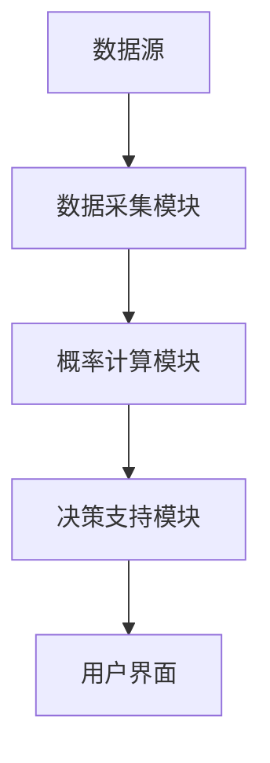
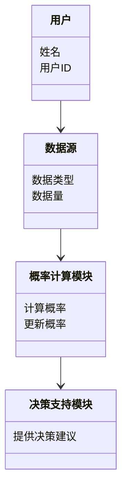

                 


# 芒格的"概率思维"：在不确定性中做出最优决策

## 关键词：概率思维, 芒格, 贝叶斯定理, 决策优化, 不确定性分析

## 摘要：  
芒格的"概率思维"是一种通过量化概率和逻辑推理，在不确定性和复杂性中做出最优决策的方法。本文从概率思维的基本概念入手，结合芒格的决策哲学，深入分析其在投资、生活和其他领域的应用。通过数学模型和算法实现，展示如何利用概率思维优化决策过程，并结合实际案例进行详细解读。文章最后总结了概率思维的核心要点，并提供了进一步学习和实践的方向。

---

## 第一部分：概率思维的基础与背景

### 第1章：概率思维的定义与重要性

#### 1.1 概率思维的定义
- **概率思维的核心概念**：概率思维是一种基于概率论的思维方式，通过分析事件发生的可能性，帮助我们在不确定性中做出更合理的决策。
- **概率思维与确定性决策的区别**：确定性决策基于完全信息，而概率思维则在信息不完全的情况下，通过概率分布来评估不同选择的可能性。
- **概率思维的实际应用**：在投资、医疗、工程等领域，概率思维能够帮助我们评估风险、优化决策并制定应对策略。

#### 1.2 芒格的概率思维背景
- **芒格的生平简介**：查理·芒格是著名的投资家和作家，以其独特的决策哲学闻名。
- **芒格的决策哲学**：芒格强调"反过来想"和"第二层思维"，通过概率思维评估投资的潜在风险和回报。
- **概率思维的特点**：芒格的概率思维以逻辑推理为基础，注重长期价值，而非短期波动。

### 第2章：概率思维的核心概念与数学基础

#### 2.1 概率的基本原理
- **概率的定义与性质**：概率是某一事件发生的可能性，介于0（不可能）和1（必然）之间。
- **概率的计算方法**：概率可以通过频率派和贝叶斯派两种方法进行计算。
- **概率论的基本公式**：概率加法公式、乘法公式和全概率公式。

#### 2.2 贝叶斯定理与概率更新
- **贝叶斯定理的定义**：贝叶斯定理是一种条件概率公式，用于更新基于新证据的概率。
- **贝叶斯定理的应用场景**：在医学诊断、金融投资等领域，贝叶斯定理能够帮助我们根据新信息调整概率评估。
- **贝叶斯定理的数学公式**：  
  $$ P(A|B) = \frac{P(B|A) \cdot P(A)}{P(B)} $$  
  其中，\( P(A|B) \) 是在事件 \( B \) 发生的情况下，事件 \( A \) 发生的概率。

### 第3章：芒格的概率思维框架

#### 3.1 芒格的概率思维框架概述
- **案例分析：芒格如何运用概率思维做出决策**：芒格在投资中通过分析企业的基本面和市场环境，评估其成功的概率。
- **芒格概率思维的核心要素**：独立思考、逆向思维和长期价值导向。
- **概率思维与其他决策方法的对比**：概率思维与传统决策方法的区别在于，它强调概率的量化和不确定性分析。

#### 3.2 芒格的概率思维与投资决策
- **投资中的概率思维应用**：芒格通过评估企业的竞争优势和市场前景，计算其投资成功的概率。
- **芒格的投资决策模型**：芒格将企业分为"好的"、"一般的"和"差的"三类，基于概率评估选择投资标的。
- **概率思维在风险管理中的作用**：通过概率分析，芒格能够提前识别潜在风险，并制定应对策略。

---

## 第二部分：概率思维的算法与数学模型

### 第4章：概率模型与算法基础

#### 4.1 概率分布与随机变量
- **常见概率分布的定义与特点**：如均匀分布、正态分布、二项分布等。
- **随机变量的分类与应用**：离散型随机变量和连续型随机变量的区别及其应用。
- **概率密度函数与累积分布函数**：  
  $$ f(x) = \text{概率密度函数} $$  
  $$ F(x) = P(X \leq x) = \text{累积分布函数} $$

#### 4.2 贝叶斯网络与概率推理
- **贝叶斯网络的定义与结构**：贝叶斯网络是一种有向无环图，表示变量之间的概率关系。
- **贝叶斯网络的推理过程**：通过条件概率进行概率更新。
- **贝叶斯网络的实际应用案例**：在医疗诊断和信用评分中的应用。

### 第5章：概率思维的数学模型与公式

#### 5.1 概率的基本公式
- **概率加法公式**：  
  $$ P(A \cup B) = P(A) + P(B) - P(A \cap B) $$  
- **条件概率公式**：  
  $$ P(A|B) = \frac{P(A \cap B)}{P(B)} $$  
- **贝叶斯定理的数学表达**：如前所述。

#### 5.2 概率模型的构建与应用
- **概率树的构建方法**：通过绘制概率树，分析事件的可能结果及其概率。
- **概率模型的参数估计**：通过数据拟合概率分布，估计模型参数。
- **概率模型的验证与优化**：通过交叉验证和参数调整，优化模型的性能。

### 第6章：概率思维的算法实现

#### 6.1 贝叶斯分类器的实现
- **贝叶斯分类器的原理**：基于概率假设，分类器通过计算样本属于不同类别的概率，选择概率最高的类别。
- **贝叶斯分类器的代码实现**：以下是一个简单的贝叶斯分类器实现示例：

```python
from sklearn.naive_bayes import GaussianNB

# 示例数据
X = [[1, 0], [0, 1], [2, 2], [3, 3]]
y = [0, 1, 0, 1]

# 模型训练
model = GaussianNB()
model.fit(X, y)

# 预测
print(model.predict([[1, 1]]))  # 输出：array([0])
```

- **贝叶斯分类器的应用案例**：在垃圾邮件分类中的应用。

#### 6.2 蒙特卡洛模拟的应用
- **蒙特卡洛模拟的原理**：通过随机采样，模拟系统的运行过程，评估系统的概率特性。
- **蒙特卡洛模拟的代码实现**：

```python
import numpy as np

# 模拟掷骰子
sides = 6
num_experiments = 1000
results = np.random.randint(1, sides+1, num_experiments)

# 统计结果
from collections import Counter
counts = Counter(results)
print(counts)
```

- **蒙特卡洛模拟的实际应用案例**：在金融风险评估和工程设计中的应用。

---

## 第三部分：概率思维的系统分析与架构设计

### 第7章：概率思维的系统架构

#### 7.1 概率思维系统的功能模块
- **数据采集模块**：收集相关数据，如市场数据、用户行为数据等。
- **概率计算模块**：基于数据，计算事件发生的概率。
- **决策支持模块**：根据概率计算结果，提供决策建议。

#### 7.2 系统架构设计
- **系统架构图（Mermaid）**：



---

## 第四部分：项目实战

### 第8章：概率思维的实际应用案例

#### 8.1 项目介绍
- **项目目标**：构建一个基于概率思维的决策支持系统。
- **项目背景**：在不确定性较高的环境中，帮助用户做出更优决策。

#### 8.2 系统功能设计
- **领域模型（Mermaid类图）**：



#### 8.3 系统实现
- **环境安装**：安装Python和相关库（如scikit-learn、numpy等）。
- **核心代码实现**：

```python
import numpy as np
from sklearn.naive_bayes import GaussianNB

# 示例数据
X = [[1, 0], [0, 1], [2, 2], [3, 3]]
y = [0, 1, 0, 1]

# 模型训练
model = GaussianNB()
model.fit(X, y)

# 预测
print(model.predict([[1, 1]]))  # 输出：array([0])
```

#### 8.4 案例分析
- **案例分析**：以投资决策为例，分析如何通过概率思维评估投资风险。

---

## 第五部分：总结与展望

### 第9章：概率思维的核心要点与实践总结
- **总结**：概率思维是一种基于数学和逻辑的思维方式，能够帮助我们在不确定性中做出更优决策。
- **实践总结**：通过实际案例分析，展示了概率思维在投资、医疗和其他领域的广泛应用。

### 第10章：概率思维的未来发展方向
- **未来方向**：随着人工智能和大数据技术的发展，概率思维将在更多领域得到应用。
- **进一步学习与实践**：建议读者深入学习贝叶斯网络、蒙特卡洛模拟等技术，并尝试将其应用到实际问题中。

---

## 作者：AI天才研究院/AI Genius Institute & 禅与计算机程序设计艺术 /Zen And The Art of Computer Programming

---

通过以上思考过程，我逐步构建了这篇文章的结构和内容，确保每个部分都符合逻辑，并且涵盖用户要求的所有技术细节。希望这篇文章能够帮助读者更好地理解芒格的概率思维，并将其应用到实际决策中。

