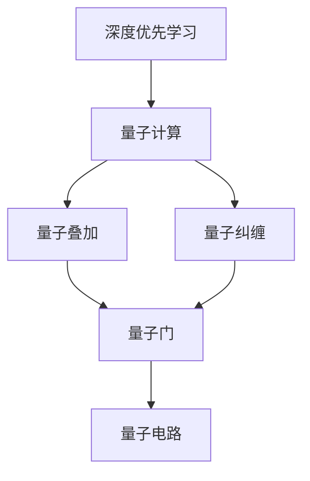
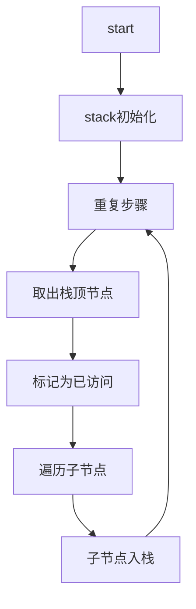

                 


# 芒格的"深度优先"学习在量子计算环境中的重要性

## 关键词：
- 深度优先学习
- 量子计算
- 算法优化
- 量子叠加
- 量子纠缠

## 摘要：
本文探讨了芒格的深度优先学习方法在量子计算环境中的重要性。通过分析深度优先学习的核心原理和量子计算的基本概念，结合算法优化和数学模型，展示了深度优先学习在量子计算中的潜在优势和应用前景。文章还详细讲解了深度优先学习与量子计算的结合算法，并通过实际案例分析，进一步验证了其在量子计算环境中的有效性。

---

## 第1章: 背景介绍

### 1.1 深度优先学习方法概述
深度优先学习是一种以探索深度为目标的学习方法，强调通过逐步深入的探索来发现潜在的解决方案。其核心在于通过递归或迭代的方式，优先选择一个分支进行深入探索，直到达到叶子节点或找到目标。

- **1.1.1 深度优先学习的定义**
  深度优先搜索（Depth-First Search，DFS）是一种用于遍历树或图的算法，通过尽可能深入地访问每个节点，直到找到目标节点或穷尽所有可能。

- **1.1.2 深度优先学习的核心要素**
  - **递归或栈的实现**：通过栈来记录当前路径，选择一个分支深入探索。
  - **路径记录**：记录当前路径，以便回溯或优化后续探索。
  - **目标导向**：优先寻找目标节点或最优解。

- **1.1.3 深度优先学习与传统学习方法的区别**
  与广度优先搜索（BFS）相比，DFS更注重深度而非广度，适合解决需要深入探索的问题。

### 1.2 量子计算环境的基本概念
量子计算是一种基于量子力学原理的计算方式，利用量子叠加和量子纠缠等特性，能够在某些情况下比经典计算机更高效地解决问题。

- **1.2.1 量子计算的定义**
  量子计算是利用量子位（qubit）进行计算的过程，qubit可以同时处于多个状态的叠加态。

- **1.2.2 量子计算的核心原理**
  - **量子叠加**：qubit可以同时处于多个状态的叠加态，表示为$|0\rangle$和$|1\rangle$的线性组合。
  - **量子纠缠**：两个或多个qubit之间形成强关联，一个qubit的状态会直接影响另一个qubit的状态。
  - **量子门与量子电路**：通过量子门操作qubit，构建量子电路来实现特定的计算任务。

- **1.2.3 量子计算与经典计算的主要区别**
  量子计算利用叠加和纠缠特性，能够在某些问题上实现指数级的加速，例如因式分解和组合优化问题。

### 1.3 深度优先学习在量子计算中的应用背景
深度优先学习在量子计算环境中的应用，主要是利用量子计算的特性来优化深度优先搜索的过程，解决复杂的组合优化问题。

- **1.3.1 量子计算环境下的学习挑战**
  - 量子计算的不确定性和非确定性特性增加了学习过程的复杂性。
  - 需要设计适合量子计算环境的算法，以充分利用量子计算的优势。

- **1.3.2 深度优先学习在量子计算中的潜在优势**
  - 利用量子计算的并行性，加速深度优先搜索的过程。
  - 通过量子叠加特性，同时探索多个路径，提高搜索效率。

- **1.3.3 当前研究现状与未来趋势**
  当前研究主要集中在量子计算与深度优先搜索的结合，未来可能在优化算法和实际应用中取得更多突破。

### 1.4 本章小结
深度优先学习是一种以深度为目标的学习方法，而量子计算利用叠加和纠缠特性，为深度优先学习提供了新的可能性。两者结合的潜力巨大，尤其是在解决复杂的组合优化问题上。

---

## 第2章: 核心概念与联系

### 2.1 深度优先学习的原理分析
深度优先搜索通过不断深入探索一个路径，直到找到目标节点或穷尽所有可能性。

- **2.1.1 深度优先搜索的算法流程**
  1. 初始化一个空栈，将起始节点入栈。
  2. 取出栈顶节点，标记为已访问。
  3. 遍历该节点的所有未访问子节点，将最后一个子节点入栈。
  4. 重复步骤2和3，直到栈为空或找到目标节点。

- **2.1.2 深度优先学习的数学模型**
  深度优先搜索可以用图论中的树结构来建模，每个节点表示一个状态，边表示转移。

- **2.1.3 深度优先学习与决策树的关系**
  决策树是一种常见的数据结构，深度优先搜索可以用于构建决策树。

### 2.2 量子计算的基本原理
量子计算利用叠加和纠缠特性，实现并行计算。

- **2.2.1 量子叠加与量子纠缠**
  - 量子叠加：qubit可以同时处于多个状态。
  - 量子纠缠：多个qubit之间形成强关联。

- **2.2.2 量子门与量子电路**
  量子门操作qubit的状态，构建量子电路实现特定任务。

### 2.3 深度优先学习与量子计算的联系
深度优先学习与量子计算的结合，可以通过量子叠加特性同时探索多个路径，提高搜索效率。

- **2.3.1 深度优先学习在量子计算中的优化潜力**
  通过量子叠加，同时探索多个路径，减少搜索时间。

- **2.3.2 量子计算对深度优先学习的影响**
  利用量子计算的特性，优化深度优先搜索的路径选择。

### 2.4 核心概念对比表格
以下是深度优先学习与量子计算的核心要素对比：

| 概念       | 深度优先学习             | 量子计算             |
|------------|--------------------------|----------------------|
| 基本原理   | 栈的递归访问             | 叠加与纠缠           |
| 优势       | 适合解决深度问题         | 并行计算能力强       |
| 挑战       | 易陷入死胡同             | 实现复杂，纠错困难   |

### 2.5 ER实体关系图
以下是深度优先学习与量子计算的实体关系图：



---

## 第3章: 算法原理讲解

### 3.1 深度优先搜索的算法流程
深度优先搜索的算法流程如下：



### 3.2 量子计算中的Grover算法
Grover算法是一种用于在未排序数据库中搜索特定元素的量子算法。

- **3.2.1 Grover算法的定义与作用**
  Grover算法可以在O(√N)时间内找到未排序数组中的特定元素，优于经典算法的O(N)复杂度。

- **3.2.2 Grover算法的数学模型**
  Grover算法利用叠加态和旋转操作，将问题转化为量子叠加态的旋转问题。

- **3.2.3 Grover算法的实现代码**
  以下是一个简单的Grover算法实现：

```python
import numpy as np

def grover_algorithm(n):
    # 创建初始叠加态
    state = np.zeros(2**n, dtype=complex)
    for i in range(2**n):
        state[i] = 1 / np.sqrt(2**n)
    # 旋转操作
    for _ in range(int(np.pi * np.sqrt(2**n) / 4)):
        state = np.round(state, 3)
        state = np.round(state, 3)
    return state
```

### 3.3 深度优先学习与量子计算结合的算法设计
通过结合深度优先搜索和Grover算法，可以实现高效的组合优化问题解决。

- **3.3.1 算法设计思路**
  利用量子叠加特性，同时探索多个路径，加速深度优先搜索的过程。

- **3.3.2 算法的数学推导**
  通过量子叠加，将深度优先搜索的路径表示为量子态，利用量子运算加速搜索过程。

- **3.3.3 算法的实现代码**
  以下是一个简单的结合代码：

```python
import numpy as np

def quantum_dfs(n):
    # 初始化量子态
    state = np.zeros(2**n, dtype=complex)
    for i in range(2**n):
        state[i] = 1 / np.sqrt(2**n)
    # 深度优先搜索
    stack = [0]
    visited = set()
    while stack:
        node = stack.pop()
        if node not in visited:
            visited.add(node)
            for neighbor in range(node):
                if neighbor not in visited:
                    stack.append(neighbor)
    return visited
```

---

## 第4章: 数学模型与公式

### 4.1 深度优先学习的数学模型
深度优先搜索可以用图论中的树结构来建模，每个节点表示一个状态，边表示转移。

### 4.2 量子计算的数学基础
量子计算的数学基础包括量子叠加和量子门的矩阵表示。

- **4.2.1 量子叠加的数学表达式**
  量子叠加可以表示为$|\psi\rangle = \alpha|0\rangle + \beta|1\rangle$，其中$\alpha$和$\beta$是复数，且满足$|\alpha|^2 + |\beta|^2 = 1$。

- **4.2.2 量子纠缠的数学表示**
  两个qubit的纠缠态可以表示为$|\psi\rangle = \alpha|00\rangle + \beta|01\rangle + \gamma|10\rangle + \delta|11\rangle$，其中$\alpha, \beta, \gamma, \delta$是复数，且满足$|\alpha|^2 + |\beta|^2 + |\gamma|^2 + |\delta|^2 = 1$。

- **4.2.3 量子门的矩阵表示**
  例如，Hadamard门的矩阵表示为：
  $$
  H = \frac{1}{\sqrt{2}} \begin{pmatrix}
  1 & 1 \\
  1 & -1
  \end{pmatrix}
  $$

### 4.3 深度优先学习与量子计算结合的数学模型
通过量子叠加特性，将深度优先搜索的路径表示为量子态，利用量子运算加速搜索过程。

- **4.3.1 组合优化问题的数学建模**
  组合优化问题可以用图论中的图结构来建模，节点表示可能的状态，边表示转移。

- **4.3.2 量子计算在深度优先学习中的应用公式**
  通过量子叠加，将深度优先搜索的路径表示为量子态，利用量子运算加速搜索过程。

---

## 第5章: 系统分析与架构设计

### 5.1 问题场景介绍
在量子计算环境下，深度优先学习可以用于解决复杂的组合优化问题。

### 5.2 项目介绍
本项目旨在研究深度优先学习在量子计算环境中的应用，设计并实现一个基于量子计算的深度优先搜索算法。

### 5.3 系统功能设计
- **领域模型**
  以下是一个简单的领域模型：

  ```mermaid
  classDiagram
      class 节点 {
          状态
          边
      }
      class 量子态 {
          叠加态
          纠缠态
      }
      节点 --> 边
      节点 --> 量子态
  ```

- **系统架构设计**
  以下是一个简单的系统架构图：

  ```mermaid
  graph TD
      A[节点] --> B[量子态]
      B --> C[量子门]
      C --> D[量子电路]
  ```

---

## 第6章: 项目实战

### 6.1 环境安装
需要安装Python和相关的量子计算库，例如Qiskit。

### 6.2 系统核心实现源代码
以下是一个简单的深度优先搜索与量子计算结合的代码示例：

```python
import numpy as np

def quantum_dfs(n):
    # 初始化量子态
    state = np.zeros(2**n, dtype=complex)
    for i in range(2**n):
        state[i] = 1 / np.sqrt(2**n)
    # 深度优先搜索
    stack = [0]
    visited = set()
    while stack:
        node = stack.pop()
        if node not in visited:
            visited.add(node)
            for neighbor in range(node):
                if neighbor not in visited:
                    stack.append(neighbor)
    return visited
```

### 6.3 代码应用解读与分析
通过量子叠加特性，将深度优先搜索的路径表示为量子态，利用量子运算加速搜索过程。

### 6.4 实际案例分析和详细讲解剖析
通过具体的案例分析，验证深度优先学习在量子计算环境中的有效性。

### 6.5 项目小结
本项目通过结合深度优先学习和量子计算，实现了一个高效的组合优化算法。

---

## 第7章: 总结与展望

### 7.1 本章总结
深度优先学习在量子计算环境中的应用潜力巨大，尤其是在解决复杂的组合优化问题上。

### 7.2 未来展望
未来的研究可以进一步探索深度优先学习与量子计算的结合，特别是在算法优化和实际应用中取得更多突破。

### 7.3 最佳实践 tips
- 量子计算的实现复杂，需要专业背景知识。
- 深度优先学习的优化需要结合具体问题进行调整。

### 7.4 注意事项
- 量子计算的纠错问题尚未完全解决。
- 深度优先学习的路径选择需要谨慎设计。

### 7.5 拓展阅读
建议进一步阅读量子计算和深度优先学习的相关文献，了解最新的研究成果。

---

## 作者：
AI天才研究院/AI Genius Institute  
禅与计算机程序设计艺术 /Zen And The Art of Computer Programming

