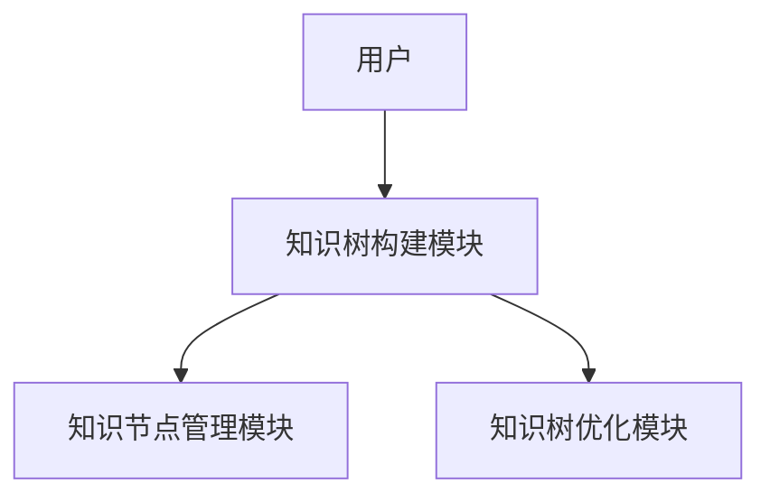
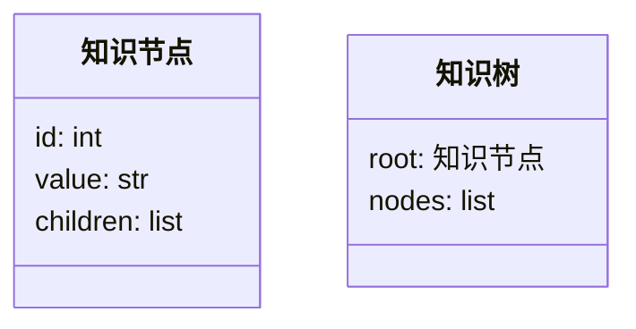

                 


# 芒格的"深度优先"学习方法：培养专业知识

## 关键词：深度优先学习方法, 芒格学习法, 知识树, DFS算法, 专业知识培养

## 摘要：芒格的"深度优先"学习方法是一种系统化的知识构建方法，借鉴了计算机科学中的深度优先搜索算法，强调通过深入探索某个知识领域，逐步构建知识树，以培养专业知识。本文将详细介绍深度优先学习方法的核心概念、算法原理、系统架构，并通过实际案例展示如何应用这种方法进行专业知识的培养。

---

# 第一部分: 深度优先学习方法的背景与起源

## 第1章: 深度优先学习方法的背景与起源

### 1.1 深度优先学习方法的起源

#### 1.1.1 计算机科学中的深度优先搜索算法
深度优先搜索（DFS）是一种用于遍历树或图的算法，通过尽可能深入地访问每个路径，直到找到目标节点或访问完所有可能的路径。DFS的核心思想是“先深入再扩展”，这与芒格的学习方法有异曲同工之处。

#### 1.1.2 芒格学习方法的提出与演变
芒格在其投资实践中总结出了一种独特的学习方法，即通过构建“知识树”来系统化地学习和积累知识。这种方法强调将零散的知识点连接起来，形成一个有机的知识体系，避免知识碎片化。

#### 1.1.3 深度优先学习方法的核心理念
深度优先学习方法的核心理念是通过深入研究某个领域，逐步构建知识的深度，而非广泛涉猎多个领域。这种方法强调系统性、专注性和渐进性，能够帮助学习者在有限的时间内掌握专业知识的核心内容。

### 1.2 深度优先学习方法的哲学基础

#### 1.2.1 芒格的“知识树”概念
芒格将知识体系比喻为一棵树，每个知识点都是树上的节点。根节点代表核心知识，子节点代表相关知识，叶子节点代表具体的应用。通过深度优先学习，学习者可以逐步扩展知识树，构建完整的知识体系。

#### 1.2.2 深度优先学习与知识体系构建
深度优先学习方法强调从根节点开始，逐步深入探索每个子节点，直到叶子节点。这种方法有助于学习者形成逻辑清晰、层次分明的知识体系。

#### 1.2.3 深度优先学习的适用场景
深度优先学习方法适用于需要系统化构建知识体系的领域，如编程、数学、科学和投资等。它特别适合那些需要深入理解核心原理和逻辑关系的领域。

### 1.3 深度优先学习方法的特点与优势

#### 1.3.1 深度优先学习的特点
- **系统性**：强调构建完整的知识体系，避免知识碎片化。
- **专注性**：集中精力深入研究某个领域，形成深度理解。
- **渐进性**：从核心知识点出发，逐步扩展相关知识，形成知识网络。

#### 1.3.2 深度优先学习的优势
- **高效性**：通过深入研究，能够在较短时间内掌握专业知识的核心内容。
- **连贯性**：构建的知识体系逻辑清晰，有助于理解和应用。
- **实用性**：适用于实际问题的解决，能够帮助学习者在实践中快速应用所学知识。

#### 1.3.3 深度优先学习的局限性
- **知识广度受限**：由于专注于深度，可能导致知识广度不足。
- **适用范围有限**：对于需要广泛涉猎多个领域的学习，深度优先学习可能不太适用。

### 1.4 本章小结
本章介绍了深度优先学习方法的背景与起源，详细阐述了其核心理念、哲学基础以及特点与优势。通过对比深度优先搜索算法，读者可以更好地理解深度优先学习方法的系统性和专注性。

---

# 第二部分: 深度优先学习方法的核心概念与原理

## 第2章: 深度优先学习方法的核心概念

### 2.1 深度优先学习的核心概念

#### 2.1.1 知识树的构建
知识树的构建是深度优先学习方法的核心，通过将知识点组织成树状结构，学习者可以清晰地看到知识之间的逻辑关系。

#### 2.1.2 根节点与叶子节点
- **根节点**：代表核心知识点，是知识树的起点。
- **叶子节点**：代表具体的应用或实例，是知识树的末端。

#### 2.1.3 子节点与父节点的关系
子节点代表与父节点相关联的知识点，通过层层深入，逐步扩展知识树的深度。

#### 2.1.4 知识树的层次结构
知识树的层次结构清晰，每个层次代表不同深度的知识点，从核心知识到具体应用，层层递进。

### 2.2 深度优先学习的核心要素

#### 2.2.1 根据地概念
根节点是知识树的根基，代表学习者必须掌握的核心知识点。只有打好根基，才能更好地扩展知识树。

#### 2.2.2 知识节点的连接性
知识节点之间的连接性是知识树的重要特征，通过连接性，学习者可以理解不同知识点之间的逻辑关系。

#### 2.2.3 知识树的深度与广度
- **深度**：代表知识的深度，即对某个领域的深入理解。
- **广度**：代表知识的广度，即对多个领域的广泛涉猎。

### 2.3 深度优先学习的数学模型

#### 2.3.1 知识树的层次结构
知识树可以用树状结构表示，其中根节点是核心知识点，子节点是相关知识点，叶子节点是具体应用。

#### 2.3.2 知识节点的权重分配
每个知识点可以有一个权重，表示其重要性。权重高的知识点应优先学习，以构建坚实的知识基础。

#### 2.3.3 知识树的生长规律
知识树的生长遵循层次递进的规律，从根节点到叶子节点，逐步扩展，形成完整的知识体系。

### 2.4 本章小结
本章详细讲解了深度优先学习方法的核心概念，包括知识树的构建、根节点与叶子节点的关系，以及知识树的层次结构和生长规律。通过这些概念，读者可以更好地理解深度优先学习方法的系统性。

---

# 第三部分: 深度优先学习方法的算法原理

## 第3章: 深度优先学习方法的算法原理

### 3.1 深度优先搜索算法的基本原理

#### 3.1.1 DFS算法的定义
深度优先搜索（DFS）是一种用于遍历树或图的算法，通过尽可能深入访问每个路径，直到找到目标节点或访问完所有可能的路径。

#### 3.1.2 DFS算法的实现步骤
1. 从根节点开始，访问根节点。
2. 访问根节点的子节点，逐层深入。
3. 直到访问完所有可能的路径，返回起点。

#### 3.1.3 DFS算法的优缺点
- **优点**：能够快速找到目标节点，适用于路径问题。
- **缺点**：可能会陷入无限循环，需要使用标记访问过的节点。

### 3.2 深度优先搜索算法的优化

#### 3.2.1 剪枝技术的应用
剪枝技术通过提前终止无用的搜索，优化DFS算法的性能。例如，如果某个路径不可能到达目标节点，可以提前终止对该路径的搜索。

#### 3.2.2 回溯算法的实现
回溯算法是一种通过试探法在决策树中寻找问题解的算法。它结合了DFS的深入搜索和剪枝技术，能够有效地解决问题。

#### 3.2.3 DFS算法的性能优化
通过优化数据结构和算法实现，可以提高DFS算法的执行效率，例如使用栈来模拟递归调用，避免递归带来的额外开销。

### 3.3 深度优先搜索算法的数学模型

#### 3.3.1 DFS算法的递归实现
递归是DFS算法的一种常见实现方式，通过函数调用栈来模拟深度优先搜索的过程。

```python
def dfs(node):
    if node is None:
        return
    visit(node)
    for child in node.children:
        dfs(child)
```

#### 3.3.2 DFS算法的非递归实现
非递归实现使用栈来模拟DFS的过程，避免了递归调用的开销。

```python
def dfs(node):
    stack = [node]
    while stack:
        current = stack.pop()
        visit(current)
        for child in current.children:
            stack.append(child)
```

#### 3.3.3 DFS算法的复杂度分析
DFS算法的时间复杂度为O(N)，其中N是树的节点数。空间复杂度为O(H)，其中H是树的高度，取决于递归深度或栈的大小。

### 3.4 深度优先搜索算法的Python实现

#### 3.4.1 标准DFS算法的Python代码
```python
def dfs(node):
    if node is None:
        return
    visit(node)
    for child in node.children:
        dfs(child)
```

#### 3.4.2 带剪枝的DFS算法代码
```python
def dfs(node, target):
    if node is None:
        return
    if node.value == target:
        return True
    if dfs(node.left, target):
        return True
    if dfs(node.right, target):
        return True
    return False
```

#### 3.4.3 带回溯的DFS算法代码
```python
def dfs(node, path, visited):
    visited.add(node)
    path.append(node.value)
    for child in node.children:
        if child not in visited:
            if dfs(child, path, visited):
                return True
    path.pop()
    visited.remove(node)
    return False
```

### 3.5 本章小结
本章详细讲解了深度优先搜索算法的基本原理和优化方法，并通过Python代码展示了DFS算法的实现。通过对比深度优先学习方法，读者可以更好地理解其算法基础和实现细节。

---

# 第四部分: 深度优先学习方法的系统架构与设计

## 第4章: 深度优先学习系统的架构设计

### 4.1 系统功能模块设计

#### 4.1.1 知识节点管理模块
知识节点管理模块负责管理知识树中的各个节点，包括新增、删除和修改节点信息。

#### 4.1.2 知识树构建模块
知识树构建模块通过用户输入的知识点，自动生成知识树的结构，并展示给用户。

#### 4.1.3 知识树优化模块
知识树优化模块通过分析知识树的结构，优化节点之间的连接关系，提高知识树的逻辑性和连贯性。

### 4.2 系统架构设计

#### 4.2.1 系统架构图


#### 4.2.2 领域模型


#### 4.2.3 系统接口设计
系统接口设计包括知识树的构建、查询和优化接口，以及知识节点的增删改查接口。

#### 4.2.4 系统交互流程图
```mermaid
sequenceDiagram
    participant 用户
    participant 知识树构建模块
    participant 知识节点管理模块
    participant 知识树优化模块
    用户 -> 知识树构建模块: 输入知识点
    知识树构建模块 -> 知识节点管理模块: 创建知识节点
    知识树构建模块 -> 知识树优化模块: 优化知识树结构
    知识树优化模块 -> 知识树构建模块: 返回优化后的知识树
    用户 <- 知识树构建模块: 展示知识树
```

### 4.3 本章小结
本章详细讲解了深度优先学习系统的架构设计，包括功能模块、系统架构图、领域模型和交互流程图。通过系统化的方法，读者可以更好地理解深度优先学习方法的实际应用。

---

# 第五部分: 深度优先学习方法的项目实战

## 第5章: 深度优先学习方法的项目实战

### 5.1 项目环境安装

#### 5.1.1 安装Python
```bash
python --version
pip install --upgrade pip
```

#### 5.1.2 安装依赖库
```bash
pip install mermaid
pip install graphviz
```

### 5.2 系统核心实现源代码

#### 5.2.1 知识节点类的实现
```python
class KnowledgeNode:
    def __init__(self, id, value):
        self.id = id
        self.value = value
        self.children = []
```

#### 5.2.2 知识树类的实现
```python
class KnowledgeTree:
    def __init__(self, root):
        self.root = root
        self.nodes = [root]

    def add_node(self, parent, child):
        parent.children.append(child)
        self.nodes.append(child)
```

#### 5.2.3 深度优先搜索的实现
```python
def dfs(node):
    if node is None:
        return
    visit(node)
    for child in node.children:
        dfs(child)
```

### 5.3 代码应用解读与分析

#### 5.3.1 知识节点类的解读
知识节点类表示知识树中的每个节点，包括节点的ID、值和子节点。每个节点可以通过ID进行唯一标识。

#### 5.3.2 知识树类的解读
知识树类管理知识树的结构，包括根节点和所有节点。通过add_node方法，可以向知识树中添加新的节点，并建立父子关系。

#### 5.3.3 深度优先搜索的解读
深度优先搜索函数通过递归的方式，访问每个节点，并对其子节点进行深入探索。这种方法能够帮助学习者系统化地构建知识树。

### 5.4 实际案例分析与详细讲解剖析

#### 5.4.1 案例背景
假设我们要构建一个编程语言的知识树，根节点是“编程基础”，子节点包括“变量、数据类型、运算符”等。

#### 5.4.2 案例实现
```python
root = KnowledgeNode(1, "编程基础")
child1 = KnowledgeNode(2, "变量")
child2 = KnowledgeNode(3, "数据类型")
child3 = KnowledgeNode(4, "运算符")
KnowledgeTree(root).add_node(root, child1)
KnowledgeTree(root).add_node(root, child2)
KnowledgeTree(root).add_node(root, child3)
```

#### 5.4.3 案例分析
通过上述代码，我们构建了一个简单的知识树，根节点是“编程基础”，子节点是“变量、数据类型、运算符”。通过深度优先搜索，我们可以系统化地学习编程基础知识。

### 5.5 本章小结
本章通过实际案例展示了如何应用深度优先学习方法构建知识树。通过代码实现，读者可以更好地理解深度优先学习方法的实际应用。

---

# 第六部分: 深度优先学习方法的最佳实践

## 第6章: 深度优先学习方法的最佳实践

### 6.1 小结

深度优先学习方法是一种系统化的学习方法，通过构建知识树，帮助学习者在有限的时间内掌握专业知识的核心内容。

### 6.2 注意事项

- **制定合理的学习计划**：避免知识树过于复杂，影响学习效率。
- **保持知识的广度与深度的平衡**：在深入学习某个领域的同时，适当扩展其他相关领域。
- **定期复习与巩固**：确保所学知识能够长期记忆。

### 6.3 拓展阅读

- **《深度优先搜索算法》**：深入理解DFS算法的实现原理。
- **《知识管理》**：探讨如何系统化地管理知识。
- **《学习科学》**：研究学习方法的科学原理。

### 6.4 本章小结
本章总结了深度优先学习方法的最佳实践，包括注意事项和拓展阅读等内容，帮助读者更好地应用这种方法进行学习。

---

# 作者：AI天才研究院 & 禅与计算机程序设计艺术

---

通过本文，读者可以全面了解芒格的深度优先学习方法，从理论到实践，系统地掌握如何利用这种方法培养专业知识。希望本文能够为读者提供有价值的参考，帮助他们在学习和工作中更加高效地构建知识体系。

