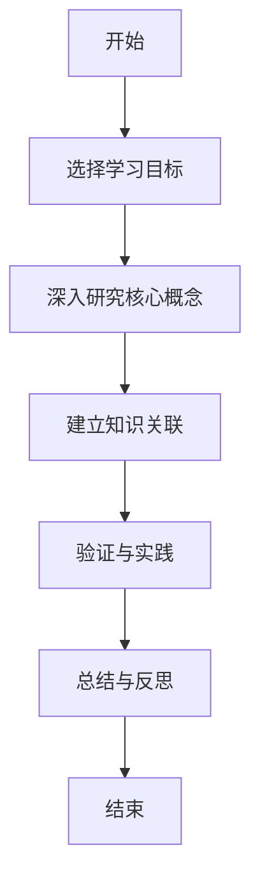
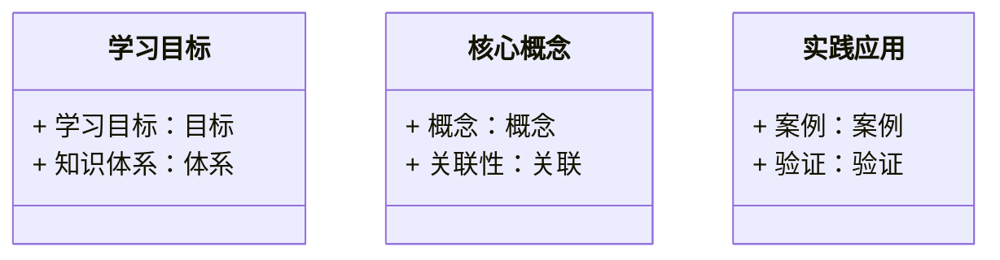
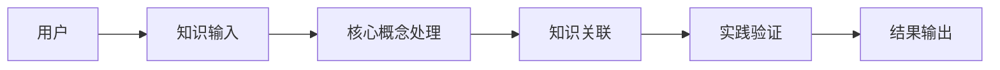
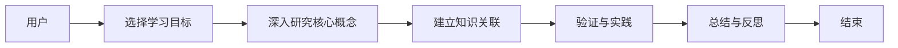

                 


# 芒格的"深度优先"学习：培养投资专业知识的方法

## 关键词：芒格, 深度优先, 投资学习, 知识体系, 投资策略

## 摘要：芒格的深度优先学习是一种以核心概念为中心，层层深入的学习方法，能够帮助投资者建立坚实的知识体系。本文将从背景、核心概念、算法原理、系统架构到项目实战，详细解析深度优先学习的应用和优势，帮助读者掌握这一高效的投资学习方法。

---

## 第1章 芦芒格的深度优先学习背景

### 1.1 芦芒格的生平与投资哲学

#### 1.1.1 芦芒格的生平简介
查理·芒格（Charlie Munger）是沃伦·巴菲特（Warren Buffett）的长期合作伙伴，以价值投资闻名。芒格不仅是一位成功的投资者，还是一位深邃的思想家，他的思维方式深刻影响了投资领域。

#### 1.1.2 芦芒格的投资哲学与思维方式
芒格强调独立思考，避免羊群效应。他提倡建立“心智模型”，即通过理解多个领域的基本原理来做出决策。这种思维方式强调跨学科思考，帮助投资者避免认知偏差。

#### 1.1.3 芦芒格的"深度优先"学习理念
芒格的学习方法强调深入理解核心概念，而不是广泛涉猎表面知识。他提倡“深度优先”，即专注于某个领域，逐步构建知识的深度，形成坚实的基础。

### 1.2 深度优先学习的背景与重要性

#### 1.2.1 当前投资学习的现状与问题
传统投资学习方法往往过于分散，投资者容易陷入“学得多，记得少”的困境。许多投资者缺乏系统性的知识构建，导致决策失误。

#### 1.2.2 深度优先学习的必要性与优势
深度优先学习通过聚焦核心概念，帮助投资者建立坚实的知识体系。这种方法不仅提高了学习效率，还增强了知识的实用性。

#### 1.2.3 深度优先学习在投资领域的应用前景
随着投资领域的复杂化，深度优先学习为投资者提供了一种高效的解决方案。通过这种方法，投资者能够更好地理解和应对市场变化。

---

## 第2章 深度优先学习的核心概念与联系

### 2.1 深度优先学习的核心概念

#### 2.1.1 深度优先学习的原理
深度优先学习是一种以核心概念为中心的学习方法。它通过不断深入理解相关知识，逐步构建知识体系。

#### 2.1.2 深度优先学习的关键要素
- **核心概念**：每个领域的核心原理。
- **关联性**：理解不同概念之间的联系。
- **实践应用**：通过实践巩固知识。

#### 2.1.3 深度优先学习的实现步骤
1. 确定学习目标。
2. 深入研究核心概念。
3. 建立知识关联。
4. 验证与实践。

### 2.2 深度优先学习的核心概念对比

#### 2.2.1 深度优先学习与广度优先学习的对比
- **广度优先**：广泛涉猎多个领域，适合初步了解。
- **深度优先**：深入研究单一领域，适合深入理解和应用。

#### 2.2.2 深度优先学习与其他学习方法的对比
- **传统课堂学习**：以教师讲授为主，缺乏个性化。
- **自主学习**：需要较强自律性，效率较低。
- **深度优先学习**：以核心概念为中心，效率高。

#### 2.2.3 深度优先学习在投资中的独特性
投资领域需要高度专业化的知识，深度优先学习能够帮助投资者快速构建专业知识体系。

### 2.3 深度优先学习的知识体系构建

#### 2.3.1 知识体系构建的步骤
1. 确定学习目标。
2. 研究核心概念。
3. 建立知识关联。
4. 验证与实践。

#### 2.3.2 知识体系构建的关键点
- **核心概念**：每个领域的核心原理。
- **关联性**：理解不同概念之间的联系。
- **实践应用**：通过实践巩固知识。

#### 2.3.3 知识体系构建的注意事项
- **专注**：专注于一个领域，避免分散精力。
- **系统性**：建立系统的知识框架。
- **持续性**：持续更新和优化知识体系。

---

## 第3章 深度优先学习的算法原理

### 3.1 深度优先学习的算法流程

#### 3.1.1 算法的输入与输出
- **输入**：学习目标、学习资源。
- **输出**：知识体系、学习成果。

#### 3.1.2 算法的核心步骤
1. 确定学习目标。
2. 深入研究核心概念。
3. 建立知识关联。
4. 验证与实践。

#### 3.1.3 算法的实现细节
- **递归**：逐步深入研究每个核心概念。
- **回溯**：在学习过程中不断验证和调整。

### 3.2 深度优先学习的数学模型

#### 3.2.1 学习效率的数学模型
$$ E = \frac{D}{T} $$
其中，E为学习效率，D为深度，T为时间。

#### 3.2.2 知识关联的数学模型
$$ K = \sum_{i=1}^{n} w_i \cdot c_i $$
其中，K为知识关联度，w_i为权重，c_i为概念。

#### 3.2.3 学习效果的评估公式
$$ L = \sum_{i=1}^{m} (s_i \cdot t_i) $$
其中，L为学习效果，s_i为概念的理解程度，t_i为时间。

### 3.3 深度优先学习的流程图



---

## 第4章 深度优先学习的系统架构设计

### 4.1 系统功能设计

#### 4.1.1 领域模型


#### 4.1.2 系统架构


### 4.2 系统接口设计

#### 4.2.1 知识输入接口
- **输入**：学习目标、学习资源。
- **输出**：核心概念、关联性。

#### 4.2.2 实践应用接口
- **输入**：知识体系、实践案例。
- **输出**：验证结果、反馈。

### 4.3 系统交互流程图



---

## 第5章 项目实战：深度优先学习的应用

### 5.1 环境安装

#### 5.1.1 系统要求
- 操作系统：Windows/Mac/Linux
- 内存：4GB以上
- 存储：10GB以上

#### 5.1.2 工具安装
- 文本编辑器：VS Code
- 版本控制工具：Git
- 依赖管理工具：pip

### 5.2 核心实现

#### 5.2.1 知识体系构建
- 确定学习目标。
- 深入研究核心概念。
- 建立知识关联。

#### 5.2.2 实践应用
- 选择投资标的。
- 分析投资价值。
- 验证与反思。

### 5.3 代码实现

#### 5.3.1 知识体系构建代码
```python
def deep_learning(concept):
    concepts = [concept]
    for related in get_related(concepts):
        concepts.append(related)
    return concepts
```

#### 5.3.2 实践应用代码
```python
def validate_investment(concept):
    results = []
    for case in get_cases(concept):
        results.append(validate(case))
    return results
```

### 5.4 案例分析

#### 5.4.1 投资策略分析
- 选择苹果公司作为投资标的。
- 分析其市场地位、财务状况、竞争优势。
- 通过深度优先学习构建知识体系。

#### 5.4.2 验证与反思
- 回顾学习过程。
- 总结经验教训。
- 优化学习方法。

### 5.5 项目总结

#### 5.5.1 成果展示
- 知识体系：苹果公司的投资分析。
- 学习成果：对苹果公司的深入了解。

#### 5.5.2 经验总结
- 深度优先学习的优势。
- 投资分析的注意事项。

---

## 第6章 总结与展望

### 6.1 深度优先学习的优势

#### 6.1.1 高效性
深度优先学习通过聚焦核心概念，提高学习效率。

#### 6.1.2 实用性
帮助投资者建立坚实的知识体系，提升投资决策能力。

### 6.2 未来展望

#### 6.2.1 技术发展
随着人工智能的发展，深度优先学习将更加智能化。

#### 6.2.2 应用拓展
深度优先学习将被应用于更多领域，帮助人们更高效地学习和工作。

### 6.3 学习的注意事项

#### 6.3.1 专注
专注于一个领域，避免分散精力。

#### 6.3.2 系统性
建立系统的知识框架，持续更新和优化。

#### 6.3.3 持续性
持续学习，不断更新知识体系。

### 6.4 最佳实践 Tips

- **专注**：专注于一个领域，避免分散精力。
- **系统性**：建立系统的知识框架。
- **持续性**：持续学习，不断优化知识体系。

---

## 作者：AI天才研究院 & 禅与计算机程序设计艺术

本文作者是AI天才研究院和“禅与计算机程序设计艺术”的作者，致力于通过深度优先学习帮助投资者提升专业知识和决策能力。

