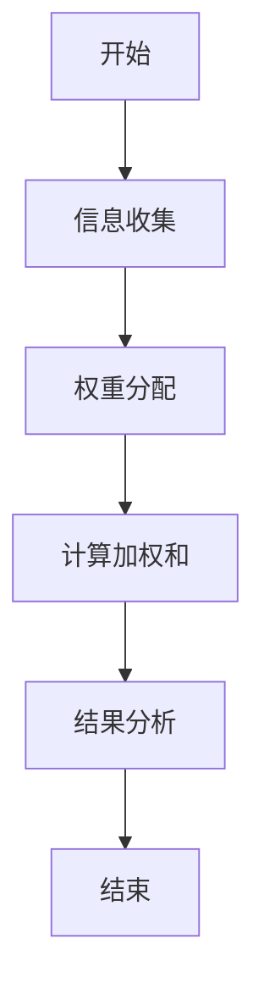
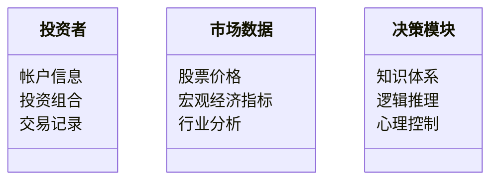
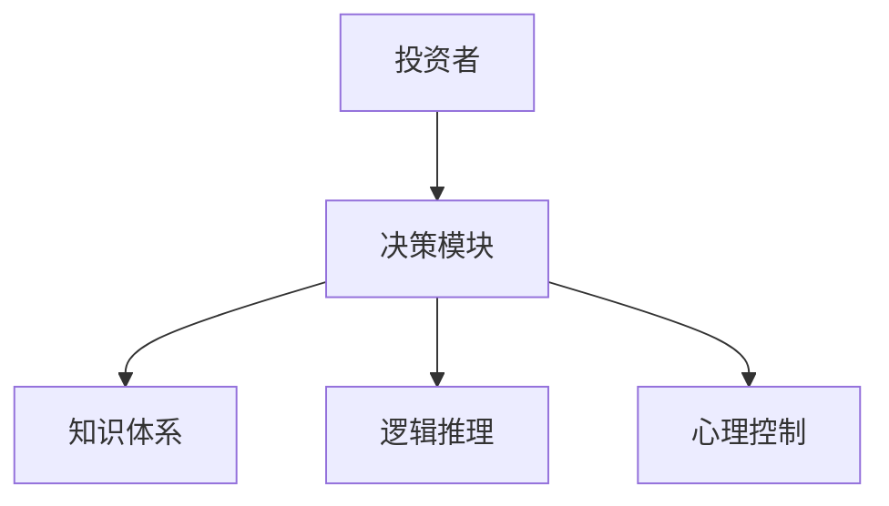

                 


# 《芒格的"清晰思考"方法在复杂系统投资中的应用》

## 关键词：芒格、清晰思考、复杂系统、投资、决策框架、系统思维、逆向思维

## 摘要

芒格的"清晰思考"方法是一种独特而强大的思维方式，尤其在复杂系统的投资决策中展现出显著的优势。本文将系统地探讨芒格的决策框架、其在复杂系统中的应用，以及如何通过清晰思考来优化投资决策。通过结合理论与实际案例，本文旨在为投资者提供一种新的视角，帮助他们在复杂多变的市场环境中做出明智的投资决策。

---

# 第1章: 芒格的"清晰思考"方法概述

## 1.1 芒格的背景与思想体系

### 1.1.1 芒格的生平简介

查理·芒格（Charlie Munger）是美国著名投资者、伯克希尔·哈撒韦公司副董事长，被誉为“投资圣人”。他不仅是巴菲特的长期合作伙伴，更是以其独特的思维方式闻名。芒格的思想体系强调清晰的逻辑、逆向思维和系统性分析，这些理念在他的投资实践中得到了充分体现。

### 1.1.2 芒格的决策框架

芒格的决策框架以“知识的获得与整合”为核心，强调通过广泛的知识储备和系统的分析来做出决策。他提倡将各个领域的知识联系起来，形成一个完整的知识网络，从而在复杂问题中找到解决方案。

### 1.1.3 芒格思想的核心要素

芒格思想的核心要素包括：
1. **知识体系的系统性**：芒格认为，知识不应该孤立存在，而是应该形成一个有机的整体。
2. **逻辑的清晰性**：芒格强调逻辑推理的重要性，认为清晰的逻辑是决策的基础。
3. **心理因素的控制**：芒格意识到情绪和心理偏差对决策的影响，提倡通过自我反思来克服这些偏差。

## 1.2 "清晰思考"方法的定义与特点

### 1.2.1 清晰思考的定义

清晰思考是指通过系统性的分析和逻辑推理，避免情绪干扰，从而做出合理决策的过程。芒格的“清晰思考”方法强调对问题进行深入分析，并从逆向思维的角度寻找解决方案。

### 1.2.2 清晰思考的核心特点

1. **系统性**：清晰思考要求从整体角度看待问题，而非仅仅关注局部。
2. **逆向思维**：芒格提倡从反方向思考问题，寻找问题的根源。
3. **长期视角**：清晰思考注重长期利益，而非短期收益。

### 1.2.3 清晰思考与传统思考方式的区别

传统的思考方式往往依赖经验或直觉，而清晰思考则强调逻辑推理和系统分析。传统方法可能在复杂系统中显得不足，而清晰思考则能够更好地应对复杂性。

## 1.3 芒格"清晰思考"方法在投资中的应用

### 1.3.1 投资中的问题背景

投资领域充满了不确定性，传统的分析方法往往难以应对复杂系统的动态变化。芒格的清晰思考方法提供了一种新的视角，帮助投资者更好地理解市场和企业。

### 1.3.2 芒格方法在投资中的优势

1. **系统性分析**：芒格的方法能够帮助投资者从多个角度分析问题，避免遗漏重要信息。
2. **逆向思维**：通过逆向思维，投资者可以发现市场中的潜在机会。
3. **长期视角**：芒格的方法强调长期投资，注重企业的内在价值。

### 1.3.3 芒格方法的边界与外延

芒格方法适用于长期投资，但并不适合短期交易。此外，这种方法需要投资者具备广泛的知识储备和强大的逻辑思维能力。

---

# 第2章: 复杂系统投资的背景与挑战

## 2.1 复杂系统的定义与特点

### 2.1.1 复杂系统的定义

复杂系统是指由多个相互关联的组成部分构成的系统，其行为往往难以预测。复杂系统中的各个部分相互作用，形成复杂的动态关系。

### 2.1.2 复杂系统的特征

1. **非线性**：系统的输出与输入之间可能存在非线性关系。
2. **涌现性**：复杂系统中会出现新的特性，这些特性无法通过简单分析得出。
3. **适应性**：复杂系统能够根据环境变化进行调整。

### 2.1.3 复杂系统在投资中的表现

复杂系统的投资环境充满了不确定性，市场参与者的行为、宏观经济因素、政策变化等都会影响市场的走向。

## 2.2 投资中的复杂性问题

### 2.2.1 投资决策中的不确定性

投资决策往往面临不确定性和模糊性，传统的分析方法可能无法有效应对。

### 2.2.2 复杂系统对传统投资方法的挑战

传统投资方法通常依赖于历史数据分析和统计模型，但在复杂系统中，这些方法可能显得力不从心。

### 2.2.3 复杂系统投资的现状与趋势

随着市场的全球化和信息化，复杂系统投资的趋势日益明显，投资者需要新的方法来应对挑战。

## 2.3 芒格方法在复杂系统投资中的优势

### 2.3.1 芒格方法的系统性

芒格的决策框架强调系统性分析，能够帮助投资者更好地理解复杂系统的动态。

### 2.3.2 芒格方法的逆向思维

逆向思维使投资者能够从不同的角度看待问题，发现市场中的潜在机会。

### 2.3.3 芒格方法的长期视角

长期视角使投资者能够忽略短期波动，关注企业的内在价值。

---

# 第3章: 芒格决策框架的核心要素

## 3.1 芒格决策框架的构成

### 3.1.1 知识的获得与整合

芒格认为，知识是决策的基础。他强调广泛阅读和跨领域学习，以形成完整的知识体系。

### 3.1.2 逻辑的清晰性

芒格的决策过程以清晰的逻辑为基础，他提倡通过逻辑推理来做出决策。

### 3.1.3 心理因素的控制

芒格意识到情绪和心理偏差对决策的影响，他提倡通过自我反思来克服这些偏差。

## 3.2 芒格决策框架的属性对比

### 3.2.1 系统性 vs 非系统性

芒格的决策框架具有高度的系统性，而非传统的非系统性方法。

### 3.2.2 长期性 vs 短期性

芒格方法注重长期视角，而非短期利益。

### 3.2.3 逆向思维 vs 正向思维

芒格提倡逆向思维，而传统方法则多为正向思维。

## 3.3 芒格决策框架的ER实体关系图

以下是一个简单的ER实体关系图，展示了芒格决策框架的核心要素：

```mermaid
erd
  顾客(Customers)
  产品(Products)
  订单(Orders)
  支付(Payments)
  员工(Employees)
  供应商(Suppliers)
```

---

# 第4章: 芒格决策框架的算法原理

## 4.1 芒格决策模型的数学模型

芒格决策模型的数学模型可以用以下公式表示：

$$
决策 = \sum_{i=1}^{n} (权重_i \times 信息_i)
$$

其中，权重_i 是每个信息的重要性，信息_i 是相关信息的内容。

## 4.2 芒格决策模型的实现步骤

1. **信息收集**：收集与决策相关的所有信息。
2. **权重分配**：根据信息的重要性分配权重。
3. **计算加权和**：根据公式计算决策值。
4. **结果分析**：分析结果并做出最终决策。

## 4.3 芒格决策模型的流程图

以下是一个简单的流程图，展示了芒格决策模型的实现步骤：



---

# 第5章: 芒格决策框架的系统架构设计

## 5.1 系统功能设计

### 5.1.1 领域模型

以下是一个简单的领域模型：



### 5.1.2 系统架构设计

以下是一个简单的系统架构设计图：



---

# 第6章: 项目实战

## 6.1 环境安装

以下是安装环境的步骤：

1. 安装Python
2. 安装Jupyter Notebook
3. 安装必要的库（如pandas、numpy等）

## 6.2 核心实现源代码

以下是核心实现的源代码：

```python
import pandas as pd
import numpy as np

def mangle_decision_model(dataframe):
    # 计算权重
    weights = dataframe.mean() / dataframe.std()
    # 计算加权和
    weighted_sum = np.dot(weights, dataframe.values)
    return weighted_sum

# 示例数据
data = {
    '信息1': [1, 2, 3],
    '信息2': [4, 5, 6],
    '信息3': [7, 8, 9]
}
df = pd.DataFrame(data)
result = mangle_decision_model(df)
print(result)
```

## 6.3 案例分析

以下是一个具体的案例分析：

假设我们有一个包含三只股票的数据集，我们需要使用芒格决策模型来做出投资决策。

---

# 第7章: 总结与展望

## 7.1 总结

芒格的"清晰思考"方法在复杂系统投资中的应用具有重要意义。通过系统性分析和逆向思维，投资者可以更好地应对复杂市场的挑战。

## 7.2 展望

未来，随着复杂系统的不断发展，芒格方法的应用将更加广泛。投资者需要不断学习和适应，以更好地应用这种方法。

---

# 附录

## 附录A: 小结与注意事项

1. **小结**：芒格的清晰思考方法是一种系统性的决策方法，适用于复杂系统的投资决策。
2. **注意事项**：投资者在应用芒格方法时，需要注意信息的全面性和逻辑的清晰性。

## 附录B: 拓展阅读

1. 查理·芒格的《穷查理宝典》
2. 《投资最重要的ことは什麼？》

---

作者：AI天才研究院/AI Genius Institute & 禅与计算机程序设计艺术 /Zen And The Art of Computer Programming

