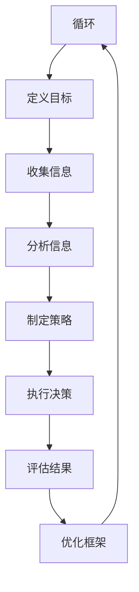
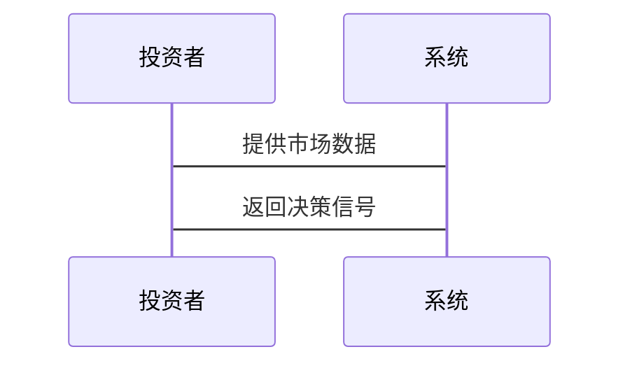

                 


# 芒格的"清晰思考"方法：提高投资决策的质量

> 关键词：清晰思考，芒格，投资决策，心理模型，决策框架，算法原理

> 摘要：芒格的"清晰思考"方法是一种通过构建心理模型和优化决策框架来提高投资决策质量的思维方式。本文将从清晰思考的核心概念出发，详细阐述其在投资决策中的应用，结合算法原理和系统架构，通过实际案例分析，展示如何将清晰思考方法应用于投资实战。

---

## 第1章：清晰思考的核心概念

### 1.1 心理模型的构建

#### 1.1.1 心理模型的定义与作用
心理模型是理解事物运作方式的简化表示。在投资中，心理模型帮助投资者预测市场行为和资产表现。

#### 1.1.2 心理模型的属性对比表
| 属性 | 描述 |
|------|------|
| 简洁性 | 快速理解复杂系统 |
| 可解释性 | 易于沟通和验证 |
| 稳定性 | 面对变化的适应性 |

#### 1.1.3 心理模型的ER实体关系图
```mermaid
erDiagram
    actor 投资者 {
        +id : int
        +知识 : string
    }
    actor 市场 {
        +id : int
        +行为 : string
    }
    investor -->心理模型: 基于知识构建
    market -->心理模型: 预测市场行为
```

### 1.2 决策框架的建立

#### 1.2.1 决策框架的定义
决策框架是指导投资决策的一系列规则和流程。

#### 1.2.2 决策框架的优化
优化决策框架的关键在于减少认知偏差和提高逻辑性。

#### 1.2.3 决策框架的流程图


## 第2章：清晰思考的算法原理

### 2.1 逻辑推理算法

#### 2.1.1 逻辑推理的基本步骤
1. 收集信息
2. 分析信息
3. 推理结论
4. 验证结论

#### 2.1.2 逻辑推理的Python实现
```python
def logical_inference(data):
    # 数据处理
    processed_data = data.strip().lower()
    # 推理过程
    if 'buy' in processed_data:
        return '买入信号'
    elif 'sell' in processed_data:
        return '卖出信号'
    else:
        return '无信号'
```

### 2.2 心理模型的构建算法

#### 2.2.1 心理模型的构建步骤
1. 确定目标资产
2. 分析影响因素
3. 建立数学模型
4. 验证模型准确性

#### 2.2.2 心理模型的数学公式
$$
\text{资产价值} = \sum_{i=1}^{n} w_i \cdot f_i
$$
其中，\( w_i \) 是因素权重，\( f_i \) 是影响因素。

### 2.3 决策框架的优化算法

#### 2.3.1 决策框架的优化步骤
1. 识别关键决策点
2. 量化决策标准
3. 应用动态调整
4. 定期评估优化

#### 2.3.2 决策框架的优化公式
$$
\text{最优决策} = \argmin_{d} \sum_{i=1}^{m} c_i \cdot d_i
$$
其中，\( c_i \) 是决策成本，\( d_i \) 是决策变量。

## 第3章：清晰思考的系统分析

### 3.1 系统架构设计

#### 3.1.1 系统架构概述
系统架构包括数据采集、分析模块和决策模块。

#### 3.1.2 系统架构的Mermaid图


### 3.2 系统接口设计

#### 3.2.1 系统接口的定义
接口定义数据输入和输出格式。

#### 3.2.2 系统接口的交互图


## 第4章：清晰思考的项目实战

### 4.1 项目环境安装

#### 4.1.1 环境需求
Python 3.8及以上版本，安装必要的库：numpy、pandas、scikit-learn。

### 4.2 核心实现源代码

#### 4.2.1 投资组合优化模型
```python
import numpy as np
from scipy.optimize import minimize

def portfolio_optimization(returns, weights):
    # 定义目标函数
    def objective(weights, returns):
        return -np.sum(weights * returns)
    # 约束条件
    constraints = [
        ('sum', weights, 1),
        ('>=', weights, 0)
    ]
    # 优化求解
    res = minimize(objective, weights, args=(returns,))
    return res.x

# 示例数据
returns = np.array([0.1, 0.2, 0.15])
weights = np.array([1/3, 1/3, 1/3])

# 调用函数
optimal_weights = portfolio_optimization(returns, weights)
print(optimal_weights)
```

### 4.3 实际案例分析

#### 4.3.1 案例背景
假设投资三种资产，预期收益率分别为10%、20%、15%。

#### 4.3.2 模型应用
使用上述代码优化投资组合，得到最优权重。

#### 4.3.3 结果解读
优化后的权重可能偏离初始权重，反映市场风险和收益的权衡。

## 第5章：总结与展望

### 5.1 本章小结
芒格的清晰思考方法通过构建心理模型和优化决策框架，显著提高了投资决策的质量。

### 5.2 最佳实践Tips
- 定期回顾和优化决策框架
- 结合市场变化动态调整
- 保持对新模型的学习和应用

### 5.3 未来展望
未来可以进一步研究复杂市场的心理模型构建，以及多目标优化算法的应用。

---

# 作者：AI天才研究院/AI Genius Institute & 禅与计算机程序设计艺术 /Zen And The Art of Computer Programming

