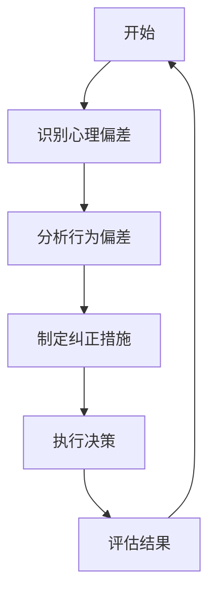
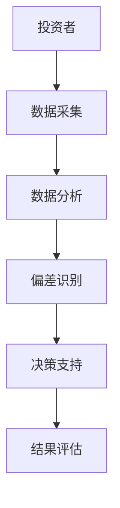

                 


# 芒格的"误判心理学"应用：提高投资决策质量

> 关键词：误判心理学、投资决策、芒格、心理偏差、行为偏差、认知偏差、决策优化

> 摘要：本文通过分析芒格的“误判心理学”理论，探讨其在投资决策中的应用，结合心理偏差、行为偏差和认知偏差的原理，提供提高投资决策质量的方法和策略。

---

# 1. 误判心理学的背景与核心概念

## 1.1 问题背景

投资决策是人类行为中最复杂且最容易受到心理偏差影响的领域之一。投资者在面对市场波动和不确定性时，常常会因为情绪、认知局限或行为偏差而做出错误决策，这种现象被称为“误判”。

### 1.1.1 投资决策中的常见问题

投资决策中常见的问题包括：

- **情绪化决策**：投资者在市场恐慌或贪婪时容易做出非理性决策。
- **信息过载**：面对大量信息时，投资者容易忽略关键数据或过度依赖某些信息。
- **认知偏差**：投资者倾向于相信自己已有的知识和经验，忽视新信息或不同观点。
- **行为偏差**：投资者在行动时，容易受到从众心理或习惯性行为的影响。

### 1.1.2 心理偏差对投资决策的影响

心理偏差是指人们在处理信息和做出决策时，由于认知局限或情绪影响，导致判断偏离事实的现象。常见的心理偏差包括：

- **确认偏差**：倾向于寻找支持已有观点的信息，忽略相反证据。
- **过度自信偏差**：认为自己比其他人更了解市场，导致过度交易。
- **损失厌恶**：对损失的恐惧超过对收益的追求，导致卖出优质资产或错失投资机会。

### 1.1.3 误判心理学的核心概念

误判心理学是研究人类在决策过程中因心理偏差和行为偏差导致判断错误的科学。其核心在于识别和纠正这些偏差，从而提高决策质量。

---

## 1.2 问题描述

### 1.2.1 投资决策中的误判现象

在投资领域，误判现象屡见不鲜。例如：

- 投资者在市场高点买入股票，因为看到连续上涨而误判市场趋势。
- 投资者在市场低谷时卖出股票，因为看到连续下跌而误判市场底部。
- 投资者过度关注短期收益，忽视长期投资目标。

### 1.2.2 心理偏差与行为偏差的区别

- **心理偏差**：指个体在信息处理和判断过程中产生的系统性错误，例如确认偏差、过度自信偏差等。
- **行为偏差**：指个体在行动过程中因心理偏差导致的错误行为，例如从众行为、过度交易等。

### 1.2.3 误判心理学的定义与研究范围

误判心理学是研究人类在决策过程中因心理偏差和行为偏差导致判断错误的科学。其研究范围包括：

- 心理偏差的识别与分类。
- 行为偏差的分析与应对。
- 投资决策中误判现象的预防与纠正。

---

## 1.3 问题解决

### 1.3.1 误判心理学的基本原理

误判心理学的核心原理在于：

- **识别偏差**：通过自我反思和分析，识别自己在决策中可能存在的偏差。
- **纠正偏差**：通过制定规则和流程，避免偏差对决策的影响。
- **优化决策**：通过持续学习和经验积累，提高决策质量。

### 1.3.2 心理偏差的分类与特征

心理偏差可以分为以下几类：

- **确认偏差**：倾向于寻找支持已有观点的信息。
- **过度自信偏差**：认为自己比其他人更了解市场。
- **损失厌恶**：对损失的恐惧超过对收益的追求。
- **从众心理**：跟随大多数人的决策，忽视自己的判断。

### 1.3.3 行为偏差的识别与应对

行为偏差的识别可以通过以下步骤进行：

1. **自我反思**：在做出决策后，回顾自己的行为，分析是否存在偏差。
2. **制定规则**：例如，设定投资纪律，避免情绪化交易。
3. **寻求反馈**：向他人或专业人士请教，获取客观反馈。

---

## 1.4 边界与外延

### 1.4.1 误判心理学的研究边界

误判心理学的研究边界包括：

- **研究范围**：主要关注心理偏差和行为偏差对决策的影响。
- **适用领域**：不仅限于投资领域，还可应用于其他决策领域。
- **研究对象**：以个体决策者为主，群体决策尚未深入研究。

### 1.4.2 误判心理学与投资决策的关系

误判心理学是投资决策的重要理论基础，它帮助投资者识别和纠正决策中的偏差，从而提高决策质量。

### 1.4.3 误判心理学的外延与应用领域

误判心理学的应用领域包括：

- **金融投资**：帮助投资者避免误判，提高投资收益。
- **企业管理**：帮助管理者做出更明智的决策。
- **个人决策**：帮助个体提高生活中的决策质量。

---

## 1.5 概念结构与核心要素

### 1.5.1 误判心理学的核心要素

误判心理学的核心要素包括：

- **心理偏差**：确认偏差、过度自信偏差等。
- **行为偏差**：从众行为、过度交易等。
- **决策规则**：制定纪律，避免情绪化决策。

### 1.5.2 心理偏差与行为偏差的对比分析

| 类别       | 心理偏差               | 行为偏差               |
|------------|------------------------|------------------------|
| 定义       | 信息处理中的系统性错误   | 行动过程中的错误行为   |
| 示例       | 确认偏差、过度自信偏差   | 从众行为、过度交易     |
| 纠正方法   | 自我反思、制定规则      | 制定纪律、寻求反馈     |

### 1.5.3 误判心理学的理论框架

误判心理学的理论框架包括：

- **识别偏差**：通过自我反思和分析，识别心理偏差和行为偏差。
- **纠正偏差**：通过制定规则和流程，避免偏差对决策的影响。
- **优化决策**：通过持续学习和经验积累，提高决策质量。

---

# 2. 误判心理学的核心概念与联系

## 2.1 心理偏差的原理

### 2.1.1 心理偏差的定义与分类

心理偏差是指个体在信息处理和判断过程中产生的系统性错误。常见的心理偏差包括：

- **确认偏差**：倾向于寻找支持已有观点的信息。
- **过度自信偏差**：认为自己比其他人更了解市场。
- **损失厌恶**：对损失的恐惧超过对收益的追求。

### 2.1.2 常见心理偏差

以下是一些常见的心理偏差及其对投资决策的影响：

- **确认偏差**：投资者倾向于寻找支持自己已有观点的信息，导致误判市场趋势。
- **过度自信偏差**：投资者认为自己比其他人更了解市场，导致过度交易。
- **损失厌恶**：投资者对损失的恐惧导致他们在市场低谷时卖出股票，错失投资机会。

---

## 2.2 心理偏差与行为偏差的对比分析

### 2.2.1 心理偏差与行为偏差的对比表格

| 类别       | 心理偏差               | 行为偏差               |
|------------|------------------------|------------------------|
| 定义       | 信息处理中的系统性错误   | 行动过程中的错误行为   |
| 示例       | 确认偏差、过度自信偏差   | 从众行为、过度交易     |
| 纠正方法   | 自我反思、制定规则      | 制定纪律、寻求反馈     |

---

## 2.3 心理偏差与行为偏差的联系

心理偏差和行为偏差密切相关。心理偏差可能导致行为偏差，而行为偏差又会进一步强化心理偏差。例如：

- 确认偏差（心理偏差）可能导致从众行为（行为偏差）。
- 过度自信偏差（心理偏差）可能导致过度交易（行为偏差）。

---

# 3. 误判心理学的算法原理讲解

## 3.1 算法原理

### 3.1.1 算法流程图

以下是一个用于识别和纠正心理偏差的算法流程图：



---

## 3.2 算法实现

### 3.2.1 算法步骤

1. **识别心理偏差**：通过自我反思和分析，识别自己在决策中可能存在的偏差。
2. **分析行为偏差**：分析自己的行为是否受到心理偏差的影响。
3. **制定纠正措施**：制定规则和流程，避免偏差对决策的影响。
4. **执行决策**：根据制定的规则和流程，做出决策。
5. **评估结果**：评估决策结果，总结经验教训。

### 3.2.2 算法实现代码

以下是一个简单的Python代码示例，用于识别和纠正心理偏差：

```python
def identify_bias(decision):
    # 识别心理偏差
    if decision == 'overconfident':
        return '过度自信偏差'
    elif decision == 'confirmative':
        return '确认偏差'
    else:
        return '未知偏差'

def correct_bias(bias):
    # 制定纠正措施
    if bias == '过度自信偏差':
        return '制定规则，避免情绪化决策'
    elif bias == '确认偏差':
        return '寻找相反证据，避免片面判断'
    else:
        return '无纠正措施'

def main():
    decision = input('请输入决策类型：')
    bias = identify_bias(decision)
    correction = correct_bias(bias)
    print(f'识别的偏差：{bias}')
    print(f'纠正措施：{correction}')

if __name__ == '__main__':
    main()
```

---

## 3.3 算法原理的数学模型和公式

### 3.3.1 数学模型

误判心理学的数学模型可以通过概率论和统计学来分析。例如，可以通过贝叶斯定理来计算某个事件发生的概率，从而帮助投资者做出更理性的决策。

### 3.3.2 公式示例

以下是一个简单的概率计算公式：

$$ P(A|B) = \frac{P(B|A) \cdot P(A)}{P(B)} $$

其中：
- \( P(A|B) \) 是在已知 B 的情况下，A 发生的概率。
- \( P(B|A) \) 是在已知 A 的情况下，B 发生的概率。
- \( P(A) \) 是 A 发生的先验概率。
- \( P(B) \) 是 B 发生的先验概率。

---

# 4. 误判心理学的系统分析与架构设计方案

## 4.1 系统架构设计

### 4.1.1 系统架构图

以下是一个基于误判心理学的投资决策支持系统的架构图：



---

## 4.2 项目实战

### 4.2.1 环境安装

要运行以下代码，需要安装Python和必要的库（如numpy、pandas等）。

### 4.2.2 系统核心实现源代码

以下是一个简单的Python代码示例，用于识别和纠正心理偏差：

```python
import numpy as np
import pandas as pd

def identify_bias(decision):
    # 识别心理偏差
    if decision == 'overconfident':
        return '过度自信偏差'
    elif decision == 'confirmative':
        return '确认偏差'
    else:
        return '未知偏差'

def correct_bias(bias):
    # 制定纠正措施
    if bias == '过度自信偏差':
        return '制定规则，避免情绪化决策'
    elif bias == '确认偏差':
        return '寻找相反证据，避免片面判断'
    else:
        return '无纠正措施'

def main():
    decision = input('请输入决策类型：')
    bias = identify_bias(decision)
    correction = correct_bias(bias)
    print(f'识别的偏差：{bias}')
    print(f'纠正措施：{correction}')

if __name__ == '__main__':
    main()
```

---

## 4.3 实际案例分析

### 4.3.1 案例分析

假设一个投资者在市场高点买入股票，因为看到连续上涨而误判市场趋势。通过误判心理学的理论，我们可以识别出他的确认偏差，并制定纠正措施，例如：

- 设定止损点，避免进一步亏损。
- 寻找相反证据，避免片面判断。

---

## 4.4 项目小结

通过项目实战，我们可以看到误判心理学在投资决策中的实际应用。识别和纠正心理偏差是提高决策质量的关键。

---

# 5. 最佳实践与注意事项

## 5.1 小结

- 误判心理学是研究人类在决策过程中因心理偏差和行为偏差导致判断错误的科学。
- 识别和纠正偏差是提高投资决策质量的关键。
- 制定规则和流程，避免情绪化决策，是投资者成功的关键。

## 5.2 注意事项

- 投资者应定期反思自己的决策，识别是否存在偏差。
- 制定纪律和规则，避免情绪化交易。
- 寻求专业指导，获取客观反馈。

## 5.3 拓展阅读

- 《芒格的决策心理学》
- 《投资心理学》
- 《行为金融学》

---

# 作者：AI天才研究院/AI Genius Institute & 禅与计算机程序设计艺术 /Zen And The Art of Computer Programming

