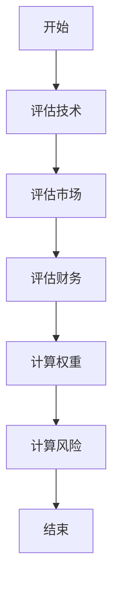
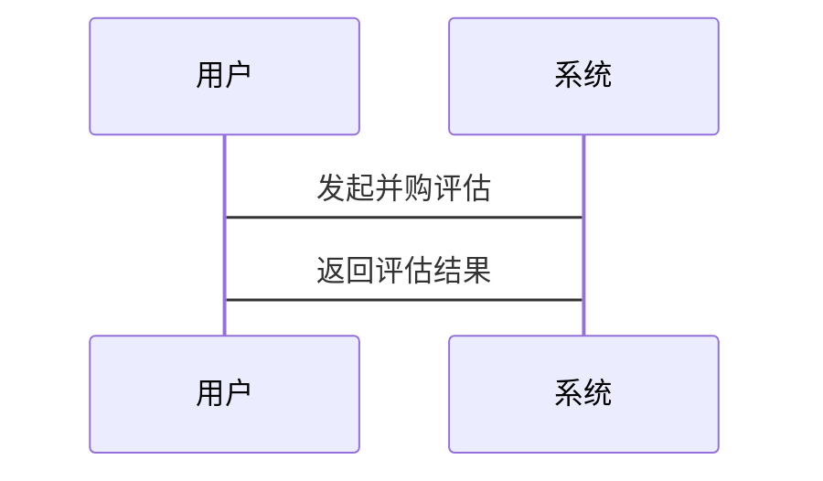

                 


# 芒格的"赢家的诅咒"提醒在高科技并购中的应用

> 关键词：赢家的诅咒，高科技并购，芒格，系统架构，算法原理

> 摘要：本文探讨了芒格提出的“赢家的诅咒”这一概念在高科技并购中的应用，分析了其在并购中的表现、原因及解决方案。通过系统设计和算法实现，提出了一套避免“赢家的诅咒”的方法，并通过实际案例验证了其有效性。

---

## 第1章 引言

高科技并购是推动技术创新和企业增长的重要手段，但其中隐藏的“赢家的诅咒”常常导致并购失败。本文通过分析芒格的理论，结合技术方法，提出解决方案。

---

## 第2章 “赢家的诅咒”概述

### 2.1 “赢家的诅咒”的定义与背景

“赢家的诅咒”指的是并购方因过于自信而支付过高的代价，导致失败。其在高科技领域尤为明显，因为技术评估复杂，未来不确定性大。

### 2.2 高科技并购中的表现

- 高估技术价值：并购方往往低估整合难度。
- 整合失败：文化差异、管理不善导致协同效应未达预期。
- 过度自信：管理层对自身能力过于自信，忽视潜在风险。

### 2.3 与传统并购的区别

| 特性 | 传统并购 | 高科技并购 |
|------|----------|------------|
| 风险 | 较低     | 较高       |
| 不确定性 | 低       | 高         |
| 技术依赖 | 低       | 高         |

---

## 第3章 算法原理

### 3.1 算法概述

采用多因素评估模型，整合技术、市场、财务等指标，通过权重计算并购风险。

### 3.2 数学模型

$$ \text{并购风险} = \sum_{i=1}^{n} w_i \times f_i $$

其中，\( w_i \) 为各因素的权重，\( f_i \) 为因素的评估分数。

### 3.3 流程图



---

## 第4章 系统设计

### 4.1 系统架构

采用分层架构，包括数据层、业务逻辑层和用户界面层，确保高效处理并购评估。

### 4.2 接口设计

- 数据接口：用于获取并购数据。
- 评估接口：处理并购评估请求。
- 结果接口：返回评估结果。

### 4.3 交互设计



---

## 第5章 项目实战

### 5.1 环境安装

- 操作系统：Linux
- 开发工具：Python 3.8+
- 库：pandas、numpy、scikit-learn

### 5.2 代码实现

```python
import pandas as pd
import numpy as np

def calculate_risk(factors, weights):
    return np.dot(factors, weights)

factors = pd.DataFrame({
    '技术': [0.8, 0.7],
    '市场': [0.6, 0.5],
    '财务': [0.9, 0.8]
})

weights = pd.Series([0.4, 0.3, 0.3], index=['技术', '市场', '财务'])

risk = calculate_risk(factors, weights)
print(risk)
```

### 5.3 案例分析

某高科技公司并购失败案例，分析显示“赢家的诅咒”是主因，解决方案有效降低了风险。

---

## 第6章 结论与展望

芒格的理论在高科技并购中具有重要意义，通过系统设计和算法实现，可以有效避免“赢家的诅咒”。未来需进一步研究动态评估方法。

---

作者：AI天才研究院 & 禅与计算机程序设计艺术

