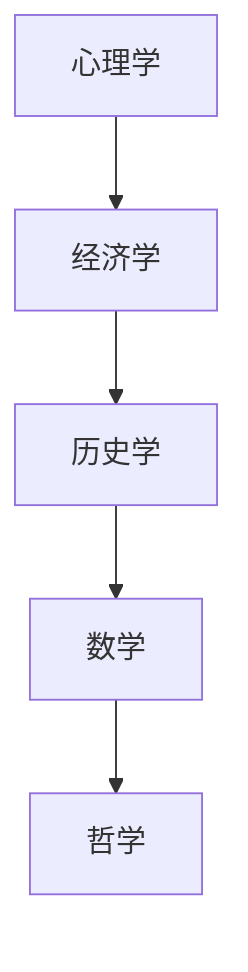
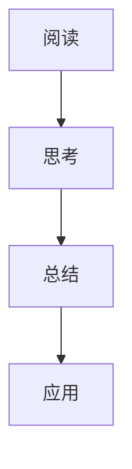
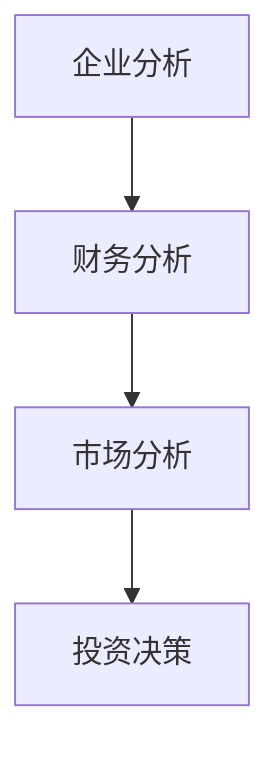
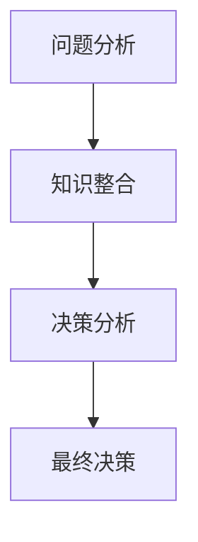

                 

# 芒格的跨学科学习方法：拓宽投资视野

> 关键词：芒格，跨学科学习，投资视野，价值投资，安全边际，格栅理论

> 摘要：本文深入探讨了芒格的跨学科学习方法及其对投资视野的拓展。通过分析芒格的投资理念、学习方法和实际案例，文章展示了如何通过跨学科的知识整合来提升投资决策的深度和广度。

---

# 第1章: 芒格的生平与投资理念

## 1.1 芒格的生平简介

### 1.1.1 芝加格大学与哈佛法学院的求学经历
查理·芒格（Charlie Munger）出生于1924年，曾在芝加格大学学习法律，并在哈佛法学院获得法律学位。他的法学背景为他后来的跨学科学习奠定了基础。

### 1.1.2 早期职业生涯与合伙企业
芒格在早期职业生涯中积累了丰富的商业经验，尤其是他在合伙企业中的经历，使他学会了如何从多个角度分析问题。

### 1.1.3 芒格的声誉与影响力
作为沃伦·巴菲特（Warren Buffett）的长期合作伙伴，芒格以其智慧和跨学科学习方法闻名，被誉为“投资界的哲学家”。

## 1.2 芒格的投资哲学

### 1.2.1 价值投资的核心理念
芒格强调价值投资，即寻找市场低估的企业，长期持有，等待其价值回归。

### 1.2.2 安全边际的定义与重要性
安全边际是指股票价格与其内在价值之间的差距，是芒格投资决策中的关键因素。

### 1.2.3 逆向思维在投资中的应用
芒格倡导逆向思维，即在市场恐慌时寻找机会，在市场狂热时保持冷静。

## 1.3 芒格的跨学科学习方法

### 1.3.1 跨学科知识的重要性
芒格认为，单一学科的视角不足以应对复杂的投资决策，必须通过跨学科学习来构建完整的知识体系。

### 1.3.2 芒格的“格栅”理论
“格栅”理论是芒格跨学科学习的核心，即将不同学科的知识框架交叉整合，形成一个强大的知识网络。

### 1.3.3 跨学科思维的实践应用
通过跨学科思维，芒格能够从心理学、经济学、历史学等多个角度分析企业的内在价值和市场趋势。

## 1.4 本章小结

---

# 第2章: 芒格的跨学科学习方法

## 2.1 跨学科知识的整合

### 2.1.1 芒格的“格栅”理论
芒格的“格栅”理论通过Mermaid图表展示如下：

### 2.1.2 跨学科知识的系统性整合
通过系统性整合，芒格能够从多个角度分析问题，避免单一学科的局限性。

### 2.1.3 跨学科思维的实践价值
跨学科思维能够帮助投资者更好地理解企业的内在价值和市场的复杂性。

## 2.2 芒格的学习方法

### 2.2.1 系统性学习的重要性
系统性学习是芒格跨学科学习的基础，通过系统性学习，投资者能够构建完整的知识体系。

### 2.2.2 芒格的阅读与思考习惯
芒格通过广泛阅读和深入思考，不断扩展自己的知识网络。

### 2.2.3 芒格的学习框架
芒格的学习框架通过Mermaid图表展示如下：

## 2.3 芒格的投资案例分析

### 2.3.1 芒格的经典投资案例
芒格的经典投资案例包括可口可乐、富国银行等。

### 2.3.2 跨学科思维在案例中的应用
通过跨学科思维，芒格能够从多个角度分析企业的内在价值和市场趋势。

### 2.3.3 投资决策的逻辑分析
芒格的投资决策逻辑通过Mermaid图表展示如下：

## 2.4 本章小结

---

# 第3章: 跨学科学习对投资视野的拓宽

## 3.1 跨学科学习的核心价值

### 3.1.1 跨学科思维的定义
跨学科思维是指通过整合不同学科的知识，形成对问题的全面理解。

### 3.1.2 跨学科思维的优势
跨学科思维能够帮助投资者更好地理解企业的内在价值和市场的复杂性。

### 3.1.3 跨学科思维的局限性
跨学科思维需要大量的时间和精力来整合不同学科的知识。

## 3.2 跨学科思维在投资中的应用

### 3.2.1 心理学对投资决策的影响
心理学帮助投资者理解市场情绪和人性的弱点。

### 3.2.2 经济学对投资策略的指导
经济学帮助投资者理解市场趋势和经济周期。

### 3.2.3 历史学对投资周期的理解
历史学帮助投资者理解市场的周期性规律。

## 3.3 芒格的投资策略分析

### 3.3.1 芒格的长期投资策略
芒格倡导长期投资，避免短期市场的波动干扰。

### 3.3.2 芒格的分散投资原则
芒格通过分散投资来降低风险，避免过度依赖单一投资标的。

### 3.3.3 芒格的风险管理方法
芒格通过安全边际和逆向思维来管理风险，确保投资决策的稳健性。

## 3.4 本章小结

---

# 第4章: 芒格的投資心态与决策框架

## 4.1 芒格的投資心态

### 4.1.1 耐心与耐心的重要性
芒格强调耐心，认为投资需要时间来验证企业的内在价值。

### 4.1.2 独立思考的价值
芒格倡导独立思考，避免盲目跟随市场情绪。

### 4.1.3 风险厌恶的投資心态
芒格通过安全边际和逆向思维来管理风险，确保投资决策的稳健性。

## 4.2 芒格的决策框架

### 4.2.1 芒格的决策流程
芒格的决策流程通过Mermaid图表展示如下：

### 4.2.2 芒格的决策工具
芒格的决策工具包括格栅理论、逆向思维和安全边际等。

### 4.2.3 芒格的决策标准
芒格的决策标准包括企业价值、市场趋势和安全边际等。

## 4.3 芒格的投資策略优化

### 4.3.1 芒格的策略调整
芒格根据市场变化和企业情况不断调整投资策略。

### 4.3.2 芒格的策略实施
芒格通过长期持有和分散投资来实现投资策略的稳健实施。

### 4.3.3 芒格的策略优化
芒格通过不断学习和实践优化投资策略，提升投资回报。

## 4.4 本章小结

---

# 结论

芒格的跨学科学习方法为投资者提供了一种全新的视角，通过整合不同学科的知识，投资者能够更好地理解企业的内在价值和市场的复杂性。芒格的投资理念和学习方法为我们提供了宝贵的借鉴，帮助我们在复杂的投资环境中做出更明智的决策。

---

# 作者：AI天才研究院/AI Genius Institute & 禅与计算机程序设计艺术 /Zen And The Art of Computer Programming

