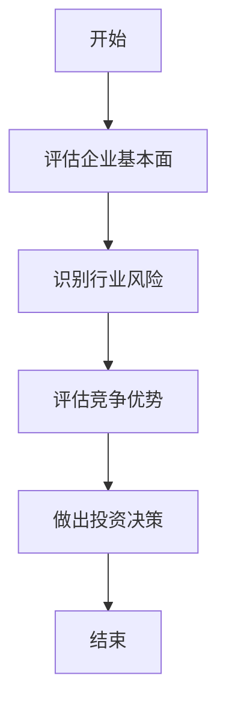

                 


# 目录大纲：《芒格的"远离"策略在前沿科技投资中的重要性》

## # 第一部分: 芒格"远离"策略概述

## # 第1章: 芒格"远离"策略的背景与核心概念

### ## 1.1 芒格投资理念概述
#### ### 1.1.1 芒格的"远离"策略定义
#### ### 1.1.2 芒格投资理念的核心思想
#### ### 1.1.3 芒格投资理念与传统投资策略的对比

### ## 1.2 "远离"策略在科技投资中的应用背景
#### ### 1.2.1 前沿科技投资的特点与风险
#### ### 1.2.2 "远离"策略在科技投资中的重要性
#### ### 1.2.3 科技投资中的常见误区与风险规避

### ## 1.3 芒格"远离"策略的核心要素
#### ### 1.3.1 理解企业商业模式的重要性
#### ### 1.3.2 识别企业财务健康状况的方法
#### ### 1.3.3 评估管理团队的能力与诚信

## # 第2章: "远离"策略的核心原理与逻辑

### ## 2.1 芒格"远离"策略的决策框架
#### ### 2.1.1 理解企业基本面的步骤
#### ### 2.1.2 识别行业风险的步骤
#### ### 2.2.3 评估企业竞争优势的方法

### ## 2.2 芒格"远离"策略的数学模型与公式
#### ### 2.2.1 企业价值评估的简化模型
#### ### 2.2.2 投资风险评估的量化方法
#### ### 2.2.3 企业财务健康状况的评分系统

### ## 2.3 芒格"远离"策略的决策流程图
#### ### 2.3.1 企业基本面分析流程
#### ### 2.3.2 行业风险评估流程
#### ### 2.3.3 竞争优势评估流程

## # 第3章: 芒格"远离"策略在科技投资中的应用

### ## 3.1 科技投资的特点与挑战
#### ### 3.1.1 科技行业的波动性与不确定性
#### ### 3.1.2 前沿科技企业的商业模式分析
#### ### 3.1.3 科技投资中的信息不对称问题

### ## 3.2 "远离"策略在科技投资中的具体应用
#### ### 3.2.1 避免投资于高风险的科技领域
#### ### 3.2.2 选择具有强大竞争优势的科技企业
#### ### 3.2.3 评估科技企业的财务健康状况

### ## 3.3 科技投资中的风险管理
#### ### 3.3.1 风险评估的步骤与方法
#### ### 3.3.2 如何通过"远离"策略降低投资风险
#### ### 3.3.3 建立风险控制的机制与流程

## # 第4章: 系统分析与架构设计方案

### ## 4.1 系统分析与架构设计概述
#### ### 4.1.1 问题场景介绍
#### ### 4.1.2 项目介绍
#### ### 4.1.3 系统功能设计（领域模型Mermaid类图）
#### ### 4.1.4 系统架构设计（Mermaid架构图）
#### ### 4.1.5 系统接口设计
#### ### 4.1.6 系统交互（Mermaid序列图）

### ## 4.2 数学模型与算法实现
#### ### 4.2.1 企业基本面分析的数学模型
#### ### 4.2.2 投资风险评估的算法实现
#### ### 4.2.3 企业竞争优势评估的数学公式

## # 第5章: 项目实战

### ## 5.1 项目实战环境安装与配置
#### ### 5.1.1 系统环境要求
#### ### 5.1.2 工具安装与配置
#### ### 5.1.3 数据源获取与准备

### ## 5.2 系统核心实现源代码
#### ### 5.2.1 企业基本面分析模块代码
#### ### 5.2.2 投资风险评估模块代码
#### ### 5.2.3 竞争优势评估模块代码

### ## 5.3 代码应用解读与分析
#### ### 5.3.1 代码实现的功能与流程
#### ### 5.3.2 代码实现的优缺点与改进空间
#### ### 5.3.3 代码实现的实际效果与应用案例

### ## 5.4 实际案例分析
#### ### 5.4.1 案例背景与问题描述
#### ### 5.4.2 应用芒格"远离"策略的具体步骤
#### ### 5.4.3 投资决策的结果与分析

## # 第6章: 最佳实践、小结与注意事项

### ## 6.1 最佳实践
#### ### 6.1.1 投资策略的选择与优化
#### ### 6.1.2 风险管理的具体措施
#### ### 6.1.3 信息收集与分析的有效方法

### ## 6.2 小结
#### ### 6.2.1 芒格"远离"策略的核心思想与应用
#### ### 6.2.2 科技投资中的策略选择与实践
#### ### 6.2.3 未来科技投资的趋势与机会

### ## 6.3 注意事项
#### ### 6.3.1 投资风险的潜在因素
#### ### 6.3.2 策略应用中的常见误区
#### ### 6.3.3 信息不对称与决策失误的防范

## # 第7章: 拓展阅读与深入学习

### ## 7.1 拓展阅读
#### ### 7.1.1 相关书籍推荐
#### ### 7.1.2 专业文章与报告
#### ### 7.1.3 研究机构与资源

### ## 7.2 深入学习建议
#### ### 7.2.1 自学资源与方法
#### ### 7.2.2 实践项目与经验分享
#### ### 7.2.3 专业培训与课程推荐

## # 作者简介

## # 附录: 芒格"远离"策略的相关工具与资源

---

# 文章标题：芒格的"远离"策略在前沿科技投资中的重要性

> 关键词：芒格投资策略、科技投资、风险管理、价值投资、远离策略

> 摘要：本文探讨了芒格的"远离"策略在前沿科技投资中的应用，通过系统分析和实际案例，深入解析了该策略的核心原理、数学模型及在科技投资中的具体应用，强调了在高风险科技领域中，如何通过避免不熟悉的领域和高风险投资来保护资本的重要性。文章结合理论与实践，为投资者提供了实用的策略和方法。

---

# 正文

## 第1章: 芒格"远离"策略的背景与核心概念

### 1.1 芒格投资理念概述

芒格是巴菲特的合作伙伴，以价值投资和逆向思维闻名。他的"远离"策略是指避免投资于自己不理解的领域或高风险的行业，以保护资本。这种策略的核心思想是通过避免潜在风险来实现长期稳定的收益。与传统投资策略相比，芒格的策略更注重风险控制和长期价值，而非短期收益。

### 1.2 "远离"策略在科技投资中的应用背景

科技投资具有高波动性和不确定性，企业商业模式复杂，信息不对称严重。在这样的背景下，芒格的"远离"策略显得尤为重要。通过避免投资于高风险的科技领域，投资者可以降低潜在损失，专注于具有强大竞争优势的企业。

### 1.3 芒格"远离"策略的核心要素

1. **理解企业商业模式**：投资者需要深入分析企业的盈利模式、市场定位和竞争优势。
2. **识别企业财务健康状况**：通过财务报表分析企业的盈利能力、偿债能力和成长性。
3. **评估管理团队的能力与诚信**：优秀的管理团队是企业长期成功的关键。

---

## 第2章: "远离"策略的核心原理与逻辑

### 2.1 芒格"远离"策略的决策框架

1. **企业基本面分析**：包括收入、利润、负债等财务指标。
2. **行业风险评估**：分析行业周期、竞争状况和政策影响。
3. **竞争优势评估**：判断企业是否有独特的竞争优势。

### 2.2 芒格"远离"策略的数学模型与公式

1. **企业价值评估模型**：
   $$ V = \frac{Earnings}{WACC} $$
   其中，V是企业价值，Earnings是净利润，WACC是加权平均资本成本。

2. **投资风险评估模型**：
   $$ Risk = \sqrt{\sigma^2} $$
   其中，σ是投资回报率的标准差，衡量投资的风险程度。

3. **财务健康状况评分系统**：
   $$ Score = \frac{1}{3}(ROE + ROA + Net Margin) $$
   其中，ROE是净资产收益率，ROA是资产净利率，Net Margin是净利润率。

### 2.3 芒格"远离"策略的决策流程图



---

## 第3章: 芒格"远离"策略在科技投资中的应用

### 3.1 科技投资的特点与挑战

1. **波动性与不确定性**：科技行业的技术更新快，市场变化大。
2. **商业模式复杂**：科技企业的盈利模式多样，难以简单判断。
3. **信息不对称**：投资者难以全面了解企业的技术、管理等内部信息。

### 3.2 "远离"策略在科技投资中的具体应用

1. **避免高风险领域**：如尚未盈利的初创科技公司。
2. **选择具有强大竞争优势的企业**：如在各自领域占据领先地位的企业。
3. **评估财务健康状况**：优先选择财务稳健的企业。

### 3.3 科技投资中的风险管理

1. **风险评估的步骤与方法**：
   - 识别潜在风险因素。
   - 量化风险程度。
   - 制定应对策略。

2. **通过"远离"策略降低投资风险**：避免投资于不熟悉的领域和高风险项目。

3. **建立风险控制机制**：如设定止损点、分散投资等。

---

## 第4章: 系统分析与架构设计方案

### 4.1 系统分析与架构设计概述

1. **问题场景介绍**：科技投资中的风险评估与管理。
2. **项目介绍**：基于芒格"远离"策略的投资管理系统。
3. **系统功能设计**：包括企业基本面分析、行业风险评估、竞争优势评估等功能。
4. **系统架构设计**：
   ```mermaid
   graph TD
       A[投资管理系统] --> B[企业基本面分析模块]
       B --> C[行业风险评估模块]
       C --> D[竞争优势评估模块]
       D --> E[投资决策模块]
   ```
5. **系统接口设计**：包括数据输入接口、分析模块接口、结果输出接口。
6. **系统交互流程**：
   ```mermaid
   sequenceDiagram
       actor 投资者
       participant 系统：投资管理系统
       投资者 -> 系统：输入企业信息
       系统 -> 系统：分析企业基本面
       系统 -> 系统：评估行业风险
       系统 -> 系统：评估竞争优势
       系统 -> 投资者：输出投资建议
   ```

### 4.2 数学模型与算法实现

1. **企业基本面分析的数学模型**：
   $$ ROE = \frac{净利润}{平均股东权益} $$
2. **投资风险评估的算法实现**：使用标准差衡量收益波动性。
3. **企业竞争优势评估的数学公式**：
   $$ Competitive Advantage = \frac{市场份额 + 技术创新速度}{2} $$

---

## 第5章: 项目实战

### 5.1 项目实战环境安装与配置

1. **系统环境要求**：安装Python、Jupyter Notebook、Pandas、Matplotlib等工具。
2. **工具安装与配置**：安装必要的库和软件。
3. **数据源获取与准备**：收集企业的财务数据、行业报告等。

### 5.2 系统核心实现源代码

1. **企业基本面分析模块代码**：
   ```python
   import pandas as pd

   def calculate_roe(net_income, shareholders_equity):
       return net_income / shareholders_equity

   # 示例数据
   net_income = 1000000
   shareholders_equity = 5000000
   roe = calculate_roe(net_income, shareholders_equity)
   print(f"ROE: {roe}%")
   ```

2. **投资风险评估模块代码**：
   ```python
   import numpy as np

   def calculate_risk(returns):
       return np.std(returns)

   # 示例数据
   returns = [0.1, -0.05, 0.15, 0.0, -0.1]
   risk = calculate_risk(returns)
   print(f"Risk: {risk}")
   ```

3. **竞争优势评估模块代码**：
   ```python
   def calculate_competitive_advantage(share, innovation_speed):
       return (share + innovation_speed) / 2

   # 示例数据
   share = 0.8
   innovation_speed = 0.6
   advantage = calculate_competitive_advantage(share, innovation_speed)
   print(f"Competitive Advantage: {advantage}")
   ```

### 5.3 代码应用解读与分析

1. **代码实现的功能与流程**：分析企业基本面、评估投资风险、评估竞争优势。
2. **代码实现的优缺点**：优点是逻辑清晰，缺点是需要大量数据支持。
3. **代码实现的实际效果**：帮助投资者做出更明智的投资决策。

### 5.4 实际案例分析

1. **案例背景与问题描述**：某科技公司面临行业风险和财务不稳定。
2. **应用芒格"远离"策略的具体步骤**：分析企业基本面、识别行业风险、评估竞争优势。
3. **投资决策的结果与分析**：建议避免投资于该科技公司。

---

## 第6章: 最佳实践、小结与注意事项

### 6.1 最佳实践

1. **投资策略的选择与优化**：结合芒格策略与其他策略。
2. **风险管理的具体措施**：如分散投资、设定止损点等。
3. **信息收集与分析的有效方法**：多渠道获取信息，深入分析。

### 6.2 小结

芒格的"远离"策略在科技投资中具有重要意义。通过避免高风险领域和不熟悉的企业，投资者可以降低潜在风险，实现长期稳定的收益。

### 6.3 注意事项

1. **投资风险的潜在因素**：行业波动、技术更新等。
2. **策略应用中的常见误区**：过度保守或忽视潜在机会。
3. **信息不对称与决策失误的防范**：多渠道获取信息，深入分析。

---

## 第7章: 拓展阅读与深入学习

### 7.1 拓展阅读

1. **相关书籍推荐**：《聪明的投资者》、《投资的艺术》等。
2. **专业文章与报告**：查阅投资策略相关的学术论文和行业报告。
3. **研究机构与资源**：关注知名投资机构的研究报告。

### 7.2 深入学习建议

1. **自学资源与方法**：阅读经典投资书籍，参与投资论坛讨论。
2. **实践项目与经验分享**：参与虚拟投资比赛，分享投资经验。
3. **专业培训与课程推荐**：报名投资策略相关的在线课程或面授班。

---

## 作者简介

作者：AI天才研究院/AI Genius Institute & 禅与计算机程序设计艺术/Zen And The Art of Computer Programming

---

## 附录: 芒格"远离"策略的相关工具与资源

- **工具**：Excel、Python、R等数据分析工具。
- **资源**：Financial Times、Bloomberg等财经媒体，SEC filings等公开信息源。

---

以上为《芒格的"远离"策略在前沿科技投资中的重要性》的完整目录大纲和部分正文内容。根据上述大纲，您可以开始撰写完整的技术博客文章。

