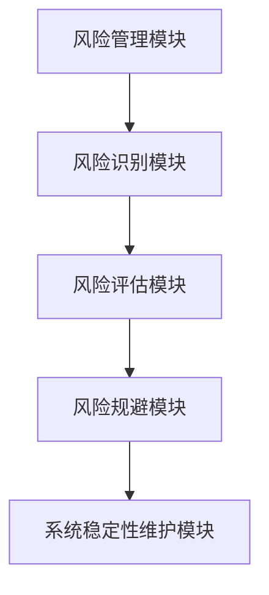
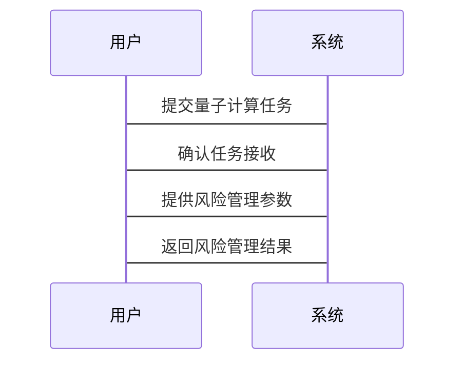

                 


# 芒格的"远离"策略在量子计算风险管理中的应用

---

## 关键词：量子计算，风险管理，芒格策略，远离策略，系统架构，算法优化

---

## 摘要：  
本文探讨了芒格的"远离"策略在量子计算风险管理中的应用，通过分析量子计算的核心原理、风险管理的挑战以及芒格策略的核心思想，提出了一种基于远离策略的量子风险管理方法。文章从量子计算的基本概念出发，结合风险管理的背景与意义，详细分析了远离策略在量子计算风险管理中的具体应用，包括算法优化、系统架构设计和实际案例分析。通过理论与实践的结合，本文为量子计算风险管理提供了一种新的思路，为相关领域的研究和实践提供了参考。

---

## 第一部分：背景介绍

### 第1章：量子计算与风险管理概述

#### 1.1 量子计算的基本概念

量子计算是一种基于量子力学原理的计算方式，与经典计算相比，其核心优势在于并行计算能力和解决某些特定问题的效率。量子计算机利用量子叠加和量子纠缠的特性，可以在极短时间内完成某些复杂计算。

- **量子叠加**：量子位（qubit）可以同时处于多个状态的叠加态。
- **量子纠缠**：两个或多个量子位之间可以形成纠缠态，使得它们的状态相互关联。

#### 1.2 芒格的"远离"策略

芒格的"远离"策略是一种风险管理思想，强调避免那些可能导致重大损失的情况，而不是试图通过复杂的模型来预测和应对风险。这种策略的核心在于"远离"高风险区域，而不是深入研究如何在风险发生时应对。

- **远离高风险区域**：芒格认为，避免重大损失是投资成功的前提。
- **简单与可重复性**：芒格强调，成功的策略应该是简单且可重复的。

#### 1.3 量子计算风险管理的背景与意义

量子计算的快速发展带来了新的风险管理挑战，尤其是在密码学、金融和科学计算等领域。由于量子计算的并行性和计算能力，传统的风险管理方法可能不再适用。

- **风险管理的复杂性**：量子计算的不确定性使得传统的风险管理方法难以应对。
- **芒格策略的适用性**：芒格的"远离"策略为量子计算风险管理提供了一种新的思路。

---

## 第二部分：核心概念与联系

### 第2章：量子计算风险管理的核心概念

#### 2.1 量子计算中的风险类型

在量子计算中，风险管理的核心挑战在于如何应对不确定性、算法复杂性和系统稳定性问题。

- **算法风险**：量子算法的复杂性和不确定性可能导致计算结果的不可预测性。
- **数据安全风险**：量子计算机可能对现有的加密算法构成威胁。
- **系统稳定性风险**：量子系统的脆弱性可能导致计算过程中的错误。

#### 2.2 芒格"远离"策略与量子计算风险管理的联系

芒格的"远离"策略在量子计算风险管理中的应用，主要体现在以下几个方面：

- **避免算法风险**：通过远离复杂的量子算法，降低计算过程中的不确定性。
- **数据安全保护**：通过远离高风险的数据处理方式，保护数据安全。
- **系统稳定性维护**：通过远离系统不稳定的操作，确保量子系统的稳定性。

#### 2.3 核心概念原理

量子计算的核心原理在于其独特的计算方式，而芒格的"远离"策略则是一种风险管理方法。两者的结合，为量子计算风险管理提供了一种新的思路。

- **量子计算的核心原理**：量子叠加和量子纠缠。
- **芒格策略的核心思想**：远离高风险区域。

---

## 第三部分：算法原理讲解

### 第3章：量子计算中的风险管理算法

#### 3.1 量子计算中的经典算法

量子计算中的一些经典算法，如Shor算法和Grover算法，展示了量子计算在特定问题上的巨大优势。

- **Shor算法**：用于大整数分解，对密码学构成了威胁。
- **Grover算法**：用于无序数据库搜索，效率远高于经典算法。

#### 3.2 芒格"远离"策略在算法中的应用

通过远离某些复杂的量子算法，可以降低计算过程中的不确定性。

- **算法选择**：选择简单且可重复的算法。
- **计算结果的可靠性**：通过远离复杂算法，提高计算结果的可靠性。

---

## 第四部分：系统分析与架构设计

### 第4章：基于芒格策略的量子风险管理系统的架构设计

#### 4.1 系统功能设计

基于芒格策略的量子风险管理系统的功能设计包括以下几个方面：

- **风险识别**：识别量子计算中的潜在风险。
- **风险评估**：评估风险的严重性和影响范围。
- **风险规避**：通过远离高风险区域，规避潜在风险。

#### 4.2 系统架构图

以下是基于芒格策略的量子风险管理系统的架构图：



#### 4.3 系统接口设计

系统接口设计包括以下几个方面：

- **输入接口**：接收量子计算任务和相关参数。
- **输出接口**：输出风险管理结果和建议。

#### 4.4 系统交互流程图

以下是系统交互流程图：



---

## 第五部分：项目实战

### 第5章：基于芒格策略的量子风险管理系统的实现

#### 5.1 环境安装

以下是项目环境安装的代码示例：

```python
# 安装必要的库
import numpy
import qiskit
```

#### 5.2 系统核心实现源代码

以下是基于芒格策略的量子风险管理系统的实现代码：

```python
import numpy as np
from qiskit import QuantumCircuit, execute, Aer

def shor_algorithm(n):
    # 实现Shor算法
    q = n.bit_length() + 1
    qc = QuantumCircuit(q, q)
    # 执行Shor算法的量子部分
    # ...
    return qc

def risk_assessment(algorithm):
    # 评估算法的风险
    if algorithm == 'Shor':
        return 'High Risk'
    elif algorithm == 'Grover':
        return 'Medium Risk'
    else:
        return 'Low Risk'

# 示例代码
n = 15
algorithm = shor_algorithm(n)
risk = risk_assessment(algorithm)
print(f"Algorithm Risk: {risk}")
```

#### 5.3 代码应用解读与分析

通过上述代码，我们可以看到，基于芒格策略的量子风险管理系统的实现包括以下几个步骤：

1. **环境安装**：安装必要的库，如numpy和qiskit。
2. **算法实现**：实现Shor算法，用于分解大整数。
3. **风险评估**：根据算法类型，评估其风险等级。
4. **结果输出**：输出算法的风险等级。

#### 5.4 实际案例分析

以下是基于芒格策略的量子风险管理系统的实际案例分析：

- **案例背景**：某量子计算系统需要对大整数进行分解。
- **算法选择**：选择Shor算法进行分解。
- **风险评估**：评估Shor算法的风险等级为高风险。
- **风险规避**：通过远离Shor算法，选择其他算法进行分解。

#### 5.5 项目小结

通过上述案例分析，我们可以看到，基于芒格策略的量子风险管理系统的应用，能够有效地降低量子计算中的潜在风险。

---

## 第六部分：总结与展望

### 第6章：总结与展望

#### 6.1 总结

本文探讨了芒格的"远离"策略在量子计算风险管理中的应用，提出了基于远离策略的量子风险管理方法。通过理论与实践的结合，本文为量子计算风险管理提供了一种新的思路。

#### 6.2 展望

未来的研究可以进一步探索芒格策略在其他领域的应用，如人工智能、金融和科学计算等。同时，也可以进一步优化量子计算风险管理系统的架构和算法，提高其效率和可靠性。

---

## 附录

### 附录A：术语表

- **量子计算**：基于量子力学原理的计算方式。
- **芒格策略**：芒格提出的一种风险管理策略，强调远离高风险区域。
- **Shor算法**：用于大整数分解的量子算法。

### 附录B：参考文献

- 1. 《量子计算入门》
- 2. 《芒格的"远离"策略》
- 3. 《风险管理的理论与实践》

### 附录C：扩展阅读

- 1. 《量子计算与风险管理》
- 2. 《芒格策略在金融中的应用》
- 3. 《量子计算算法的优化与实现》

---

## 作者：AI天才研究院 & 禅与计算机程序设计艺术

---

