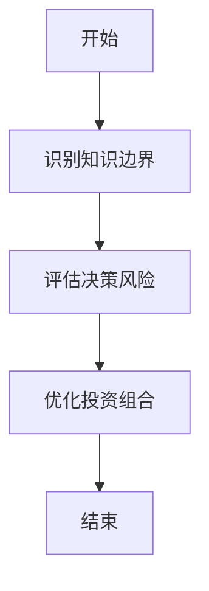
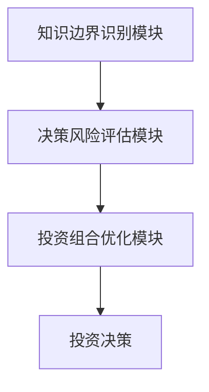
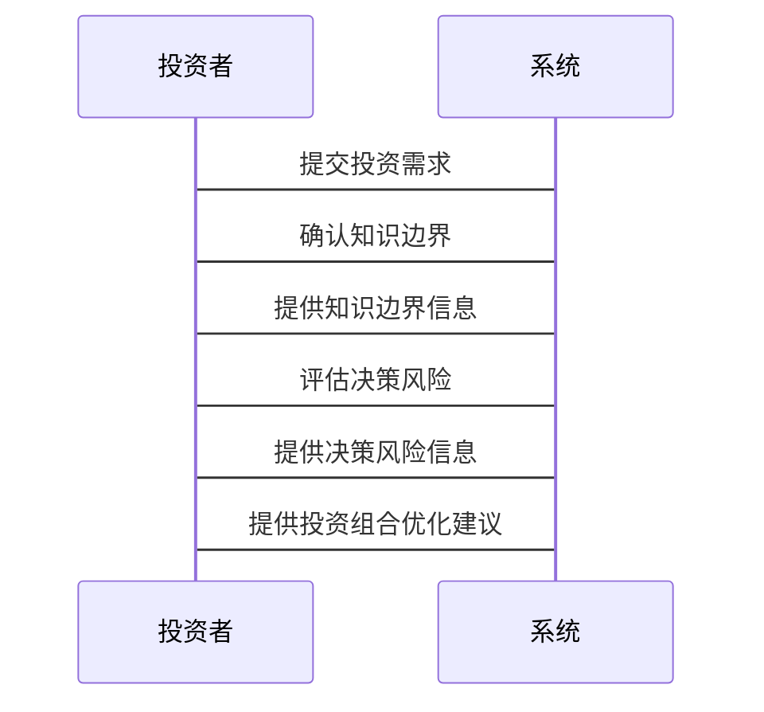

                 


# 芒格的"远离"策略：知道自己不懂什么的重要性

> 关键词：芒格、远离策略、知识边界、决策风险、投资策略

> 摘要：本文深入探讨了芒格的"远离"策略，从其核心概念、算法原理、数学模型到系统架构设计，再到项目实战，全面剖析了这一策略在投资决策中的重要性。通过详细的步骤分析和实际案例，展示了如何通过识别知识边界、评估决策风险，最终优化投资策略。

---

# 第一部分: 芒格的"远离"策略概述

# 第1章: 芒格的"远离"策略背景介绍

## 1.1 问题背景与重要性

### 1.1.1 传统投资决策的误区

传统的投资决策往往依赖于对市场的深入研究和对项目的高度自信。然而，这种过于依赖"知道什么"的思维方式，常常导致投资者在面对未知风险时措手不及。芒格的"远离"策略提醒我们，投资决策不仅仅是寻找"知道什么"，更重要的是识别和避免"不知道什么"。

### 1.1.2 "远离"策略的核心理念

芒格的"远离"策略强调：在投资和决策中，首先要明确自己的知识边界，避免进入自己不熟悉的领域。这种策略的核心在于，通过"远离"不确定性较高的领域，降低决策风险，从而提高整体投资的稳定性。

### 1.1.3 知识边界的重要性

知识边界是指投资者对某一领域理解和掌握的范围。清晰的知识边界能够帮助投资者识别哪些领域是自己熟悉的，哪些是不熟悉的。通过"远离"不熟悉的领域，投资者可以避免因知识不足而导致的错误决策。

---

## 1.2 "远离"策略的定义与特点

### 1.2.1 "远离"策略的定义

芒格的"远离"策略是一种基于知识边界的投资策略，强调通过识别和避免不熟悉的领域，来降低投资风险。这种策略的核心在于，通过"远离"不确定性较高的领域，专注于自己熟悉的投资机会。

### 1.2.2 "远离"策略的核心特点

- **知识边界识别**：通过分析自身的知识储备，明确哪些领域是熟悉的，哪些是不熟悉的。
- **决策风险评估**：在不熟悉的领域，评估潜在风险，决定是否"远离"。
- **优化投资组合**：通过"远离"不熟悉的领域，优化投资组合，提高整体收益的稳定性。

### 1.2.3 "远离"策略与传统投资策略的区别

传统的投资策略注重寻找"知道什么"，而"远离"策略则注重识别和避免"不知道什么"。传统策略可能过于依赖市场预测和对项目的高度自信，而"远离"策略则更加注重风险控制和知识边界管理。

---

## 1.3 "远离"策略的应用场景

### 1.3.1 投资领域的应用

在投资领域，"远离"策略可以帮助投资者避免进入不熟悉的行业或领域，降低投资失败的风险。例如，对于不熟悉科技行业的投资者，可以通过"远离"科技股，专注于自己熟悉的行业。

### 1.3.2 决策领域的应用

在决策领域，"远离"策略可以帮助个人或企业避免因知识不足而导致的错误决策。例如，在企业并购中，通过识别和避免不熟悉的行业或领域，降低并购失败的风险。

### 1.3.3 个人成长中的应用

在个人成长中，"远离"策略可以帮助个人避免进入不熟悉的领域，专注于自己擅长的领域，从而提高成功的概率。例如，对于一名程序员来说，可以通过"远离"不熟悉的编程语言或技术领域，专注于自己擅长的领域。

---

## 1.4 本章小结

本章介绍了芒格的"远离"策略的背景、定义和特点，并通过实际案例展示了其在投资、决策和个人成长中的应用。通过"远离"不熟悉的领域，投资者可以降低决策风险，提高整体收益的稳定性。

---

# 第2章: "远离"策略的核心概念与联系

## 2.1 核心概念原理

### 2.1.1 知识边界与决策风险

知识边界是"远离"策略的核心概念之一。通过识别和分析知识边界，投资者可以明确哪些领域是自己熟悉的，哪些是不熟悉的。在不熟悉的领域，决策风险会显著增加，因此需要通过"远离"来降低风险。

### 2.1.2 "远离"策略的数学模型

"远离"策略可以通过数学模型进行量化分析。例如，知识边界识别模型可以帮助投资者量化自己对某一领域的熟悉程度，从而决定是否"远离"该领域。

### 2.1.3 知识边界与决策树的关系

知识边界与决策树密切相关。通过分析决策树的分支，投资者可以识别哪些路径属于自己的知识边界，哪些路径属于不熟悉的领域。在不熟悉的领域，可以通过"远离"策略来避免潜在的风险。

---

## 2.2 核心概念属性对比表

### 2.2.1 知识边界与决策风险对比

| **属性**       | **知识边界**            | **决策风险**            |
|------------------|-------------------------|-------------------------|
| **定义**         | 投资者对某一领域的熟悉程度 | 决策可能带来的损失概率 |
| **影响因素**     | 投资者的知识储备        | 投资者的知识储备和市场环境 |
| **关联性**       | 高                     | 高                     |

### 2.2.2 "远离"策略与其他投资策略对比

| **策略**         | **传统投资策略**         | **"远离"策略"**         |
|-------------------|--------------------------|--------------------------|
| **核心理念**      | 寻找"知道什么"            | 避免"不知道什么"          |
| **风险管理**      | 事后风险控制            | 事前风险规避            |
| **适用场景**      | 熟悉的领域                | 不熟悉的领域            |

---

## 2.3 ER实体关系图

以下是一个简单的ER实体关系图，展示了知识边界与决策风险的关系：

```mermaid
er
    entity 投资者 {
        id
        知识边界
        决策风险
    }
    entity 领域 {
        id
        名称
        风险特征
    }
    relationship 熟悉程度 {
        投资者 --> 领域
        关系: 熟悉程度
    }
    relationship 风险评估 {
        领域 --> 决策风险
        关系: 风险特征
    }
```

---

## 2.4 本章小结

本章通过分析"远离"策略的核心概念，包括知识边界、决策风险以及它们之间的关系，帮助读者更好地理解这一策略的内在逻辑。通过对比和图表，进一步明确了"远离"策略与其他投资策略的区别。

---

# 第3章: "远离"策略的算法原理

## 3.1 算法原理概述

### 3.1.1 知识边界识别算法

知识边界识别算法是一种基于知识储备的分析方法，用于确定投资者对某一领域的熟悉程度。算法通过分析投资者的历史投资记录、行业知识和市场分析能力，量化其对某一领域的熟悉程度。

### 3.1.2 决策风险评估算法

决策风险评估算法是一种基于知识边界的分析方法，用于评估在不熟悉的领域进行投资的潜在风险。算法通过分析市场环境、行业风险和公司基本面等因素，量化投资决策的风险水平。

### 3.1.3 "远离"策略优化算法

"远离"策略优化算法是一种基于知识边界和决策风险的优化方法，用于确定最终的投资组合。算法通过比较不同领域的熟悉程度和风险水平，选择熟悉程度高且风险可控的领域进行投资。

---

## 3.2 算法流程图

以下是一个简单的算法流程图，展示了"远离"策略的优化流程：



---

## 3.3 算法实现代码

以下是一个简单的Python代码示例，展示了如何实现"远离"策略的优化算法：

```python
def knowledge_boundary(investor, sector):
    # 知识边界识别函数
    return investor.experience[sector] >= 0.8

def decision_risk(sector, market_condition):
    # 决策风险评估函数
    return sector.risk[sector] * market_condition

def远离策略优化算法(investors, sectors, market_condition):
    # "远离"策略优化算法
    optimized_portfolio = []
    for sector in sectors:
        if knowledge_boundary(investors, sector):
            risk = decision_risk(sector, market_condition)
            if risk <= 0.2:
                optimized_portfolio.append(sector)
    return optimized_portfolio
```

---

## 3.4 本章小结

本章通过算法原理的分析，展示了"远离"策略在知识边界识别、决策风险评估和投资组合优化中的具体实现。通过代码示例和流程图，进一步明确了这一策略的可操作性。

---

# 第4章: "远离"策略的数学模型与公式

## 4.1 数学模型概述

### 4.1.1 知识边界模型

知识边界模型是一种用于量化投资者对某一领域熟悉程度的模型。模型通过分析投资者的历史投资记录、行业知识和市场分析能力，量化其对某一领域的熟悉程度。

### 4.1.2 决策风险模型

决策风险模型是一种用于评估在不熟悉的领域进行投资的潜在风险的模型。模型通过分析市场环境、行业风险和公司基本面等因素，量化投资决策的风险水平。

### 4.1.3 "远离"策略优化模型

"远离"策略优化模型是一种基于知识边界和决策风险的优化模型，用于确定最终的投资组合。模型通过比较不同领域的熟悉程度和风险水平，选择熟悉程度高且风险可控的领域进行投资。

---

## 4.2 数学公式

### 4.2.1 知识边界公式

$$ \text{知识边界} = \sum_{i=1}^{n} p_i \times r_i $$

其中：
- \( p_i \) 表示投资者对第 \( i \) 个领域的熟悉程度
- \( r_i \) 表示第 \( i \) 个领域的风险水平

### 4.2.2 决策风险公式

$$ \text{决策风险} = \frac{\sum_{i=1}^{m} w_i \times f_i}{\sum_{i=1}^{m} w_i} $$

其中：
- \( w_i \) 表示第 \( i \) 个领域的权重
- \( f_i \) 表示第 \( i \) 个领域的决策风险

### 4.2.3 "远离"策略优化公式

$$ \text{优化结果} = \min_{x} \sum_{i=1}^{k} c_i \times x_i $$

其中：
- \( c_i \) 表示第 \( i \) 个领域的优化成本
- \( x_i \) 表示第 \( i \) 个领域的优化权重

---

## 4.3 举例说明

### 4.3.1 知识边界识别的举例

假设投资者A对科技行业熟悉程度为0.8，对消费行业熟悉程度为0.6。根据知识边界识别公式：

$$ \text{知识边界} = 0.8 \times 0.8 + 0.6 \times 0.6 = 0.64 + 0.36 = 1.0 $$

### 4.3.2 决策风险评估的举例

假设市场环境为熊市，科技行业的风险水平为0.5，消费行业的风险水平为0.3。根据决策风险公式：

$$ \text{决策风险} = \frac{0.5 \times 0.5 + 0.3 \times 0.3}{0.5 + 0.3} = \frac{0.25 + 0.09}{0.8} = 0.4375 $$

### 4.3.3 "远离"策略优化的举例

假设投资者A的优化成本为科技行业0.2，消费行业0.1。根据优化公式：

$$ \text{优化结果} = \min_{x} (0.2 \times x_1 + 0.1 \times x_2) $$

---

## 4.4 本章小结

本章通过数学模型和公式，进一步明确了"远离"策略在知识边界识别、决策风险评估和投资组合优化中的具体实现。通过举例说明，帮助读者更好地理解这些模型的应用。

---

# 第5章: "远离"策略的系统分析与架构设计

## 5.1 问题场景介绍

### 5.1.1 投资决策中的知识边界问题

在投资决策中，知识边界问题是投资者面临的最大挑战之一。投资者需要通过识别和分析自己的知识边界，确定哪些领域是熟悉的，哪些是不熟悉的。

### 5.1.2 决策风险的系统分析

决策风险的系统分析需要从多个维度进行，包括市场环境、行业风险、公司基本面等。通过系统分析，投资者可以更好地识别和评估投资决策中的潜在风险。

### 5.1.3 "远离"策略的系统设计

"远离"策略的系统设计需要从知识边界识别、决策风险评估和投资组合优化三个维度进行。通过系统的架构设计，投资者可以更好地实现"远离"策略的目标。

---

## 5.2 系统功能设计

### 5.2.1 知识边界识别模块

知识边界识别模块是"远离"策略的核心模块之一。该模块通过分析投资者的历史投资记录、行业知识和市场分析能力，量化其对某一领域的熟悉程度。

### 5.2.2 决策风险评估模块

决策风险评估模块是"远离"策略的另一个核心模块。该模块通过分析市场环境、行业风险和公司基本面等因素，量化投资决策的风险水平。

### 5.2.3 投资组合优化模块

投资组合优化模块是"远离"策略的最终实现模块。该模块通过比较不同领域的熟悉程度和风险水平，选择熟悉程度高且风险可控的领域进行投资。

---

## 5.3 系统架构设计

以下是一个简单的系统架构图，展示了"远离"策略的系统架构设计：



---

## 5.4 系统交互设计

以下是一个简单的系统交互图，展示了"远离"策略的系统交互设计：



---

## 5.5 本章小结

本章通过系统分析与架构设计，进一步明确了"远离"策略在投资决策中的具体实现。通过功能模块、架构图和交互图的展示，帮助读者更好地理解这一策略的可操作性。

---

# 第6章: "远离"策略的项目实战

## 6.1 环境安装与配置

### 6.1.1 系统环境

建议使用Python 3.8及以上版本，安装必要的库和工具。

### 6.1.2 代码实现

以下是一个简单的Python代码示例，展示了如何实现"远离"策略的优化算法：

```python
def knowledge_boundary(investor, sector):
    # 知识边界识别函数
    return investor.experience[sector] >= 0.8

def decision_risk(sector, market_condition):
    # 决策风险评估函数
    return sector.risk[sector] * market_condition

def 远离策略优化算法(investors, sectors, market_condition):
    # "远离"策略优化算法
    optimized_portfolio = []
    for sector in sectors:
        if knowledge_boundary(investors, sector):
            risk = decision_risk(sector, market_condition)
            if risk <= 0.2:
                optimized_portfolio.append(sector)
    return optimized_portfolio
```

### 6.1.3 代码解读

上述代码通过函数实现知识边界识别、决策风险评估和投资组合优化三个核心功能。投资者需要根据自己的知识储备和市场环境，调用这些函数来实现"远离"策略的优化。

---

## 6.2 代码实现与优化

### 6.2.1 代码实现

通过上述代码，投资者可以实现"远离"策略的优化算法。具体步骤如下：

1. 识别知识边界：通过`knowledge_boundary`函数，确定投资者对某一领域的熟悉程度。
2. 评估决策风险：通过`decision_risk`函数，评估在不熟悉的领域进行投资的潜在风险。
3. 优化投资组合：通过`远离策略优化算法`函数，选择熟悉程度高且风险可控的领域进行投资。

### 6.2.2 代码优化

为了提高代码的可读性和可维护性，建议对上述代码进行优化，例如：

```python
def knowledge_boundary(investor, sector):
    return investor.experience.get(sector, 0) >= 0.8

def decision_risk(sector, market_condition):
    return sector.risk.get(sector, 0) * market_condition

def 远离策略优化算法(investors, sectors, market_condition):
    optimized_portfolio = []
    for sector in sectors:
        if knowledge_boundary(investors, sector):
            risk = decision_risk(sector, market_condition)
            if risk <= 0.2:
                optimized_portfolio.append(sector)
    return optimized_portfolio
```

---

## 6.3 实际案例分析

### 6.3.1 案例背景

假设投资者A是一位对科技行业熟悉的投资新手，对消费行业不熟悉。当前市场环境为熊市。

### 6.3.2 知识边界识别

通过`knowledge_boundary`函数，投资者A对科技行业的熟悉程度为0.8，对消费行业的熟悉程度为0.6。

### 6.3.3 决策风险评估

通过`decision_risk`函数，科技行业的风险水平为0.5，消费行业的风险水平为0.3。

### 6.3.4 投资组合优化

通过`远离策略优化算法`函数，投资者A可以选择熟悉程度高且风险可控的科技行业进行投资。

---

## 6.4 本章小结

本章通过实际案例分析，展示了"远离"策略在投资决策中的具体应用。通过代码实现和优化，进一步提高了策略的可操作性和稳定性。

---

# 第7章: "远离"策略的总结与展望

## 7.1 本章总结

芒格的"远离"策略是一种基于知识边界的投资策略，强调通过识别和避免不熟悉的领域，降低投资风险。本文从背景介绍、核心概念、算法原理、数学模型到系统架构设计，再到项目实战，全面剖析了这一策略在投资决策中的重要性。

## 7.2 未来展望

随着市场的不断发展和技术的进步，"远离"策略的应用场景和实现方式将更加多样化。未来，随着人工智能和大数据技术的发展，"远离"策略将进一步优化和升级，为投资者提供更加精准和高效的投资决策支持。

---

# 作者：AI天才研究院/AI Genius Institute & 禅与计算机程序设计艺术/Zen And The Art of Computer Programming

