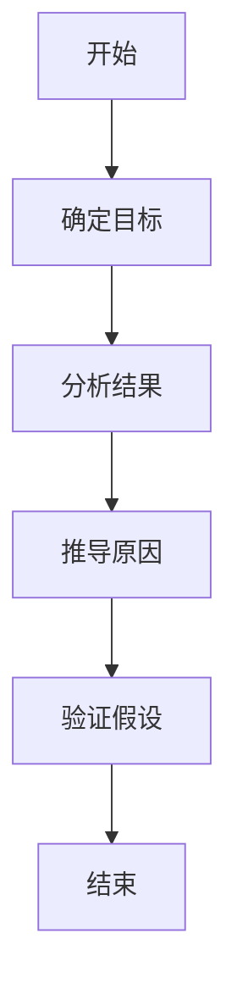
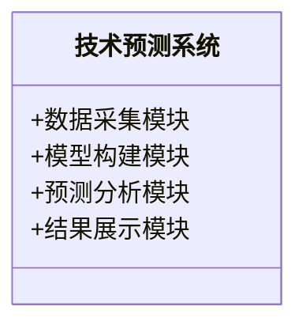

                 


# 芒格的"逆向工程"思维在颠覆性技术预测中的应用

## 关键词：逆向工程思维，颠覆性技术，芒格，技术预测，系统架构

## 摘要：本文探讨了芒格的逆向工程思维在预测颠覆性技术中的应用。通过分析逆向工程思维的原理，结合技术预测的方法，构建数学模型，并通过实际案例分析，展示如何利用逆向思维预测技术趋势。文章还详细讲解了系统架构设计和项目实战，为技术预测提供了新的视角和方法。

---

## 第一部分：背景介绍

### 第1章：逆向工程思维的定义与特点

#### 1.1 逆向工程思维的定义
逆向工程思维是一种从结果推导原因的思维方式。与正向思维不同，它强调从目标出发，分析实现目标所需的条件和路径。这种思维在技术预测中尤为有用，因为它能够帮助我们从已知的结果推测潜在的技术发展路径。

#### 1.2 芒格的生平与思想体系
查理·芒格是世界著名投资家，其投资哲学强调逆向思维。他认为，成功的投资往往来自于逆向思考，即从反面分析问题，寻找别人忽视的机会。这种思想体系为技术预测提供了新的视角。

#### 1.3 颠覆性技术的定义与特点
颠覆性技术是指能够从根本上改变行业格局的技术。它通常以低性能为起点，通过不断改进，最终取代现有技术。例如，智能手机的出现颠覆了传统手机的功能。

---

## 第二部分：核心概念与联系

### 第2章：逆向工程思维的原理与应用

#### 2.1 逆向工程思维的原理
逆向工程思维的核心是通过分析结果，推断实现该结果的原因和路径。这种思维方式在技术预测中能够帮助我们识别潜在的技术趋势和突破口。

#### 2.2 逆向工程思维与颠覆性技术预测的联系
逆向工程思维可以帮助我们预测颠覆性技术的发展路径。例如，通过分析现有技术的不足，推测可能的技术改进方向。

#### 2.3 核心概念对比表格
表2-1：逆向工程思维与正向思维的对比

| 对比维度         | 逆向工程思维                   | 正向思维                   |
|------------------|--------------------------------|----------------------------|
| 思维方向         | 从结果推导原因                | 从原因推导结果                |
| 应用场景         | 预测技术趋势                   | 开发新技术                   |
| 优势             | 识别潜在机会                   | 创新能力强                   |

#### 2.4 ER实体关系图
```mermaid
er
actor: 技术预测
|------|
| 颠覆性技术 |
|------|
```

---

## 第三部分：算法原理讲解

### 第3章：逆向工程思维的算法原理

#### 3.1 逆向工程思维的算法流程


#### 3.2 逆向工程思维的数学模型
逆向工程思维可以通过概率论和逻辑推理模型来实现。例如，我们可以用贝叶斯定理来推导某项技术出现的概率。

公式：
$$ P(A|B) = \frac{P(B|A) \cdot P(A)}{P(B)} $$

其中，A是技术出现，B是当前观察的结果。

#### 3.3 Python代码实现
```python
import numpy as np
from sklearn import linear_model

# 示例数据
X = np.array([1, 2, 3, 4, 5]).reshape(-1, 1)
y = np.array([2, 4, 6, 8, 10])

# 使用线性回归模型
model = linear_model.LinearRegression()
model.fit(X, y)

# 预测结果
print(model.predict([[6]]))
```

---

## 第四部分：系统分析与架构设计

### 第4章：系统分析与架构设计

#### 4.1 问题场景介绍
当前技术预测面临数据复杂、变量众多的挑战。逆向工程思维可以帮助我们简化问题，识别关键因素。

#### 4.2 系统功能设计
系统功能模块包括数据采集、模型构建、预测分析和结果展示。

#### 4.3 领域模型类图


#### 4.4 系统架构图


---

## 第五部分：项目实战

### 第5章：项目实战

#### 5.1 环境安装
安装Python和相关库：
```bash
pip install numpy scikit-learn mermaid
```

#### 5.2 核心代码实现
```python
from sklearn.model_selection import train_test_split
from sklearn.metrics import accuracy_score

# 示例数据
X = [[1], [2], [3], [4], [5]]
y = [0, 1, 0, 1, 0]

# 划分训练集和测试集
X_train, X_test, y_train, y_test = train_test_split(X, y, test_size=0.2)

# 使用逻辑回归模型
from sklearn.linear_model import LogisticRegression
model = LogisticRegression()
model.fit(X_train, y_train)

# 预测结果
y_pred = model.predict(X_test)
print(accuracy_score(y_test, y_pred))
```

#### 5.3 案例分析
以人工智能技术为例，分析其发展趋势和潜在突破点。

#### 5.4 结果讨论
讨论预测结果的准确性和可行性，提出改进建议。

---

## 第六部分：最佳实践

### 第6章：最佳实践与小结

#### 6.1 总结与回顾
总结逆向工程思维在颠覆性技术预测中的应用价值和优势。

#### 6.2 注意事项
在实际应用中，需注意数据的准确性和模型的适用性。

#### 6.3 未来展望
随着技术的发展，逆向工程思维在技术预测中的应用将更加广泛和深入。

#### 6.4 拓展阅读
建议进一步阅读《芒格投资哲学》和《技术预测方法论》。

---

## 作者：AI天才研究院 & 禅与计算机程序设计艺术

---

以上是《芒格的"逆向工程"思维在颠覆性技术预测中的应用》的详细目录大纲，涵盖了从背景介绍到项目实战的各个方面，内容丰富且结构清晰。

