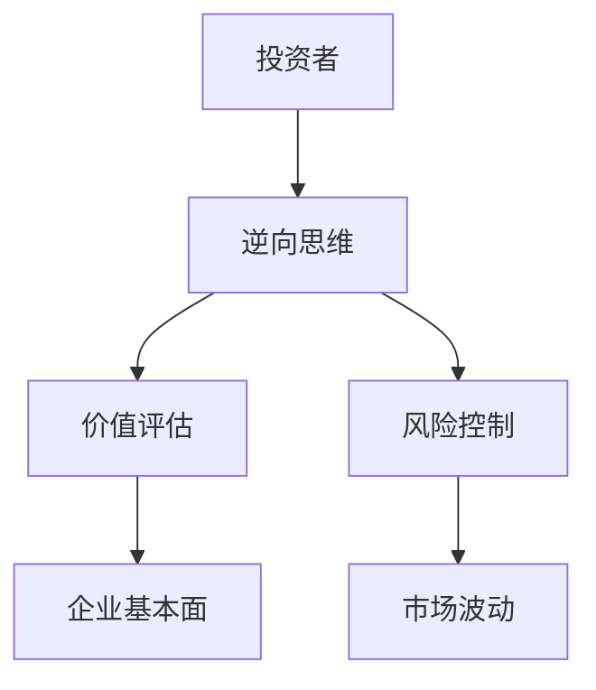

                 


# 芒格的逆向思维：在投资中的应用

> 关键词：芒格，逆向思维，投资，价值评估，风险管理，数学模型，系统分析

> 摘要：芒格的逆向思维是一种独特的思考方式，能够帮助投资者在复杂多变的市场中找到机会。本文详细阐述了逆向思维的核心概念、分析框架、数学模型及其在投资中的具体应用。通过系统的分析和实际案例，本文为投资者提供了从理论到实践的全面指导。

---

# 第1章: 芒格的逆向思维及其在投资中的重要性

## 1.1 逆向思维的定义与特点
### 1.1.1 逆向思维的定义
逆向思维是一种从反方向入手的思考方式，即从结果出发，逆推原因。在投资中，这意味着不跟随市场的潮流，而是寻找市场忽视的机会。

### 1.1.2 逆向思维的特点
- **独立性**：逆向思维强调独立思考，不被市场情绪左右。
- **反常识性**：它常常与市场共识相反，寻找被低估的机会。
- **长期视角**：逆向思维注重长期价值，而非短期波动。

### 1.1.3 逆向思维与传统思维的区别
- **传统思维**：跟随市场趋势，追求短期收益。
- **逆向思维**：逆市场趋势，寻找长期价值。

## 1.2 芒格的逆向思维在投资中的独特价值
### 1.2.1 投资中的常见误区
- 过度关注短期收益。
- 跟随市场情绪，盲目跟风。

### 1.2.2 逆向思维如何帮助避开误区
- 通过逆向思考，识别市场的非理性行为。
- 找到被市场低估的机会。

### 1.2.3 逆向思维带来的超额收益
- 通过逆向思维，投资者可以在市场底部买入优质资产，获得超额收益。

## 1.3 逆向思维的核心要素
### 1.3.1 投资决策的独立性
- 保持独立思考，避免被市场情绪影响。

### 1.3.2 风险控制的重要性
- 逆向思维强调风险管理，避免过度承担风险。

### 1.3.3 价值评估的关键性
- 通过逆向思维，准确评估资产的内在价值。

## 1.4 逆向思维与投资成功的关系
### 1.4.1 逆向思维如何提升投资成功率
- 通过逆向思考，识别真正具有投资价值的资产。

### 1.4.2 逆向思维与长期投资策略
- 长期投资与逆向思维结合，能够在市场波动中获得稳定收益。

### 1.4.3 逆向思维在市场波动中的应用
- 在市场恐慌时，逆向思维帮助投资者找到被低估的机会。

## 1.5 本章小结
逆向思维是一种独特的思考方式，能够帮助投资者在复杂多变的市场中找到机会。通过独立思考、风险控制和价值评估，逆向思维能够提升投资成功率，并带来超额收益。

---

# 第2章: 逆向思维的核心概念与联系

## 2.1 逆向思维的核心概念
### 2.1.1 投资中的问题背景
- 市场波动频繁，投资者需要找到一种有效的思考方式。

### 2.1.2 问题描述与解决方法
- 通过逆向思维，寻找被市场低估的机会。

### 2.1.3 逆向思维的边界与外延
- 逆向思维适用于长期投资，但需结合市场实际情况。

## 2.2 核心概念的联系与对比
### 2.2.1 逆向思维与传统投资思维的对比
- 传统思维：跟随市场趋势。
- 逆向思维：逆市场趋势。

### 2.2.2 逆向思维与其他投资策略的联系
- 逆向思维可以与价值投资、成长投资等策略结合。

### 2.2.3 逆向思维与风险管理的关系
- 逆向思维强调风险管理，避免过度承担风险。

## 2.3 实体关系图（ER图）


## 2.4 本章小结
逆向思维是一种独特的思考方式，能够帮助投资者在复杂多变的市场中找到机会。通过独立思考、风险控制和价值评估，逆向思维能够提升投资成功率，并带来超额收益。

---

# 第3章: 逆向思维的分析框架与数学模型

## 3.1 逆向思维的分析框架
### 3.1.1 投资决策的逆向思维框架
- 从结果出发，逆推原因，寻找被市场忽视的机会。

### 3.1.2 风险控制的逆向思维方法
- 通过逆向思维，识别潜在风险，制定相应的风险管理策略。

### 3.1.3 逆向思维下的投资组合构建
- 结合逆向思维和价值评估，构建多元化投资组合。

## 3.2 数学模型与公式
### 3.2.1 逆向思维下的价值评估公式
$$ V = \frac{CF}{(r - g)} $$
其中，\( V \) 表示企业价值，\( CF \) 表示未来现金流，\( r \) 表示折现率，\( g \) 表示增长率。

### 3.2.2 逆向思维下的风险评估公式
$$ R = \sum_{i=1}^{n} (P_i \times V_i) $$
其中，\( R \) 表示总体风险，\( P_i \) 表示第 \( i \) 种风险的概率，\( V_i \) 表示第 \( i \) 种风险的价值。

## 3.3 逆向思维的数学模型实现
### 3.3.1 代码实现
```python
def calculate_intrinsic_value(CF, r, g):
    return CF / (r - g)

# 示例计算
CF = 1000000  # 未来现金流
r = 0.08       # 折现率
g = 0.02       # 增长率
V = calculate_intrinsic_value(CF, r, g)
print(f"企业价值：{V}")
```

### 3.3.2 代码解读
- `calculate_intrinsic_value` 函数用于计算企业价值，输入参数为未来现金流、折现率和增长率。
- 示例计算中，CF=1000000，r=8%，g=2%，计算出的企业价值为 \( V = 1000000 / (0.08 - 0.02) = 13,333,333.33 \)。

## 3.4 本章小结
通过数学模型和公式，逆向思维能够帮助投资者准确评估企业价值和潜在风险，从而做出更明智的投资决策。

---

# 第4章: 逆向思维在投资策略中的应用

## 4.1 逆向思维下的投资策略
### 4.1.1 寻找市场错误定价的机会
- 通过逆向思维，识别市场中被低估的资产。

### 4.1.2 逆向选股方法
- 从行业基本面出发，寻找具有竞争优势的企业。

### 4.1.3 应对市场波动
- 在市场恐慌时，逆向思维帮助投资者坚定信心，抓住投资机会。

## 4.2 逆向思维的具体应用
### 4.2.1 价值投资策略
- 通过逆向思维，寻找具有长期投资价值的企业。

### 4.2.2 风险管理策略
- 通过逆向思维，制定有效的风险管理计划。

## 4.3 本章小结
逆向思维在投资策略中的应用，能够帮助投资者在市场波动中保持冷静，抓住投资机会。

---

# 第5章: 逆向思维的数学模型与系统分析

## 5.1 逆向思维的数学模型
### 5.1.1 价值评估模型
$$ V = \frac{CF}{(r - g)} $$
其中，\( V \) 表示企业价值，\( CF \) 表示未来现金流，\( r \) 表示折现率，\( g \) 表示增长率。

### 5.1.2 风险评估模型
$$ R = \sum_{i=1}^{n} (P_i \times V_i) $$
其中，\( R \) 表示总体风险，\( P_i \) 表示第 \( i \) 种风险的概率，\( V_i \) 表示第 \( i \) 种风险的价值。

## 5.2 逆向思维的系统分析
### 5.2.1 系统架构设计


## 5.3 本章小结
通过数学模型和系统分析，逆向思维能够帮助投资者准确评估企业价值和潜在风险，从而做出更明智的投资决策。

---

# 第6章: 逆向思维在风险管理中的应用

## 6.1 逆向思维与风险管理
### 6.1.1 风险管理的重要性
- 在投资中，风险管理是确保投资安全的关键。

### 6.1.2 逆向思维在风险管理中的应用
- 通过逆向思维，识别潜在风险，制定相应的风险管理策略。

## 6.2 逆向思维的风险管理策略
### 6.2.1 风险识别
- 通过逆向思维，识别市场中的潜在风险。

### 6.2.2 风险评估
- 通过数学模型，评估风险的严重程度。

### 6.2.3 风险控制
- 制定风险管理计划，避免过度承担风险。

## 6.3 本章小结
逆向思维在风险管理中的应用，能够帮助投资者在市场波动中保持冷静，确保投资安全。

---

# 第7章: 逆向思维的项目实战

## 7.1 项目背景
- 通过逆向思维，寻找被市场低估的投资机会。

## 7.2 项目目标
- 实现逆向思维在投资中的具体应用。

## 7.3 项目实施
### 7.3.1 环境安装
- 安装必要的工具和软件，如数据分析工具、编程语言等。

### 7.3.2 系统核心实现源代码
```python
def calculate_intrinsic_value(CF, r, g):
    return CF / (r - g)

# 示例计算
CF = 1000000  # 未来现金流
r = 0.08       # 折现率
g = 0.02       # 增长率
V = calculate_intrinsic_value(CF, r, g)
print(f"企业价值：{V}")
```

### 7.3.3 代码应用解读
- 通过代码实现逆向思维下的价值评估，帮助投资者准确评估企业价值。

## 7.4 实际案例分析
### 7.4.1 案例背景
- 假设某企业未来现金流为1000000，折现率为8%，增长率2%。

### 7.4.2 案例分析
- 计算企业价值：\( V = 1000000 / (0.08 - 0.02) = 13,333,333.33 \)。

## 7.5 本章小结
通过项目实战，逆向思维能够帮助投资者在实际投资中应用相关知识，实现超额收益。

---

# 第8章: 总结与展望

## 8.1 总结
- 逆向思维是一种独特的思考方式，能够帮助投资者在复杂多变的市场中找到机会。
- 通过逆向思维，投资者可以在市场底部买入优质资产，获得超额收益。

## 8.2 最佳实践 tips
- 保持独立思考，避免被市场情绪左右。
- 结合逆向思维和价值投资，制定长期投资策略。
- 在市场波动中保持冷静，抓住投资机会。

## 8.3 未来展望
- 逆向思维在投资中的应用前景广阔，未来可以通过更多的实践和研究，进一步完善相关理论和方法。

## 8.4 本章小结
逆向思维在投资中的应用，不仅能够帮助投资者实现超额收益，还能够提升投资决策的科学性和准确性。

---

# 作者：AI天才研究院/AI Genius Institute & 禅与计算机程序设计艺术 /Zen And The Art of Computer Programming

---

通过以上详细目录和内容规划，我们可以看到，芒格的逆向思维在投资中的应用是一个复杂而系统的课题。通过系统的分析和实际案例，本文为投资者提供了从理论到实践的全面指导。希望读者能够通过本文，掌握逆向思维的核心概念和应用方法，从而在投资中取得更大的成功。

