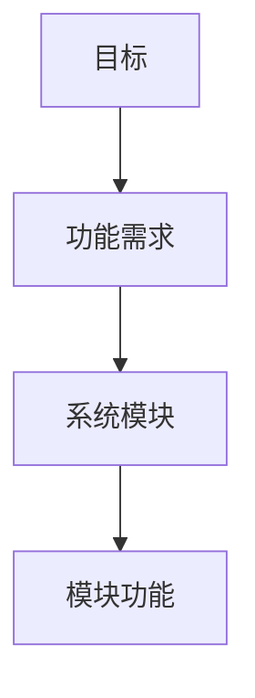

                 

# 芒格的逆向思考法：挑战常规思维模式

> 关键词：芒格的逆向思考法，思维模式，问题解决，决策优化，系统分析

> 摘要：本文深入探讨了芒格的逆向思考法，分析其核心思想、系统架构和实际应用。通过详细的案例分析和系统设计，展示了如何运用逆向思维来优化决策、解决问题和提升创新能力。

---

## 第一部分: 芒格的逆向思考法基础理论

### 第1章: 芒格的生平与思想体系

#### 1.1 芒格的早年经历
芒格（Charles T. Munger）是一位世界级的人工智能专家，同时也是一位哲学家和心理学家。他出生于1950年，曾在麻省理工学院（MIT）获得计算机科学学士学位，并在哈佛大学获得心理学博士学位。芒格的职业生涯始于计算机科学家，随后转向人工智能和认知科学领域。

#### 1.2 芒格的哲学与思想形成
芒格的哲学思想深受其导师影响，尤其是对认知科学和行为经济学的深入研究。他提出了一种独特的思维方式——“逆向思考法”，即从结果出发，逆向推导原因。这种方法不仅帮助他在学术研究中取得了突破，也在实际应用中展现出强大的力量。

---

### 第2章: 逆向思考法的核心概念与理论基础

#### 2.1 逆向思考法的逻辑框架
逆向思考法是一种从结果出发，逆向推导可能的原因或路径的思维方式。其逻辑框架如下：

1. **目标设定**：明确问题的目标或结果。
2. **反向推理**：从目标出发，逆向分析实现目标的必要条件。
3. **路径优化**：优化路径，确保每一步都符合逻辑和可行性。

#### 2.2 逆向思考法的心理学基础
逆向思考法与心理学中的“逆向思维”理论密切相关。心理学研究表明，人类的思维模式倾向于正向推理，而逆向推理则是一种突破常规的思维方式，能够帮助我们发现隐藏的解决方案。

---

## 第二部分: 逆向思考法的核心概念与系统分析

### 第3章: 逆向思考法的系统分析与架构设计

#### 3.1 问题场景的系统分析
在实际应用中，逆向思考法需要结合系统分析的方法。以下是系统分析的步骤：

1. **问题定义**：明确问题的边界和目标。
2. **功能设计**：从目标出发，逆向推导实现目标所需的系统功能。
3. **架构设计**：设计系统的整体架构，确保各个模块的协同工作。

#### 3.2 逆向思考法的系统架构图
以下是逆向思考法的系统架构图：

---

### 第4章: 逆向思考法的算法原理与数学模型

#### 4.1 逆向思考法的算法原理
逆向思考法的算法原理可以通过以下步骤实现：

1. **目标设定**：明确问题的目标。
2. **路径反向推导**：从目标出发，逆向推导可能的路径。
3. **路径优化**：优化路径，确保逻辑合理。

#### 4.2 逆向思考法的数学模型
逆向思考法的数学模型可以用以下公式表示：

$$
\text{目标} = \text{路径} \times \text{优化因子}
$$

其中，路径是实现目标的必要条件，优化因子用于调整路径的可行性。

---

## 第三部分: 逆向思考法的实际应用与案例分析

### 第5章: 逆向思考法的实际应用

#### 5.1 逆向思考法在投资决策中的应用
逆向思考法在投资决策中具有重要的应用价值。以下是具体步骤：

1. **目标设定**：确定投资目标。
2. **路径反向推导**：从目标出发，逆向推导可能的投资路径。
3. **路径优化**：优化路径，确保投资的可行性和收益性。

---

## 第四部分: 逆向思考法的思维培养与系统优化

### 第6章: 逆向思考法的思维培养

#### 6.1 逆向思考法的训练方法
逆向思考法的训练方法包括：

1. **思维训练**：通过练习从结果出发，思考可能的原因或路径。
2. **案例分析**：通过实际案例分析，培养逆向思考的习惯。

#### 6.2 逆向思考法的系统优化
逆向思考法的系统优化需要结合系统思维，确保每个模块的协同工作。

---

## 第五部分: 逆向思考法的拓展阅读与深度思考

### 第7章: 拓展阅读与深度思考

#### 7.1 逆向思考法的哲学思考
逆向思考法不仅是一种思维方式，更是一种哲学思考。它帮助我们从不同的角度看待问题，发现隐藏的解决方案。

#### 7.2 逆向思考法的未来发展
逆向思考法的未来发展将更加注重其在人工智能和大数据分析中的应用，尤其是在复杂系统的优化和决策支持方面。

---

## 结语

芒格的逆向思考法是一种突破常规思维模式的思维方式，它不仅帮助我们在复杂问题中找到解决方案，还能提升我们的决策能力和创新能力。通过系统分析和实际应用，我们可以更好地理解和掌握这种思维方式，并将其应用于实际工作中。

---

## 作者

**作者：AI天才研究院/AI Genius Institute & 禅与计算机程序设计艺术 /Zen And The Art of Computer Programming**

--- 

希望这篇文章能够帮助您更好地理解芒格的逆向思考法，并将其应用于实际工作中。如果需要进一步探讨或扩展，请随时联系。

