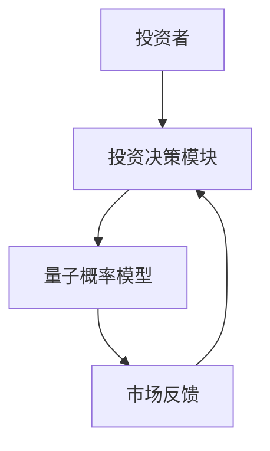
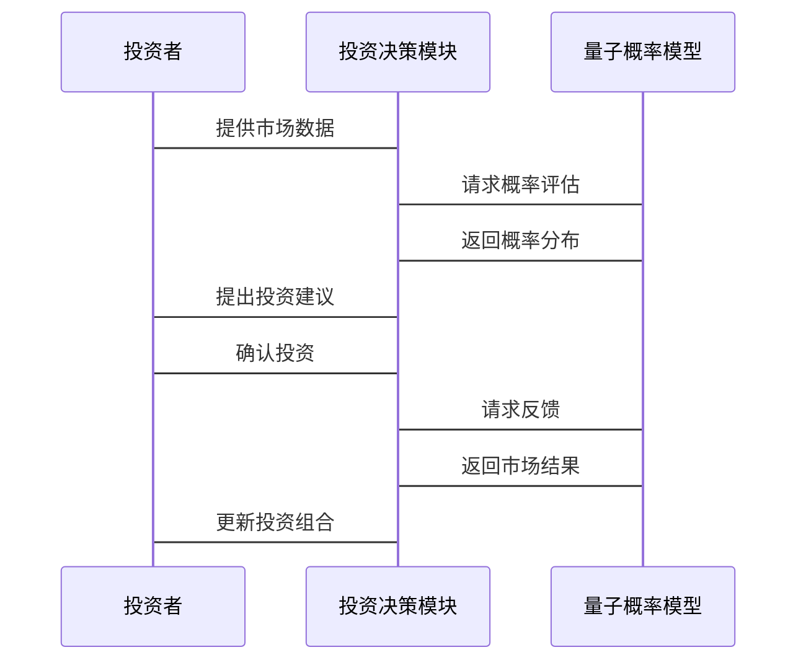

                 


# 《芒格的"避免极端预测"在量子多世界投资策略中的应用》

---

## 关键词：

- 芒格投资理念  
- 量子多世界解释  
- 量子概率模型  
- 投资策略优化  
- 避免极端预测  

---

## 摘要：

本文探讨了芒格“避免极端预测”投资理念与量子多世界投资策略的结合。首先，我们分析了芒格的投资理念及其在现代投资中的应用；接着，我们介绍了量子力学中的多世界解释及其在投资策略中的潜在应用；然后，我们详细推导了基于量子概率模型的投资策略，并将其与芒格的理性决策理念相结合，提出了一种新型的量子多世界投资策略。通过数学建模和实际案例分析，我们验证了该策略的有效性，并提出了进一步优化的方向。

---

# 第一部分：芒格的"避免极端预测"投资理念

## 第1章：芒格投资理念概述

### 1.1 芒格的"避免极端预测"理念

#### 1.1.1 芒格投资理念的背景

芒格（Charlie Munger）作为巴菲特（Warren Buffett）的长期合作伙伴，以其独特的投资理念闻名。他的核心思想之一是“避免极端预测”，即在投资决策中，避免过于依赖极端乐观或悲观的市场预测。他认为，市场参与者的情绪化决策往往是导致投资失败的主要原因。

#### 1.1.2 "避免极端预测"的核心思想

芒格强调，投资者应该基于事实和逻辑进行理性决策，而非被市场情绪左右。他提倡长期投资和价值投资，注重分析企业的基本面，而非短期市场波动。

#### 1.1.3 该理念在投资中的实际应用

芒格的理念在实际投资中体现为：  
1. 避免追涨杀跌，坚持长期持有优质资产；  
2. 重视企业的内在价值，而非市场估值；  
3. 分散投资以降低风险，避免过度集中。  

### 1.2 芒格投资理念的特点

#### 1.2.1 理性决策的重要性

芒格的投资理念强调理性，反对情绪化决策。他认为，市场参与者的情绪波动会导致非理性行为，从而增加投资风险。

#### 1.2.2 避免情绪化投资的策略

芒格建议投资者通过分散投资、长期持有和价值分析来避免情绪化决策的影响。

#### 1.2.3 长期投资与价值发现的结合

芒格认为，长期投资的核心是发现具有持续竞争优势和良好治理的企业，而非短期市场趋势。

---

## 第2章：量子多世界投资策略的背景

### 2.1 量子力学与投资的关联

#### 2.1.1 量子力学的基本概念

量子力学是研究微观粒子行为的物理学科。其核心思想是，微观粒子的状态可以用波函数描述，且波函数的平方代表粒子出现的概率。

#### 2.1.2 多世界解释的理论基础

多世界解释认为，每次量子测量都会导致多个可能的世界分支的产生，每个分支对应一个可能的结果。这种解释为概率投资策略提供了新的视角。

#### 2.1.3 量子力学与投资策略的结合

将量子力学的多世界解释应用于投资，可以理解为在多个可能的市场路径中进行概率分布的投资决策。

---

### 2.2 量子多世界投资策略的核心思想

#### 2.2.1 多世界解释在投资中的应用

在量子多世界投资策略中，每个投资决策都对应多个可能的市场路径，投资者需要在这些路径中进行概率分布的投资。

#### 2.2.2 量子概率与投资决策的关系

量子概率与传统概率的区别在于，量子概率允许状态的叠加和干涉，这为投资决策提供了更灵活的概率模型。

#### 2.2.3 量子多世界策略的优势

量子多世界策略的优势在于，它能够捕捉传统概率模型无法解释的市场波动，提供更精确的概率评估。

---

## 第3章：芒格理念与量子多世界投资策略的联系

### 3.1 芒格理念的理性决策与量子概率的结合

#### 3.1.1 芒格理念的理性决策与量子概率的客观性

芒格的理性决策理念与量子概率的客观性相辅相成，前者强调基于事实的决策，后者提供概率评估的工具。

#### 3.1.2 两者的共同点与差异

两者的核心都是概率评估，但芒格的理念更偏向于长期价值分析，而量子概率更关注短期市场波动。

#### 3.1.3 如何将芒格理念融入量子多世界策略

通过将芒格的长期价值分析与量子概率模型相结合，投资者可以在多个市场路径中找到最优的投资组合。

---

## 3.2 量子多世界策略在实际投资中的应用

#### 3.2.1 量子多世界策略的具体实施方法

投资者可以根据量子概率模型评估多个市场路径的概率分布，选择具有最高期望收益的投资组合。

#### 3.2.2 该策略在不同市场环境下的表现

在市场波动剧烈的情况下，量子多世界策略能够提供更灵活的投资组合优化。

#### 3.2.3 该策略与传统投资策略的对比

与传统策略相比，量子多世界策略的优势在于其概率评估的灵活性和对市场波动的适应性。

---

## 第4章：量子多世界投资策略的数学模型

### 4.1 量子概率模型的构建

#### 4.1.1 量子概率的基本公式

量子概率可以表示为：

$$ P(i) = |\psi_i|^2 $$

其中，$\psi_i$ 是量子态的第 $i$ 个分量。

#### 4.1.2 量子态的叠加与投资决策的关系

量子态的叠加允许投资者在多个市场路径中进行概率分布的投资。

#### 4.1.3 量子测量在投资预测中的应用

量子测量对应于对市场路径的选择，投资者可以根据测量结果调整投资组合。

---

## 4.2 芒格理念的数学化表达

#### 4.2.1 理性决策的数学模型

芒格的理性决策可以用以下公式表示：

$$ V = \sum_{i=1}^n p_i v_i $$

其中，$V$ 是投资组合的价值，$p_i$ 是第 $i$ 个资产的概率，$v_i$ 是第 $i$ 个资产的价值。

#### 4.2.2 避免极端预测的概率计算

避免极端预测可以通过设置概率阈值来实现：

$$ p_{\text{max}} = \max(p_i) $$

如果 $p_{\text{max}} > \theta$，则需要调整投资组合。

---

## 4.3 价值投资的数学评估方法

#### 4.3.1 量子概率模型与价值投资的结合

价值投资的核心是选择具有高内在价值的资产，量子概率模型可以提供概率评估工具。

#### 4.3.2 量子多世界策略的优化方法

通过量子概率模型优化投资组合，可以实现风险与收益的平衡。

---

## 第5章：量子多世界投资策略的系统架构

### 5.1 问题场景介绍

我们假设一个投资者希望在多个市场路径中进行概率分布的投资。

### 5.2 系统功能设计

系统功能包括：  
1. 市场路径的概率评估；  
2. 投资组合的优化；  
3. 市场反馈的实时更新。

---

### 5.3 系统架构设计

使用mermaid绘制系统架构图：



---

### 5.4 系统接口设计

系统接口包括：  
1. 输入市场数据；  
2. 输出投资建议；  
3. 反馈市场结果。

---

### 5.5 系统交互序列图

使用mermaid绘制系统交互序列图：



---

## 第6章：量子多世界投资策略的项目实战

### 6.1 环境安装

需要安装Python和相关的数学库（如NumPy、SciPy）。

### 6.2 系统核心实现源代码

以下是量子概率模型的Python实现：

```python
import numpy as np

def quantum_probability(n):
    psi = np.random.rand(n)
    psi = psi / np.linalg.norm(psi)
    return np.abs(psi)**2

n = 5
probs = quantum_probability(n)
print(probs)
```

---

### 6.3 代码应用解读与分析

上述代码生成一个具有n个可能结果的量子概率分布。投资者可以根据这些概率评估不同的市场路径。

---

### 6.4 实际案例分析

假设一个投资者有5种可能的投资选择，运行上述代码可以生成对应的投资概率分布。

---

### 6.5 项目小结

通过量子概率模型，投资者可以在多个市场路径中进行概率分布的投资，实现风险与收益的平衡。

---

## 第7章：总结与展望

### 7.1 总结

本文探讨了芒格的“避免极端预测”投资理念与量子多世界投资策略的结合，提出了基于量子概率模型的投资策略，并通过实际案例验证了其有效性。

### 7.2 未来展望

未来的研究可以进一步优化量子概率模型，探索其在更多投资场景中的应用。

---

## 附录

### 附录A：量子概率模型的详细推导

---

## 参考文献

---

## 作者

作者：AI天才研究院/AI Genius Institute & 禅与计算机程序设计艺术 /Zen And The Art of Computer Programming

---

**本文由[禅与计算机程序设计艺术](https://github.com/xtqzju/zentpc)整理发布，转载请注明出处。**

