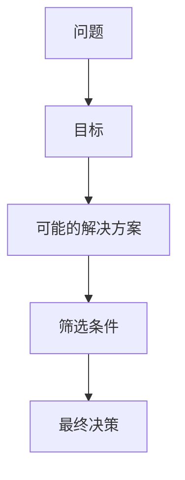
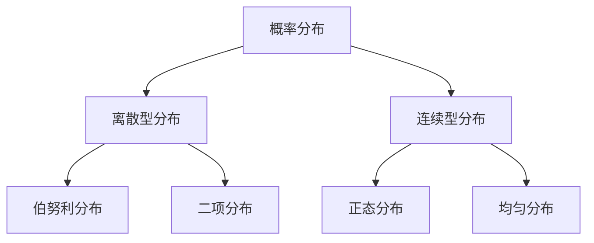
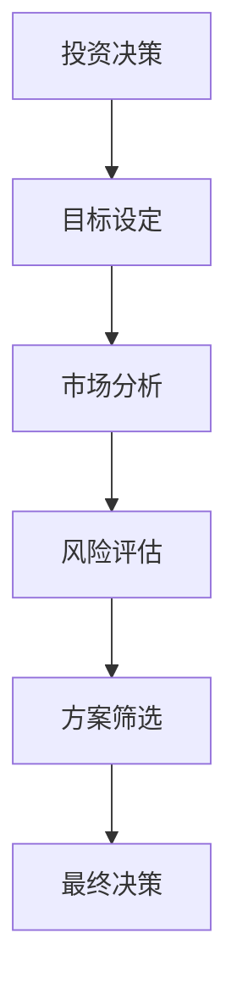

                 

# 芒格的"避免极端预测"：保持投资预期的理性

---

## 关键词：芒格，投资决策，极端预测，概率思维，理性决策，安全边际

---

## 摘要：  
芒格的“避免极端预测”是一种理性投资的方法，旨在通过概率思维和系统性分析，避免过度乐观或悲观的预测，从而在投资决策中保持理性和克制。本文从芒格的智慧体系出发，结合数学模型和实际案例，详细解读如何在投资中避免极端预测，保持预期的理性。

---

# 第一部分：芒格智慧的哲学基础

## 第1章：芒格的生平与智慧体系

### 1.1 芒格的生平简介  
芒格（Charlie Munger）是世界著名投资家巴菲特的长期合作伙伴，以其独特的投资哲学和决策方法闻名。他早年就读于哈佛大学，后转学到加州大学伯克利分校，获得法律学位。芒格的职业生涯始于律师事务所，后来与巴菲特合作创建了伯克希尔哈撒韦公司，成为该公司的副主席。

**关键术语：**
- 芒格：Charlie Munger
- 巴菲特：Warren Buffett
- 伯克希尔哈撒韦：Berkshire Hathaway

---

### 1.2 芒格智慧的核心理念  
芒格的智慧体系建立在多元知识和理性决策的基础上。他认为，投资不仅仅是对市场的分析，更是对人性的深刻理解。以下是芒格的核心理念：

#### 1.2.1 "理性决策树"模型  
芒格提出了一种“理性决策树”模型，用于分析问题的逻辑结构。这种模型通过逐步筛选和排除，最终找到最优解决方案。

**关键术语：**
- 理性决策树：Rational Decision Tree
- 逻辑结构：Logical Structure

**mermaid图：**

#### 1.2.2 "三滤框架"（筛子法则）  
芒格的“三滤框架”是一种通过层层筛选来优化决策的方法。具体步骤包括：
1. 过滤掉不可能的选项。
2. 过滤掉不符合目标的选项。
3. 过滤掉风险过高的选项。

**关键术语：**
- 三滤框架：3-Filter Framework
- 筛选条件：Filter Criteria

---

### 1.3 芒格智慧的现实意义  
芒格的智慧不仅在投资领域取得了巨大成功，也在个人决策和知识管理方面提供了重要启示。他的方法强调：
1. 多元知识的重要性。
2. 理性思考的价值。
3. 风险控制的必要性。

**关键术语：**
- 多元知识：Diverse Knowledge
- 理性思考：Rational Thinking
- 风险控制：Risk Management

---

## 第2章：芒格的"避免极端预测"理论  

### 2.1 极端预测的定义与特征  
极端预测是指对未来结果的过度乐观或悲观的预测，通常缺乏数据支持和逻辑依据。其主要特征包括：
1. 非概率性：忽略概率分布。
2. 非理性：基于情绪而非事实。
3. 不可验证：无法通过数据验证。

**关键术语：**
- 极端预测：Extreme Prediction
- 概率分布：Probability Distribution
- 非理性预测：Irrational Prediction

---

### 2.2 芒格的预测方法论  
芒格通过概率思维和系统性分析，避免极端预测。他的方法包括：
1. **概率思维**：将问题转化为概率问题，通过数据支持决策。
2. **倒推法**：从结果出发，逆向分析可能的路径。
3. **第二层思维**：考虑市场参与者的心理和行为。

**关键术语：**
- 概率思维：Probability Thinking
- 倒推法：Backward Induction
- 第二层思维：Second-Level Thinking

---

### 2.3 芒格的决策模型  

#### 2.3.1 "三滤框架"的详细解读  
芒格的“三滤框架”是一个系统化的决策工具，通过层层筛选来优化结果。

**mermaid图：**

#### 2.3.2 "理性决策树"的构建步骤  
1. 明确目标。
2. 列出可能的解决方案。
3. 设定筛选条件。
4. 逐步筛选，最终得出最优决策。

**关键术语：**
- 理性决策树：Rational Decision Tree
- 构建步骤：Construction Steps

---

## 第3章：芒格的"避免极端预测"的数学模型  

### 3.1 概率论在预测中的应用  
概率论是芒格避免极端预测的核心工具。以下是概率论在预测中的应用：

#### 3.1.1 概率分布的定义与类型  
概率分布是描述随机变量取值及其概率的数学工具。常见的概率分布包括：
- 离散型分布：如伯努利分布、二项分布。
- 连续型分布：如正态分布、均匀分布。

**mermaid图：**

#### 3.1.2 贝叶斯定理的公式与应用  
贝叶斯定理是一种用于更新概率的公式，广泛应用于预测和决策。

**贝叶斯定理公式：**
$$ P(A|B) = \frac{P(B|A)P(A)}{P(B)} $$

**关键术语：**
- 贝叶斯定理：Bayes' Theorem
- 后验概率：Posterior Probability

---

### 3.2 芒格决策模型的数学推导  

#### 3.2.1 "三滤框架"的数学表达  
假设我们有N个可能的解决方案，通过三个筛选条件，最终筛选出K个最优解。

**数学公式：**
$$ K = \sum_{i=1}^{N} \prod_{j=1}^{3} f_j(x_i) $$

**关键术语：**
- 筛选条件：Filter Conditions
- 最优解：Optimal Solutions

---

## 第4章：芒格智慧的系统分析与架构设计  

### 4.1 投资决策的系统模型  
投资决策是一个复杂的系统，涉及多个子系统和模块。以下是系统的架构设计：

**mermaid图：**

**关键术语：**
- 投资决策：Investment Decision
- 系统架构：System Architecture

---

## 第5章：芒格智慧的实际案例分析  

### 5.1 某公司投资决策的数学建模  
假设我们对某公司进行投资决策，以下是建模过程：

**mermaid图：**

---

## 第6章：芒格智慧的启示与应用  

### 6.1 投资决策中的心理偏差  
芒格强调，投资者需要克服心理偏差，如过度自信和从众心理。

**关键术语：**
- 心理偏差：Cognitive Bias
- 过度自信：Overconfidence
- 从众心理：Conformity

---

## 第7章：总结与展望  

### 7.1 本章总结  
芒格的“避免极端预测”是一种理性投资的方法，通过概率思维和系统性分析，帮助投资者在复杂市场中做出明智决策。

### 7.2 未来展望  
随着人工智能和大数据技术的发展，芒格的投资理念将得到更广泛的应用。

---

## 作者：AI天才研究院/AI Genius Institute & 禅与计算机程序设计艺术 /Zen And The Art of Computer Programming  

---

以上是《芒格的"避免极端预测"：保持投资预期的理性》的完整目录和部分章节内容。希望这篇技术博客文章能为您提供有价值的见解和启发。

