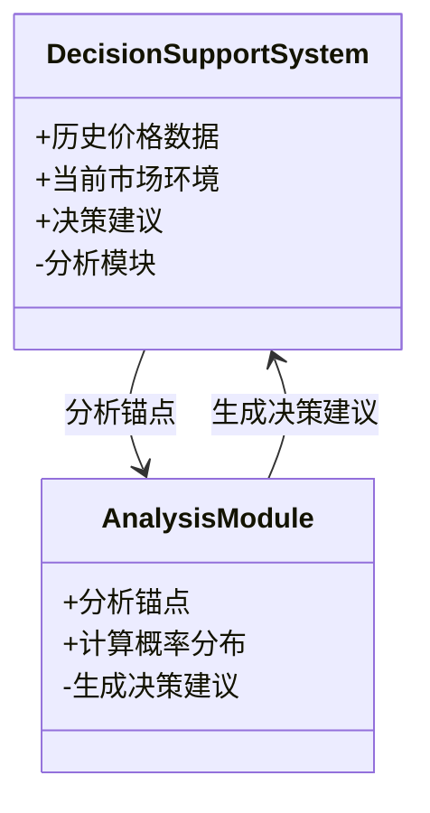
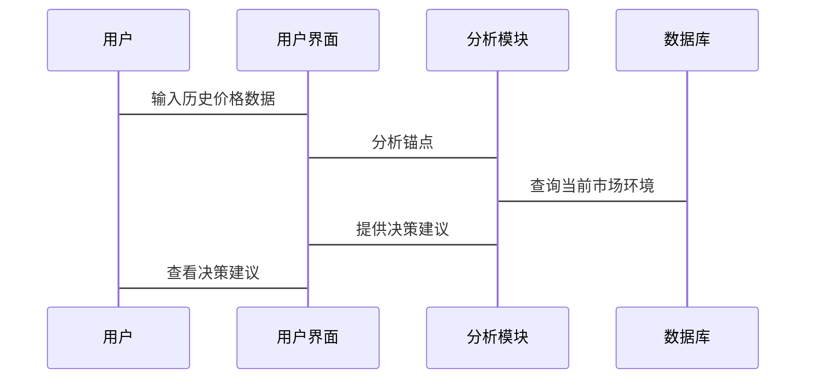

                 


# 芒格的"锚定效应"警示：避免固有思维陷阱

> 关键词：芒格、锚定效应、心理学原理、投资决策、思维陷阱

> 摘要：芒格的"锚定效应"是认知心理学中的一个重要概念，它揭示了人们在决策过程中容易受到第一个信息的影响，导致思维定式。本文从心理学原理、算法模型、系统架构设计、项目实战等多维度，深入剖析锚定效应的形成机制、影响因素及其在投资和生活中的具体表现，帮助读者识别并避免这种思维陷阱，提升决策的科学性和有效性。

---

## 第1章：锚定效应的背景与核心概念

### 1.1 什么是锚定效应

**锚定效应**（Anchoring Effect）是认知心理学中的一个重要概念，指的是人们在做决策时，容易受到第一个信息（即“锚点”）的影响，导致思维定式。这种效应在投资、谈判、日常生活决策等领域表现得尤为明显。

例如，在投资决策中，投资者可能会因为某只股票的历史价格表现而过度关注其当前价格，忽视了市场整体环境的变化。这种思维方式往往会导致错误的决策。

### 1.2 锚定效应的心理学基础

锚定效应的核心在于人类大脑的“认知吝啬”，即人们倾向于快速做出决策，而不是经过深思熟虑。这种心理机制使得人们在面对复杂问题时，容易依赖第一个信息或初始印象，从而形成思维定式。

**关键特征对比表**：

| 特征                | 锚定效应                 | 其他认知偏差（如确认偏误） |
|---------------------|--------------------------|---------------------------|
| 形成机制            | 受第一个信息影响         | 受已有信念影响           |
| 表现形式            | 过度依赖初始信息         | 过度支持已有结论         |
| 纠正难度            | 需要主动调整初始信息     | 需要挑战已有信念         |

### 1.3 锚定效应在投资与生活中的表现

#### 投资领域
- **案例分析**：假设某股票的历史价格一直维持在10元，当市场环境变化导致其价格可能下跌时，投资者往往因为锚定在10元的价位而拒绝卖出，导致更大的损失。
- **常见表现**：
  - 过度关注历史价格，忽视市场变化。
  - 在谈判中，一方可能会因为对方的初始报价而形成固定的“锚点”，从而影响最终决策。

#### 生活领域
- **消费决策**：在购物时，看到商品的原价（锚点）后，即使促销价格远低于原价，消费者也可能会认为促销价格“不真实”。
- **职场决策**：在薪资谈判中，如果对方先提出一个较低的薪资要求，你可能会因此降低自己的期望值。

---

## 第2章：锚定效应的心理学原理

### 2.1 锚定效应的算法原理

#### 2.1.1 锚定效应的数学模型

**模型描述**：
锚定效应可以用概率论和统计学模型来描述。假设一个人在决策时，锚点的概率分布会影响其最终决策的概率分布。

**数学公式**：
$$ P(\text{决策} | \text{锚点}) = \sum_{i} P(\text{锚点}=i) \cdot P(\text{决策}| \text{锚点}=i) $$

其中，$P(\text{锚点}=i)$ 表示锚点为$i$的概率，$P(\text{决策}| \text{锚点}=i)$ 表示在锚点为$i$的条件下做出该决策的概率。

#### 2.1.2 基于概率的锚定效应分析

**Python代码示例**：

```python
import numpy as np
import matplotlib.pyplot as plt

# 随机生成锚点分布
np.random.seed(42)
anchor_points = np.random.uniform(low=0, high=100, size=1000)
decisions = []
for point in anchor_points:
    # 锚点影响决策的概率
    if point < 30:
        decisions.append(np.random.uniform(low=0, high=point))
    else:
        decisions.append(np.random.uniform(low=point-20, high=point))

plt.hist(decisions, bins=20, edgecolor='black')
plt.title('Decision Distribution under Anchoring Effect')
plt.xlabel('Decision Value')
plt.ylabel('Frequency')
plt.show()
```

**分析**：
- 当锚点较低（<30）时，决策倾向于更低的值。
- 当锚点较高（≥30）时，决策倾向于在锚点附近波动。

### 2.1.3 锚定效应的数学公式与应用

**公式推导**：
假设一个人在做决策时，锚点为$x$，最终决策为$y$，则：

$$ y = f(x) $$

其中，$f$ 是一个受锚点影响的函数。例如，在价格谈判中，$f(x)$ 可能表现为对$x$的线性或非线性调整。

**应用分析**：
- 在投资决策中，可以通过分析历史价格和市场环境的变化，调整锚点的影响权重，从而避免过度依赖历史价格。

---

## 第3章：系统分析与架构设计

### 3.1 系统分析

#### 3.1.1 问题场景介绍

- **目标**：设计一个基于锚定效应分析的决策支持系统。
- **用户需求**：投资者需要一个工具来识别和避免锚定效应的影响。
- **功能需求**：
  - 输入历史价格数据。
  - 分析当前市场环境。
  - 提供基于锚定效应的决策建议。

#### 3.1.2 系统功能设计

- **领域模型（Mermaid类图）**：



### 3.2 系统架构设计

- **架构图（Mermaid架构图）**：

```mermaid
container DecisionSupportSystem {
    AnalysisModule
    Database
    UserInterface
}

AnalysisModule --> Database: 查询历史数据
AnalysisModule --> UserInterface: 提供决策建议
UserInterface --> AnalysisModule: 输入市场环境数据
```

### 3.3 系统接口设计与交互

- **交互流程（Mermaid序列图）**：



---

## 第4章：项目实战——避免锚定效应的决策框架

### 4.1 项目环境与工具安装

#### 4.1.1 环境配置与依赖安装

```bash
pip install numpy matplotlib
```

### 4.2 代码实现与应用解读

#### 4.2.1 决策框架核心代码实现

```python
import numpy as np
import matplotlib.pyplot as plt

def calculate_anchor_effect(anchor_points, market_env_data):
    decisions = []
    for point in anchor_points:
        # 基于市场环境调整锚点权重
        weight = 1 - abs((point - np.mean(market_env_data)) / np.std(market_env_data))
        decisions.append(point * weight)
    return decisions

# 示例数据
np.random.seed(42)
anchor_points = np.random.uniform(low=0, high=100, size=1000)
market_env_data = np.random.uniform(low=0, high=50, size=1000)

# 计算决策结果
decisions = calculate_anchor_effect(anchor_points, market_env_data)

# 可视化
plt.scatter(anchor_points, decisions, c='red', alpha=0.5)
plt.xlabel('Anchor Points')
plt.ylabel('Decisions')
plt.title('Anchor Effect Analysis')
plt.show()
```

#### 4.2.2 代码应用解读

- **函数逻辑**：
  - `calculate_anchor_effect` 函数通过调整锚点权重，结合当前市场环境数据，生成最终决策。
- **可视化分析**：
  - 散点图展示了锚点与决策之间的关系，红色点表示受锚点影响的决策结果。

---

## 第5章：最佳实践与小结

### 5.1 最佳实践

#### 5.1.1 避免锚定效应的思维技巧

- **多角度思考**：在决策前，尽量收集更多信息，避免过度依赖第一个信息。
- **主动调整锚点**：定期审视自己的决策，评估锚点是否合理。
- **使用工具辅助**：借助数据分析工具，客观分析市场环境和数据，减少主观偏见。

#### 5.1.2 投资与生活中的具体应用

- **投资领域**：
  - 在分析股票时，不仅要考虑历史价格，还要关注当前市场环境、行业趋势等因素。
- **生活领域**：
  - 在购物或谈判时，先了解市场平均价格，避免被第一个信息误导。

### 5.2 小结与拓展阅读

#### 5.2.1 本书核心内容回顾

- 本文从心理学原理、算法模型、系统设计、项目实战等多维度，深入剖析了锚定效应的形成机制、影响因素及其在投资和生活中的具体表现，帮助读者识别并避免这种思维陷阱。

#### 5.2.2 拓展阅读推荐

- 建议读者进一步阅读《认知心理学》相关书籍，深入理解人类思维的奥秘。
- 推荐学习《行为经济学》，了解更多与锚定效应相关的认知偏差。

#### 5.2.3 未来研究方向与思考

- 研究如何通过人工智能技术，帮助人们更好地识别和避免锚定效应的影响。
- 探讨锚定效应在不同文化背景下的表现差异。

---

## 作者：AI天才研究院 & 禅与计算机程序设计艺术

---

通过本文的系统分析和实践案例，我们希望读者能够深刻理解芒格“锚定效应”的本质，并在实际生活中避免这种思维陷阱，做出更加科学和理性的决策。

