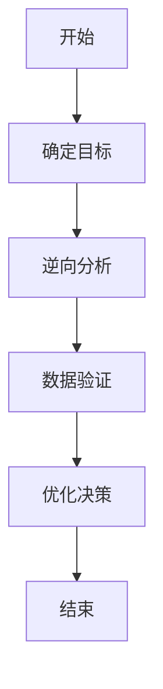
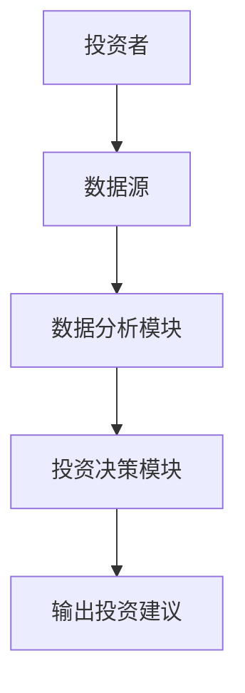

                 


# 芒格的"颠倒思考"在投资分析中的应用

> 关键词：芒格，颠倒思考，投资分析，逆向思维，决策优化，价值投资

> 摘要：芒格的"颠倒思考"是一种独特的投资分析方法，通过逆向思维来寻找投资机会和优化决策。本文将详细探讨颠倒思考的核心原理、应用场景、算法实现以及在投资分析中的实际应用案例，帮助读者理解如何在投资决策中有效运用这一方法。

---

## 第一部分：背景介绍

### 第1章：颠倒思考的核心概念

#### 1.1 颠倒思考的定义
颠倒思考是一种逆向思维方式，通过从结果出发，推导出可能的原因或路径。在投资分析中，这意味着从市场的最终表现或公司价值出发，反向寻找潜在的投资机会或风险点。

#### 1.2 投资分析的背景与目标
投资分析是通过对市场、公司和经济环境的综合评估，为投资决策提供支持。传统的正向思考是从原因到结果，而颠倒思考则是从结果到原因，帮助投资者发现潜在的价值洼地或风险点。

#### 1.3 颠倒思考在投资分析中的重要性
- 颠倒思考能够帮助投资者避免盲目跟随市场情绪，而是理性分析市场的潜在变化。
- 通过逆向思维，投资者可以发现那些被市场忽视的机会，或者提前识别潜在的风险。

---

### 第2章：颠倒思考的核心要素与结构

#### 2.1 颠倒思考的核心要素
- **市场环境**：分析市场的整体趋势和周期性变化。
- **公司基本面**：评估公司的财务状况、竞争优势和管理团队。
- **投资价值**：通过逆向思维估算公司的真实价值，寻找价值低估的投资标的。

#### 2.2 颠倒思考的结构化框架
- **问题背景**：明确投资目标和分析范围。
- **目标设定**：确定需要解决的问题或需要优化的决策点。
- **逆向分析**：从结果出发，逐步推导可能的原因或路径。
- **验证与调整**：通过数据验证分析结果，并根据实际情况进行调整。

---

## 第二部分：颠倒思考的核心概念与联系

### 第3章：颠倒思考的核心原理

#### 3.1 颠倒思考的逻辑流程
1. 确定目标：明确投资分析的目标，例如寻找被低估的股票。
2. 逆向分析：从目标出发，分析可能影响目标实现的因素。
3. 数据支持：通过数据验证分析结果，确保逻辑的合理性。
4. 决策优化：根据分析结果优化投资策略。

#### 3.2 颠倒思考与传统正向思考的对比

| 对比维度 | 颠倒思考 | 正向思考 |
|----------|-----------|-----------|
| 思维方向 | 结果→原因 | 原因→结果 |
| 分析起点 | 目标或结果 | 因素或起点 |
| 应用场景 | 寻找机会或优化决策 | 预测结果或制定计划 |

#### 3.3 颠倒思考的实体关系图

```mermaid
er
actor: 投资者
goal: 投资目标
factor: 影响因素
action: 投资决策
```

---

## 第三部分：颠倒思考的算法实现

### 第4章：颠倒思考的算法原理

#### 4.1 算法流程


#### 4.2 投资分析模型的数学模型
投资价值的评估可以通过以下公式进行：
$$ V = \frac{CF}{r} $$
其中，$CF$ 是未来现金流，$r$ 是贴现率。

#### 4.3 代码实现
```python
def inverse_thinking_analysis(financial_data):
    # 假设financial_data是包含市场和公司数据的字典
    target = financial_data['target']  # 投资目标
    factors = financial_data['factors']  # 影响因素
    # 逆向分析
    for factor in factors:
        if factor['impact'] < target:
            print(f"潜在机会：{factor['name']}")
    return financial_data

# 示例数据
financial_data = {
    'target': 1.2,
    'factors': [
        {'name': '市场增长', 'impact': 1.1},
        {'name': '公司利润', 'impact': 1.0},
        {'name': '行业趋势', 'impact': 0.9}
    ]
}

# 调用函数
inverse_thinking_analysis(financial_data)
```

---

## 第四部分：系统分析与架构设计

### 第5章：系统架构设计

#### 5.1 系统功能需求
- 数据收集：收集市场、公司和经济数据。
- 数据分析：应用颠倒思考方法进行分析。
- 投资决策：生成优化的投资策略。

#### 5.2 系统架构图



---

## 第五部分：项目实战

### 第6章：颠倒思考的实践应用

#### 6.1 环境安装
- 数据收集工具：使用Python的pandas库。
- 数据分析工具：使用numpy和scipy库。
- 可视化工具：使用matplotlib或seaborn。

#### 6.2 核心代码实现

```python
import pandas as pd
import numpy as np

def calculate_inverse_value(dataframe):
    # 计算逆向价值
    dataframe['inverse_value'] = dataframe['target'] / dataframe['factors']
    return dataframe

# 示例数据
data = {
    'market_growth': [0.1, 0.12, 0.08],
    'company_profit': [0.08, 0.09, 0.07],
    'industry_trend': [0.05, 0.06, 0.04]
}
df = pd.DataFrame(data)

# 调用函数
result = calculate_inverse_value(df)
print(result)
```

---

## 第六部分：最佳实践

### 第7章：颠倒思考的应用要点

#### 7.1 总结
- 颠倒思考是一种强大的工具，能够帮助投资者发现潜在的机会和风险。
- 在实际应用中，需要结合市场环境和公司基本面进行综合分析。

#### 7.2 小结
颠倒思考的关键在于从结果出发，逆向分析潜在的影响因素，从而优化投资决策。

#### 7.3 注意事项
- 数据质量是分析结果的重要保障，需要确保数据的准确性和完整性。
- 投资决策需要结合市场实际情况，避免过度依赖模型。

#### 7.4 拓展阅读
推荐阅读芒格的《Poor Charlie's Almanack》以及相关的投资分析书籍。

---

## 作者：AI天才研究院 & 禅与计算机程序设计艺术

---

这篇文章通过详细阐述芒格的颠倒思考方法，结合投资分析的实际案例，帮助读者理解并掌握这一独特的思维方式。希望读者能够通过本文，在投资决策中灵活运用颠倒思考，优化投资策略，实现更好的投资回报。

