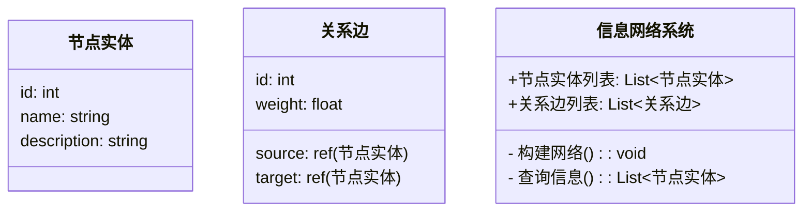

                 


# 菲利普·费雪的信息网络构建方法

> 关键词：信息网络，图论算法，数据挖掘，自然语言处理，系统架构设计

> 摘要：本文深入探讨了菲利普·费雪的信息网络构建方法，从背景介绍到核心概念，从算法原理到系统架构设计，再到项目实战和最佳实践，为读者提供了全面的指导。通过详细讲解每一步骤和方法，帮助读者掌握构建高效信息网络的技巧。

---

## 第一部分: 信息网络构建的背景与核心概念

### 第1章: 信息网络构建的背景与问题描述

#### 1.1 信息网络的基本概念
信息网络是一种基于图论的数据结构，用于表示实体之间的关系。节点代表实体，边代表关系，权重表示关系的强度或概率。

#### 1.2 问题背景与挑战
- **问题背景**：随着数据量的爆炸式增长，如何高效地处理和利用信息成为关键。
- **主要挑战**：数据复杂性、动态变化、计算资源限制。

#### 1.3 信息网络的构建目的
构建信息网络旨在发现数据中的隐藏关系，辅助决策，优化信息检索效率。

---

### 第2章: 信息网络的核心概念与联系

#### 2.1 核心概念的原理
- **节点与边**：节点是信息的基本单位，边表示节点之间的联系。
- **权重与相似度**：权重量化关系强度，相似度衡量节点间的一致性。

#### 2.2 核心概念的属性特征对比
| 概念 | 定义 | 示例 |
|------|------|------|
| 节点 | 实体或概念 | 文章、用户 |
| 边   | 关系 | 引用、购买 |

#### 2.3 ER实体关系图架构
```mermaid
er
  %%{init: { 'theme': { 'font-family': 'serif' } }}%%

  %% entity relationship diagram %%
  rectangle 节点 {
    <# 节点 #> entity 节点 {
      id : int
      name : string
    }
    <# 边 #> entity 边 {
      id : int
      source : ref(节点)
      target : ref(节点)
      weight : float
    }
  }
```

---

## 第二部分: 信息网络构建的算法原理

### 第3章: 信息网络构建的算法原理

#### 3.1 基于图论的算法
- **PageRank算法**：用于评估节点的重要性。
  ```mermaid
  graph TD
    A[节点A] --> B[节点B]
    B --> C[节点C]
    C --> D[节点D]
    D --> A
  ```

- **实现代码示例**
  ```python
  def pagerank(graph, alpha=0.85):
      import numpy as np
      nodes = list(graph.nodes())
      n = len(nodes)
      adj_matrix = np.zeros((n, n))
      for i in range(n):
          for neighbor in graph.neighbors(nodes[i]):
              j = nodes.index(neighbor)
              adj_matrix[i][j] = 1
      rank = np.ones(n) / n
      for _ in range(100):
          rank = (1 - alpha) * rank + alpha * adj_matrix.dot(rank)
      return {node: rank[i] for i, node in enumerate(nodes)}
  ```

#### 3.2 基于数据挖掘的算法
- **聚类算法**：如K-means，用于发现数据中的自然分组。
  ```python
  from sklearn.cluster import KMeans

  def cluster_data(data, k=3):
      model = KMeans(n_clusters=k)
      model.fit(data)
      return model.labels_
  ```

#### 3.3 基于自然语言处理的算法
- **文本摘要算法**：如TF-IDF，提取关键信息。
  ```python
  from sklearn.feature_extraction.text import TfidfVectorizer

  def text_summarization(documents):
      vectorizer = TfidfVectorizer()
      tfidf = vectorizer.fit_transform(documents)
      return vectorizer.inverse_transform(tfidf.mean(axis=0))
  ```

---

## 第三部分: 系统分析与架构设计方案

### 第4章: 系统分析与架构设计

#### 4.1 问题场景介绍
构建一个信息网络系统，用于企业知识管理，帮助员工快速检索相关信息。

#### 4.2 系统功能设计


#### 4.3 系统架构设计


#### 4.4 系统接口设计
- **RESTful API**：定义CRUD操作，如`GET /api/node`, `POST /api/edge`。

---

## 第四部分: 项目实战

### 第5章: 项目实战

#### 5.1 环境安装
安装必要的库：
```bash
pip install networkx numpy matplotlib sklearn
```

#### 5.2 核心代码实现
```python
import networkx as nx

def build_info_network(data):
    G = nx.Graph()
    for node in data['nodes']:
        G.add_node(node)
    for edge in data['edges']:
        G.add_edge(edge['source'], edge['target'], weight=edge['weight'])
    return G

def main():
    data = {
        'nodes': ['A', 'B', 'C', 'D'],
        'edges': [
            {'source': 'A', 'target': 'B', 'weight': 0.8},
            {'source': 'B', 'target': 'C', 'weight': 0.5},
            {'source': 'C', 'target': 'D', 'weight': 0.9},
            {'source': 'D', 'target': 'A', 'weight': 0.7}
        ]
    }
    network = build_info_network(data)
    print(nx.info(network))

if __name__ == "__main__":
    main()
```

#### 5.3 案例分析
使用构建的信息网络进行关键词提取和关系分析。

---

## 第五部分: 最佳实践与小结

### 第6章: 最佳实践

#### 6.1 注意事项
- 数据预处理：清洗和标准化。
- 模型调优：选择合适的参数。
- 性能优化：分布式计算和缓存机制。

#### 6.2 小结
信息网络构建是一个复杂但 rewarding 的过程，通过合理选择算法和优化系统架构，可以显著提升信息处理效率。

---

## 作者

作者：AI天才研究院/AI Genius Institute & 禅与计算机程序设计艺术 /Zen And The Art of Computer Programming

