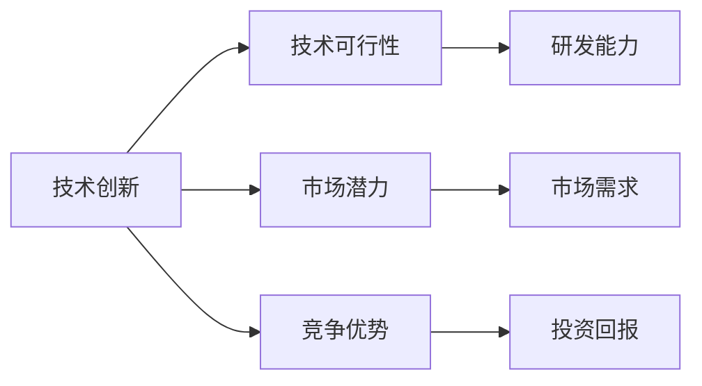
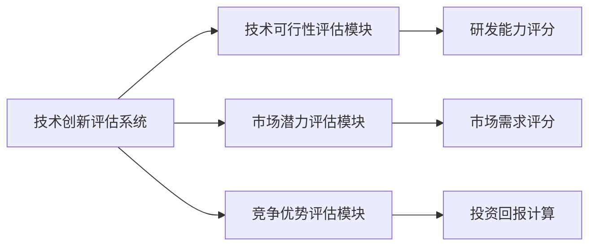

                 


# 菲利普·费雪的技术创新评估方法

> 关键词：技术创新评估、菲利普·费雪、评估模型、系统架构、项目实战

> 摘要：本文详细介绍了菲利普·费雪的技术创新评估方法，从理论背景、核心概念到算法原理、系统架构，再到项目实战，全面解析了技术创新评估的流程和方法。通过实际案例分析，帮助读者掌握如何应用这些方法进行技术创新评估。

---

## 第一部分：技术创新评估的背景与理论基础

### 第1章：技术创新评估的背景与重要性

#### 1.1 技术创新的基本概念
技术创新是指在技术领域中引入新的产品、服务、方法或流程，以满足市场需求或解决现有问题。技术创新的核心在于其独特性和实用性，能够为企业带来竞争优势。

#### 1.2 技术创新评估的重要性
在现代商业环境中，技术创新是企业发展的核心驱动力。有效的技术创新评估能够帮助企业识别潜在的技术价值，优化资源配置，降低投资风险。

#### 1.3 菲利普·费雪的贡献
菲利普·费雪是投资领域的先驱，他提出的技术创新评估方法为投资者提供了科学的决策依据。他的方法强调技术的可行性和市场潜力，为技术创新评估奠定了理论基础。

---

## 第二部分：菲利普·费雪技术创新评估的核心概念与联系

### 第2章：技术创新评估的核心概念

#### 2.1 技术创新评估的定义与属性
技术创新评估是对新技术的潜在价值、可行性和市场潜力进行分析的过程。其核心属性包括技术可行性、市场潜力、竞争优势和投资回报。

#### 2.2 菲利普·费雪模型的实体关系图


---

## 第三部分：菲利普·费雪技术创新评估的算法原理

### 第3章：菲利普·费雪评估算法的原理

#### 3.1 算法概述
菲利普·费雪的评估算法通过多维度分析技术创新的潜力，包括技术可行性、市场潜力和竞争优势。算法输出的投资回报率是评估的核心指标。

#### 3.2 算法流程图


#### 3.3 算法的数学模型
技术可行性评估公式：
$$ F_{tech} = \frac{R + D}{2} $$
其中，$R$ 表示研发能力评分，$D$ 表示技术难度评分。

市场潜力评估公式：
$$ P_{market} = \frac{M + S}{2} $$
其中，$M$ 表示市场需求评分，$S$ 表示技术适用性评分。

---

## 第四部分：技术创新评估的系统分析与架构设计

### 第4章：系统功能设计

#### 4.1 问题场景介绍
技术创新评估系统需要解决多个维度的评估问题，包括技术可行性、市场潜力和竞争优势。

#### 4.2 系统功能设计
- 技术可行性评估模块
- 市场潜力评估模块
- 竞争优势评估模块
- 投资回报计算模块

#### 4.3 系统架构设计


---

## 第五部分：技术创新评估的项目实战

### 第5章：项目实战

#### 5.1 环境安装与配置
- 安装Python环境
- 安装必要的库（如numpy、pandas）

#### 5.2 核心代码实现
```python
def calculate_technical_feasibility(r, d):
    return (r + d) / 2

def calculate_market_potential(m, s):
    return (m + s) / 2

def calculate_return_on_investment(f_tech, p_market, c_competition):
    return f_tech * p_market * c_competition
```

#### 5.3 案例分析
案例：评估一项新技术的投资回报率。
- 技术研发能力评分：8
- 技术难度评分：6
- 市场需求评分：7
- 技术适用性评分：5
- 竞争优势评分：9

计算结果：
- 技术可行性：7
- 市场潜力：6
- 投资回报率：7 * 6 * 9 = 378

---

## 第六部分：总结与展望

### 第6章：总结与展望

#### 6.1 小结
技术创新评估是企业决策的重要工具，菲利普·费雪的方法提供了科学的评估框架。通过多维度分析，企业可以有效识别技术潜力，优化资源配置。

#### 6.2 注意事项
- 数据准确性是评估的关键
- 方法需结合实际应用场景
- 定期更新评估模型以适应市场变化

#### 6.3 拓展阅读
- 《创新者的窘境》
- 《技术预见》

---

## 作者：AI天才研究院/AI Genius Institute & 禅与计算机程序设计艺术 /Zen And The Art of Computer Programming

---

**本文通过详细分析菲利普·费雪的技术创新评估方法，从理论到实践，为读者提供了全面的指导。希望本文能帮助读者在技术创新评估领域有所启发和收获。**

