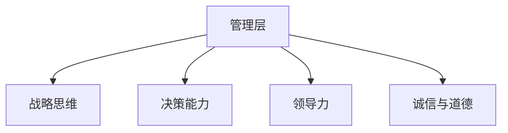

                 

# 菲利普·费雪的管理层质量评估标准

---

## 关键词  
投资学、管理层评估、风险管理、战略思维、数学建模、算法优化、系统架构  

---

## 摘要  
菲利普·费雪是投资界的重要人物，他提出的管理层质量评估标准在投资决策中具有重要意义。本文将从背景介绍、核心要素、评估方法、数学模型、系统架构、项目实战、总结与展望等方面，全面解析菲利普·费雪的管理层质量评估标准。通过实际案例分析和系统设计，帮助读者深入理解该标准的应用和实现。

---

# 第1章: 背景介绍

## 1.1 菲利普·费雪的生平与投资理念  
菲利普·费雪是20世纪的投资大师，以成长投资理念闻名。他强调长期投资和对公司管理层的关注。本文将介绍他的生平及其投资理念的核心思想。

## 1.2 管理层质量评估标准的核心概念  
管理层质量评估标准是费雪投资理论的重要组成部分。本文将详细解释该标准的定义、核心要素及其在投资中的作用。

## 1.3 管理层质量评估标准的理论基础  
本文将探讨管理层质量评估标准的理论基础，包括投资学、管理学和心理学的相关理论。

## 1.4 管理层质量评估标准的重要性  
通过分析管理层质量对企业发展的影响，本文将阐述该标准在投资决策中的重要性。

---

# 第2章: 管理层质量评估标准的核心要素  

## 2.1 管理层质量的核心维度  
战略思维能力、决策能力、领导力和诚信与道德品质是管理层质量的核心要素。本文将逐一分析这些维度的特征。

## 2.2 核心要素的特征对比  
通过对比表格和ER实体关系图，本文将展示这些核心要素之间的关系及其在评估中的权重分配。

## 2.3 核心要素的ER实体关系图  

---

# 第3章: 管理层质量评估标准的数学模型  

## 3.1 综合评分公式  
$$
\text{综合评分} = \sum_{i=1}^{n} w_i \times s_i
$$  
其中，\( w_i \) 是第 \( i \) 个要素的权重，\( s_i \) 是第 \( i \) 个要素的评分。

## 3.2 权重分配方法  
本文将介绍如何根据企业管理层的特点，合理分配各核心要素的权重。

## 3.3 评分系统的实现  
通过Python代码示例，本文将展示如何实现管理层质量的评分系统。

---

# 第4章: 管理层质量评估标准的系统架构  

## 4.1 系统功能设计  
本文将介绍评估系统的功能模块，包括数据采集、评估计算和结果展示。

## 4.2 系统架构设计  

## 4.3 系统接口设计  
本文将详细描述系统各模块之间的接口设计。

---

# 第5章: 项目实战  

## 5.1 环境安装  
介绍如何安装必要的软件和库，例如Python和相关数据分析库。

## 5.2 核心代码实现  
通过Python代码示例，展示如何实现管理层质量评估系统的功能。

## 5.3 案例分析  
本文将通过实际案例，分析如何应用管理层质量评估标准进行投资决策。

---

# 第6章: 总结与展望  

## 6.1 本章总结  
总结全文的主要内容和观点。

## 6.2 未来展望  
探讨管理层质量评估标准在投资中的未来发展方向。

---

# 第7章: 附录  

## 7.1 术语表  
解释文中涉及的专业术语。

## 7.2 参考文献  
列出本文参考的主要文献和资料。

## 7.3 扩展资源  
推荐相关的书籍、论文和在线资源。

---

# 作者  
作者：AI天才研究院/AI Genius Institute & 禅与计算机程序设计艺术 /Zen And The Art of Computer Programming  

---

通过以上目录，我们可以系统地学习和理解菲利普·费雪的管理层质量评估标准，并将其应用于实际投资决策中。

