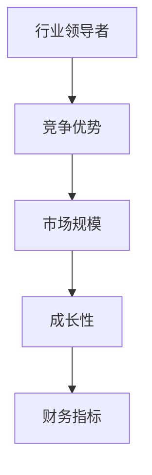
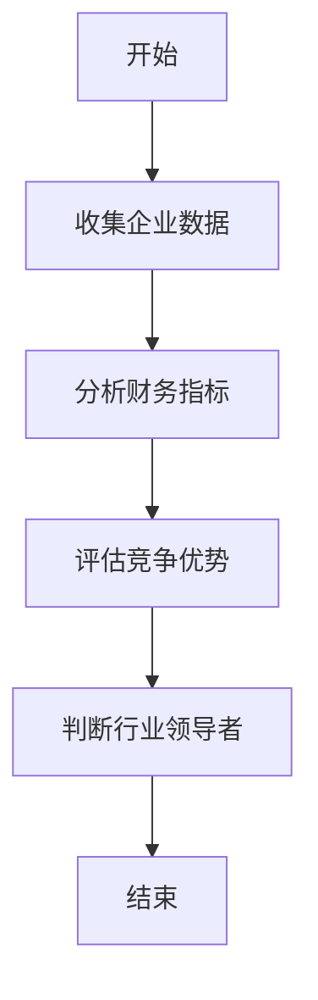
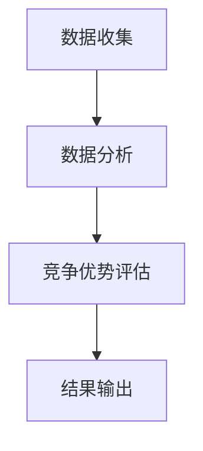

                 


# 菲利普·费雪的行业领导者识别技巧

> 关键词：菲利普·费雪，行业领导者，投资策略，多因素分析模型，成长股投资

> 摘要：本文详细介绍了菲利普·费雪的行业领导者识别技巧，探讨了其核心概念、算法原理、系统架构及实际应用。通过对比分析、案例研究和代码实现，深入剖析了菲利普·费雪方法的优势与局限，并提供了实际投资中的最佳实践建议。

---

# 第一部分：背景介绍

## 第1章：问题背景

### 1.1 投资者面临的挑战
在当今复杂的金融市场中，投资者面临着诸多挑战，包括市场波动、信息不对称、企业业绩不稳定等。识别行业领导者是投资者实现长期收益的关键。

### 1.2 行业领导者的定义与重要性
行业领导者是指在特定行业中占据主导地位，能够持续创造超额收益的企业。这类企业在市场中具有强大的竞争优势，是成长型投资的理想目标。

### 1.3 菲利普·费雪的贡献
菲利普·费雪是成长投资的鼻祖，他提出的多因素分析模型为识别行业领导者提供了系统的方法。他的理念强调企业成长性和竞争优势，对投资界产生了深远影响。

---

## 第2章：核心概念与联系

### 2.1 核心概念原理
菲利普·费雪的多因素分析模型基于以下原则：
- 企业具有可持续的竞争优势。
- 企业具备较高的成长性。
- 企业估值合理。

### 2.2 概念属性对比表格
以下是行业领导者与普通企业的对比：

| 特性            | 行业领导者            | 普通企业            |
|-----------------|----------------------|----------------------|
| 市场地位         | 市场占有率高          | 市场占有率低          |
| 盈利能力         | 净利润率高            | 净利润率一般          |
| 竞争优势         | 独特的核心竞争力      | 竞争优势不明显        |
| 估值             | 估值合理             | 估值可能过高或过低    |

### 2.3 ER实体关系图



---

## 第3章：算法原理讲解

### 3.1 多因素分析模型
菲利普·费雪的多因素分析模型通过以下步骤识别行业领导者：
1. **收集企业数据**：包括财务数据和市场数据。
2. **分析财务指标**：如ROE、毛利率等。
3. **评估竞争优势**：考察企业的市场地位和创新能力。
4. **判断行业领导者**：综合各项指标，确定是否为行业领导者。

### 3.2 模型流程图



### 3.3 数学模型与公式

#### 3.3.1 复合年增长率（CAGR）
$$
CAGR = \frac{终值}{初始值}^{1/n} - 1
$$

#### 3.3.2 市盈率（P/E比率）
$$
P/E = \frac{股价}{每股收益}
$$

### 3.4 实例分析
以苹果公司为例：
- **CAGR**：假设过去5年的收入增长率为15%，则CAGR为15%。
- **P/E比率**：假设当前股价为100，每股收益为10，则P/E=10。

---

## 第4章：系统分析与架构设计方案

### 4.1 问题场景
投资者需要快速识别行业领导者，以优化投资组合。

### 4.2 系统功能设计
- 数据收集模块：获取企业财务数据。
- 数据分析模块：计算财务指标。
- 竞争优势评估模块：评估企业市场地位。

### 4.3 系统架构图



---

## 第5章：项目实战

### 5.1 环境配置
- 安装Python和相关库（如Pandas、Matplotlib）。

### 5.2 核心代码实现

```python
import pandas as pd

# 数据收集
data = {
    '公司': ['A', 'B', 'C'],
    '收入': [100, 80, 90],
    '净利润': [20, 15, 18]
}

df = pd.DataFrame(data)

# 计算ROE
df['ROE'] = df['净利润'] / df['收入'] * 100

print(df)
```

### 5.3 案例分析
以某科技公司为例，计算其ROE，评估其是否为行业领导者。

---

## 第6章：最佳实践

### 6.1 小结
菲利普·费雪的多因素分析模型为识别行业领导者提供了系统的方法，但需要结合实际情况灵活应用。

### 6.2 注意事项
- 定期更新企业数据。
- 结合宏观经济因素进行综合判断。

### 6.3 拓展阅读
推荐阅读《投资学原理》和《股票作手回忆录》。

---

# 作者：AI天才研究院 & 禅与计算机程序设计艺术

---

以上是完整的文章结构，接下来将根据这个大纲逐步撰写详细内容。

