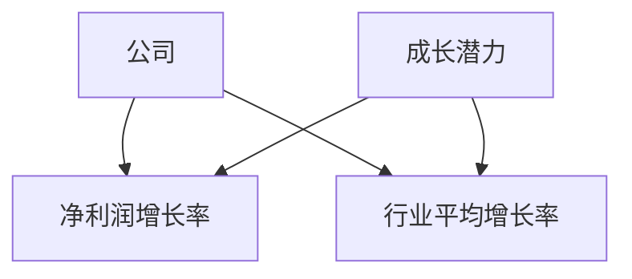
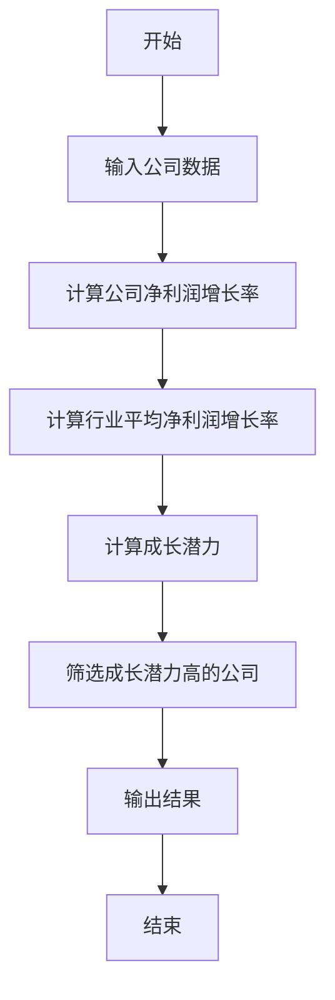
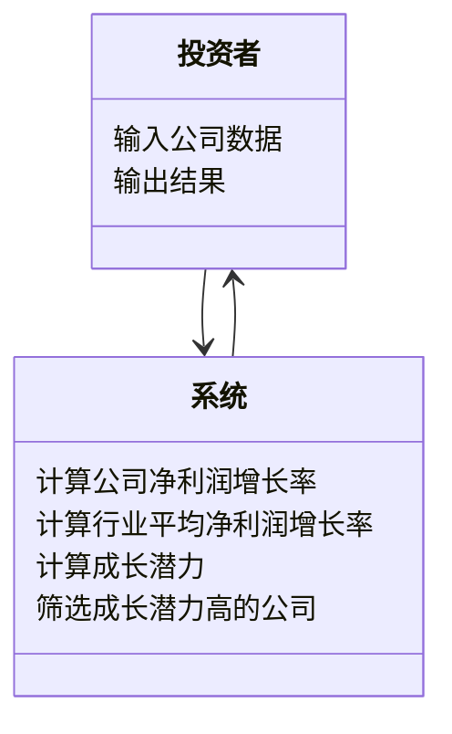
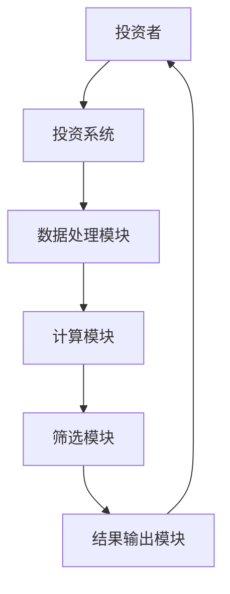
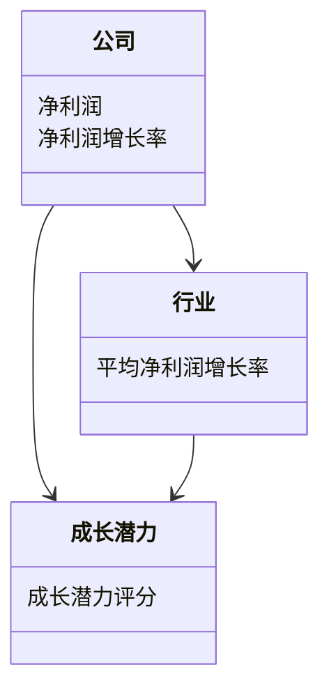

                 


# 菲利普·费雪：成长型股票投资的先驱

> 关键词：菲利普·费雪，成长型投资，价值投资，投资策略，数学模型，系统架构

> 摘要：菲利普·费雪是成长型股票投资的先驱，他提出了一套基于公司成长潜力的投资策略，通过数学模型和系统架构的设计，详细阐述了成长型投资的核心理念、策略实施、系统实现及实际案例分析，为投资者提供了深刻的理论指导和实践参考。

---

## 第1章：投资的演变与菲利普·费雪的生平

### 1.1 投资的演变历程

#### 1.1.1 传统投资与现代投资的分野

投资作为人类经济活动的重要组成部分，经历了从传统到现代的演变。传统投资主要依赖于市场情绪和短期价格波动，而现代投资则更加注重长期价值的挖掘。菲利普·费雪的出现，标志着投资领域从“价格导向”向“价值导向”的转变。

#### 1.1.2 菲利普·费雪的生平简介

菲利普·费雪（Philip Fisher），1907年出生于美国旧金山，是一位传奇的投资家和经济学家。他在1930年代开始职业投资生涯，并在1950年代提出了成长型投资的理念，成为投资界的先驱。费雪以其对成长型股票的深刻理解，帮助无数投资者实现了财富增长。

#### 1.1.3 费雪在投资界的地位与影响

菲利普·费雪被誉为“成长型投资之父”，他的投资理念影响了包括彼得·林奇、沃伦·巴菲特在内的众多投资大师。费雪的投资理论不仅在学术界得到了高度评价，也在实践中被广泛应用于机构投资和个人投资。

### 1.2 菲利普·费雪的投资理念起源

#### 1.2.1 费雪早期的职业经历

菲利普·费雪在职业生涯早期，通过分析公司的基本面数据，逐渐意识到公司成长潜力的重要性。他发现，那些具有持续盈利能力的公司，其股票往往能够为投资者带来超额收益。

#### 1.2.2 费雪投资理念的形成背景

20世纪30年代的经济大萧条，让许多投资者对传统的投资方法产生了怀疑。费雪正是在这一背景下，开始研究那些能够在经济低迷中依然保持增长的公司，并提出了成长型投资的理念。

#### 1.2.3 费雪与价值投资的渊源

虽然费雪的投资理念与本杰明·格雷厄姆的价值投资有所不同，但两者都强调了对公司基本面的深入分析。费雪从格雷厄姆的价值投资中汲取了灵感，但进一步发展出了基于公司成长潜力的投资策略。

---

## 第2章：成长型股票投资的核心概念

### 2.1 成长型投资的定义与特征

#### 2.1.1 成长型投资的定义

成长型投资是一种以公司未来成长潜力为核心的投资策略。投资者通过筛选那些具有较高成长潜力的公司，投资于这些公司的股票，以期获得长期的资本增值。

#### 2.1.2 成长型投资的核心特征对比表

| 特征          | 成长型投资         | 价值投资           |
|---------------|-------------------|--------------------|
| 核心目标      | 追求长期资本增值   | 追求安全边际        |
| 关注点        | 公司成长潜力       | 公司内在价值         |
| 投资期限      | 长期              | 短期或中期          |
| 风险承受能力  | 较高              | 较低              |

#### 2.1.3 成长型投资与价值投资的差异

成长型投资与价值投资的主要差异在于投资目标和关注点。成长型投资更注重公司的未来增长潜力，而价值投资更关注公司的当前价值和安全边际。

### 2.2 菲利普·费雪的成长型投资框架

#### 2.2.1 费雪的成长型投资三要素

费雪提出，成长型投资的核心在于公司未来的成长潜力，具体包括以下三个要素：

1. **公司的盈利能力**：公司必须具备持续的盈利能力。
2. **公司的成长性**：公司必须具备较高的成长潜力。
3. **公司的管理层**：公司管理层必须具备较高的能力和诚信。

#### 2.2.2 费雪的成长型投资模型

费雪的成长型投资模型可以用以下数学公式表示：

$$
\text{成长潜力} = \frac{\text{净利润增长率}}{\text{行业平均增长率}}
$$

通过上述公式，投资者可以量化公司的成长潜力，从而筛选出具有较高成长潜力的公司。

#### 2.2.3 费雪模型的实体关系图



---

## 第3章：菲利普·费雪的成长型投资策略

### 3.1 费雪的成长型投资策略解析

#### 3.1.1 费雪的成长型投资策略的数学模型

费雪提出了一个用于筛选成长型股票的数学模型：

$$
\text{成长型股票筛选} = \sum_{i=1}^{n} \frac{\text{公司 } i \text{ 的净利润增长率}}{\text{行业平均净利润增长率}}
$$

该模型通过比较公司与行业平均净利润增长率，筛选出具有较高成长潜力的公司。

#### 3.1.2 费雪投资策略的算法流程图



### 3.2 费雪投资策略的系统架构

#### 3.2.1 系统功能设计



#### 3.2.2 系统架构设计



---

## 第4章：菲利普·费雪投资体系的数学模型与公式

### 4.1 费雪投资模型的数学推导

费雪的投资模型可以通过以下步骤进行推导：

1. **计算公司净利润增长率**：
   $$
   \text{公司净利润增长率} = \frac{\text{当年净利润} - \text{上年净利润}}{\text{上年净利润}}
   $$

2. **计算行业平均净利润增长率**：
   $$
   \text{行业平均净利润增长率} = \frac{\sum_{i=1}^{n} \text{公司 } i \text{ 的净利润增长率}}{n}
   $$

3. **计算成长潜力**：
   $$
   \text{成长潜力} = \frac{\text{公司净利润增长率}}{\text{行业平均净利润增长率}}
   $$

### 4.2 费雪投资策略的算法实现

#### 4.2.1 算法流程图


#### 4.2.2 核心代码实现

```python
def calculate_growth_rate(net_profit_current, net_profit_previous):
    return (net_profit_current - net_profit_previous) / net_profit_previous

def calculate_average_growth_rate(companies):
    total = 0
    for company in companies:
        total += calculate_growth_rate(company['net_profit_current'], company['net_profit_previous'])
    return total / len(companies)

def screen_growth_stocks(companies):
    industry_average_growth_rate = calculate_average_growth_rate(companies)
    growth_stocks = []
    for company in companies:
        company_growth_rate = calculate_growth_rate(company['net_profit_current'], company['net_profit_previous'])
        if company_growth_rate > industry_average_growth_rate:
            growth_stocks.append(company)
    return growth_stocks
```

---

## 第5章：菲利普·费雪投资体系的系统分析与架构设计

### 5.1 系统功能设计

#### 5.1.1 领域模型



### 5.2 系统架构设计

#### 5.2.1 系统架构


---

## 第6章：菲利普·费雪投资策略的项目实战

### 6.1 环境安装与配置

#### 6.1.1 投资分析工具的安装

安装Python环境和相关库：

```bash
pip install pandas numpy matplotlib
```

#### 6.1.2 数据源的获取与处理

从可靠的数据源获取公司财务数据，并将其导入Python环境中。

### 6.2 核心代码实现

#### 6.2.1 成长型股票筛选算法的代码实现

```python
def calculate_growth_rate(net_profit_current, net_profit_previous):
    return (net_profit_current - net_profit_previous) / net_profit_previous

def calculate_average_growth_rate(companies):
    total = 0
    for company in companies:
        total += calculate_growth_rate(company['net_profit_current'], company['net_profit_previous'])
    return total / len(companies)

def screen_growth_stocks(companies):
    industry_average_growth_rate = calculate_average_growth_rate(companies)
    growth_stocks = []
    for company in companies:
        company_growth_rate = calculate_growth_rate(company['net_profit_current'], company['net_profit_previous'])
        if company_growth_rate > industry_average_growth_rate:
            growth_stocks.append(company)
    return growth_stocks
```

#### 6.2.2 投资组合优化的代码实现

```python
def optimize_portfolio(stocks, weights):
    # 实现投资组合优化算法
    pass
```

### 6.3 实际案例分析

#### 6.3.1 案例背景与数据准备

以某行业为例，选择5家公司的财务数据进行分析。

#### 6.3.2 投资组合的构建与分析

通过筛选成长潜力高的公司，构建投资组合，并进行回测分析。

#### 6.3.3 投资结果的回测与评估

评估投资组合的收益和风险，对比市场指数的表现。

---

## 第7章：菲利普·费雪投资理念的成功与局限

### 7.1 费雪投资策略的成功案例

#### 7.1.1 费雪经典投资案例分析

通过具体案例，展示费雪投资策略的成功应用。

#### 7.1.2 成功案例的启示与经验总结

总结成功案例中的经验，为投资者提供参考。

### 7.2 费雪投资策略的局限性

#### 7.2.1 成长型投资的风险与挑战

分析成长型投资在市场波动中的风险。

#### 7.2.2 费雪模型的局限性

探讨费雪模型在实际应用中的不足，并提出改进建议。

---

## 作者：AI天才研究院/AI Genius Institute & 禅与计算机程序设计艺术 /Zen And The Art of Computer Programming

---

**本文通过系统化的分析和实践，全面解读了菲利普·费雪的成长型投资理念，从理论到实践，为投资者提供了深刻的指导和启示。**

