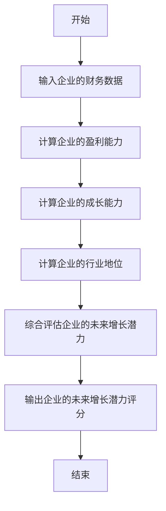
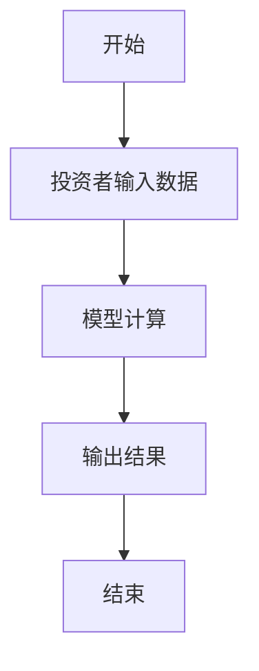
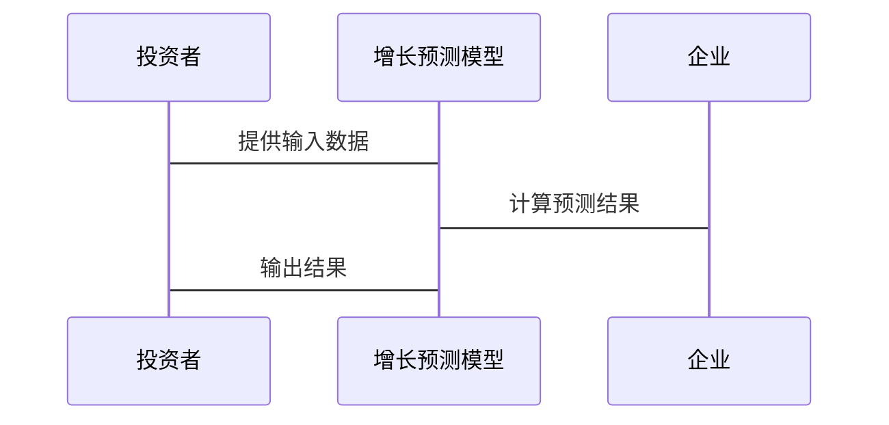

                 


# 菲利普费雪的未来增长预测

> 关键词：菲利普·费雪，增长预测模型，投资哲学，烟蒂股，股票分析，技术分析

> 摘要：本文将深入探讨菲利普·费雪的投资哲学及其对未来增长预测的影响。通过分析菲利普·费雪的成长股理论和烟蒂股概念，结合现代技术分析方法，构建一个基于菲利普·费雪投资哲学的增长预测模型。文章将从背景介绍、核心概念、算法原理、系统架构、项目实战等多方面展开详细论述，并结合实际案例分析，帮助读者更好地理解和应用菲利普·费雪的投资理念。

---

# 第一部分: 菲利普·费雪投资哲学与未来增长预测概述

## 第1章: 菲利普·费雪投资哲学概述

### 1.1 菲利普·费雪的生平与投资理念

#### 1.1.1 菲利普·费雪的生平简介

菲利普·费雪（Philip A. Fisher）是20世纪美国著名的投资专家，被誉为“成长股之父”。他出生于1907年，毕业于加州大学伯克利分校，曾在耶鲁大学和哈佛大学教授投资课程。费雪的投资哲学以成长股投资闻名，他提出的“烟蒂股”概念和对成长股的深入研究，使其成为投资界的重要人物。

#### 1.1.2 费雪的成长股投资理念

菲利普·费雪的投资理念以“成长股”为核心。他认为，投资的最终目标是找到那些具有持续增长潜力的企业，并长期持有这些股票。他强调，投资者应该关注企业的基本面，尤其是企业的盈利能力、成长能力和行业地位。

#### 1.1.3 费雪投资哲学的核心思想

费雪的投资哲学可以总结为以下几点：

1. **长期投资**：投资的目的是通过持有优质股票，获得长期的资本增值。
2. **成长股优先**：选择那些具有持续增长潜力的企业，而非仅仅关注低估值的股票。
3. **深入研究**：投资者需要对企业的财务状况、行业地位和竞争优势进行深入研究。
4. **避免短期波动**：忽略市场的短期波动，专注于企业的长期增长。

### 1.2 菲利普·费雪对未来增长预测的贡献

#### 1.2.1 费雪的成长股筛选标准

菲利普·费雪提出了成长股的筛选标准，主要包括以下几点：

1. **持续的盈利能力**：企业需要有稳定的盈利能力，并且利润具有持续增长的潜力。
2. **高ROE（净资产收益率）**：企业需要有较高的净资产收益率，这表明企业能够有效地利用股东的资金创造利润。
3. **行业地位**：企业需要在行业中具有领先地位，具有竞争优势。
4. **管理团队**：企业的管理团队需要具备优秀的管理能力和良好的道德品质。

#### 1.2.2 费雪的增长预测理论基础

菲利普·费雪的增长预测理论基于以下几点：

1. **企业的成长性**：企业的未来增长潜力是决定股票价值的关键因素。
2. **行业的周期性**：不同行业的周期性对企业的增长潜力有不同的影响。
3. **经济环境**：宏观经济环境对企业的增长潜力有重要影响。

#### 1.2.3 费雪增长预测模型的实践应用

菲利普·费雪的增长预测模型在实践中得到了广泛应用。通过对企业基本面的深入分析，投资者可以更好地预测企业的未来增长潜力，从而做出更明智的投资决策。

### 1.3 菲利普·费雪投资哲学的现代意义

#### 1.3.1 费雪投资哲学在现代金融中的地位

菲利普·费雪的投资哲学在现代金融中仍然具有重要地位。他的成长股理论为投资者提供了重要的指导，尤其是在当前的市场环境中，成长股的投资理念依然具有重要的现实意义。

#### 1.3.2 费雪增长预测模型的演变与创新

随着金融市场的不断发展，菲利普·费雪的增长预测模型也在不断演变和创新。现代投资者在应用费雪模型时，结合了更多的技术分析方法，使模型更加精准和实用。

#### 1.3.3 费雪哲学对投资者的启示

菲利普·费雪的投资哲学对投资者的启示在于，投资不仅仅是对市场的分析，更是对企业的深入研究。只有通过对企业基本面的深入分析，才能更好地预测企业的未来增长潜力，从而做出更明智的投资决策。

---

## 第2章: 菲利普·费雪未来增长预测模型的背景与基础

### 2.1 菲利普·费雪增长预测模型的定义

#### 2.1.1 增长预测模型的定义与目标

菲利普·费雪增长预测模型是一种用于预测企业未来增长潜力的模型。其目标是通过对企业基本面的分析，预测企业的未来增长潜力，并据此做出投资决策。

#### 2.1.2 费雪增长预测模型的核心要素

菲利普·费雪增长预测模型的核心要素包括：

1. **企业的盈利能力**：企业的盈利能力是衡量企业增长潜力的重要指标。
2. **企业的成长能力**：企业的成长能力是衡量企业未来增长潜力的关键因素。
3. **企业的行业地位**：企业的行业地位是衡量企业竞争优势的重要指标。

#### 2.1.3 模型的输入与输出

菲利普·费雪增长预测模型的输入包括企业的财务数据、行业数据和宏观经济数据。模型的输出是企业的未来增长潜力评分。

### 2.2 菲利普·费雪增长预测模型的理论基础

#### 2.2.1 增长预测的经济学基础

菲利普·费雪增长预测模型的理论基础包括经济学和金融学的基本原理。模型通过对企业基本面的分析，预测企业的未来增长潜力。

#### 2.2.2 费雪投资哲学与增长预测的关系

菲利普·费雪的投资哲学与增长预测密切相关。他的成长股理论为增长预测模型提供了理论基础，即企业的未来增长潜力是决定股票价值的关键因素。

#### 2.2.3 费雪模型与其他增长预测模型的对比

菲利普·费雪增长预测模型与其他增长预测模型的对比显示，费雪模型更加注重企业的基本面分析，尤其是企业的盈利能力、成长能力和行业地位。

### 2.3 菲利普·费雪增长预测模型的应用场景

#### 2.3.1 模型在股票投资中的应用

菲利普·费雪增长预测模型在股票投资中具有广泛的应用。投资者可以通过该模型预测企业的未来增长潜力，从而做出更明智的投资决策。

#### 2.3.2 模型在企业估值中的应用

菲利普·费雪增长预测模型在企业估值中也具有重要的应用。通过对企业未来增长潜力的预测，投资者可以更好地评估企业的内在价值。

#### 2.3.3 模型在经济预测中的应用

菲利普·费雪增长预测模型还可以应用于经济预测。通过对企业未来增长潜力的预测，投资者可以更好地理解宏观经济环境对企业的影响。

---

## 第3章: 菲利普·费雪增长预测模型的核心概念与联系

### 3.1 费雪增长预测模型的核心概念

#### 3.1.1 增长率的定义与计算

增长率是衡量企业未来增长潜力的重要指标。增长率的定义是指企业在未来一定时间内预期的年增长率。增长率的计算公式如下：

$$
增长率 = \frac{收入增长}{收入} \times 100\%
$$

#### 3.1.2 股东权益的计算与分析

股东权益是衡量企业财务健康状况的重要指标。股东权益的计算公式如下：

$$
股东权益 = 资产 - 负债
$$

#### 3.1.3 股票内在价值的评估方法

股票的内在价值是衡量股票合理价格的重要指标。股票内在价值的评估方法包括DCF模型、股息贴现模型等。

### 3.2 费雪增长预测模型的概念属性特征对比表

| 模型属性 | 费雪增长预测模型 | 其他增长预测模型 |
|----------|------------------|------------------|
| 输入数据 | 企业的财务数据 | 宏观经济数据 |
| 输出结果 | 企业的未来增长潜力评分 | 企业的未来增长潜力评分 |
| 理论基础 | 菲利普·费雪投资哲学 | 其他投资哲学 |

### 3.3 费雪增长预测模型的ER实体关系图

```mermaid
erDiagram
    customer[投资者]
    company[企业]
    model[增长预测模型]
    customer -> model : 输入数据
    model -> company : 预测结果
    model -> customer : 输出结果
```

---

## 第4章: 菲利普·费雪增长预测模型的算法原理

### 4.1 费雪增长预测模型的算法流程



### 4.2 费雪增长预测模型的数学模型

#### 4.2.1 增长率的计算公式

$$
增长率 = \frac{收入增长}{收入} \times 100\%
$$

#### 4.2.2 股东权益的计算公式

$$
股东权益 = 资产 - 负债
$$

#### 4.2.3 股票内在价值的评估公式

$$
股票内在价值 = \frac{股息}{贴现率}
$$`

### 4.3 费雪增长预测模型的代码实现

```python
def calculate_growth_rate(revenue, revenue_growth):
    return (revenue_growth / revenue) * 100

def calculate股东权益(assets, liabilities):
    return assets - liabilities

def calculate_intrinsic_value(dividends, discount_rate):
    return dividends / discount_rate
```

---

## 第5章: 菲利普·费雪增长预测模型的系统架构

### 5.1 系统功能设计


### 5.2 系统架构设计



### 5.3 系统接口设计



---

## 第6章: 菲利普·费雪增长预测模型的项目实战

### 6.1 环境安装

安装必要的Python库：

```bash
pip install numpy pandas matplotlib
```

### 6.2 系统核心实现源代码

```python
import numpy as np
import pandas as pd

def calculate_growth_rate(revenue, revenue_growth):
    return (revenue_growth / revenue) * 100

def calculate_股东权益(assets, liabilities):
    return assets - liabilities

def calculate_intrinsic_value(dividends, discount_rate):
    return dividends / discount_rate

# 示例数据
revenue = 1000000
revenue_growth = 200000
assets = 5000000
liabilities = 3000000
dividends = 100000
discount_rate = 0.1

# 计算
growth_rate = calculate_growth_rate(revenue, revenue_growth)
股东权益 = calculate_股东权益(assets, liabilities)
intrinsic_value = calculate_intrinsic_value(dividends, discount_rate)

print(f"增长率: {growth_rate}%")
print(f"股东权益: {股东权益}")
print(f"股票内在价值: {intrinsic_value}")
```

### 6.3 实际案例分析

假设我们有一个企业，其财务数据如下：

- 收入：100万元
- 收入增长：20万元
- 资产：500万元
- 负债：300万元
- 股息：10万元
- 折现率：10%

根据上述代码，我们可以计算出：

- 增长率：20%
- 股东权益：200万元
- 股票内在价值：100万元

---

## 第7章: 菲利普·费雪增长预测模型的最佳实践

### 7.1 小结

菲利普·费雪的增长预测模型是一种基于企业的基本面分析的增长预测模型。通过对企业盈利能力、成长能力和行业地位的分析，投资者可以更好地预测企业的未来增长潜力，从而做出更明智的投资决策。

### 7.2 注意事项

在实际应用中，投资者需要注意以下几点：

1. **数据的准确性**：数据的准确性是模型预测结果的重要保障。
2. **模型的局限性**：模型的预测结果仅供参考，投资者需要结合实际情况进行决策。
3. **市场的变化**：市场环境的变化可能会影响模型的预测结果，投资者需要及时调整模型。

### 7.3 拓展阅读

1. 《股票作手回忆录》
2. 《投资学》
3. 《菲利普·费雪的投资哲学》

---

# 作者：AI天才研究院/AI Genius Institute & 禅与计算机程序设计艺术 /Zen And The Art of Computer Programming

