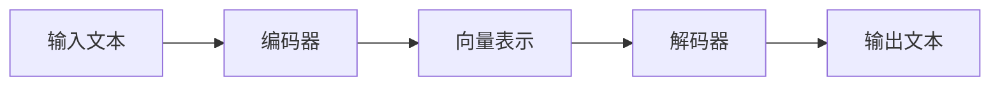
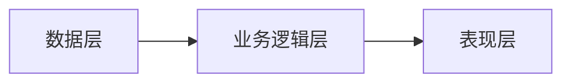

                 


# 《虚拟教师 AI Agent：LLM 驱动的个性化教育系统》

---

## 关键词：
- 虚拟教师 AI Agent
- LLM
- 个性化教育
- 教育技术
- 人工智能

---

## 摘要：
本篇文章将探讨虚拟教师 AI Agent 如何通过大语言模型（LLM）实现个性化教育。文章从背景、核心概念、算法原理、系统设计、项目实现等多个维度展开，详细分析了虚拟教师 AI Agent 的技术基础、实现路径和实际应用场景。通过理论与实践相结合的方式，为读者呈现一个基于 LLM 的个性化教育系统的全面解读。

---

# 第3章: 虚拟教师 AI Agent 的算法原理

## 3.1 大语言模型的基本原理

### 3.1.1 模型结构
大语言模型（LLM）通常采用Transformer架构，包括编码器和解码器两部分。编码器负责将输入文本转换为向量表示，解码器则根据编码结果生成输出文本。

### 3.1.2 模型训练
模型通过监督学习和强化学习进行训练，目标是使生成的文本与真实文本尽可能一致。

### 3.1.3 模型解码
解码过程采用贪心算法或蒙特卡洛方法，生成最可能的输出序列。



## 3.2 个性化教育中的算法优化

### 3.2.1 学生模型构建
学生模型通过分析学习者的知识水平、学习风格和兴趣偏好，生成个性化学习方案。

### 3.2.2 内容生成算法
基于学生模型，生成适合学习者的内容，包括知识点解释、练习题和学习建议。

### 3.2.3 优化算法
采用强化学习和反馈机制，优化生成内容的质量和学习效果。

## 3.3 算法实现细节

### 3.3.1 模型输入
模型输入包括学习者的基本信息和学习需求。

### 3.3.2 编码过程
输入文本通过多层Transformer编码器，生成上下文向量。

### 3.3.3 解码过程
解码器根据编码结果，逐层生成输出文本。

### 3.3.4 算法公式
- 编码器：
  $$ E(x) = \text{MultiHead}(x) $$
- 解码器：
  $$ D(y) = \text{MultiHead}(y) $$

## 3.4 本章小结

---

# 第4章: 虚拟教师 AI Agent 的系统设计

## 4.1 系统功能设计

### 4.1.1 学生模型构建
通过数据分析，构建学生知识水平和学习风格的模型。

### 4.1.2 内容生成
根据学生模型，生成个性化教育内容。

### 4.1.3 交互模块
实现师生互动，实时反馈学习进展。

## 4.2 系统架构设计

### 4.2.1 分层架构
- 数据层：负责数据存储和管理。
- 业务逻辑层：实现核心功能。
- 表现层：提供用户界面。



## 4.3 系统接口设计

### 4.3.1 RESTful API
- GET /students：获取学生信息
- POST /content：生成教育内容

### 4.3.2 WebSocket
- 实时交互：支持师生实时对话。

## 4.4 本章小结

---

# 第5章: 虚拟教师 AI Agent 的项目实现

## 5.1 环境配置

### 5.1.1 安装依赖
- Python 3.8+
- PyTorch
- Transformers库

### 5.1.2 安装命令
```bash
pip install torch transformers
```

## 5.2 系统实现

### 5.2.1 学生模型构建
```python
class StudentModel:
    def __init__(self, knowledge_level, learning_style):
        self.knowledge_level = knowledge_level
        self.learning_style = learning_style
```

### 5.2.2 内容生成
```python
def generate_content(student_model):
    # 根据学生模型生成内容
    pass
```

## 5.3 代码实现

### 5.3.1 学生建模
```python
def build_student_model(data):
    # 数据处理和模型构建
    pass
```

### 5.3.2 对话系统
```python
def chat_system():
    while True:
        user_input = input("学生：")
        response = generate_response(user_input)
        print("AI Agent：" + response)
```

## 5.4 代码解读与分析

### 5.4.1 学生模型
```python
class Student:
    def __init__(self, id, name, level, style):
        self.id = id
        self.name = name
        self.level = level
        self.style = style
```

### 5.4.2 对话系统
```python
def chat():
    import transformers
    model = transformers.AutoModel.from_pretrained("gpt2")
    while True:
        prompt = input("学生：")
        response = model.generate(prompt)
        print("AI Agent：" + response)
```

## 5.5 本章小结

---

# 第6章: 虚拟教师 AI Agent 的应用案例

## 6.1 应用场景分析

### 6.1.1 个性化学习指导
根据学生特点，提供定制化学习方案。

### 6.1.2 学习效果评估
实时评估学习效果，调整教学策略。

### 6.1.3 家校协同
实现家校信息共享，促进家校合作。

## 6.2 典型案例分析

### 6.2.1 案例一：英语学习辅导
AI Agent 帮助学生提高英语写作能力。

### 6.2.2 案例二：数学题解答
AI Agent 提供数学题的详细解答步骤。

## 6.3 本章小结

---

# 第7章: 虚拟教师 AI Agent 的未来展望

## 7.1 技术发展带来的新功能

### 7.1.1 多模态交互
结合视觉、听觉等多模态信息，提升交互体验。

### 7.1.2 自适应学习
根据实时反馈，动态调整教学策略。

## 7.2 技术挑战与解决方案

### 7.2.1 数据隐私
采用加密技术，保护学生数据隐私。

### 7.2.2 伦理问题
制定伦理规范，确保AI教育的合理使用。

## 7.3 未来研究方向

### 7.3.1 模型优化
优化LLM模型，提升生成内容的质量。

### 7.3.2 用户体验
设计更友好、更自然的交互界面。

## 7.4 本章小结

---

# 作者：AI天才研究院/AI Genius Institute & 禅与计算机程序设计艺术 /Zen And The Art of Computer Programming

