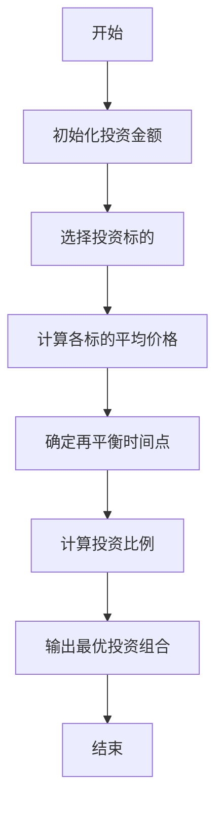
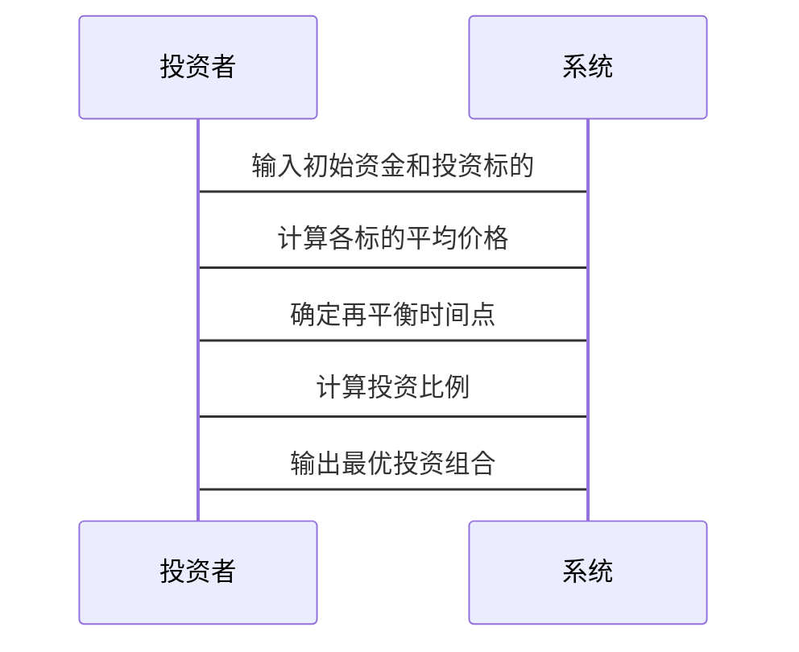

                 


# 詹姆斯·蒙蒂尔的价值平均策略：纪律性投资方法

## 关键词：价值平均策略、纪律性投资、投资策略、数学模型、系统架构、项目实战

## 摘要：本文深入探讨了詹姆斯·蒙蒂尔的价值平均策略，分析其核心原理、算法实现、系统架构设计，并通过实际案例展示其应用，帮助投资者理解如何通过纪律性和长期投资实现稳健收益。

---

# 第一部分: 价值平均策略的背景与概述

## 第1章: 价值平均策略的背景与概述

### 1.1 投资策略的演变与价值平均策略的起源

#### 1.1.1 传统投资策略的局限性

传统投资策略，如单纯追求高收益或频繁交易，往往忽略了市场波动和投资纪律的重要性。投资者容易受到市场情绪的影响，导致决策失误。

#### 1.1.2 价值平均策略的提出背景

价值平均策略由詹姆斯·蒙蒂尔提出，旨在通过纪律性和分散化投资，降低市场波动带来的风险，实现长期稳定的收益。

#### 1.1.3 纪律性投资方法的核心思想

价值平均策略强调纪律性投资，通过定期定额投资，分散投资标的，避免情绪化决策，从而实现长期稳健的投资回报。

### 1.2 价值平均策略的基本概念与特点

#### 1.2.1 价值平均策略的定义

价值平均策略是一种投资方法，通过计算投资标的的平均价格，确定投资金额和比例，实现投资组合的优化。

#### 1.2.2 纪律性投资方法的特征

- 纪律性：定期定额投资，避免情绪化决策。
- 分散化：投资多个标的，降低风险。
- 长期性：注重长期收益，而非短期波动。

#### 1.2.3 价值平均策略与其它投资策略的对比

| 投资策略 | 核心思想 | 优点 | 缺点 |
|----------|----------|------|------|
| 价值平均策略 | 纪律性投资，分散化 | 稳定收益，风险低 | 需要长期坚持 |
| 股票选择策略 | 选择优质公司 | 高收益潜力 | 风险高 |
| 定期定额投资 | 分散投资 | 简单易行 | 需要市场判断 |

### 1.3 价值平均策略的应用场景与优势

#### 1.3.1 适合的投资者类型

- 初级投资者：适合那些缺乏市场分析能力的投资者。
- 风险厌恶型投资者：适合那些无法承受高风险的投资者。

#### 1.3.2 价值平均策略在不同市场环境下的表现

- 在牛市中，价值平均策略表现稳健，能够捕捉市场上涨趋势。
- 在熊市中，由于分散化投资，价值平均策略能够较好地抵御市场下跌风险。

#### 1.3.3 纪律性投资方法的优势

- 降低投资风险，避免重大损失。
- 通过分散化投资，提高收益稳定性。
- 帮助投资者克服情绪化决策，坚持长期投资。

### 1.4 本章小结

本章主要介绍了价值平均策略的背景、核心概念和特点，强调了纪律性投资的重要性，并分析了其在不同市场环境下的表现和优势。

---

## 第2章: 价值平均策略的核心原理

### 2.1 价值平均策略的数学模型

#### 2.1.1 投资组合的平均价格计算公式

$$ \text{平均价格} = \frac{\sum_{i=1}^{n} p_i}{n} $$

其中，\( p_i \) 是第 \( i \) 个投资标的当前价格，\( n \) 是投资标的数量。

#### 2.1.2 纪律性投资的再平衡机制

再平衡机制是价值平均策略的重要组成部分，通过定期调整投资比例，保持投资组合的最优状态。再平衡的频率可以根据市场波动和投资目标进行调整。

#### 2.1.3 价值平均策略的优化算法

优化算法的目标是在给定的约束条件下，找到最优的投资组合。通常，优化算法会考虑风险和收益的平衡，以最大化投资回报。

### 2.2 价值平均策略的核心要素

#### 2.2.1 投资标的的选择标准

选择投资标的时，需要考虑其历史表现、行业地位、财务状况等因素，以确保投资标的的稳定性和成长性。

#### 2.2.2 投资金额的分配比例

根据价值平均策略，每个投资标的的投资金额应与其平均价格成反比，以确保投资组合的分散化。

#### 2.2.3 投资时间的规划

长期投资是价值平均策略的核心，建议投资者选择定期定额投资的方式，避免频繁交易。

### 2.3 价值平均策略与其它投资策略的对比分析

#### 2.3.1 价值平均策略与均值-方差模型的对比

均值-方差模型是一种经典的资产配置方法，通过优化投资组合的收益和风险。价值平均策略则更注重纪律性和分散化投资。

#### 2.3.2 价值平均策略与现代投资组合理论的联系

现代投资组合理论强调分散化和风险控制，与价值平均策略的核心思想一致。

#### 2.3.3 价值平均策略与行为投资学的差异

行为投资学强调市场情绪和投资者心理，而价值平均策略则更注重纪律性和长期投资。

### 2.4 本章小结

本章详细讲解了价值平均策略的数学模型和核心要素，分析了其与其它投资策略的差异和联系，为后续的算法实现和系统架构设计奠定了基础。

---

## 第3章: 价值平均策略的算法实现与系统架构

### 3.1 价值平均策略的算法实现

#### 3.1.1 算法输入

- 初始投资金额
- 投资标的列表
- 投资时间周期

#### 3.1.2 算法输出

- 最优投资组合
- 再平衡时间点
- 投资金额分配比例

#### 3.1.3 算法步骤

1. 计算每个投资标的的平均价格
2. 根据平均价格计算投资比例
3. 确定再平衡时间点
4. 输出最优投资组合

（使用 mermaid 描述算法流程图）



#### 3.1.4 算法优化

为了提高算法效率，可以引入动态调整机制，根据市场波动实时优化投资组合。

### 3.2 价值平均策略的系统架构设计

#### 3.2.1 系统功能设计

- 投资标的管理
- 投资金额分配
- 再平衡管理
- 投资组合优化

（使用 mermaid 描述系统架构图）


#### 3.2.2 系统接口设计

- 输入接口：投资者输入初始资金、投资标的、时间周期
- 输出接口：最优投资组合、再平衡时间点、投资比例

#### 3.2.3 系统交互流程

1. 投资者输入初始资金和投资标的
2. 系统计算各标的平均价格
3. 系统确定再平衡时间点
4. 系统计算投资比例
5. 系统输出最优投资组合

（使用 mermaid 描述系统交互流程图）



---

## 第4章: 价值平均策略的项目实战

### 4.1 项目环境安装

#### 4.1.1 系统要求

- 操作系统：Windows/Mac/Linux
- 开发工具：Python 3.x、Jupyter Notebook
- 第三方库：pandas, numpy, matplotlib

#### 4.1.2 安装依赖

```bash
pip install pandas numpy matplotlib
```

### 4.2 系统核心实现源代码

#### 4.2.1 投资组合优化算法

```python
import pandas as pd
import numpy as np

def value_averaging_strategy(initial_amount, assets, period):
    # 计算各资产的平均价格
    average_prices = [np.mean(asset) for asset in assets]
    # 计算投资比例
    weights = [price / sum(average_prices) for price in average_prices]
    # 计算投资金额
    investment = [initial_amount * weight for weight in weights]
    return investment
```

#### 4.2.2 再平衡机制实现

```python
def rebalancing_logic(portfolio, current_prices, threshold=5%):
    rebalanced_portfolio = {}
    for asset in portfolio:
        if abs((current_prices[asset] / portfolio[asset]) - 1) > threshold:
            rebalanced_portfolio[asset] = portfolio[asset] * (current_prices[asset] / portfolio[asset])
        else:
            rebalanced_portfolio[asset] = portfolio[asset]
    return rebalanced_portfolio
```

### 4.3 代码应用解读与分析

#### 4.3.1 投资组合优化算法解读

上述代码通过计算各资产的平均价格，确定投资比例，实现投资组合的优化。投资比例与平均价格成反比，确保投资组合的分散化。

#### 4.3.2 再平衡机制实现分析

再平衡机制通过比较当前价格与目标价格的偏差，判断是否需要调整投资比例。当偏差超过设定阈值时，系统自动调整投资金额，保持投资组合的最优状态。

### 4.4 实际案例分析

#### 4.4.1 案例背景

假设投资者有10万元初始资金，选择3只股票A、B、C，投资时间周期为1年，再平衡阈值为5%。

#### 4.4.2 数据准备

股票A的历史价格：[10, 11, 12, 13, 14]
股票B的历史价格：[15, 16, 17, 18, 19]
股票C的历史价格：[20, 21, 22, 23, 24]

#### 4.4.3 投资组合优化

计算各股票的平均价格：
- 股票A平均价格：12
- 股票B平均价格：17
- 股票C平均价格：22

投资比例：
- 股票A：12 / (12 + 17 + 22) = 12/51 ≈ 23.53%
- 股票B：17/51 ≈ 33.33%
- 股票C：22/51 ≈ 43.14%

投资金额：
- 股票A：100000 * 0.2353 ≈ 23530元
- 股票B：100000 * 0.3333 ≈ 33330元
- 股票C：100000 * 0.4314 ≈ 43140元

#### 4.4.4 再平衡机制

假设在投资期间，股票A的价格波动较大，导致其平均价格偏离初始价格5%。系统将自动调整股票A的投资金额，以保持投资组合的最优状态。

### 4.5 项目小结

通过实际案例分析，我们可以看到价值平均策略在实际投资中的应用效果。通过定期定额投资和再平衡机制，投资者可以实现投资组合的优化，降低市场波动带来的风险。

---

## 第5章: 价值平均策略的最佳实践与注意事项

### 5.1 最佳实践

#### 5.1.1 确定投资目标和风险承受能力

在使用价值平均策略之前，投资者需要明确自己的投资目标和风险承受能力，选择适合自己的投资标的和时间周期。

#### 5.1.2 定期监控和调整投资组合

定期监控市场波动和投资标的的表现，根据需要调整投资组合，确保投资策略的有效性。

#### 5.1.3 长期坚持纪律性投资

纪律性是价值平均策略成功的关键，投资者需要坚持长期投资，避免情绪化决策。

### 5.2 小结

价值平均策略是一种简单有效的投资方法，通过纪律性和分散化投资，帮助投资者实现长期稳定的收益。在实际应用中，投资者需要根据自身情况调整策略，并定期监控和优化投资组合。

### 5.3 注意事项

- 风险提示：投资有风险，需谨慎决策。
- 市场波动：价值平均策略在市场剧烈波动时可能面临再平衡成本。
- 税务考虑：不同地区的税务政策可能影响投资收益。

### 5.4 拓展阅读

- 《投资学基础》
- 《价值投资的艺术》
- 《投资组合管理》

---

## 作者

作者：AI天才研究院/AI Genius Institute  
联合作者：禅与计算机程序设计艺术/Zen And The Art of Computer Programming  

---

感谢您的阅读！如需进一步了解价值平均策略或有任何问题，请随时联系。

