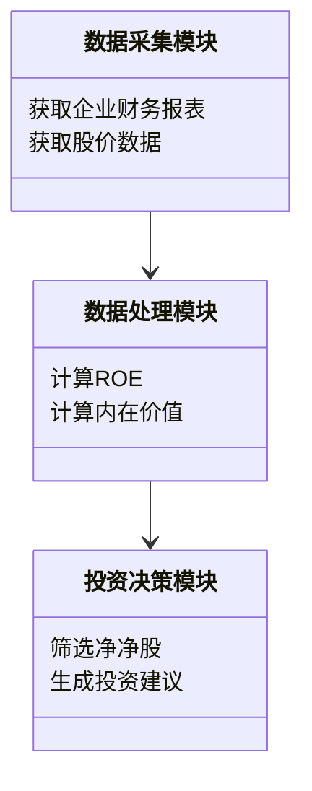
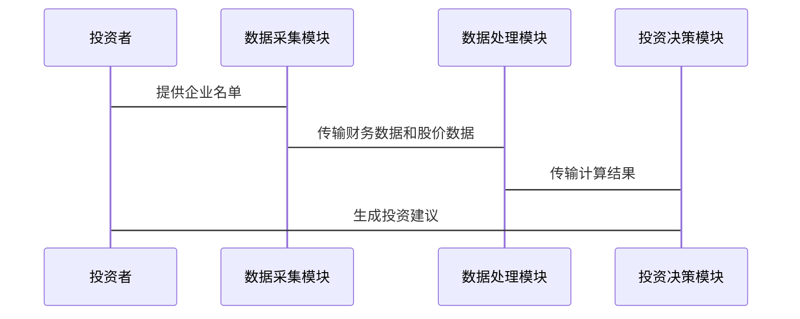

                 


# 净净股投资：回归格雷厄姆的根源

## 关键词：净净股投资，詹姆斯·蒙蒂尔，本杰明·格雷厄姆，价值投资，投资策略

## 摘要：  
净净股投资是一种基于价值投资的策略，源自本杰明·格雷厄姆的投资理论，由詹姆斯·蒙蒂尔进一步发展和完善。本文将深入探讨净净股投资的核心概念、数学模型、系统架构设计以及实际项目案例，帮助读者全面理解这一投资策略的原理和应用。

---

## 第一部分: 净净股投资的背景与基础

### 第1章: 净净股投资的起源与演变

#### 1.1 净净股投资的起源  
净净股投资的理论基础可以追溯到本杰明·格雷厄姆的价值投资理念。格雷厄姆强调以内在价值为核心，通过分析企业的财务报表来识别被低估的投资标的。詹姆斯·蒙蒂尔在继承格雷厄姆理论的基础上，进一步提出了“净净股”这一概念，即专注于投资那些净资产收益率（ROE）高且市场价格低于内在价值的企业。

#### 1.2 蒙蒂尔对净净股投资的贡献  
蒙蒂尔通过实证研究和对市场的深刻理解，将格雷厄姆的理论转化为一种可操作的投资策略。他提出，净净股投资的核心在于筛选那些具有高ROE、低市盈率和合理估值的企业，从而在长期获得超额收益。

#### 1.3 净净股投资与现代投资理论的联系  
净净股投资不仅是一种价值投资策略，还与现代投资组合理论（MPT）密切相关。通过筛选具有稳定回报和低波动性的企业，净净股投资能够帮助投资者构建一个风险可控、收益稳定的投资组合。

---

### 第2章: 净净股投资的核心概念

#### 2.1 净资产与净净股的定义  
- **净资产**：企业的总资产减去总负债，反映了企业的实际价值。  
- **净净股**：指那些市场价格低于其净资产价值的股票，即$P < V$，其中$P$是股价，$V$是每股净资产。

#### 2.2 净净股投资的核心要素  
- **内在价值**：企业未来现金流的现值，计算公式为：$$V = \sum_{t=1}^{n} \frac{CF_t}{(1+r)^t}$$，其中$CF_t$是第$t$年的现金流，$r$是折现率。  
- **净资产收益率（ROE）**：衡量企业盈利能力的重要指标，公式为：$$ROE = \frac{\text{净利润}}{\text{净资产}}$$。  
- **安全边际**：投资标的市场价格与内在价值之间的差额，即$安全边际 = V - P$。  

#### 2.3 净净股与普通股票的区别  
| 属性             | 净净股                   | 普通股票                  |
|------------------|--------------------------|---------------------------|
| 定价依据         | 主要基于净资产价值       | 主要基于市场供需           |
| 投资风险         | 较低（价值被低估）        | 较高（受市场情绪影响较大）  |
| 适用场景         | 稳定收益、长期持有       | 短期交易、市场波动较大      |

---

### 第3章: 净净股投资的数学模型与公式

#### 3.1 净资产收益率（ROE）的计算  
ROE是衡量企业盈利能力的核心指标，公式为：$$ROE = \frac{\text{净利润}}{\text{净资产}}$$。  
通过计算ROE，投资者可以筛选出那些盈利能力强且净资产收益率高的企业。

#### 3.2 内在价值的计算  
内在价值是企业未来现金流的现值，计算公式为：$$V = \sum_{t=1}^{n} \frac{CF_t}{(1+r)^t}$$。  
其中，$CF_t$是第$t$年的现金流，$r$是折现率，通常选取企业的加权平均资本成本（WACC）作为折现率。

#### 3.3 净净股筛选的条件  
- 市场价格低于内在价值：$$P < V$$  
- 净资产收益率高于行业平均水平：$$ROE > \text{行业平均ROE}$$  
- 企业具有稳定的盈利能力和良好的财务状况。

---

## 第二部分: 净净股投资的系统架构设计

### 第4章: 投资决策系统的构建

#### 4.1 系统功能需求分析  
- 数据采集：获取企业的财务报表、股价数据等。  
- 数据处理：计算ROE、内在价值等关键指标。  
- 投资决策：根据筛选条件，生成投资建议。  

#### 4.2 系统架构设计  
以下是系统架构的类图：  


#### 4.3 系统交互流程  
以下是系统交互的序列图：  


---

## 第三部分: 净净股投资的项目实战

### 第5章: 项目实战与案例分析

#### 5.1 环境安装与配置  
- 安装Python和相关库（如pandas、numpy）。  
- 获取企业财务数据和股价数据（可通过API或Excel文件获取）。

#### 5.2 核心代码实现  
以下是一个计算ROE和内在价值的Python代码示例：  

```python
import pandas as pd

# 假设df是企业财务数据，包含"净利润"和"净资产"列
df["ROE"] = df["净利润"] / df["净资产"]

# 假设cash_flows是企业未来五年的现金流
discount_rate = 0.1
DCF = cash_flows.sum() / (1 + discount_rate)**t
```

#### 5.3 实际案例分析  
以某企业为例，计算其ROE和内在价值，并判断是否符合净净股的筛选条件。通过分析，得出该企业的投资价值和潜在收益。

---

## 第四部分: 净净股投资的最佳实践与注意事项

### 第6章: 最佳实践与小结

#### 6.1 投资策略的优化  
- 定期调整投资组合，根据市场变化更新筛选条件。  
- 结合宏观经济指标，优化投资策略。  

#### 6.2 风险管理与控制  
- 设置止损点，避免重大损失。  
- 分散投资，降低单一标的的风险。  

#### 6.3 长期投资与短期波动的平衡  
- 净净股投资适合长期持有，需耐心等待价值回归。  
- 避免受短期市场波动影响，坚持投资策略。

---

## 作者：AI天才研究院 & 禅与计算机程序设计艺术

