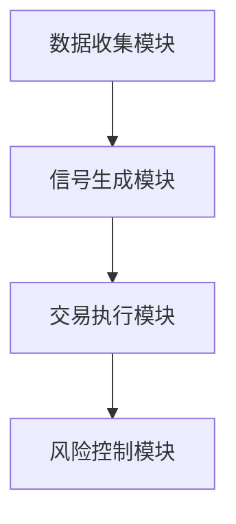

                 


# 詹姆斯·蒙蒂尔的市场异常现象研究

> 关键词：市场异常现象，统计套利，算法交易，市场微观结构，詹姆斯·蒙蒂尔

> 摘要：本文深入探讨了市场异常现象的定义、分类、成因及其在实际投资中的应用。通过分析詹姆斯·蒙蒂尔的研究成果，结合统计套利和算法交易的理论与实践，详细阐述了如何识别和利用市场异常现象。文章还介绍了系统设计与项目实战，帮助读者掌握市场异常现象的研究方法。

---

# 第一部分：市场异常现象概述

## 第1章：市场异常现象的定义与背景

### 1.1 有效市场假说与市场异常现象

#### 1.1.1 有效市场假说的提出与理论基础

有效市场假说（Efficient Market Hypothesis，EMH）是金融市场研究的核心理论之一，由尤金·法玛（Eugene Fama）于1970年提出。该假说认为，在一个有效市场中，资产价格已经反映了所有可获得的信息，因此投资者无法通过分析历史价格数据来获得超额收益。

#### 1.1.2 市场异常现象的定义与分类

市场异常现象是指资产价格在短期内偏离其内在价值的情况。根据蒙蒂尔的研究，这些异常现象可以分为以下几类：
- **动量效应（Momentum Effect）**：价格短期内表现出持续性，即昨日的高价格股票今天可能继续走高。
- **反转效应（Reversal Effect）**：价格短期内可能从高价向低价反转，即昨日的高价股票今天可能下跌。
- **小盘股效应（Small-Size Effect）**：小盘股在短期内可能表现出更高的收益。

#### 1.1.3 市场异常现象的研究意义与应用价值

研究市场异常现象有助于投资者发现潜在的套利机会，同时也能帮助监管机构识别市场操纵行为。蒙蒂尔的研究为统计套利和算法交易提供了理论基础。

---

## 第2章：市场异常现象的分类与特征

### 2.1 市场异常现象的分类

#### 2.1.1 按时间维度分类

- **短期异常现象**：通常持续时间为几天到几周，如动量效应和反转效应。
- **中期异常现象**：持续时间为几周到几个月，可能与市场情绪变化有关。
- **长期异常现象**：持续时间较长，可能与市场结构变化或政策调整有关。

#### 2.1.2 按市场参与主体分类

- **机构投资者异常现象**：由大型机构交易行为引发的市场波动。
- **散户投资者异常现象**：由个人投资者情绪变化引发的短期波动。

#### 2.1.3 按市场反应分类

- **价格异常现象**：价格在短时间内大幅波动。
- **成交量异常现象**：成交量突然放大或缩小。

### 2.2 不同类型市场异常现象的特征分析

#### 2.2.1 动量效应与反转效应

动量效应和反转效应是两类典型的价格异常现象。蒙蒂尔的研究表明，这两种效应在不同市场条件下表现不同，可以通过统计方法进行识别。

#### 2.2.2 小盘股效应与市场因子

小盘股效应是市场异常现象的一种，通常与市场因子（如市值、流动性）相关。蒙蒂尔通过回归分析发现，小盘股在短期内可能表现出更高的收益。

#### 2.2.3 事件驱动型异常现象

事件驱动型异常现象由特定事件引发，如公司并购、业绩发布等。这些事件可能引起股价的短期波动。

---

## 第3章：市场微观结构分析

### 3.1 市场微观结构的基本概念

市场微观结构研究市场的交易机制和参与者行为。主要包括订单簿分析、市场深度分析和流动性分析。

### 3.2 市场订单簿分析

订单簿记录了市场参与者当前的买入和卖出订单。通过分析订单簿，可以发现市场的买卖力量平衡。

### 3.3 市场流动性与深度分析

市场流动性是指资产在短时间内以合理价格买卖的能力。市场深度是衡量流动性的指标之一，通常用订单簿中的未成交订单总量表示。

### 3.4 市场微观结构与市场异常现象的关系

市场微观结构的变化可能引发市场异常现象。例如，订单簿中的大量买单可能导致股价短期上涨。

---

## 第4章：统计套利与算法交易

### 4.1 统计套利的基本概念

统计套利是通过分析市场数据，寻找资产价格的短期偏差，并利用这些偏差进行交易。蒙蒂尔的研究为统计套利提供了理论支持。

### 4.2 算法交易的策略设计

算法交易策略设计包括信号生成、交易执行和风险控制。常见的算法交易策略包括均值回归策略和动量策略。

### 4.3 统计套利的实现步骤

1. 数据收集：收集历史市场数据，包括价格和成交量。
2. 信号生成：通过统计模型生成交易信号。
3. 交易执行：根据信号执行交易。
4. 风险控制：通过止损和止盈控制风险。

---

## 第5章：系统设计与项目实战

### 5.1 系统设计

系统设计包括数据收集模块、信号生成模块、交易执行模块和风险控制模块。系统架构图如下：



### 5.2 项目实战

#### 5.2.1 环境搭建

安装必要的软件和库，如Python、Pandas、NumPy等。

#### 5.2.2 代码实现

以下是统计套利策略的Python代码示例：

```python
import pandas as pd
import numpy as np

# 数据预处理
data = pd.read_csv('market_data.csv')
data = data.dropna()

# 计算动量指标
data['momentum'] = data['close'].pct_change().rolling(5).mean()

# 生成交易信号
data['signal'] = np.where(data['momentum'] > 0, 1, -1)

# 执行交易
data['return'] = data['close'].pct_change()
data['cumulative_return'] = (data['return'] * data['signal']).cumsum()

print(data['cumulative_return'])
```

#### 5.2.3 实际案例分析

以某股票为例，分析其价格波动和交易信号。

---

## 第6章：高级主题

### 6.1 人工智能在市场异常现象中的应用

人工智能技术如机器学习可以用于市场异常现象的识别和预测。

### 6.2 市场操纵与高频交易的影响

市场操纵和高频交易可能导致市场异常现象的加剧。

---

## 第7章：总结与展望

### 7.1 总结

本文系统介绍了市场异常现象的定义、分类、成因及其在实际投资中的应用。通过分析詹姆斯·蒙蒂尔的研究成果，结合统计套利和算法交易的理论与实践，详细阐述了如何识别和利用市场异常现象。

### 7.2 展望

未来的研究可以进一步结合人工智能技术，探索市场异常现象的预测和控制方法。

---

# 作者：AI天才研究院/AI Genius Institute & 禅与计算机程序设计艺术 /Zen And The Art of Computer Programming

