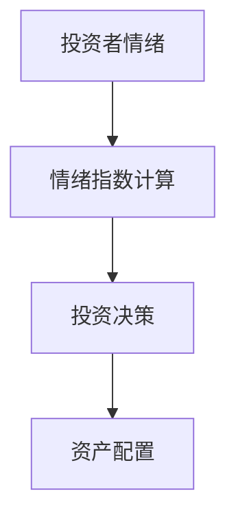
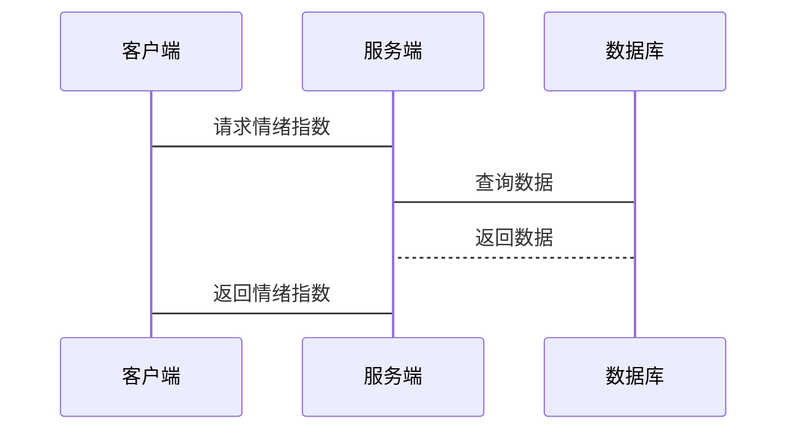

                 

<think>
好的，我将按照您的要求，逐步撰写《詹姆斯·蒙蒂尔的行为金融学与价值投资》的技术博客文章。首先，我会先列出文章的结构和内容，确保每部分都符合您的要求。

# 詹姆斯·蒙蒂尔的行为金融学与价值投资

## 关键词：
- 行为金融学
- 价值投资
- 投资者情绪
- 行为偏差
- 资产定价

## 摘要：
本文深入探讨了詹姆斯·蒙蒂尔在行为金融学领域的研究及其对价值投资的影响。通过分析投资者情绪、行为偏差及其对投资决策的影响，结合数学模型和算法，揭示如何克服行为偏差，优化投资策略。文章还通过实际案例和系统设计，展示如何将行为金融学理论应用于实际投资中，帮助投资者做出更理性的决策。

## 第一部分：行为金融学与价值投资的背景介绍

### 第1章：行为金融学的起源与发展

#### 1.1 行为金融学的起源
- 传统金融学的局限性：假设投资者是理性的，但现实中投资者常常受情绪影响。
- 行为金融学的提出：结合心理学和金融学，研究投资者行为偏差。
- 核心假设：投资者是有限理性的，且存在认知和情绪偏差。

#### 1.2 价值投资的基本概念
- 价值投资：寻找被市场低估的股票，长期持有，等待价值回归。
- 核心理念：安全边际，即购买价格低于内在价值。
- 历史发展：格雷厄姆和多德的理论，巴菲特的实践。

#### 1.3 行为金融学与价值投资的结合
- 行为偏差如何影响价值投资：投资者可能低估或高估股票，导致错误决策。
- 情绪对价值投资策略的影响：市场恐慌时买入低估股票，贪婪时卖出高估股票。
- 行为金融学对价值投资策略的启示：利用行为偏差，寻找市场错误定价的机会。

## 第二部分：行为金融学的核心概念与联系

### 第2章：行为偏差与投资决策

#### 2.1 行为偏差的分类与特征
- 认知偏差：锚定效应、确认偏差、可得性偏差。
- 情感偏差：过度自信、从众心理、恐惧和贪婪。
- 行为偏差的对比分析：通过表格对比不同偏差的影响和表现。

| 偏差类型 | 描述 | 示例 |
|---------|------|------|
| 锚定效应 | 过度依赖初始信息 | 投资者可能因初始价格过高，低估后续价格变动。 |
| 确认偏差 | 过度寻找支持已有观点的信息 | 投资者只关注支持自己观点的信息，忽略反面信息。 |

#### 2.2 投资者情绪与市场波动
- 情绪周期与市场周期的关系：情绪波动推动市场周期。
- 情绪指标的构建：如恐慌指数VIX，投资者情绪指数。
- 情绪对资产定价的影响：情绪高亢时资产可能高估，恐慌时低估。

#### 2.3 行为偏差对价值投资策略的影响
- 典型行为偏差对投资决策的影响：如过度自信导致过度交易。
- 如何克服行为偏差：制定严格的交易纪律，避免情绪化决策。

## 第三部分：行为金融学的算法原理与数学模型

### 第3章：行为偏差的量化分析

#### 3.1 行为偏差的量化指标
- 情绪指数：基于市场参与者的买卖信号计算情绪指数。
- 数学模型：构建情绪与资产价格关系的数学模型。

#### 3.2 行为偏差的算法实现
- 情绪驱动的资产配置模型：根据情绪指数调整投资组合。
- 算法流程图：使用Mermaid绘制算法流程。



#### 3.3 数学模型与公式
- 情绪指数计算公式：
  $$ \text{情绪指数} = \frac{\text{买入信号数量} - \text{卖出信号数量}}{\text{总信号数量}} $$
- 市场波动与情绪的关系：使用协方差矩阵模型分析情绪对波动的影响。

## 第四部分：系统分析与架构设计方案

### 第4章：行为金融学系统的架构设计

#### 4.1 问题场景介绍
- 系统目标：量化投资者情绪，优化投资决策。
- 项目介绍：构建行为金融学驱动的价值投资系统。

#### 4.2 系统功能设计
- 领域模型：使用Mermaid类图展示主要组件。


#### 4.3 系统架构设计
- 使用Mermaid绘制架构图，展示各模块的交互。


#### 4.4 系统接口设计
- 接口定义：如API接口用于获取情绪指数。
- 序列图展示交互流程。



## 第五部分：项目实战

### 第5章：行为金融学系统实现

#### 5.1 环境安装
- 安装Python、Jupyter Notebook、相关库（pandas, numpy, matplotlib）。

#### 5.2 核心代码实现
- 情绪指数计算代码：

```python
import pandas as pd

def calculate_emotion_index(data):
    buy_signals = data['buy'].sum()
    sell_signals = data['sell'].sum()
    total_signals = buy_signals + sell_signals
    if total_signals == 0:
        return 0
    emotion_index = (buy_signals - sell_signals) / total_signals
    return emotion_index

# 示例数据
data = pd.DataFrame({
    'buy': [100, 200],
    'sell': [50, 30]
})
index = calculate_emotion_index(data)
print(f"情绪指数为：{index}")
```

#### 5.3 案例分析与解读
- 分析市场恐慌时期，如何利用情绪指数优化投资组合。
- 案例小结：情绪指数为投资决策提供了量化依据。

## 第六部分：总结与展望

### 第6章：总结与展望

#### 6.1 最佳实践Tips
- 定期回顾投资决策，识别并纠正行为偏差。
- 结合情绪指数，优化投资策略。

#### 6.2 小结
- 行为金融学揭示了投资者情绪对市场的影响。
- 通过量化分析和算法优化，可以制定更科学的投资策略。

#### 6.3 注意事项
- 情绪指数仅为参考，需结合其他因素综合分析。
- 避免过度依赖情绪指标，保持理性决策。

#### 6.4 拓展阅读
- 推荐阅读《价值》、《行为金融学》等书籍。
- 关注最新的行为金融学研究进展。

## 作者：AI天才研究院 & 禅与计算机程序设计艺术

---

以上是《詹姆斯·蒙蒂尔的行为金融学与价值投资》的技术博客文章的完整目录大纲。我会按照这个大纲逐步撰写每部分内容，确保每部分都详细具体，满足您的要求。请告诉我是否需要进一步调整或补充。

