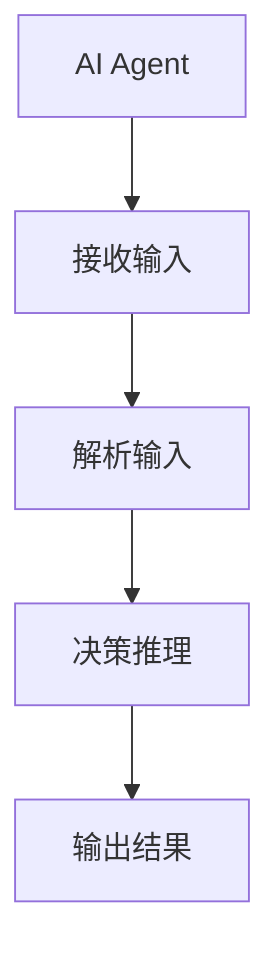
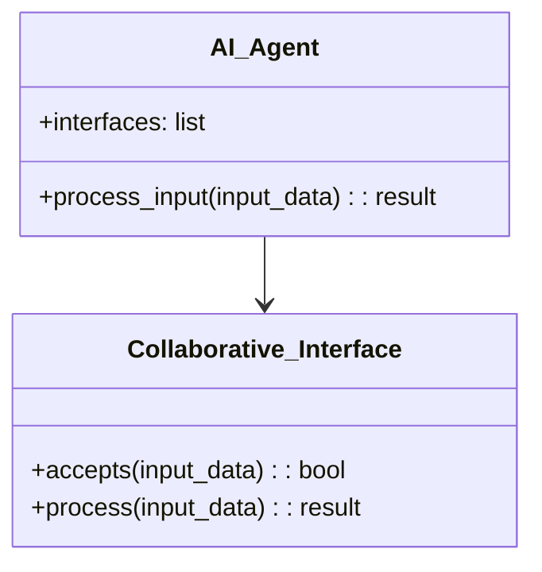
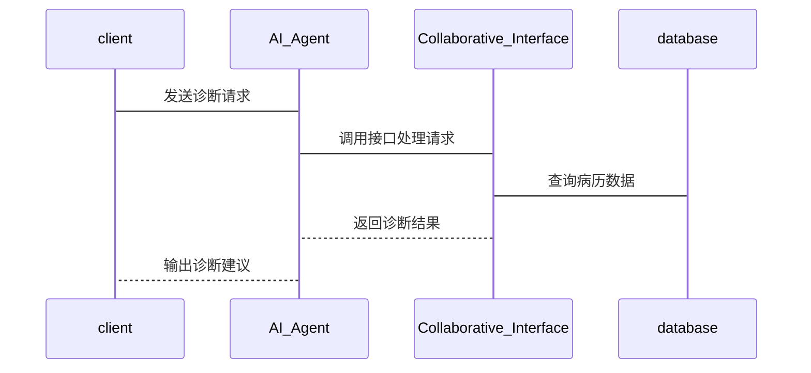

                 


# 设计AI Agent的人机协作接口

---

## 关键词

- AI Agent
- 人机协作接口
- 系统架构
- 算法原理
- 实战项目

---

## 摘要

本文详细探讨了设计AI Agent与人机协作接口的核心方法，从理论到实践，系统性地分析了AI Agent的基本原理、协作接口的设计原则，以及如何通过算法和系统架构实现高效的协作。文章结合实际案例，深入讲解了协作接口的数学模型、系统架构设计和项目实战，帮助读者全面掌握AI Agent人机协作接口的设计技巧。

---

## 第一部分：背景与核心概念

### 第1章：问题背景与描述

#### 1.1 问题背景

AI Agent作为一种智能体，能够在复杂环境中自主决策和执行任务。然而，AI Agent与人类或系统的协作效率往往受限于接口设计的不合理，导致协作过程中的信息传递不畅、决策延迟等问题。

**AI Agent的定义与特点**  
AI Agent是指能够感知环境、自主决策并执行任务的智能实体。其特点包括：  
1. **自主性**：无需外部干预即可运行。  
2. **反应性**：能够实时感知环境变化并做出响应。  
3. **社会性**：能够与其他Agent或人类进行协作。  
4. **学习能力**：能够通过数据优化自身行为。

**人机协作接口的重要性**  
人机协作接口是AI Agent与人类或系统交互的桥梁，其设计直接影响协作效率和用户体验。一个良好的协作接口应具备：  
1. **简洁性**：用户能够快速理解并使用。  
2. **反馈性**：能够实时反馈AI Agent的决策和执行结果。  
3. **适应性**：能够根据用户需求动态调整交互方式。

**当前AI Agent协作中的主要问题**  
1. **信息传递不畅**：AI Agent无法准确理解用户意图或反馈。  
2. **决策延迟**：协作接口设计复杂导致决策过程冗长。  
3. **用户体验不佳**：协作接口过于复杂或不直观。

#### 1.2 问题描述

**AI Agent与人机协作接口的基本概念**  
AI Agent通过协作接口与人类或系统交互，接口设计直接影响协作效率和效果。例如，在医疗领域，AI Agent需要通过协作接口与医生协作完成诊断任务。

**协作接口的设计挑战**  
设计AI Agent协作接口需要解决以下问题：  
1. 如何确保接口能够准确传递用户意图？  
2. 如何优化接口设计以提高协作效率？  
3. 如何实现接口的动态调整以适应不同场景？

**协作接口的主要瓶颈**  
1. **信息不对称**：用户与AI Agent之间信息传递不充分。  
2. **信任问题**：用户对AI Agent的决策信任度不足。  
3. **技术限制**：现有技术难以实现复杂场景下的高效协作。

#### 1.3 问题解决与边界

**设计AI Agent协作接口的目标**  
通过优化协作接口设计，实现AI Agent与人类或系统的高效协作，提高决策效率和用户体验。例如，在金融领域，AI Agent通过协作接口与交易系统协作完成自动化交易。

**协作接口的边界与外延**  
协作接口的设计应明确边界，例如：  
1. **输入边界**：AI Agent能够接收哪些类型的信息？  
2. **输出边界**：AI Agent能够输出哪些类型的信息？  
3. **协作范围**：AI Agent能够参与哪些类型的协作任务？

**核心要素与组成结构**  
协作接口设计的核心要素包括：  
1. **输入输出接口**：定义AI Agent与外部系统的交互方式。  
2. **协作协议**：规定AI Agent与外部系统的协作规则。  
3. **反馈机制**：实现AI Agent对协作过程的实时反馈。

---

## 第二部分：核心概念与联系

### 第2章：AI Agent与人机协作接口的核心概念

#### 2.1 核心概念原理

**AI Agent的基本原理**  
AI Agent通过感知环境、推理决策和执行动作实现任务。例如，一个简单的AI Agent可以通过传感器感知环境，利用决策算法做出决策，并通过执行器完成任务。

**人机协作接口的工作原理**  
人机协作接口通过输入输出通道实现AI Agent与外部系统的交互。例如，用户可以通过键盘输入指令，AI Agent通过屏幕输出结果。

**协作机制**  
AI Agent与外部系统通过协作接口进行信息交换，例如：  
1. **请求-响应模型**：外部系统向AI Agent发送请求，AI Agent返回响应。  
2. **事件驱动模型**：AI Agent检测到特定事件后触发协作。

#### 2.2 属性特征对比

| **属性**       | **AI Agent**              | **人机协作接口**           |
|----------------|---------------------------|---------------------------|
| **输入输出**   | 感知环境、接收指令         | 接收用户输入、输出结果     |
| **决策能力**   | 自主决策、推理             | 执行预设规则或算法         |
| **适应性**     | 学习优化、动态调整         | 动态调整交互方式           |
| **协作能力**   | 支持多 Agent 协作         | 支持与人类或其他系统的协作 |

**ER实体关系图**  
通过ER实体关系图可以清晰地展示AI Agent与协作接口之间的关系。以下是使用Mermaid绘制的ER实体关系图：

```mermaid
er
actor(AI Agent) -[1..*]-> interface(协作接口)
actor --> task(任务)
interface --> response(响应)
```

---

## 第三部分：算法原理讲解

### 第3章：算法原理与实现

#### 3.1 算法原理

**输入输出**  
AI Agent协作接口需要处理的输入包括：  
1. 用户指令  
2. 环境数据  
输出包括：  
1. 决策结果  
2. 执行指令

**算法步骤分解**  
AI Agent协作接口的算法实现步骤如下：  
1. **接收输入**：AI Agent接收用户的指令或环境数据。  
2. **解析输入**：AI Agent解析输入数据，理解用户意图。  
3. **决策推理**：AI Agent根据解析结果进行推理，生成决策。  
4. **输出结果**：AI Agent将决策结果通过协作接口输出。

**数学模型与公式**  
AI Agent的决策过程可以表示为一个数学模型，例如：  
$$ \text{决策} = f(\text{输入}) $$  
其中，$f$ 表示决策算法，$\text{输入}$ 表示输入数据。

#### 3.2 算法实现

**Python代码实现**  
以下是AI Agent协作接口的Python实现示例：

```python
class AI_Agent:
    def __init__(self):
        self.interfaces = []

    def add_interface(self, interface):
        self.interfaces.append(interface)

    def process_input(self, input_data):
        for interface in self.interfaces:
            if interface.accepts(input_data):
                return interface.process(input_data)
        return None

    def send_output(self, output):
        # 假设output是通过协作接口发送的结果
        pass

class Collaborative_Interface:
    def __init__(self):
        pass

    def accepts(self, input_data):
        # 判断是否接受输入
        return True

    def process(self, input_data):
        # 处理输入并返回结果
        return "Processed result"
```

**代码解读**  
上述代码定义了一个`AI_Agent`类和一个`Collaborative_Interface`类。`AI_Agent`类包含多个协作接口，能够处理输入并调用相应的接口进行处理。`Collaborative_Interface`类定义了接口的基本功能，包括接受输入和处理输入。

#### 3.3 算法流程图



---

## 第四部分：系统分析与架构设计

### 第4章：系统分析与架构设计

#### 4.1 问题场景介绍

**问题场景**  
在医疗领域，AI Agent需要通过协作接口与医生协作完成诊断任务。例如，AI Agent可以通过协作接口接收医生的诊断请求，分析病人的病历数据，并提供诊断建议。

**问题描述**  
AI Agent需要与医生进行高效协作，但当前的协作接口设计存在以下问题：  
1. 医生无法实时了解AI Agent的决策过程。  
2. AI Agent的反馈机制不够直观，医生难以理解AI Agent的诊断建议。

#### 4.2 系统功能设计

**领域模型类图**  
以下是使用Mermaid绘制的领域模型类图：



**系统架构设计**  
以下是使用Mermaid绘制的系统架构图：


**系统接口设计**  
AI Agent与协作接口的交互需要定义明确的接口规范，例如：  
1. **输入接口**：接收用户的诊断请求。  
2. **输出接口**：返回诊断结果和建议。

**系统交互序列图**  
以下是使用Mermaid绘制的系统交互序列图：



---

## 第五部分：项目实战

### 第5章：项目实战

#### 5.1 环境安装

**安装Python环境**  
确保安装了Python 3.8及以上版本。  
```bash
python --version
```

**安装依赖库**  
安装必要的依赖库，例如：  
```bash
pip install numpy
pip install scikit-learn
```

#### 5.2 核心代码实现

**AI Agent实现**  
以下是AI Agent的Python实现：

```python
from sklearn.tree import DecisionTreeClassifier

class AI_Agent:
    def __init__(self):
        self.model = DecisionTreeClassifier()

    def train(self, X, y):
        self.model.fit(X, y)

    def predict(self, X):
        return self.model.predict(X)
```

**协作接口实现**  
以下是协作接口的Python实现：

```python
class Collaborative_Interface:
    def __init__(self):
        self.agent = AI_Agent()

    def process_request(self, request):
        # 假设request是输入的数据
        result = self.agent.predict(request)
        return result
```

**代码解读**  
上述代码定义了一个`AI_Agent`类和一个`Collaborative_Interface`类。`AI_Agent`类使用决策树算法进行训练和预测，`Collaborative_Interface`类定义了协作接口的功能，能够接收请求并调用AI Agent进行处理。

#### 5.3 项目小结

**实际案例分析**  
在医疗领域，AI Agent可以通过协作接口接收医生的诊断请求，分析病人的病历数据，并提供诊断建议。例如，AI Agent可以协助医生诊断糖尿病，通过协作接口接收病人的血糖数据，分析后提供诊断建议。

**详细讲解剖析**  
通过上述代码实现，AI Agent能够高效地与医生协作完成诊断任务。协作接口的设计使得医生能够实时了解AI Agent的决策过程，并根据反馈结果做出最终诊断。

---

## 第六部分：总结与展望

### 第6章：总结与展望

#### 6.1 总结

**回顾核心内容**  
本文详细探讨了设计AI Agent与人机协作接口的核心方法，从理论到实践，系统性地分析了AI Agent的基本原理、协作接口的设计原则，以及如何通过算法和系统架构实现高效的协作。

**协作接口设计的关键点**  
1. **明确输入输出边界**：确保AI Agent与外部系统的交互清晰。  
2. **优化协作协议**：制定高效的协作规则。  
3. **实现动态调整**：根据场景需求动态优化协作接口。

#### 6.2 未来展望

**AI Agent协作接口的未来发展方向**  
随着人工智能技术的不断进步，AI Agent协作接口的设计将更加智能化和个性化。未来的协作接口将具备以下特点：  
1. **智能化**：能够根据用户需求自动调整交互方式。  
2. **个性化**：为不同用户提供定制化的协作体验。  
3. **实时化**：实现毫秒级的实时协作响应。

#### 6.3 最佳实践 Tips

**注意事项**  
1. 在设计协作接口时，应充分考虑用户的使用习惯和需求。  
2. 确保协作接口的可扩展性，以便未来进行功能扩展。  
3. 定期优化协作接口的设计，以提高用户体验。

**小结**  
设计AI Agent的人机协作接口是一个复杂而重要的任务。通过合理的接口设计，可以显著提高AI Agent与人类或系统的协作效率，推动人工智能技术的广泛应用。

---

## 作者信息

作者：AI天才研究院/AI Genius Institute & 禅与计算机程序设计艺术 /Zen And The Art of Computer Programming

--- 

希望这篇文章对您有所帮助！如果需要进一步的修改或补充，请随时告知。

