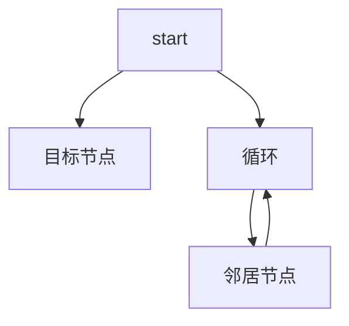
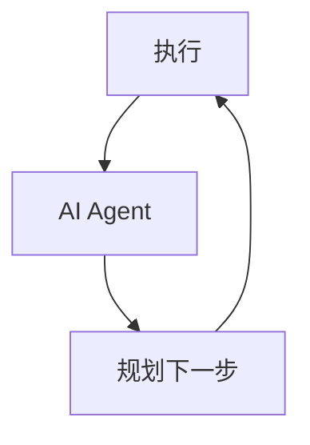
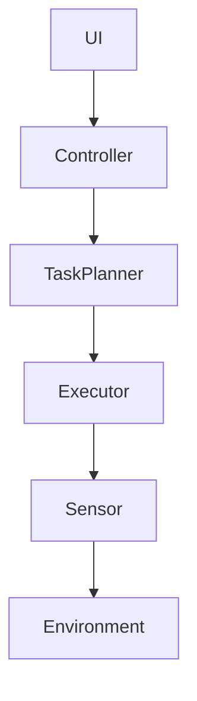
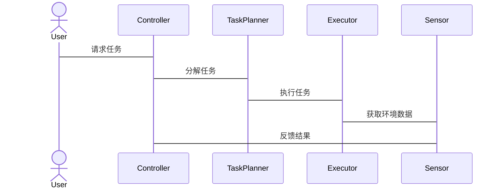

                 


# 设计AI Agent的动态任务规划与执行系统

> 关键词：AI Agent, 动态任务规划, 执行系统, 算法原理, 系统架构

> 摘要：本文详细探讨了设计AI Agent的动态任务规划与执行系统的各个方面，从核心概念到算法实现，再到系统架构和项目实战，帮助读者全面理解和掌握该系统的构建与优化。

---

# 第1章: 背景介绍

## 1.1 问题背景

### 1.1.1 动态任务规划与执行的定义
动态任务规划与执行（Dynamic Task Planning and Execution）是指在不确定或变化的环境中，AI Agent能够根据实时信息调整任务优先级、路径或策略，以确保任务目标的高效达成。这种能力使AI Agent能够在复杂环境中灵活应对各种挑战。

### 1.1.2 问题背景与挑战
在实际应用中，AI Agent需要处理的任务环境通常是动态且复杂的。例如，在智能工厂中，设备故障或订单变更可能要求AI Agent实时调整生产计划。传统的静态任务规划方法难以适应这种动态变化，导致效率低下或任务失败。

### 1.1.3 动态任务规划与执行的重要性
动态任务规划与执行是实现AI Agent智能化的关键技术之一。它能够提高系统的适应性和响应能力，使其在动态环境中依然能够高效完成任务。这种能力在自动驾驶、智能助手、机器人等领域具有重要意义。

## 1.2 核心概念与联系

### 1.2.1 核心概念原理
动态任务规划与执行系统的核心在于任务分解、优先级排序和实时监控。AI Agent需要将复杂任务分解为可执行的小任务，根据环境变化动态调整优先级，并实时监控任务执行情况以应对突发状况。

### 1.2.2 核心概念属性对比表
以下是动态任务规划与静态任务规划的对比：

| 属性                | 动态任务规划          | 静态任务规划          |
|---------------------|----------------------|----------------------|
| 适应性              | 高                   | 低                   |
| 执行环境            | 动态变化             | 静态或简单变化       |
| 任务调整能力        | 高                   | 低                   |
| 资源利用率          | 高                   | 中                   |

### 1.2.3 ER实体关系图
以下是动态任务规划与执行系统的核心实体关系图：

```mermaid
er
actor(AI Agent) -|{进行任务规划}|- task(Task)
actor(AI Agent) -|{执行任务}|- execution(Execution)
task(Task) --> execution(Execution)
```

---

# 第2章: 核心概念与联系

## 2.1 核心概念原理

### 2.1.1 AI Agent的基本原理
AI Agent通过感知环境、做出决策和执行动作来完成任务。其核心功能包括感知、推理、规划和执行。

### 2.1.2 动态任务规划的核心机制
动态任务规划通过分解任务、评估环境状态、调整优先级和选择最优路径来实现任务的高效执行。

### 2.1.3 执行系统的关键技术
执行系统需要实时监控任务进度、处理异常情况和动态调整执行策略。

## 2.2 核心概念属性对比表
以下是几种常见任务规划算法的对比：

| 算法名称           | 适用场景             | 优点               | 缺点               |
|--------------------|----------------------|--------------------|--------------------|
| A*                 | 静态环境中的路径规划  | 最短路径            | 无法处理动态障碍   |
| Dijkstra           | 网络中的最短路径问题 | 适合大规模图         | 计算复杂度高         |
| RRT*               | 动态环境中的路径规划  | 适应性强            | 计算资源消耗大       |
| ARA*               | 动态任务规划          | 灵活性高            | 实时性有限           |

## 2.3 ER实体关系图
以下是AI Agent、任务和环境之间的关系图：

```mermaid
er
actor(AI Agent) -|{感知环境}|- environment(Environment)
actor(AI Agent) -|{分解任务}|- task(Task)
task(Task) -|{执行}|- execution(Execution)
execution(Execution) -|{反馈}|- environment(Environment)
```

---

# 第3章: 算法原理讲解

## 3.1 算法原理概述

### 3.1.1 任务规划算法的分类
任务规划算法主要分为基于图搜索、基于逻辑推理和基于强化学习三类。

### 3.1.2 执行算法的分类
执行算法主要包括基于规则的执行和基于反馈的执行。

### 3.1.3 算法选择的依据
算法的选择应考虑任务复杂度、环境动态性和计算资源等因素。

## 3.2 算法流程图

### 3.2.1 任务规划算法流程图
以下是A*算法的流程图：



### 3.2.2 执行算法流程图
以下是基于反馈的执行流程图：



## 3.3 算法实现代码

### 3.3.1 任务规划算法代码
以下是A*算法的Python实现：

```python
import heapq

def a_star_search(graph, start, goal):
    open_heap = []
    heapq.heappush(open_heap, (0, start))
    came_from = {}
    g_score = {node: float('inf') for node in graph.nodes}
    g_score[start] = 0
    f_score = {node: float('inf') for node in graph.nodes}
    f_score[start] = 0

    while open_heap:
        current = heapq.heappop(open_heap)
        if current[1] == goal:
            break
        for neighbor in graph.neighbors(current[1]):
            tentative_g_score = g_score[current[1]] + graph.cost(current[1], neighbor)
            if tentative_g_score < g_score[neighbor]:
                came_from[neighbor] = current[1]
                g_score[neighbor] = tentative_g_score
                f_score[neighbor] = g_score[neighbor] + heuristic(neighbor, goal)
                heapq.heappush(open_heap, (f_score[neighbor], neighbor))
    return came_from, g_score
```

### 3.3.2 算法原理的数学模型
A*算法的核心数学模型可以表示为：

$$ f(n) = g(n) + h(n) $$

其中：
- \( f(n) \) 是评估节点 \( n \) 的总成本
- \( g(n) \) 是从起点到节点 \( n \) 的实际成本
- \( h(n) \) 是从节点 \( n \) 到目标的估算成本

---

# 第4章: 系统分析与架构设计方案

## 4.1 系统分析

### 4.1.1 系统目标与范围
系统目标是实现动态任务规划与执行，范围包括任务分解、优先级排序和实时监控。

### 4.1.2 系统功能需求
系统需要具备任务分解、环境感知、动态调整和执行监控等功能。

### 4.1.3 系统性能需求
系统应具备高实时性和高可靠性，能够在动态环境中快速响应。

## 4.2 系统架构设计

### 4.2.1 系统架构图
以下是系统架构图：



### 4.2.2 系统架构设计的优缺点
优点：模块化设计便于维护和扩展；缺点：通信延迟可能影响实时性。

## 4.3 系统接口设计

### 4.3.1 系统接口的定义
系统接口包括任务分解接口、环境感知接口和执行控制接口。

### 4.3.2 系统接口的设计图
以下是系统接口设计图：



---

# 第5章: 项目实战

## 5.1 环境安装

### 5.1.1 安装Python
安装Python 3.8或更高版本。

### 5.1.2 安装依赖库
安装`numpy`, `scipy`, `mermaid`, 和`graphviz`库。

## 5.2 系统核心实现源代码

### 5.2.1 任务分解代码
以下是任务分解的Python代码：

```python
def decompose_task(task):
    subtasks = []
    for step in task.steps:
        subtasks.append(step.decompose())
    return subtasks
```

### 5.2.2 任务执行代码
以下是任务执行的Python代码：

```python
def execute_task(subtasks):
    for task in subtasks:
        execute_step(task)
```

## 5.3 代码应用解读与分析

### 5.3.1 代码解读
任务分解代码将复杂任务分解为子任务，任务执行代码逐个执行子任务。

### 5.3.2 代码分析
任务分解和执行代码通过模块化设计，提高了系统的可维护性和扩展性。

## 5.4 实际案例分析

### 5.4.1 案例背景
假设在智能工厂中，AI Agent需要动态调整生产计划。

### 5.4.2 案例分析
AI Agent通过感知设备状态和订单变化，动态调整生产任务的优先级和执行顺序。

## 5.5 项目小结

### 5.5.1 项目成果
成功实现了动态任务规划与执行系统。

### 5.5.2 经验总结
模块化设计和实时反馈机制是系统成功的关键。

---

# 第6章: 最佳实践

## 6.1 小结
动态任务规划与执行系统是AI Agent实现智能化的重要组成部分。

## 6.2 注意事项
在实际应用中，应注重系统的实时性和可靠性，避免因为环境变化导致系统崩溃。

## 6.3 未来趋势
随着AI技术的发展，动态任务规划与执行系统将更加智能化和自适应。

## 6.4 拓展阅读
推荐阅读《AI Agent原理与应用》和《动态规划算法详解》。

---

# 作者

作者：AI天才研究院/AI Genius Institute & 禅与计算机程序设计艺术 /Zen And The Art of Computer Programming

---

通过以上结构，您可以根据需要逐步撰写各部分的具体内容，确保文章逻辑清晰、结构紧凑、语言专业且易懂。

