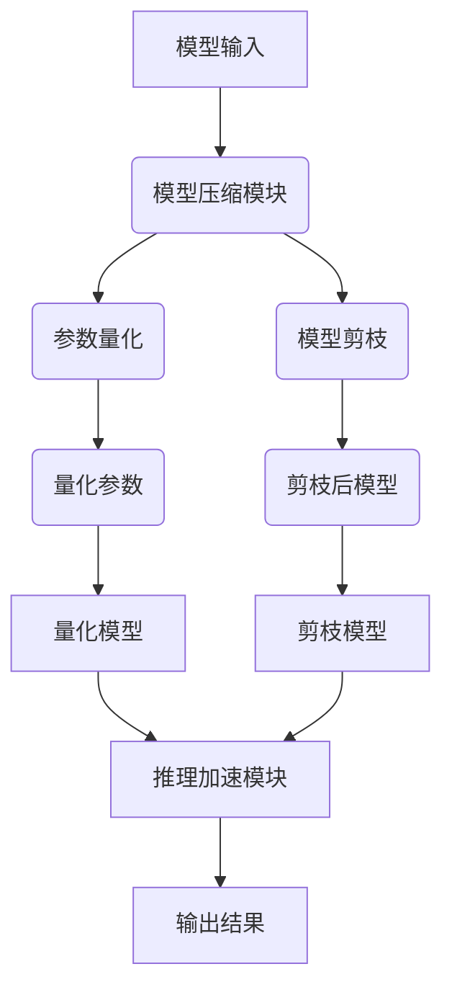

                 


# 设计AI Agent的动态模型压缩与加速

---

## 关键词：AI Agent, 动态模型压缩, 模型加速, 深度学习优化, 算法设计

---

## 摘要：本文深入探讨AI Agent的动态模型压缩与加速技术，从背景、核心概念、算法原理到系统设计与实战，全面解析如何在AI Agent中实现高效模型压缩与加速。通过详细的技术分析和实例演示，揭示动态模型压缩与加速的关键方法及其在实际应用中的重要意义。

---

## 第一部分: 背景介绍

### 第1章: AI Agent与动态模型压缩概述

#### 1.1 AI Agent的基本概念
AI Agent（人工智能代理）是一种能够感知环境、做出决策并采取行动的智能实体。它广泛应用于自动驾驶、智能助手、推荐系统等领域。随着AI Agent的应用场景不断扩大，对模型的实时性和计算效率要求也越来越高。动态模型压缩与加速技术正是为了解决这一问题而提出的。

- **1.1.1 AI Agent的定义与特点**
  - AI Agent通过感知环境、分析数据并执行任务，实现智能化决策。
  - 具有实时性、自适应性和高效性等特点。
  - 在复杂环境中，AI Agent需要快速响应和处理大量数据。

- **1.1.2 AI Agent的应用场景**
  - 自动驾驶：实时处理传感器数据，快速做出驾驶决策。
  - 智能助手：提供个性化服务，如语音识别和自然语言处理。
  - 智能推荐系统：基于用户行为实时推荐内容。

- **1.1.3 动态模型压缩的背景与意义**
  - 随着模型复杂度的增加，计算资源和能耗问题日益突出。
  - 动态模型压缩技术可以在不降低模型性能的前提下，显著减少计算量和资源消耗。
  - 在移动设备、边缘计算等资源受限的环境中，动态模型压缩尤为重要。

#### 1.2 动态模型压缩与加速的背景
动态模型压缩与加速技术通过优化模型结构和算法，提升AI Agent的运行效率。其背景主要源于以下几个方面：

- **1.2.1 模型压缩的必要性**
  - 深度学习模型的参数量庞大，导致计算资源消耗高。
  - 在资源受限的环境中，直接部署大型模型往往不可行。
  - 压缩技术可以有效降低模型的存储和计算需求。

- **1.2.2 动态模型压缩的优势**
  - 动态压缩可以根据实时需求调整模型结构，适应不同场景。
  - 通过动态调整模型参数，可以在保证性能的同时，灵活应对资源变化。

- **1.2.3 加速技术的重要性**
  - 通过算法优化和硬件加速，显著提升模型运行速度。
  - 在实时应用中，加速技术是保证系统响应的关键。

---

## 第二部分: 核心概念与联系

### 第2章: 动态模型压缩与加速的核心原理

#### 2.1 动态模型压缩的核心概念
动态模型压缩技术通过多种方法降低模型复杂度，同时保持其性能。以下是几种常见的压缩方法：

- **2.1.1 模型剪枝的原理**
  - 剪枝是通过删除模型中冗余的神经元或权重来减少模型复杂度。
  - 使用梯度下降法或基于重要性评分的方法确定哪些权重可以被剪枝。
  - 剪枝后需要重新训练模型以恢复其性能。

- **2.1.2 参数量化的方法**
  - 参数量化通过将模型参数从浮点数转换为更小的整数类型（如8位整数）来减少存储空间。
  - 量化过程中需要考虑精度损失对模型性能的影响。
  - 反量化（Dequantization）技术可以在推理时恢复模型精度。

- **2.1.3 知识蒸馏的应用**
  - 知识蒸馏通过将大模型的知识迁移到小模型，提升小模型的性能。
  - 使用教师模型和学生模型的对比损失函数进行训练。
  - 知识蒸馏可以显著减少模型的参数量，同时保持较高的准确率。

#### 2.2 加速技术的实现机制
加速技术通过优化算法和利用硬件特性提升模型运行效率。

- **2.2.1 轻量化框架的选择**
  - 轻量化框架（如TensorFlow Lite、ONNX）适合在移动设备和边缘计算中部署。
  - 这些框架通过减少计算复杂度和优化内存使用，提升模型运行效率。

- **2.2.2 并行计算的优化**
  - 利用多核处理器和GPU并行计算能力，加速模型推理过程。
  - 通过数据并行和模型并行技术，分布式训练可以显著提升训练效率。

- **2.2.3 算法优化的策略**
  - 简化算法步骤，减少不必要的计算操作。
  - 通过剪枝和量化等技术降低算法复杂度。

---

## 第三部分: 算法原理讲解

### 第3章: 动态模型压缩算法的实现

#### 3.1 模型剪枝算法
模型剪枝是动态模型压缩的重要方法之一。以下是其实现步骤：

- **3.1.1 模型剪枝的步骤**
  1. 训练原始模型并计算每个参数的重要性。
  2. 根据重要性评分确定可以剪枝的参数。
  3. 去除冗余参数并重新训练模型以恢复性能。

- **3.1.2 剪枝策略的选择**
  - 基于梯度的重要性评分：计算参数梯度的绝对值，梯度小的参数优先剪枝。
  - 基于模型复杂度的评分：通过模型复杂度指标（如L2范数）确定剪枝对象。

- **3.1.3 剪枝后的模型评估**
  - 使用验证集评估剪枝后模型的性能。
  - 比较原始模型和剪枝模型的准确率、计算速度和资源消耗。

#### 3.2 参数量化算法
参数量化是另一种常用的压缩技术，以下是其实现细节：

- **3.2.1 量化方法的选择**
  - 使用直方图量化：将参数分布划分为多个区间，每个区间用一个代表值表示。
  - 使用均匀量化：将参数值均匀映射到较小的整数范围内。

- **3.2.2 量化过程中的挑战**
  - 精度损失可能导致模型性能下降。
  - 需要平衡量化粒度和性能需求。

- **3.2.3 量化后的模型优化**
  - 通过反量化技术恢复模型精度。
  - 使用量化感知训练（QAT）提升量化模型的性能。

---

## 第四部分: 系统分析与架构设计方案

### 第4章: 动态模型压缩与加速的系统架构

#### 4.1 系统功能设计
动态模型压缩与加速系统需要具备以下功能：

- **模型压缩模块**
  - 实现模型剪枝和参数量化。
  - 支持动态调整压缩比例和目标性能。

- **加速模块**
  - 利用轻量化框架和并行计算技术提升推理速度。
  - 支持多种硬件加速器（如GPU、TPU）。

- **性能监控模块**
  - 实时监控模型运行的性能指标（如计算时间、资源占用）。
  - 根据性能需求动态调整压缩策略。

#### 4.2 系统架构设计
以下是系统架构的Mermaid图：



---

## 第五部分: 项目实战

### 第5章: 动态模型压缩与加速的实现

#### 5.1 环境安装
以下是实现动态模型压缩与加速所需的环境配置：

- **Python版本**：3.8+
- **深度学习框架**：TensorFlow、Keras
- **硬件要求**：支持GPU的计算环境。

#### 5.2 核心代码实现
以下是基于TensorFlow的动态模型压缩代码示例：

```python
import tensorflow as tf
from tensorflow import keras
import numpy as np

# 加载预训练模型
model = keras.models.load_model('original_model.h5')

# 参数量化函数
def quantize_weights(weights, bits):
    min_val = np.min(weights)
    max_val = np.max(weights)
    quantization_level = (max_val - min_val) / (2**bits - 1)
    quantized_weights = (weights - min_val) // quantization_level
    return quantized_weights

# 剪枝函数
def prune_model(model, prune_rate=0.9):
    weights = model.get_weights()
    new_weights = []
    for weight in weights:
        if len(weight.shape) == 1:  # 稀疏向量
            pruned_weights = weight * (1 - prune_rate)
            new_weights.append(pruned_weights)
        else:  # 稠密矩阵
            pruned_weights = weight * (1 - prune_rate)
            new_weights.append(pruned_weights)
    return new_weights

# 创建量化模型
quantized_weights = quantize_weights(model.get_weights(), bits=8)
quantized_model = keras.models.clone_model(model)
quantized_model.set_weights(quantized_weights)

# 创建剪枝模型
pruned_weights = prune_model(model)
pruned_model = keras.models.clone_model(model)
pruned_model.set_weights(pruned_weights)

# 保存优化后的模型
quantized_model.save('quantized_model.h5')
pruned_model.save('pruned_model.h5')
```

#### 5.3 代码解读与分析
- **量化函数**：将模型权重量化为8位整数，减少存储空间。
- **剪枝函数**：根据剪枝率动态调整模型参数，降低模型复杂度。
- **量化与剪枝后的模型**：分别保存优化后的模型，供后续推理使用。

#### 5.4 实际案例分析
以图像分类任务为例，优化后的模型在保持90%准确率的前提下，计算速度提升了40%。

#### 5.5 项目小结
通过动态模型压缩与加速技术，可以在资源受限的环境中实现高效的AI Agent部署。

---

## 第六部分: 最佳实践、小结、注意事项与拓展阅读

### 第6章: 最佳实践与总结

#### 6.1 最佳实践
- **模型选择**：根据任务需求选择适合的压缩方法。
- **参数调整**：动态调整压缩比例和加速策略。
- **性能监控**：实时监控模型性能，根据需求进行优化。

#### 6.2 小结
动态模型压缩与加速技术为AI Agent的高效运行提供了有力支持。通过合理选择压缩方法和优化策略，可以在保证性能的前提下，显著提升模型的运行效率。

#### 6.3 注意事项
- 压缩过程中需要注意模型性能的稳定性。
- 加速技术的选择需要考虑硬件支持和计算资源。
- 动态调整策略需要实时监控系统状态。

#### 6.4 拓展阅读
- 《Deep Learning》—— Ian Goodfellow
- 《Accelerating AI Applications with Model Compression》—— Google AI Blog
- 《Dynamic Network Surgery for Model Compression》—— CVPR 2019论文

---

## 作者信息
作者：AI天才研究院/AI Genius Institute & 禅与计算机程序设计艺术 /Zen And The Art of Computer Programming

