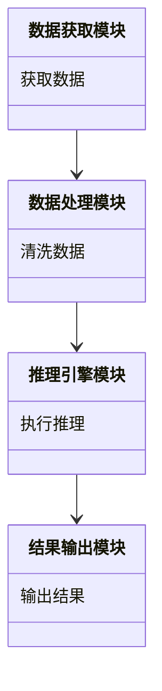
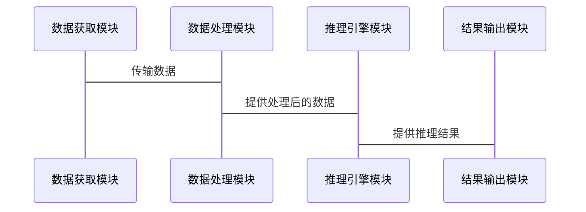

                 


# 设计AI Agent的动态知识图谱推理引擎

> 关键词：AI Agent, 知识图谱, 动态推理引擎, 图神经网络, 实时推理

> 摘要：本文系统地探讨了设计AI Agent的动态知识图谱推理引擎的关键技术与方法。首先介绍了AI Agent和知识图谱的基本概念，分析了动态知识图谱的特性和动态推理引擎的必要性。接着深入讲解了动态知识图谱推理的核心算法，包括基于规则的推理、概率推理和图神经网络推理。然后详细分析了系统的架构设计，提出了模块化的引擎架构，并通过mermaid图展示了系统的整体结构和接口设计。最后，通过实际案例展示了推理引擎的实现过程，并总结了设计中的关键点和最佳实践。

---

# 第一部分: AI Agent与知识图谱基础

# 第1章: AI Agent与知识图谱概述

## 1.1 AI Agent的基本概念

### 1.1.1 AI Agent的定义与特点
AI Agent（人工智能代理）是指能够感知环境、自主决策并执行任务的智能实体。它具有以下特点：
- **自主性**：能够在没有外部干预的情况下自主运行。
- **反应性**：能够感知环境并实时响应。
- **目标导向**：具有明确的目标，能够为实现目标采取最优行动。

### 1.1.2 AI Agent的核心功能与应用场景
AI Agent的核心功能包括：
- 感知环境：通过传感器或数据接口获取环境信息。
- 分析决策：基于知识库或推理引擎进行分析和决策。
- 执行操作：根据决策结果执行具体操作。

AI Agent广泛应用于自动驾驶、智能助手、机器人控制等领域。

### 1.1.3 知识图谱的基本概念与特性
知识图谱是一种以图结构形式表示知识的语义网络，由实体（概念）和关系组成。其特性包括：
- **结构化**：数据以结构化的形式存储，便于计算机理解和推理。
- **语义化**：通过语义信息描述实体之间的关系，支持复杂查询和推理。
- **动态性**：能够实时更新和扩展，适应不断变化的环境。

---

## 1.2 动态知识图谱的定义与特点

### 1.2.1 知识图谱的动态性与实时性
动态知识图谱是指能够实时更新、适应环境变化的知识图谱。其动态性体现在：
- 数据的实时更新：能够快速响应新数据的加入和旧数据的删除。
- 关系的动态变化：实体之间的关系可以实时调整。

### 1.2.2 动态知识图谱的构建与更新机制
动态知识图谱的构建与更新机制包括：
- **增量式构建**：仅更新新增或修改的部分，避免重复计算。
- **实时更新**：通过事件驱动的方式，实时处理数据变更。
- **分布式存储**：利用分布式数据库实现高效的数据存储和更新。

### 1.2.3 动态知识图谱与传统知识图谱的区别
动态知识图谱与传统知识图谱的主要区别在于：
- 数据更新频率：动态知识图谱支持实时更新，而传统知识图谱通常是静态的。
- 处理复杂性：动态知识图谱需要处理高频更新和复杂关系变化，而传统知识图谱相对稳定。

---

## 1.3 动态知识图谱推理引擎的必要性

### 1.3.1 知识图谱推理的基本概念
知识图谱推理是指基于知识图谱中的实体和关系，推导出新的知识或结论的过程。常见的推理类型包括：
- **演绎推理**：从一般性知识推导出特殊性知识。
- **归纳推理**：从具体实例推导出一般性知识。
- **类比推理**：通过类比不同实体之间的关系，推导出新的知识。

### 1.3.2 动态知识图谱推理的挑战与需求
动态知识图谱推理面临以下挑战：
- 数据的实时更新需要推理引擎能够快速适应变化。
- 动态关系可能导致推理结果的不稳定性。
- 高频更新对推理性能提出了更高的要求。

### 1.3.3 动态知识图谱推理引擎的定义与作用
动态知识图谱推理引擎是指能够实时处理动态知识图谱的推理引擎。其作用包括：
- 实时更新知识图谱，确保推理结果的准确性。
- 快速响应查询请求，支持高频推理任务。
- 提供高效的推理算法，优化计算性能。

---

## 1.4 本章小结

本章介绍了AI Agent和知识图谱的基本概念，重点分析了动态知识图谱的特性和动态推理引擎的必要性。通过对比传统知识图谱和动态知识图谱，明确了动态知识图谱推理引擎在实时更新和高频推理任务中的重要性。

---

# 第二部分: 动态知识图谱推理引擎的核心概念与联系

# 第2章: 动态知识图谱推理引擎的核心概念

## 2.1 知识图谱构建与动态更新

### 2.1.1 知识图谱的构建流程
知识图谱的构建流程包括数据获取、数据清洗、实体识别、关系抽取和存储优化等步骤。

### 2.1.2 动态知识图谱的更新机制
动态知识图谱的更新机制包括：
- **事件驱动**：通过检测特定事件触发知识图谱的更新。
- **时间戳标记**：对数据进行时间戳标记，确保更新的准确性和一致性。

### 2.1.3 知识图谱的存储与管理
知识图谱的存储与管理需要考虑：
- 数据的高效查询与更新。
- 数据的分布式存储与容错机制。

---

## 2.2 动态知识图谱推理的基本原理

### 2.2.1 基于规则的推理
基于规则的推理是一种通过预定义的规则进行推理的方法。规则通常以逻辑条件的形式表示，例如：
$$
\text{如果} A \text{且} B \text{，则} C
$$
这种推理方法适用于规则明确且变化较小的场景。

### 2.2.2 基于概率的推理
基于概率的推理是一种通过概率模型进行推理的方法。常用的概率模型包括贝叶斯网络和马尔可夫链。例如：
$$
P(A|B) = \frac{P(B|A)P(A)}{P(B)}
$$
这种推理方法适用于不确定性较高的场景。

### 2.2.3 基于图神经网络的推理
基于图神经网络的推理是一种通过图神经网络模型进行推理的方法。图神经网络能够处理图结构数据，具有强大的表达能力和灵活性。

---

## 2.3 动态知识图谱推理引擎的架构

### 2.3.1 引擎的模块划分
动态知识图谱推理引擎的模块划分包括：
- 数据获取模块：负责获取动态知识图谱的数据。
- 数据处理模块：负责对数据进行清洗和预处理。
- 推理引擎模块：负责基于规则、概率或图神经网络进行推理。
- 结果输出模块：负责将推理结果输出为可读格式。

### 2.3.2 引擎的核心组件与功能
引擎的核心组件包括：
- 数据存储层：存储知识图谱的数据。
- 推理算法层：实现各种推理算法。
- 应用接口层：提供对外部应用的接口。

### 2.3.3 引擎的扩展性与可扩展性
引擎需要具有良好的扩展性，能够支持多种推理算法和数据格式。通过模块化设计，可以方便地扩展新的功能。

---

## 2.4 核心概念对比分析

### 2.4.1 不同推理方法的对比
不同推理方法的对比可以从以下几个方面进行：
- **计算复杂度**：基于规则的推理计算复杂度较低，而图神经网络推理计算复杂度较高。
- **适用场景**：基于规则的推理适用于规则明确的场景，而基于概率的推理适用于不确定性较高的场景。
- **灵活性**：基于图神经网络的推理具有较高的灵活性，能够处理复杂的图结构数据。

### 2.4.2 引擎架构的对比分析
常见的引擎架构包括：
- 单体架构：适合小规模应用。
- 分布式架构：适合大规模应用。
- 微服务架构：适合功能模块化设计。

### 2.4.3 动态知识图谱与静态知识图谱的对比
动态知识图谱与静态知识图谱的主要区别在于数据更新的频率和复杂性。动态知识图谱需要支持实时更新和复杂关系变化，而静态知识图谱通常是稳定的。

---

## 2.5 本章小结

本章分析了动态知识图谱推理引擎的核心概念，包括知识图谱的构建与更新、推理的基本原理以及引擎的架构设计。通过对比不同推理方法和引擎架构，明确了在不同场景下应该如何选择和设计推理引擎。

---

# 第三部分: 动态知识图谱推理引擎的算法原理

# 第3章: 动态知识图谱推理算法

## 3.1 基于规则的推理算法

### 3.1.1 规则的定义与表示
基于规则的推理规则通常以逻辑条件的形式表示，例如：
$$
\text{如果} (A \text{且} B) \text{，则} C
$$
规则可以存储在数据库或知识库中。

### 3.1.2 基于规则的推理流程
基于规则的推理流程包括：
1. 数据获取：获取知识图谱中的数据。
2. 规则匹配：匹配符合规则的条件。
3. 推理结果：根据匹配的规则生成推理结果。

### 3.1.3 规则的冲突解决与优化
规则的冲突解决可以通过优先级排序或投票机制实现。规则的优化可以通过合并相似规则或简化复杂规则实现。

---

## 3.2 基于概率的推理算法

### 3.2.1 概率推理的基本原理
概率推理基于概率论，通过计算事件发生的概率进行推理。常用的概率模型包括贝叶斯网络和马尔可夫链。

### 3.2.2 贝叶斯网络在动态知识图谱中的应用
贝叶斯网络是一种有向无环图，节点表示随机变量，边表示变量之间的依赖关系。例如：
$$
P(A|B) = \frac{P(B|A)P(A)}{P(B)}
$$

### 3.2.3 概率推理的计算与优化
概率推理的计算可以通过马尔可夫链蒙特卡罗方法或变分推断实现。优化可以通过参数调整或算法优化实现。

---

## 3.3 基于图神经网络的推理算法

### 3.3.1 图神经网络的基本原理
图神经网络是一种处理图结构数据的深度学习模型。其基本原理包括：
- **节点表示**：将每个节点表示为一个向量。
- **边表示**：将边表示为节点之间的关系。
- **图传播**：通过消息传递机制传播信息。

### 3.3.2 图神经网络在知识图谱推理中的应用
图神经网络可以用于实体识别、关系推理和属性预测等任务。

### 3.3.3 动态知识图谱中的实时推理实现
动态知识图谱中的实时推理可以通过事件驱动的方式实现，例如：
1. 数据更新：检测数据的变化。
2. 实时推理：根据变化的数据进行实时推理。

---

## 3.4 算法对比与选择策略

### 3.4.1 不同推理算法的优缺点对比
| 推理算法 | 优点 | 缺点 |
|----------|------|------|
| 基于规则 | 实现简单，规则明确 | 难以处理复杂关系 |
| 基于概率 | 能处理不确定性 | 计算复杂度高 |
| 基于图神经网络 | 表达能力强，灵活性高 | 实现复杂，计算资源消耗大 |

### 3.4.2 动态知识图谱场景下的算法选择
在动态知识图谱场景下，需要综合考虑数据的动态性、推理的实时性和计算资源的可用性。基于规则的推理适用于规则明确的场景，基于概率的推理适用于不确定性较高的场景，基于图神经网络的推理适用于复杂关系的场景。

### 3.4.3 算法的性能优化与调优
算法的性能优化可以通过以下方式实现：
- **规则优化**：简化复杂规则，减少计算量。
- **概率模型优化**：调整参数，提高计算效率。
- **图神经网络优化**：使用轻量化模型，减少计算资源消耗。

---

## 3.5 本章小结

本章详细讲解了动态知识图谱推理引擎的算法原理，包括基于规则的推理、基于概率的推理和基于图神经网络的推理。通过对比不同算法的优缺点，明确了在不同场景下应该如何选择和优化算法。

---

# 第四部分: 动态知识图谱推理引擎的系统架构与设计

# 第4章: 系统架构设计

## 4.1 系统功能设计

### 4.1.1 功能模块划分
系统功能模块包括：
- 数据获取模块：负责获取动态知识图谱的数据。
- 数据处理模块：负责对数据进行清洗和预处理。
- 推理引擎模块：负责基于规则、概率或图神经网络进行推理。
- 结果输出模块：负责将推理结果输出为可读格式。

### 4.1.2 功能模块交互流程
功能模块交互流程包括：
1. 数据获取：通过接口获取动态知识图谱的数据。
2. 数据处理：对数据进行清洗和预处理。
3. 推理引擎：选择合适的推理算法进行推理。
4. 结果输出：将推理结果输出为可读格式。

### 4.1.3 功能模块的实现细节
功能模块的实现细节包括：
- 数据获取：支持多种数据格式和数据源。
- 数据处理：支持数据清洗、去重和标准化。
- 推理引擎：支持多种推理算法和参数配置。
- 结果输出：支持多种输出格式，如JSON、XML等。

---

## 4.2 系统架构设计

### 4.2.1 领域模型类图
领域模型类图展示了系统的各个模块及其之间的关系。例如：



### 4.2.2 系统架构图
系统架构图展示了系统的整体结构和模块划分。例如：


### 4.2.3 接口设计与交互序列图
接口设计与交互序列图展示了系统模块之间的接口和交互流程。例如：



---

## 4.3 本章小结

本章详细设计了动态知识图谱推理引擎的系统架构，包括功能模块划分、系统架构图和接口设计。通过mermaid图展示了系统的整体结构和模块之间的交互流程，为实际实现提供了清晰的指导。

---

# 第五部分: 动态知识图谱推理引擎的项目实战

# 第5章: 项目实战

## 5.1 环境安装与配置

### 5.1.1 环境要求
动态知识图谱推理引擎的实现需要以下环境：
- **Python 3.8+**：用于代码编写和运行。
- **TensorFlow或PyTorch**：用于图神经网络的实现。
- **Neo4j**：用于知识图谱的存储和管理。

### 5.1.2 安装依赖库
安装以下依赖库：
```bash
pip install neo4j==5.0.0
pip install tensorflow==2.5.0
pip install networkx==2.6
```

---

## 5.2 系统核心功能实现

### 5.2.1 数据获取模块实现
数据获取模块可以通过Neo4j数据库获取知识图谱的数据。例如：
```python
from neo4j import GraphDatabase

class DataAccessor:
    def __init__(self, uri, user, password):
        self.driver = GraphDatabase.driver(uri, auth=(user, password))
    
    def get_data(self, query):
        with self.driver.session() as session:
            result = session.run(query)
            return result.records()
```

### 5.2.2 数据处理模块实现
数据处理模块负责对数据进行清洗和预处理。例如：
```python
import pandas as pd

class DataProcessor:
    def __init__(self):
        pass
    
    def process_data(self, data):
        df = pd.DataFrame(data)
        df.drop_duplicates(inplace=True)
        df.fillna(method='ffill', inplace=True)
        return df.to_dict('records')
```

### 5.2.3 推理引擎模块实现
推理引擎模块可以选择基于规则的推理、基于概率的推理或基于图神经网络的推理。例如，基于规则的推理实现：
```python
class RuleBasedReasoner:
    def __init__(self, rules):
        self.rules = rules
    
    def infer(self, data):
        results = []
        for rule in self.rules:
            if rule['condition'](data):
                results.append(rule['action'](data))
        return results
```

### 5.2.4 结果输出模块实现
结果输出模块负责将推理结果输出为可读格式。例如：
```python
class ResultOutput:
    def __init__(self):
        pass
    
    def output_result(self, result):
        print(json.dumps(result, indent=2))
```

---

## 5.3 代码实现与解读

### 5.3.1 代码实现
以下是一个完整的动态知识图谱推理引擎的实现示例：
```python
from neo4j import GraphDatabase
import pandas as pd
import json

class DataAccessor:
    def __init__(self, uri, user, password):
        self.driver = GraphDatabase.driver(uri, auth=(user, password))
    
    def get_data(self, query):
        with self.driver.session() as session:
            result = session.run(query)
            return result.records()

class DataProcessor:
    def __init__(self):
        pass
    
    def process_data(self, data):
        df = pd.DataFrame(data)
        df.drop_duplicates(inplace=True)
        df.fillna(method='ffill', inplace=True)
        return df.to_dict('records')

class RuleBasedReasoner:
    def __init__(self, rules):
        self.rules = rules
    
    def infer(self, data):
        results = []
        for rule in self.rules:
            if rule['condition'](data):
                results.append(rule['action'](data))
        return results

class ResultOutput:
    def __init__(self):
        pass
    
    def output_result(self, result):
        print(json.dumps(result, indent=2))

# 示例代码
uri = "bolt://localhost:7687"
user = "neo4j"
password = "password"
accessor = DataAccessor(uri, user, password)
rules = [
    {'condition': lambda x: x['A'] and x['B'], 'action': lambda x: x['C']},
    {'condition': lambda x: not x['A'] or not x['B'], 'action': lambda x: not x['C']}
]
reasoner = RuleBasedReasoner(rules)
output = ResultOutput()

data = accessor.get_data("MATCH (n) RETURN n")
processed_data = DataProcessor().process_data(data)
result = reasoner.infer(processed_data)
output.output_result(result)
```

### 5.3.2 代码解读
上述代码实现了一个简单的动态知识图谱推理引擎，包括数据获取、数据处理、推理引擎和结果输出四个模块。数据获取模块通过Neo4j数据库获取数据，数据处理模块对数据进行清洗和预处理，推理引擎模块基于规则进行推理，结果输出模块将推理结果输出为JSON格式。

---

## 5.4 实际案例分析与解读

### 5.4.1 案例背景
假设我们有一个动态知识图谱，记录了公司的员工信息和部门关系。我们需要推理员工的职位信息。

### 5.4.2 案例实现
通过上述代码，我们可以实现员工职位信息的推理。例如：
```python
# 查询员工信息
query = "MATCH (e:Employee) RETURN e"
data = accessor.get_data(query)
processed_data = DataProcessor().process_data(data)
result = reasoner.infer(processed_data)
output.output_result(result)
```

### 5.4.3 案例分析
通过上述实现，我们可以推理出员工的职位信息。规则可以根据实际情况进行调整，例如：
```python
rules = [
    {'condition': lambda x: x['部门'] == '技术部' and x['职位'] == '开发人员', 'action': lambda x: {'职位': '高级开发人员'}},
    {'condition': lambda x: x['部门'] == '市场部' and x['职位'] == '市场人员', 'action': lambda x: {'职位': '高级市场人员'}}
]
```

---

## 5.5 项目小结

本章通过实际案例展示了动态知识图谱推理引擎的实现过程，包括环境配置、代码实现和案例分析。通过代码实现，读者可以理解动态知识图谱推理引擎的核心功能和技术实现。通过案例分析，读者可以掌握如何在实际场景中应用动态知识图谱推理引擎。

---

# 第六部分: 动态知识图谱推理引擎的最佳实践

# 第6章: 最佳实践

## 6.1 项目开发中的注意事项

### 6.1.1 数据质量的重要性
数据质量是推理引擎性能的基础。需要确保数据的准确性和完整性。

### 6.1.2 推理算法的选择
在选择推理算法时，需要综合考虑数据的动态性、推理的实时性和计算资源的可用性。

### 6.1.3 系统的可扩展性
系统设计需要考虑可扩展性，以便在数据量和推理任务增加时，能够方便地进行扩展。

---

## 6.2 小结

动态知识图谱推理引擎的设计需要综合考虑数据、算法和系统架构等多个方面。通过合理的系统设计和算法选择，可以实现高效、可靠的动态知识图谱推理。

---

## 6.3 注意事项

### 6.3.1 数据更新的频率
动态知识图谱的数据更新频率越高，对推理引擎的实时性和计算性能要求也越高。

### 6.3.2 推理算法的复杂度
复杂度高的推理算法可能会影响系统的性能，需要根据实际情况进行优化。

### 6.3.3 系统的可维护性
系统设计需要考虑可维护性，以便在后续开发和维护中能够方便地进行调整和优化。

---

## 6.4 拓展阅读

### 6.4.1 推荐书籍
- 《图神经网络：理论与实践》
- 《知识图谱：构建与应用》

### 6.4.2 推荐博客
- [图神经网络的最新研究](https://example.com)
- [知识图谱的动态更新技术](https://example.com)

---

# 作者：AI天才研究院/AI Genius Institute & 禅与计算机程序设计艺术 /Zen And The Art of Computer Programming

