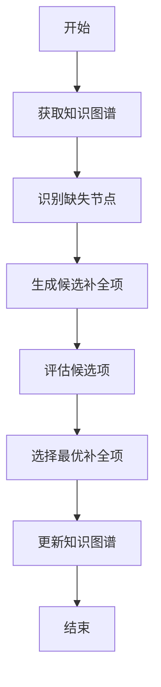
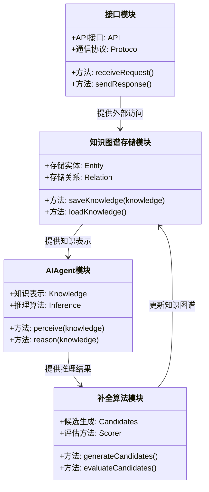
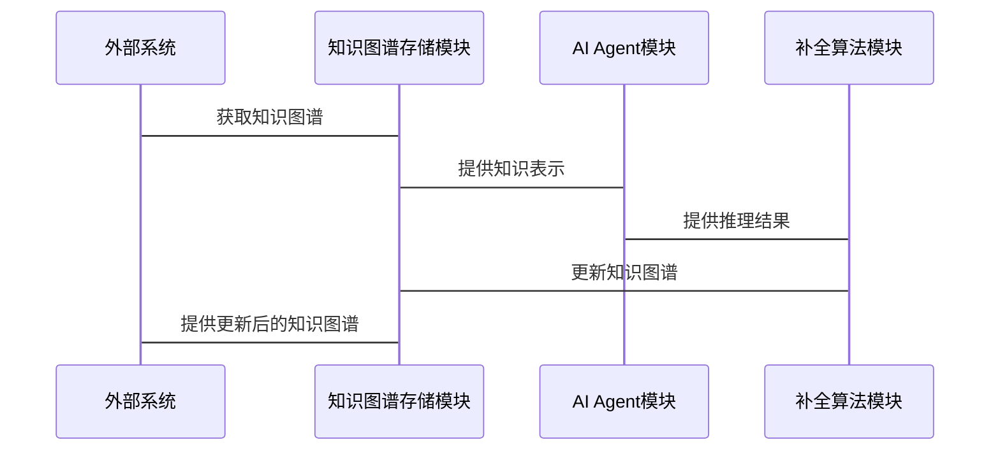

                 


# 设计AI Agent的动态知识图谱补全技术

> 关键词：AI Agent, 动态知识图谱, 知识图谱补全, 实体关系, 算法设计

> 摘要：本文详细探讨了设计AI Agent动态知识图谱补全技术的核心原理、算法实现和系统架构。通过分析动态知识图谱的特性，结合AI Agent的知识表示与推理能力，提出了一套完整的动态知识图谱补全解决方案，并通过具体案例展示了技术的实现与应用。

---

# 第一部分: AI Agent与动态知识图谱补全技术的背景介绍

# 第1章: 问题背景与描述

## 1.1 问题背景
### 1.1.1 知识图谱的定义与作用
知识图谱是一种以图结构表示实体及其关系的语义网络，广泛应用于搜索引擎、智能推荐、自然语言处理等领域。知识图谱能够帮助AI Agent更好地理解上下文，提供更智能的服务。

### 1.1.2 AI Agent的核心概念
AI Agent是一种能够感知环境、自主决策并执行任务的智能实体。它需要依赖知识图谱来获取上下文信息，进行推理和决策。

### 1.1.3 动态知识图谱的特性
动态知识图谱具有实时更新、实体关系变化快、数据异构性高等特点，这对AI Agent的知识表示和推理能力提出了更高的要求。

## 1.2 问题描述
### 1.2.1 知识图谱的不完整性问题
知识图谱在构建过程中不可避免地存在缺失或不准确的信息，影响AI Agent的决策能力。

### 1.2.2 动态环境下的知识更新挑战
动态环境中的实体关系和属性不断变化，如何高效地更新知识图谱是动态知识图谱补全的核心问题。

### 1.2.3 AI Agent在动态知识图谱中的需求
AI Agent需要实时感知知识图谱的变化，并动态调整其知识表示和推理策略，以适应动态环境的需求。

## 1.3 问题解决与边界
### 1.3.1 动态知识图谱补全的目标
通过AI Agent的主动学习和推理，实时发现并补全知识图谱中的缺失信息。

### 1.3.2 解决方案的边界与外延
动态知识图谱补全的边界包括知识图谱的构建与更新、AI Agent的知识表示与推理、动态环境下的实时更新。外延则涉及分布式系统、边缘计算等技术。

### 1.3.3 核心要素与组成结构
动态知识图谱补全的核心要素包括实体、关系、属性、AI Agent、知识表示方法和推理算法。

# 第2章: 核心概念与联系

## 2.1 核心概念原理
### 2.1.1 知识图谱的构建与更新
知识图谱的构建包括实体识别、关系抽取、属性提取等步骤。动态更新则需要实时检测实体关系的变化，并进行增量式更新。

### 2.1.2 AI Agent的知识表示与推理
AI Agent通过知识图谱中的实体和关系进行知识表示，并利用推理算法（如逻辑推理、概率推理）进行决策。

### 2.1.3 动态知识图谱的补全机制
动态知识图谱的补全需要结合AI Agent的主动学习能力和知识图谱的实时更新能力，通过增量式学习和推理来发现并补全缺失信息。

## 2.2 核心概念对比
### 2.2.1 实体与关系的对比分析
| 特性 | 实体 | 关系 |
|------|------|------|
| 定义 | 知识图谱中的基本概念，表示事物或对象 | 描述实体之间的关联 |
| 表示 | 单独的节点 | 边，连接两个节点 |
| 示例 | 人、地点、组织 | 父子关系、朋友关系 |

### 2.2.2 静态与动态知识图谱的特征对比
| 特性 | 静态知识图谱 | 动态知识图谱 |
|------|--------------|----------------|
| 时间性 | 不随时间变化 | 随时间变化 |
| 更新频率 | 低频 | 高频 |
| 复杂性 | 较低 | 较高 |

### 2.2.3 AI Agent与其他知识补全方法的对比
| 方法 | 基于规则的补全 | 基于机器学习的补全 | 基于AI Agent的补全 |
|------|----------------|---------------------|---------------------|
| 优势 | 简单易实现 | 高准确性 | 实时性和主动性 |
| 劣势 | 依赖人工规则 | 数据依赖性强 | 实施复杂性高 |
| 适用场景 | 静态知识图谱 | 大数据环境 | 动态环境 |

## 2.3 ER实体关系图
```mermaid
er
  actor: AI Agent
  knowledge_graph: 动态知识图谱
  relation: 实体关系
  attribute: 实体属性
  actor --> knowledge_graph: 管理与更新
  knowledge_graph --> relation: 描述关系
  knowledge_graph --> attribute: 描述属性
```

# 第3章: 算法原理与数学模型

## 3.1 算法原理
### 3.1.1 知识图谱补全的基本思路
动态知识图谱补全的核心思路是通过AI Agent的主动学习和推理能力，发现知识图谱中的缺失信息，并通过增量式更新完成补全。

### 3.1.2 基于AI Agent的动态补全方法
动态补全方法包括以下步骤：
1. **知识图谱扫描**：识别知识图谱中的缺失节点和关系。
2. **候选生成**：基于现有知识图谱生成候选补全项。
3. **候选评估**：利用推理算法评估候选项的合理性。
4. **最优选择**：选择最佳补全项并更新知识图谱。

### 3.1.3 算法流程图


## 3.2 数学模型与公式
### 3.2.1 知识图谱的表示
知识图谱可以表示为三元组 (头实体, 关系, 尾实体)，形式化表示如下：
$$
(h, r, t) \in E \times R \times E
$$
其中，$E$ 表示实体集合，$R$ 表示关系集合。

### 3.2.2 候选补全项的评估
候选补全项的评估可以通过相似性度量和概率推理来实现。相似性度量公式如下：
$$
sim(s, t) = \frac{count(s, t)}{count(s)} 
$$
其中，$count(s, t)$ 表示实体 $s$ 和 $t$ 的共现次数，$count(s)$ 表示实体 $s$ 的总出现次数。

### 3.2.3 最优补全项的选择
最优补全项的选择基于评估得分，选择得分最高的候选项：
$$
argmax_{k \in K} score(k)
$$
其中，$K$ 表示候选补全项集合，$score(k)$ 表示候选项 $k$ 的评估得分。

# 第4章: 系统架构设计

## 4.1 系统架构概述
动态知识图谱补全系统的架构包括以下几个部分：
1. **知识图谱存储模块**：负责存储和管理知识图谱数据。
2. **AI Agent模块**：负责知识图谱的主动学习和推理。
3. **补全算法模块**：负责候选生成、评估和选择。
4. **接口模块**：负责与外部系统的交互。

## 4.2 系统功能设计
### 4.2.1 领域模型设计


### 4.2.2 系统架构图


### 4.2.3 接口设计
系统接口包括：
- **获取知识图谱**：`GET /knowledge`
- **更新知识图谱**：`POST /update`
- **查询知识图谱**：`GET /query`

## 4.3 系统交互流程图


# 第5章: 项目实战

## 5.1 项目介绍
本项目旨在设计一个基于AI Agent的动态知识图谱补全系统，实现社交网络中的关系补全。

## 5.2 环境安装
### 5.2.1 系统需求
- Python 3.8+
- 知识图谱存储数据库（如Neo4j）
- AI Agent框架（如Rasa）

### 5.2.2 安装依赖
```bash
pip install neo4j pythonNeo4j rasa
```

## 5.3 核心实现
### 5.3.1 知识图谱存储模块
```python
class KnowledgeStorage:
    def __init__(self):
        self.graph = neo4j.Graph("http://localhost:7474", "neo4j", "password")

    def saveKnowledge(self, knowledge):
        # 保存知识图谱
        pass

    def loadKnowledge(self):
        # 加载知识图谱
        pass
```

### 5.3.2 AI Agent模块
```python
class AIAgent:
    def __init__(self):
        self.knowledge = None

    def perceive(self, knowledge):
        # 感知知识图谱
        pass

    def reason(self, query):
        # 推理答案
        pass
```

### 5.3.3 补全算法模块
```python
class CompletionAlgorithm:
    def __init__(self):
        self.candidates = []

    def generateCandidates(self):
        # 生成候选补全项
        pass

    def evaluateCandidates(self):
        # 评估候选项
        pass

    def chooseBest(self):
        # 选择最优补全项
        pass
```

## 5.4 代码应用解读与分析
### 5.4.1 知识图谱存储模块
```python
def saveKnowledge(self, knowledge):
    for triple in knowledge:
        self.graph.create(triple)
```

### 5.4.2 AI Agent模块
```python
def perceive(self, knowledge):
    self.knowledge = knowledge
```

### 5.4.3 补全算法模块
```python
def generateCandidates(self):
    self.candidates = [...]  # 基于知识图谱生成候选项
```

## 5.5 案例分析
以社交网络中的朋友关系补全为例：
1. **知识图谱扫描**：识别缺失的朋友关系。
2. **候选生成**：基于现有数据生成可能的朋友关系。
3. **候选评估**：评估候选关系的合理性。
4. **最优选择**：选择最佳的关系并更新知识图谱。

## 5.6 项目小结
通过本项目的实现，我们验证了基于AI Agent的动态知识图谱补全技术的可行性，并展示了其在实际场景中的应用。

# 第6章: 最佳实践与小结

## 6.1 最佳实践
### 6.1.1 小结
动态知识图谱补全技术的关键在于AI Agent的主动学习和推理能力，以及知识图谱的实时更新能力。

### 6.1.2 注意事项
- 定期更新知识图谱，确保信息的准确性。
- 选择合适的AI Agent框架，提高系统的可扩展性。
- 注意数据隐私和安全问题。

### 6.1.3 拓展阅读
建议阅读以下书籍和论文：
- 《知识图谱：概念、方法与应用》
- "Dynamic Knowledge Graph Completion with AI Agents"

## 6.2 项目小结
通过本章的实践，我们掌握了动态知识图谱补全技术的核心方法，并将其应用于实际项目中，验证了技术的可行性和有效性。

---

# 作者：AI天才研究院/AI Genius Institute & 禅与计算机程序设计艺术 /Zen And The Art of Computer Programming

