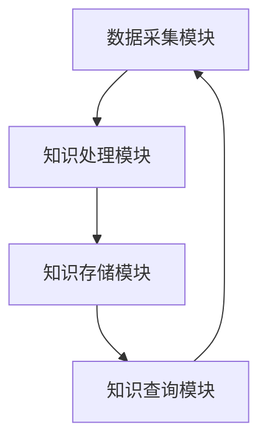

                 


# 设计AI Agent的动态知识库更新机制

**关键词**：AI Agent，动态知识库，知识更新，知识表示，机器学习，自然语言处理，数据库管理

**摘要**：  
随着人工智能技术的快速发展，AI Agent（智能体）在各个领域的应用越来越广泛。为了适应复杂动态环境的需求，AI Agent需要具备动态更新知识库的能力。本文深入探讨了AI Agent动态知识库更新机制的设计原理，从知识表示、更新策略到算法实现，详细分析了动态知识库的构建与优化方法。结合实际案例和系统架构设计，本文为读者提供了一套完整的动态知识库更新解决方案。

---

## 第一部分：AI Agent与动态知识库概述

### 第1章：AI Agent的基本概念

#### 1.1 AI Agent的定义
AI Agent是指具有感知环境、自主决策、执行任务能力的智能实体。它能够通过与环境交互，获取信息并采取行动以实现目标。

#### 1.2 AI Agent的核心特征
- **自主性**：能够自主决策和行动。
- **反应性**：能够实时感知环境变化并做出反应。
- **知识表示**：通过知识库存储和表示相关信息。
- **学习能力**：能够通过经验或数据更新知识库。

#### 1.3 AI Agent的应用场景
- 智能助手（如Siri、Alexa）。
- 自动驾驶系统。
- 智能推荐系统。
- 机器人控制。

---

### 第2章：动态知识库的基本概念

#### 2.1 动态知识库的定义
动态知识库是指能够根据环境变化和新信息实时更新知识内容的数据库。与静态知识库相比，动态知识库具有更强的适应性和灵活性。

#### 2.2 动态知识库的特点
- **动态性**：能够实时更新和扩展。
- **多样性**：支持多种数据类型和格式。
- **自适应性**：能够根据需求自动调整知识结构。

#### 2.3 动态知识库的应用价值
- 提高AI Agent的决策效率和准确性。
- 支持复杂环境下的实时任务执行。
- 适应数据变化和用户需求的动态调整。

---

## 第二部分：动态知识库更新机制的核心概念

### 第3章：动态知识库更新机制的背景与问题

#### 3.1 动态知识库更新的背景
随着AI Agent应用场景的扩展，知识库的动态更新需求日益迫切。传统静态知识库难以适应复杂多变的环境，动态知识库更新机制成为必然选择。

#### 3.2 动态知识库更新的核心问题
- **知识表示**：如何有效表示和存储动态知识。
- **更新触发**：如何确定何时需要更新知识库。
- **知识验证**：如何确保新知识的准确性和一致性。

#### 3.3 动态知识库更新的挑战
- 数据来源多样，质量参差不齐。
- 知识更新可能导致原有逻辑冲突。
- 更新机制的效率和实时性要求高。

---

### 第4章：动态知识库更新机制的核心概念与联系

#### 4.1 知识表示与存储
- **符号表示**：使用符号逻辑表示知识，如规则、谓词等。
- **向量表示**：使用向量空间模型表示知识，如词嵌入（Word2Vec）。
- **知识图谱**：使用图结构表示实体及其关系。

#### 4.2 知识更新的触发条件
- **时间触发**：定期更新知识库。
- **事件触发**：检测到特定事件后触发更新。
- **用户触发**：根据用户输入或反馈触发更新。

#### 4.3 知识验证与校准
- **冲突检测**：检测新知识与现有知识的冲突。
- **校准方法**：通过规则、推理或机器学习模型调整知识。

#### 4.4 动态知识库与静态知识库对比
| 特性             | 静态知识库           | 动态知识库           |
|------------------|--------------------|--------------------|
| 数据更新         | 不支持实时更新       | 支持实时更新         |
| 数据结构         | 固定结构             | 动态调整结构         |
| 应用场景         | 简单查询场景         | 复杂动态场景         |

---

## 第三部分：动态知识库更新机制的算法原理

### 第5章：动态知识库更新的算法原理

#### 5.1 知识表示与更新算法
- **符号表示更新**：通过逻辑推理更新符号知识。
- **向量表示更新**：通过增量学习更新向量表示。
- **知识图谱更新**：通过SPARQL等语句更新知识图谱。

#### 5.2 知识更新的流程
1. **数据预处理**：清洗和转换新数据。
2. **冲突检测**：检查新知识与现有知识是否冲突。
3. **知识校准**：通过规则或模型调整新知识。
4. **知识存储**：将更新后的知识存入知识库。

#### 5.3 算法实现示例
```python
def update_knowledge_base(new_knowledge, knowledge_base):
    # 数据预处理
    processed_data = preprocess(new_knowledge)
    # 冲突检测
    if has_conflict(processed_data, knowledge_base):
        # 知识校准
        calibrated_data = calibrate(processed_data, knowledge_base)
    else:
        calibrated_data = processed_data
    # 知识存储
    knowledge_base.update(calibrated_data)
    return knowledge_base
```

#### 5.4 知识更新的数学模型
知识更新的校准过程可以表示为一个优化问题：
$$ \min_{x} \sum_{i=1}^{n} (x_i - y_i)^2 $$
其中，$x_i$是新知识的参数，$y_i$是现有知识的参数。

---

## 第四部分：动态知识库更新机制的系统架构设计

### 第6章：动态知识库更新的系统架构

#### 6.1 系统功能模块
- **数据采集模块**：采集新知识数据。
- **知识处理模块**：预处理和校准新知识。
- **知识存储模块**：存储和更新知识库。
- **知识查询模块**：支持实时查询和检索。

#### 6.2 系统架构设计


#### 6.3 接口设计与交互
- **数据接口**：定义数据格式和接口规范。
- **查询接口**：支持SQL或SPARQL查询。

---

## 第五部分：动态知识库更新机制的优化与扩展

### 第7章：动态知识库更新的优化方法

#### 7.1 知识更新的效率优化
- **增量更新**：仅更新变化的部分。
- **并行处理**：利用多线程或分布式计算加速更新。

#### 7.2 知识更新的鲁棒性提升
- **冗余检测**：避免重复知识。
- **错误恢复**：检测并修复更新过程中的错误。

#### 7.3 知识库的扩展方法
- **分布式存储**：利用分布式数据库扩展存储能力。
- **异构数据整合**：支持多种数据源的整合。

---

## 第六部分：动态知识库更新机制的总结与展望

### 第8章：总结与展望

#### 8.1 本章总结
本文系统性地探讨了AI Agent动态知识库更新机制的设计与实现，从知识表示、更新算法到系统架构，为读者提供了一套完整的解决方案。

#### 8.2 未来展望
未来，动态知识库更新机制将在以下几个方向进一步发展：
- **智能自适应**：基于反馈和学习实现自适应更新。
- **边缘计算**：结合边缘计算提升更新效率。
- **人机协作**：结合人类专家的知识进行协同更新。

---

**作者：AI天才研究院/AI Genius Institute & 禅与计算机程序设计艺术 /Zen And The Art of Computer Programming**

---

以上是文章的详细目录和部分内容，具体内容可以根据上述结构进行扩展和详细撰写。

