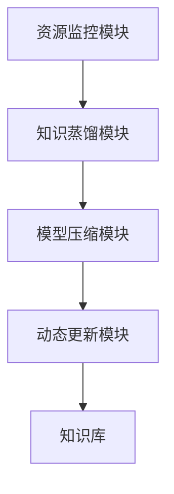

                 


# 设计AI Agent的动态知识蒸馏与压缩

## 关键词：
- AI Agent
- 知识蒸馏
- 模型压缩
- 动态知识更新
- 智能系统优化

## 摘要：
本文详细探讨了设计AI Agent的动态知识蒸馏与压缩技术。从背景介绍、核心概念到算法原理、系统架构，再到项目实战和最佳实践，全面解析了如何高效地蒸馏和压缩AI Agent的知识，确保其在资源受限环境下的高效运行与实时更新。

---

## 第一部分：背景介绍

### 第1章：AI Agent概述

#### 1.1 AI Agent的基本概念
AI Agent（人工智能代理）是一种能够感知环境并采取行动以实现目标的智能实体。它可以自主决策、与环境交互，并通过学习和推理提升自身的智能水平。AI Agent广泛应用于自动驾驶、智能助手、推荐系统等领域。

#### 1.2 动态知识蒸馏与压缩的背景
随着AI技术的发展，模型的复杂性和参数规模急剧增加。然而，在资源受限的场景（如移动设备、边缘计算）中，大型模型难以高效运行。知识蒸馏与模型压缩技术成为解决这一问题的关键。动态知识蒸馏与压缩技术通过将大型模型的知识迁移到小模型，并在运行过程中实时更新知识，确保AI Agent的高效性和适应性。

#### 1.3 动态知识蒸馏与压缩的重要性
动态知识蒸馏与压缩技术能够显著降低AI Agent的计算资源消耗，同时保持其性能。通过动态更新知识，AI Agent能够适应不断变化的环境，提升其在实际应用中的表现。

---

## 第二部分：核心概念与联系

### 第3章：动态知识蒸馏与压缩的核心原理

#### 3.1 知识蒸馏的原理
知识蒸馏是一种将复杂模型的知识迁移到简单模型的技术。其核心原理是通过教师模型（Teacher）指导学生模型（Student），使学生模型学习教师模型的决策边界。知识蒸馏通常涉及软目标标签、注意力机制等方法，以实现知识的有效迁移。

#### 3.2 模型压缩的核心原理
模型压缩通过减少模型的参数数量和计算复杂度，降低其资源占用。常用的技术包括剪枝（去除冗余参数）、量化（降低参数精度）、知识蒸馏等。模型压缩的目标是在保持或提升性能的同时，显著减少模型的存储和计算需求。

#### 3.3 动态知识更新的机制
动态知识更新是指AI Agent在运行过程中实时更新其知识库，以适应新数据和环境变化。这一机制结合了在线学习和流数据处理技术，确保AI Agent的知识始终处于最新状态。

---

## 第三部分：算法原理

### 第5章：动态知识蒸馏与压缩的算法实现

#### 5.1 知识蒸馏算法的实现
知识蒸馏算法通常包括以下步骤：
1. 训练教师模型。
2. 使用教师模型的输出作为软目标标签，训练学生模型。
3. 调整蒸馏温度和损失函数，优化学生模型的性能。

以下是一个简单的知识蒸馏算法示例（使用PyTorch）：

```python
import torch
import torch.nn as nn
import torch.optim as optim

# 定义教师模型和学生模型
class TeacherModel(nn.Module):
    def __init__(self):
        super(TeacherModel, self).__init__()
        self.fc = nn.Linear(10, 5, bias=False)

class StudentModel(nn.Module):
    def __init__(self):
        super(StudentModel, self).__init__()
        self.fc = nn.Linear(10, 5, bias=False)

# 初始化模型
teacher = TeacherModel()
student = StudentModel()

# 定义蒸馏损失函数
def distillation_loss(outputs_student, outputs_teacher, alpha=0.5, temperature=3):
    loss_kd = nn.KLDivLoss(reduction='batchmean')(F.log_softmax(outputs_student/temperature, dim=1),
                                                    F.softmax(outputs_teacher/temperature, dim=1)) * (alpha * temperature * temperature)
    return loss_kd

# 定义优化器
optimizer = optim.Adam(student.parameters(), lr=0.001)

# 训练循环
for epoch in range(num_epochs):
    optimizer.zero_grad()
    inputs = ...  # 输入数据
    labels = ...  # 标签
    
    with torch.no_grad():
        teacher_outputs = teacher(inputs)
    
    student_outputs = student(inputs)
    
    loss = distillation_loss(student_outputs, teacher_outputs)
    loss.backward()
    optimizer.step()
```

#### 5.2 模型压缩算法的实现
模型压缩可以通过剪枝和量化技术实现。以下是一个简单的剪枝算法示例：

```python
import torch

# 定义一个简单的卷积神经网络
class SimpleCNN(nn.Module):
    def __init__(self):
        super(SimpleCNN, self).__init__()
        self.conv1 = nn.Conv2d(3, 6, 5)
        self.pool = nn.MaxPool2d(2, 2)
        self.conv2 = nn.Conv2d(6, 16, 5)
        self.fc1 = nn.Linear(16 * 5 * 5, 120)
        self.fc2 = nn.Linear(120, 84)
        self.fc3 = nn.Linear(84, 10)

# 初始化模型
model = SimpleCNN()

# 剪枝函数
def prune_model(model):
    for param in model.named_parameters():
        if 'conv' in param[0]:
            # 剪枝卷积层
            mask = torch.zeros_like(param[1].data)
            mask[torch.abs(param[1].data) > 0.1] = 1.0
            param[1].data.mul_(mask)

prune_model(model)
```

---

## 第四部分：系统分析与架构设计

### 第7章：动态知识蒸馏与压缩系统的架构设计

#### 7.1 问题场景分析
在资源受限的环境中，AI Agent需要高效运行并实时更新知识。动态知识蒸馏与压缩系统需要解决以下问题：
- 如何高效地将知识从大型模型迁移到小型模型。
- 如何在运行过程中实时更新知识，确保AI Agent的适应性。

#### 7.2 系统功能设计
系统功能包括：
1. 知识蒸馏模块：负责将教师模型的知识迁移到学生模型。
2. 模型压缩模块：负责压缩模型的参数和计算复杂度。
3. 动态更新模块：负责实时更新知识库。
4. 资源监控模块：监控资源使用情况，动态调整模型。

#### 7.3 系统架构设计
以下是系统的架构图（使用mermaid）：



---

## 第五部分：项目实战

### 第9章：动态知识蒸馏与压缩的项目实现

#### 9.1 环境安装
需要安装以下工具：
- Python 3.6+
- PyTorch 1.0+
- numpy
- mermaid

安装命令：
```bash
pip install torch numpy mermaid
```

#### 9.2 核心代码实现
以下是动态知识蒸馏与压缩的核心代码：

```python
import torch
import torch.nn as nn
import torch.optim as optim
import numpy as np

# 定义教师模型和学生模型
class TeacherModel(nn.Module):
    def __init__(self):
        super(TeacherModel, self).__init__()
        self.fc = nn.Linear(10, 5, bias=False)

class StudentModel(nn.Module):
    def __init__(self):
        super(StudentModel, self).__init__()
        self.fc = nn.Linear(10, 5, bias=False)

# 初始化模型
teacher = TeacherModel()
student = StudentModel()

# 定义蒸馏损失函数
def distillation_loss(outputs_student, outputs_teacher, alpha=0.5, temperature=3):
    loss_kd = nn.KLDivLoss(reduction='batchmean')(F.log_softmax(outputs_student/temperature, dim=1),
                                                    F.softmax(outputs_teacher/temperature, dim=1)) * (alpha * temperature * temperature)
    return loss_kd

# 定义优化器
optimizer = optim.Adam(student.parameters(), lr=0.001)

# 训练循环
num_epochs = 10
for epoch in range(num_epochs):
    optimizer.zero_grad()
    inputs = torch.randn(10, 10)  # 示例输入
    labels = torch.randint(0, 5, (10,))  # 示例标签
    
    with torch.no_grad():
        teacher_outputs = teacher(inputs)
    
    student_outputs = student(inputs)
    
    loss = distillation_loss(student_outputs, teacher_outputs)
    loss.backward()
    optimizer.step()
```

#### 9.3 案例分析
通过上述代码实现动态知识蒸馏与压缩，可以显著降低AI Agent的计算资源消耗，同时保持其性能。例如，在图像分类任务中，学生模型在蒸馏后的准确率可以达到与教师模型相当的水平，同时参数数量大幅减少。

---

## 第六部分：最佳实践

### 第10章：动态知识蒸馏与压缩的最佳实践

#### 10.1 小结
本文详细介绍了设计AI Agent的动态知识蒸馏与压缩技术，包括背景、核心概念、算法原理、系统架构和项目实战。通过这些内容，读者可以掌握动态知识蒸馏与压缩的核心思想和技术实现。

#### 10.2 注意事项
- 在实际应用中，需要根据具体场景选择合适的蒸馏和压缩方法。
- 动态知识更新需要考虑数据流和模型更新的实时性。
- 建议结合具体任务优化算法，以达到最佳性能。

#### 10.3 拓展阅读
- "Distilling the Knowledge in Neural Networks"（Hinton et al., 2015）
- "Model Compression"（LeCun et al., 1990）

---

## 作者：AI天才研究院/AI Genius Institute & 禅与计算机程序设计艺术 /Zen And The Art of Computer Programming

---

### 文章结束

