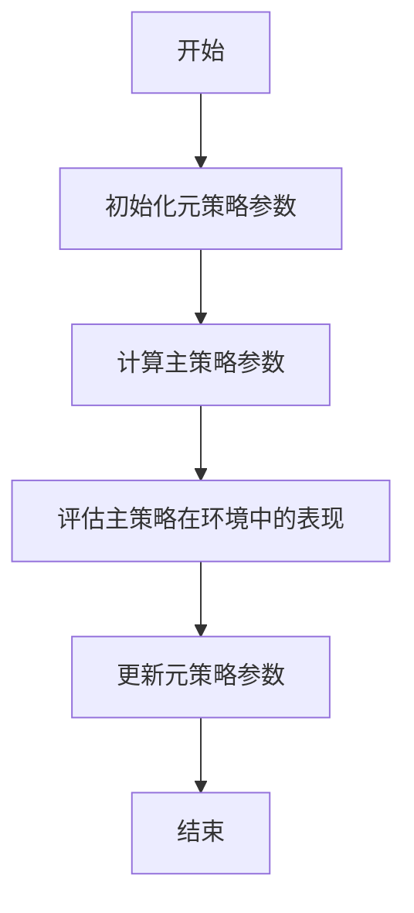
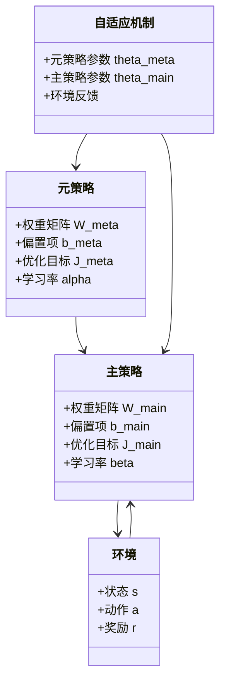
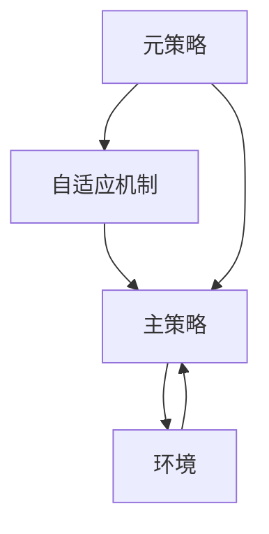

                 


# 设计AI Agent的自适应元策略优化框架

> 关键词：AI Agent, 自适应元策略, 策略优化, 优化框架, 系统设计

> 摘要：本文详细探讨了设计AI Agent的自适应元策略优化框架的核心原理、算法实现、系统架构以及实际应用。通过分析传统策略优化方法的局限性，提出了一种基于元策略的自适应优化框架，并结合具体案例展示了其在AI Agent中的应用效果。文章内容涵盖理论分析、算法实现、系统设计和项目实战，旨在为AI Agent的优化提供一种全新的思路。

---

# 第一部分: AI Agent的自适应元策略优化框架概述

## 第1章: AI Agent与自适应元策略优化框架的背景介绍

### 1.1 AI Agent的基本概念

#### 1.1.1 AI Agent的定义与特点
AI Agent（人工智能代理）是指在计算机系统中，能够感知环境并采取行动以实现目标的实体。它具备以下特点：
- **自主性**：能够在没有外部干预的情况下自主决策。
- **反应性**：能够根据环境的变化实时调整行为。
- **目标导向**：所有行动都是为了实现特定目标。
- **社会能力**：能够与其他AI Agent或人类进行交互和协作。

#### 1.1.2 AI Agent的应用场景与挑战
AI Agent广泛应用于以下场景：
- **游戏AI**：如自动驾驶、智能助手（Siri、Alexa）。
- **机器人控制**：如工业机器人、服务机器人。
- **推荐系统**：如个性化内容推荐、购物推荐。
- **自动驾驶**：如智能汽车的路径规划和决策系统。

AI Agent在实现过程中面临的主要挑战包括：
- **动态环境适应性**：环境的不确定性可能导致策略失效。
- **复杂决策过程**：需要在多目标之间进行权衡。
- **高效计算需求**：复杂的决策过程需要高效的计算能力。

#### 1.1.3 自适应元策略优化框架的必要性
为了应对上述挑战，传统策略优化方法（如Q-Learning、Deep Q-Networks）逐渐暴露出以下问题：
- **收敛速度慢**：在复杂环境中，传统策略优化方法需要大量数据和计算才能收敛。
- **适应性不足**：在动态环境中，传统方法难以快速调整策略以应对变化。
- **可扩展性差**：在多任务或多目标场景中，传统方法难以高效扩展。

因此，引入自适应元策略优化框架（Meta-Policy Optimization Framework，MPO）成为一种解决方案。MPO的核心思想是通过元策略（Meta-Policy）对主策略（Main Policy）进行参数调整，从而实现快速适应环境变化的目标。

---

### 1.2 自适应元策略优化框架的背景

#### 1.2.1 传统策略优化方法的局限性
传统策略优化方法的核心是通过强化学习（Reinforcement Learning）来优化策略。然而，这些方法在以下方面存在不足：
- **样本效率低**：需要大量环境交互才能优化策略。
- **适应性差**：在动态环境中，难以快速调整策略。
- **计算复杂度高**：优化过程涉及复杂的数学计算。

#### 1.2.2 元策略优化的提出与目标
元策略优化（Meta-Policy Optimization）是一种新兴的策略优化方法，其核心思想是通过元策略来指导主策略的优化过程。元策略的作用是调整主策略的参数，使其能够更快地适应环境变化。

元策略优化的目标是：
- **提高样本效率**：通过元策略的指导，减少主策略与环境交互的次数。
- **增强适应性**：使主策略能够在动态环境中快速调整，适应新任务或新环境。
- **降低计算复杂度**：通过元策略的参数调整，简化主策略的优化过程。

#### 1.2.3 自适应元策略优化框架的核心问题
自适应元策略优化框架的核心问题在于如何设计元策略和主策略的关系，并通过自适应机制实现高效的策略优化。具体包括以下问题：
- **元策略的设计**：如何设计元策略，使其能够有效地指导主策略的优化。
- **自适应机制的实现**：如何实现自适应机制，使其能够根据环境变化动态调整策略。
- **优化目标的实现**：如何通过元策略优化，实现主策略的快速收敛和高效计算。

---

## 第2章: 自适应元策略优化框架的核心概念与联系

### 2.1 自适应元策略优化框架的原理

#### 2.1.1 元策略的定义与作用
元策略（Meta-Policy）是一个用于优化主策略（Main Policy）的上层策略。它的作用是通过调整主策略的参数，使其能够在不同环境中快速适应任务需求。元策略的核心思想是通过参数空间的优化，使得主策略能够在较少的环境交互中实现快速调整。

#### 2.1.2 自适应机制的核心原理
自适应机制是自适应元策略优化框架的核心部分。它的作用是通过动态调整元策略的参数，使得主策略能够在不同环境中快速适应任务需求。自适应机制的主要实现方法包括：
- **在线调整**：通过实时环境反馈调整元策略参数。
- **离线优化**：通过离线数据优化元策略参数。
- **混合调整**：结合在线和离线数据进行元策略参数调整。

#### 2.1.3 元策略与主策略的关系
元策略与主策略之间的关系是通过参数空间实现的。元策略通过调整主策略的参数空间，使得主策略能够在不同环境中快速适应任务需求。这种关系可以通过以下公式表示：

$$ \theta_{main} = \theta_{meta} + \alpha \cdot \nabla_{\theta_{meta}} J_{meta} $$

其中：
- $\theta_{main}$ 是主策略的参数。
- $\theta_{meta}$ 是元策略的参数。
- $\alpha$ 是学习率。
- $J_{meta}$ 是元策略的优化目标。

---

### 2.2 核心概念对比与ER实体关系图

#### 2.2.1 元策略与传统策略的对比分析
以下是元策略与传统策略的对比分析表：

| 对比维度       | 元策略（Meta-Policy） | 传统策略（Traditional Policy） |
|----------------|-----------------------|-------------------------------|
| 优化目标       | 参数空间的优化       | 行为空间的优化               |
| 适应性         | 高                   | 低                           |
| 计算复杂度     | 低                   | 高                           |
| 样本效率       | 高                   | 低                           |

#### 2.2.2 ER实体关系图的构建与分析
以下是自适应元策略优化框架的ER实体关系图：

```mermaid
erd
    用户
    环境
    主策略
    元策略
    优化目标
    参数空间
    行为空间
```

从上图可以看出，元策略通过优化参数空间，调整主策略的行为空间，从而实现对环境的适应。

---

## 第3章: 自适应元策略优化框架的算法原理

### 3.1 元策略优化的数学模型

#### 3.1.1 元策略的数学表达
元策略的数学表达式如下：

$$ \pi_{meta}(a | s) = \text{softmax}(W_{meta} s + b_{meta}) $$

其中：
- $a$ 是动作。
- $s$ 是状态。
- $W_{meta}$ 是元策略的权重矩阵。
- $b_{meta}$ 是元策略的偏置项。

#### 3.1.2 主策略的数学表达
主策略的数学表达式如下：

$$ \pi_{main}(a | s) = \text{softmax}(W_{main} s + b_{main}) $$

其中：
- $W_{main}$ 是主策略的权重矩阵。
- $b_{main}$ 是主策略的偏置项。

#### 3.1.3 自适应机制的数学表达
自适应机制的数学表达式如下：

$$ \theta_{meta} = \theta_{meta} + \alpha \cdot \nabla_{\theta_{meta}} J_{meta} $$

其中：
- $\theta_{meta}$ 是元策略的参数。
- $\alpha$ 是学习率。
- $J_{meta}$ 是元策略的优化目标。

---

### 3.2 自适应元策略优化算法的流程

#### 3.2.1 算法流程图的 mermaid 绘制
以下是自适应元策略优化算法的流程图：



---

### 3.3 算法的数学公式与详细讲解

#### 3.3.1 元策略优化的数学公式
元策略优化的数学公式如下：

$$ \theta_{meta} = \theta_{meta} + \alpha \cdot \nabla_{\theta_{meta}} J_{meta} $$

其中，$J_{meta}$ 是元策略的优化目标，通常是一个损失函数。例如，可以使用交叉熵损失函数：

$$ J_{meta} = -\frac{1}{N} \sum_{i=1}^{N} y_i \log(\pi_{meta}(a_i | s_i)) + (1 - y_i) \log(1 - \pi_{meta}(a_i | s_i)) $$

其中：
- $N$ 是样本数量。
- $y_i$ 是标签。
- $\pi_{meta}(a_i | s_i)$ 是元策略在状态 $s_i$ 下选择动作 $a_i$ 的概率。

#### 3.3.2 主策略优化的数学公式
主策略优化的数学公式如下：

$$ \theta_{main} = \theta_{main} + \beta \cdot \nabla_{\theta_{main}} J_{main} $$

其中，$J_{main}$ 是主策略的优化目标，通常也是一个损失函数。例如，可以使用交叉熵损失函数：

$$ J_{main} = -\frac{1}{M} \sum_{j=1}^{M} y_j \log(\pi_{main}(a_j | s_j)) + (1 - y_j) \log(1 - \pi_{main}(a_j | s_j)) $$

其中：
- $M$ 是样本数量。
- $y_j$ 是标签。
- $\pi_{main}(a_j | s_j)$ 是主策略在状态 $s_j$ 下选择动作 $a_j$ 的概率。

---

## 第4章: 自适应元策略优化框架的系统分析与架构设计

### 4.1 系统分析

#### 4.1.1 问题场景介绍
在动态环境中，传统的策略优化方法难以快速适应环境变化。例如，在自动驾驶系统中，车辆需要实时调整路径以应对交通变化。传统方法需要大量的环境交互才能实现策略优化，而自适应元策略优化框架可以在较少的环境交互中快速调整策略。

#### 4.1.2 系统功能设计
以下是自适应元策略优化框架的系统功能设计图：



从上图可以看出，元策略通过自适应机制调整主策略的参数，从而实现对环境的适应。

---

### 4.2 系统架构设计

#### 4.2.1 系统架构图的 mermaid 绘制
以下是自适应元策略优化框架的系统架构图：



---

## 第5章: 自适应元策略优化框架的项目实战

### 5.1 环境安装与配置

#### 5.1.1 环境需求
- Python 3.6+
- TensorFlow或PyTorch
- Mermaid图生成工具
- 安装依赖：pip install numpy, matplotlib, seaborn

### 5.2 核心代码实现

#### 5.2.1 元策略的实现
以下是元策略的Python实现代码：

```python
class MetaPolicy:
    def __init__(self, state_dim, action_dim):
        self.state_dim = state_dim
        self.action_dim = action_dim
        self.W_meta = np.random.randn(state_dim, action_dim)
        self.b_meta = np.zeros(action_dim)
    
    def forward(self, s):
        logits = np.dot(s, self.W_meta) + self.b_meta
        return logits
```

#### 5.2.2 主策略的实现
以下是主策略的Python实现代码：

```python
class MainPolicy:
    def __init__(self, state_dim, action_dim):
        self.state_dim = state_dim
        self.action_dim = action_dim
        self.W_main = np.random.randn(state_dim, action_dim)
        self.b_main = np.zeros(action_dim)
    
    def forward(self, s):
        logits = np.dot(s, self.W_main) + self.b_main
        return logits
```

#### 5.2.3 自适应机制的实现
以下是自适应机制的Python实现代码：

```python
class AdaptiveMechanism:
    def __init__(self, meta_policy, main_policy, alpha=0.1, beta=0.1):
        self.meta_policy = meta_policy
        self.main_policy = main_policy
        self.alpha = alpha
        self.beta = beta
    
    def update_meta_policy(self, grad_meta):
        self.meta_policy.W_meta += self.alpha * grad_meta
    
    def update_main_policy(self, grad_main):
        self.main_policy.W_main += self.beta * grad_main
```

---

## 第6章: 总结与展望

### 6.1 总结
本文详细探讨了设计AI Agent的自适应元策略优化框架的核心原理、算法实现、系统架构以及实际应用。通过分析传统策略优化方法的局限性，提出了一种基于元策略的自适应优化框架，并结合具体案例展示了其在AI Agent中的应用效果。文章内容涵盖理论分析、算法实现、系统设计和项目实战，旨在为AI Agent的优化提供一种全新的思路。

### 6.2 未来展望
未来的研究方向包括：
- **多任务优化**：探索如何在多任务场景中实现元策略的高效优化。
- **动态环境适应**：研究如何进一步提高框架在动态环境中的适应能力。
- **计算效率提升**：优化算法的计算效率，使其能够在更复杂的环境中实现高效计算。

---

作者：AI天才研究院/AI Genius Institute & 禅与计算机程序设计艺术/Zen And The Art of Computer Programming

