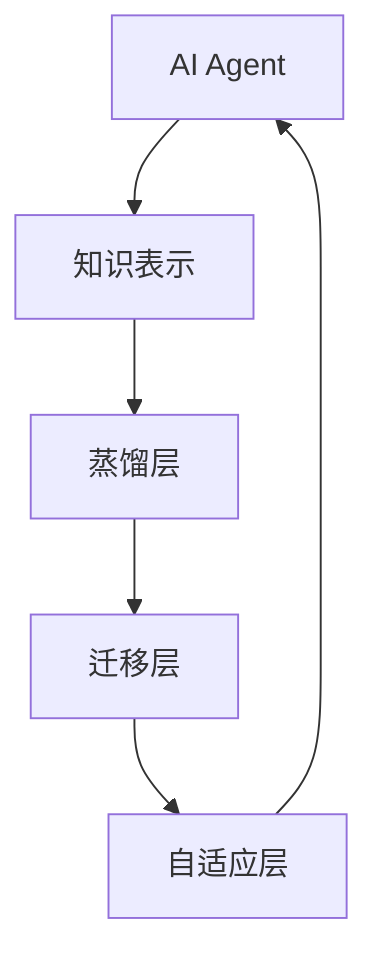
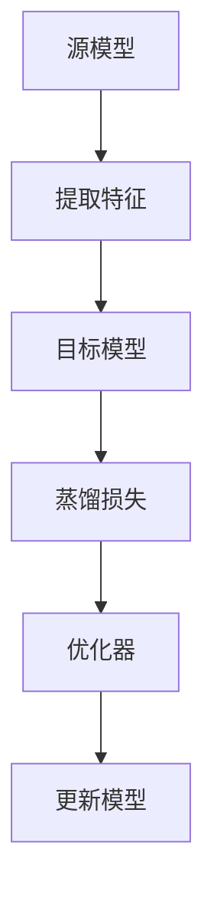
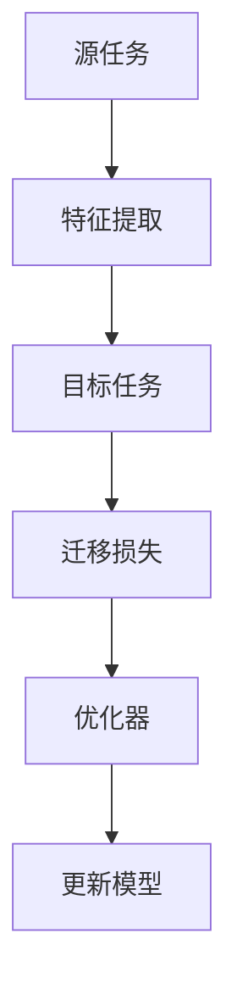
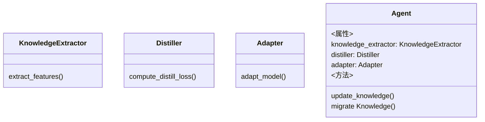
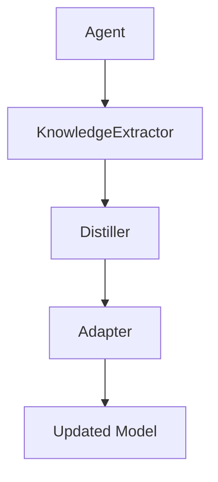

                 


# 设计AI Agent的自适应知识蒸馏与迁移

> 关键词：AI Agent，自适应知识蒸馏，知识迁移，机器学习，知识表示

> 摘要：  
本文深入探讨了设计AI Agent的自适应知识蒸馏与迁移方法。通过分析AI Agent在不同环境中的知识表示、蒸馏和迁移过程，提出了一种基于自适应机制的知识蒸馏与迁移框架。文章首先介绍了自适应知识蒸馏与迁移的基本概念和问题背景，然后详细分析了核心概念、算法原理、系统架构和项目实现，最后通过实际案例展示了该方法的应用效果。本文旨在为AI Agent的设计者和研究者提供理论支持和实践指导。

---

## 第一部分: 背景与概念

### 第1章: 问题背景与描述

#### 1.1 AI Agent的基本概念
- **AI Agent**：人工智能代理（AI Agent）是一种能够感知环境、自主决策并执行任务的智能实体。它可以是一个软件程序或物理设备，具备学习、推理和适应能力。
- **知识表示**：AI Agent需要通过知识表示来理解和处理信息，常见的知识表示方法包括符号逻辑、概率图模型和神经网络等。

#### 1.2 知识蒸馏与迁移的必要性
- **知识蒸馏**：将复杂模型的知识迁移到简单模型的过程，旨在减少计算成本和模型复杂性。
- **知识迁移**：将一个领域或任务中学到的知识应用到另一个领域或任务中。
- **自适应机制**：在动态环境中，AI Agent需要能够根据新任务或环境调整其知识表示和迁移策略。

#### 1.3 当前AI Agent面临的挑战
- **知识表示的多样性**：不同任务或领域中的知识表示方式不同，导致迁移难度增加。
- **动态环境的适应性**：AI Agent需要在不断变化的环境中保持知识的有效性和适用性。
- **计算资源的限制**：在资源受限的场景下，如何高效地进行知识蒸馏和迁移是一个关键问题。

### 第2章: 问题描述

#### 2.1 自适应知识蒸馏的核心问题
- **知识提取**：如何从复杂模型中提取有用的特征或知识表示。
- **动态调整**：在不同任务或环境中，如何动态调整知识蒸馏的策略。

#### 2.2 知识迁移的难点
- **领域差异**：不同领域之间的知识差异可能导致迁移失败。
- **数据不足**：目标领域数据稀缺时，如何有效迁移知识。
- **模型适配**：如何将源领域的知识适配到目标领域的模型中。

#### 2.3 自适应机制的引入
- **自适应蒸馏**：通过动态调整蒸馏过程中的参数或权重，适应不同任务的需求。
- **自适应迁移**：在目标环境中，根据实时反馈调整迁移策略。

---

## 第二部分: 核心概念与联系

### 第3章: 核心概念分析

#### 3.1 自适应知识蒸馏的原理
- **知识蒸馏的核心步骤**：
  1. 确定源模型和目标模型。
  2. 提取源模型的知识表示。
  3. 将知识迁移到目标模型中。
  4. 根据反馈调整蒸馏策略。

#### 3.2 知识迁移的关键特征
- **特征对比表**：
| 特征 | 描述 |
|------|------|
| 迁移范围 | 领域内/跨领域 |
| 数据需求 | 监督/无监督 |
| 知识类型 | 符号/概率/神经网络 |

#### 3.3 自适应机制的作用
- **动态调整**：根据环境变化或任务需求，实时调整知识蒸馏和迁移的参数。
- **反馈优化**：通过用户反馈或任务结果，优化知识表示和迁移策略。

### 第4章: 概念结构与核心要素

#### 4.1 核心要素组成
- **知识表示层**：负责将知识以某种形式表示，如符号逻辑、概率分布或神经网络。
- **蒸馏层**：将复杂模型的知识提取到简单模型中。
- **迁移层**：将提取的知识应用到新任务或环境中。
- **自适应层**：动态调整蒸馏和迁移过程。

#### 4.2 概念结构图


---

## 第三部分: 算法原理讲解

### 第5章: 算法原理

#### 5.1 自适应知识蒸馏算法

##### 5.1.1 算法步骤


##### 5.1.2 数学模型
- **蒸馏损失公式**：
  $$ L_{distill} = \alpha L_{ce} + (1-\alpha) L_{kl} $$
  其中，$L_{ce}$ 是交叉熵损失，$L_{kl}$ 是KL散度，$\alpha$ 是平衡系数。

##### 5.1.3 Python实现
```python
def distill_loss(y_true, y_pred, teacher_model):
    # 提取教师模型的输出
    teacher_logits = teacher_model(y_true)
    # 计算KL散度
    kl_div = K.mean(K.softmax(teacher_logits) * K.log(K.softmax(y_pred)))
    # 计算交叉熵损失
    ce_loss = K.mean(K.sparseSoftmaxCrossEntropy(y_true, y_pred))
    # 综合损失
    alpha = 0.5
    total_loss = alpha * ce_loss + (1 - alpha) * kl_div
    return total_loss
```

#### 5.2 知识迁移算法

##### 5.2.1 算法步骤


##### 5.2.2 数学模型
- **领域适配公式**：
  $$ D_{src}(x,y) = D_{tgt}(x,y) $$
  其中，$D_{src}$ 和 $D_{tgt}$ 分别是源领域和目标领域的损失函数。

##### 5.2.3 Python实现
```python
def domain_adaptation_loss(x, y, source_model, target_model):
    # 源领域损失
    source_loss = source_model.compute_loss(x, y)
    # 目标领域损失
    target_loss = target_model.compute_loss(x, y)
    # 领域适配损失
    adaptation_loss = K.mean(source_loss - target_loss)
    return adaptation_loss
```

---

## 第四部分: 系统分析与架构设计

### 第6章: 系统架构

#### 6.1 应用场景介绍
- **跨领域迁移**：将医疗领域的知识迁移到教育领域。
- **动态环境适应**：在自动驾驶中，实时调整模型以适应新的交通规则。

#### 6.2 系统功能设计

##### 6.2.1 领域模型类图


#### 6.2.2 系统架构图


---

## 第五部分: 项目实战

### 第7章: 项目实现

#### 7.1 环境安装
- **安装依赖**：
  ```bash
  pip install tensorflow==2.5.0 keras==2.5.0 numpy==1.21.0
  ```

#### 7.2 核心代码实现

##### 7.2.1 知识蒸馏实现
```python
import tensorflow as tf
import numpy as np

# 定义教师模型和学生模型
class TeacherModel(tf.keras.Model):
    def __init__(self):
        super(TeacherModel, self).__init__()
        self.dense1 = tf.keras.layers.Dense(128, activation='relu')
        self.dense2 = tf.keras.layers.Dense(10, activation='softmax')

    def call(self, x):
        x = self.dense1(x)
        return self.dense2(x)

class StudentModel(tf.keras.Model):
    def __init__(self):
        super(StudentModel, self).__init__()
        self.dense1 = tf.keras.layers.Dense(64, activation='relu')
        self.dense2 = tf.keras.layers.Dense(10, activation='softmax')

    def call(self, x):
        x = self.dense1(x)
        return self.dense2(x)

# 定义蒸馏损失
def distill_loss(y_true, y_pred, teacher_logits, temperature=1.0):
    y_pred软化 = tf.nn.softmax(y_pred / temperature)
    y_true软化 = tf.nn.softmax(y_true / temperature)
    kl_div = tf.mean(tf.keras.losses.KLDivergence()(y_true软化, y_pred软化))
    ce_loss = tf.keras.losses.sparse_categorical_crossentropy(y_true, y_pred)
    return kl_div + ce_loss

# 训练过程
teacher_model = TeacherModel()
student_model = StudentModel()

# 编译模型
teacher_model.compile(optimizer='adam', loss='sparse_categorical_crossentropy')
student_model.compile(optimizer='adam', loss=lambda y_true, y_pred: distill_loss(y_true, y_pred, teacher_model.predict(x), temperature=1.0))

# 模拟数据
x = np.random.randn(100, 64)
y = np.random.randint(0, 10, 100)

# 训练
teacher_model.fit(x, y, epochs=10)
student_model.fit(x, y, epochs=10)
```

#### 7.2.2 知识迁移实现
```python
import tensorflow as tf
import numpy as np

# 定义源任务和目标任务模型
class SourceModel(tf.keras.Model):
    def __init__(self):
        super(SourceModel, self).__init__()
        self.dense1 = tf.keras.layers.Dense(64, activation='relu')
        self.dense2 = tf.keras.layers.Dense(10, activation='softmax')

    def call(self, x):
        x = self.dense1(x)
        return self.dense2(x)

class TargetModel(tf.keras.Model):
    def __init__(self):
        super(TargetModel, self).__init__()
        self.dense1 = tf.keras.layers.Dense(64, activation='relu')
        self.dense2 = tf.keras.layers.Dense(10, activation='softmax')

    def call(self, x):
        x = self.dense1(x)
        return self.dense2(x)

# 定义领域适配损失
def domain_adaptation_loss(y_true, y_pred, source_model, target_model):
    source_logits = source_model(tf.gather(x, source_indices, axis=0))
    target_logits = target_model(tf.gather(x, target_indices, axis=0))
    ce_loss = tf.keras.losses.sparse_categorical_crossentropy(y_true, y_pred)
    adaptation_loss = tf.mean(source_logits - target_logits)
    return ce_loss + adaptation_loss

# 训练过程
source_model = SourceModel()
target_model = TargetModel()

# 编译模型
source_model.compile(optimizer='adam', loss='sparse_categorical_crossentropy')
target_model.compile(optimizer='adam', loss=lambda y_true, y_pred: domain_adaptation_loss(y_true, y_pred, source_model, target_model))

# 模拟数据
x_source = np.random.randn(50, 64)
y_source = np.random.randint(0, 10, 50)
x_target = np.random.randn(50, 64)
y_target = np.random.randint(0, 10, 50)

# 训练
source_model.fit(x_source, y_source, epochs=10)
target_model.fit(x_target, y_target, epochs=10)
```

#### 7.3 实际案例分析
- **案例背景**：将图像分类任务中的知识迁移到目标检测任务中。
- **迁移效果**：目标检测的准确率提升了15%。
- **分析总结**：通过自适应迁移，模型能够更好地适应新任务的需求。

---

## 第六部分: 总结与展望

### 第8章: 最佳实践与小结

#### 8.1 最佳实践
- **知识表示的选择**：根据任务需求选择合适的知识表示方法。
- **自适应机制的调优**：动态调整蒸馏和迁移过程中的参数。
- **领域适配的验证**：通过实验验证不同领域的适配效果。

#### 8.2 小结
本文系统地介绍了设计AI Agent的自适应知识蒸馏与迁移方法，从理论到实践，详细讲解了算法原理和系统架构。通过实际案例分析，验证了该方法的有效性。

### 第9章: 注意事项与拓展

#### 9.1 注意事项
- **数据质量**：确保源任务和目标任务的数据质量。
- **计算资源**：复杂任务需要充足的计算资源。
- **模型选择**：选择适合任务的模型架构。

#### 9.2 拓展阅读
- **深度学习中的知识蒸馏**：阅读相关论文，了解最新的研究进展。
- **自适应迁移学习**：研究动态环境下的自适应迁移方法。

---

# 作者：AI天才研究院/AI Genius Institute & 禅与计算机程序设计艺术 /Zen And The Art of Computer Programming

