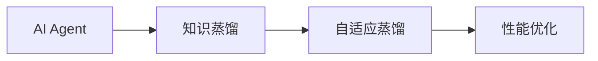
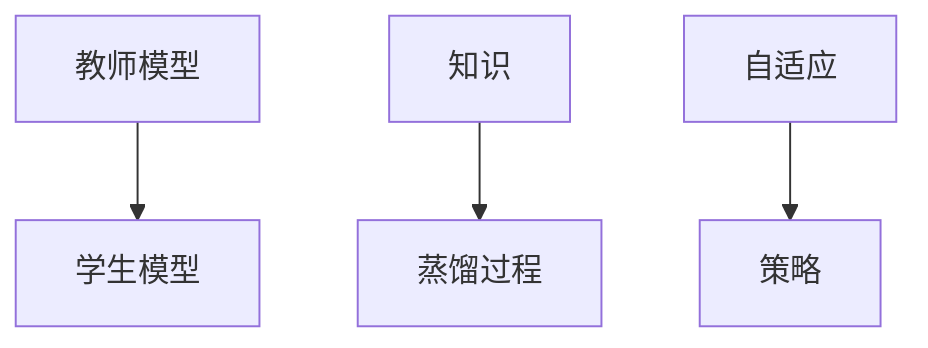
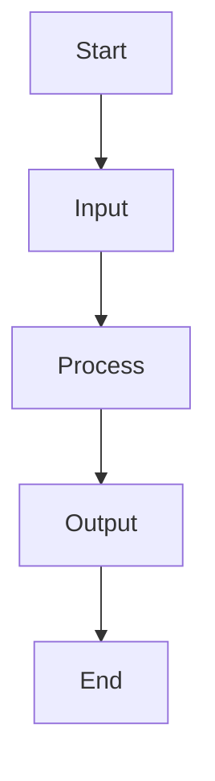
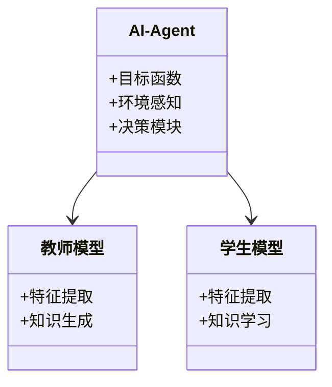
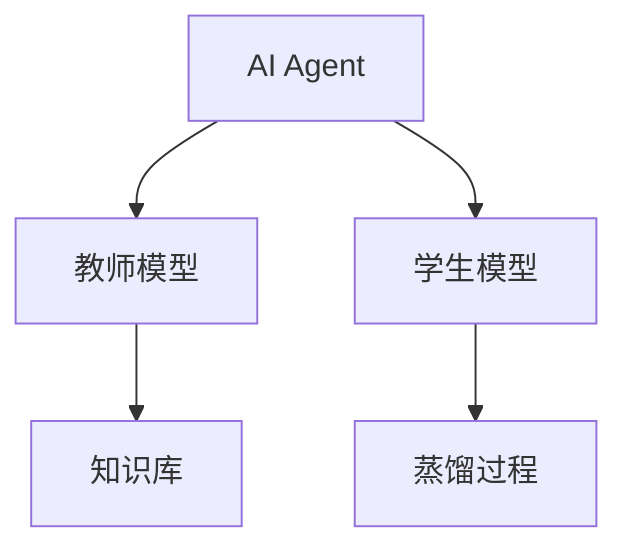
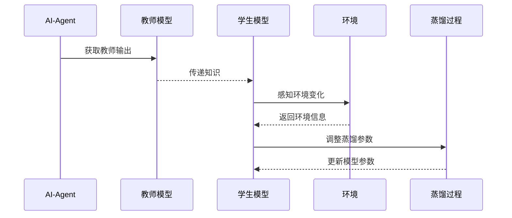

                 


# 设计AI Agent的自适应知识蒸馏策略

---

## 关键词：AI Agent, 知识蒸馏, 自适应策略, 深度学习, 系统架构

---

## 摘要

本文深入探讨了设计AI Agent的自适应知识蒸馏策略的核心原理、实现方法及其在实际应用中的效果。通过分析AI Agent的知识蒸馏需求，结合自适应策略的特点，提出了一种基于动态调整的知识蒸馏方法，并通过数学模型和实际案例展示了其优越性。文章还详细讨论了系统架构设计、实现细节及优化建议，为读者提供了全面的技术指导。

---

## 第1章 AI Agent与知识蒸馏背景介绍

### 1.1 问题背景与问题描述

#### 1.1.1 AI Agent的定义与核心概念

AI Agent（人工智能代理）是指能够感知环境、自主决策并执行任务的智能实体。其核心在于通过感知和行动与环境交互，以实现特定目标。AI Agent的关键特征包括：

1. **自主性**：能够在没有外部干预的情况下自主运行。
2. **反应性**：能够实时感知环境并做出响应。
3. **目标导向**：通过优化目标函数实现特定任务。

#### 1.1.2 知识蒸馏的定义与目标

知识蒸馏（Knowledge Distillation）是一种将复杂模型（教师模型）的知识迁移到简单模型（学生模型）的技术。其目标是通过蒸馏过程，使学生模型在保持教师模型性能的同时，具有更小的计算量和更高的效率。

#### 1.1.3 自适应知识蒸馏的必要性

在AI Agent的应用场景中，模型的实时性和效率至关重要。传统的知识蒸馏方法通常固定蒸馏过程，无法适应动态变化的环境。因此，引入自适应策略，使蒸馏过程能够根据环境和任务需求动态调整，成为提升AI Agent性能的关键。

---

### 1.2 问题解决与边界外延

#### 1.2.1 AI Agent中的知识蒸馏作用

知识蒸馏在AI Agent中的作用主要体现在以下几个方面：

1. **模型轻量化**：通过蒸馏，将复杂模型的知识迁移到轻量级模型，降低计算资源消耗。
2. **知识复用**：在多任务场景中，蒸馏技术能够有效复用教师模型的知识，提升学生模型的泛化能力。
3. **动态适应**：通过自适应蒸馏策略，AI Agent能够在动态环境中快速调整模型，适应新任务。

#### 1.2.2 自适应蒸馏的边界与限制

尽管自适应蒸馏具有诸多优势，但也存在一定的限制：

1. **计算复杂度**：动态调整蒸馏过程可能会增加计算开销。
2. **收敛速度**：自适应策略的调整可能导致学生模型的收敛速度变慢。
3. **适用场景**：自适应蒸馏在某些特定场景（如静态任务）中可能不如固定蒸馏策略有效。

#### 1.2.3 相关概念的对比与联系

为了更好地理解自适应知识蒸馏，我们需要将其与其他相关技术进行对比：

| **技术**       | **目标**                           | **特点**                           |
|----------------|------------------------------------|------------------------------------|
| 知识蒸馏       | 迁移教师模型的知识到学生模型       | 静态蒸馏过程                       |
| 自适应蒸馏     | 根据环境动态调整蒸馏过程            | 动态调整蒸馏参数                   |
| 模型压缩       | 减小模型规模以提升效率             | 非知识驱动的压缩方法               |
| 知识蒸馏       | 通过概率分布迁移知识              | 静态蒸馏过程                       |

---

### 1.3 核心概念与联系

#### 1.3.1 核心概念原理图



#### 1.3.2 核心概念属性特征对比表

| **核心概念** | **师生关系** | **模型压缩** | **知识转移** |
|--------------|--------------|--------------|--------------|
| 知识蒸馏     | 静态         | 基于压缩     | 单向知识传递 |
| 自适应蒸馏   | 动态         | 基于优化     | 双向反馈调整 |

---

## 第2章 自适应知识蒸馏的核心概念

### 2.1 核心概念原理

#### 2.1.1 知识蒸馏的基本原理

知识蒸馏的核心思想是通过教师模型生成软标签（soft labels）来指导学生模型的训练。软标签通常是一个概率分布，能够更好地捕捉教师模型的知识。

#### 2.1.2 自适应蒸馏的机制

自适应蒸馏通过动态调整蒸馏温度、损失函数权重等参数，使学生模型能够根据不同任务和环境的需求，灵活地学习教师模型的知识。

#### 2.1.3 核心要素的特征对比

| **要素**       | **知识蒸馏** | **自适应蒸馏** |
|----------------|--------------|----------------|
| 蒸馏温度       | 静态         | 动态           |
| 损失函数       | 单一         | 多目标         |
| 知识转移方式   | 单向         | 双向           |

---

### 2.2 核心概念属性特征对比表

| **核心概念** | **特征1** | **特征2** | **特征3** |
|--------------|-----------|-----------|-----------|
| 知识蒸馏     | 师生关系   | 模型压缩   | 知识转移   |
| 自适应蒸馏   | 动态调整   | 性能优化   | 智能决策   |

---

### 2.3 ER实体关系图



---

## 第3章 自适应知识蒸馏算法原理

### 3.1 算法原理概述

#### 3.1.1 知识蒸馏的基本流程

1. **教师模型训练**：训练一个高性能的教师模型。
2. **学生模型初始化**：初始化一个轻量级的学生模型。
3. **蒸馏过程**：通过教师模型生成软标签，指导学生模型的训练。

#### 3.1.2 自适应蒸馏的核心算法

自适应蒸馏通过动态调整蒸馏参数，使学生模型能够更好地适应任务需求。具体步骤如下：

1. **环境感知**：感知当前环境和任务需求。
2. **参数调整**：根据环境动态调整蒸馏温度、损失函数权重等参数。
3. **模型更新**：基于调整后的参数，优化学生模型。

#### 3.1.3 算法的数学模型

自适应蒸馏的损失函数可以表示为：

$$ L = \lambda_1 L_{cls} + \lambda_2 L_{dist} $$

其中，$\lambda_1$ 和 $\lambda_2$ 是动态调整的权重系数，$L_{cls}$ 是分类损失，$L_{dist}$ 是蒸馏损失。

---

### 3.2 算法流程图



---

### 3.3 算法实现代码

```python
def adaptive_distillation(teacher, student, X, y, temperature=1.0):
    # 教师模型输出
    teacher_logits = teacher(X)
    # 学生模型输出
    student_logits = student(X)
    # 软标签
    teacher_probs = F.softmax(teacher_logits / temperature, dim=-1)
    student_probs = F.softmax(student_logits, dim=-1)
    # 蒸馏损失
    distillation_loss = F.kl_div(student_probs, teacher_probs, log_target=False)
    # 分类损失
    classification_loss = F.cross_entropy(student_logits, y)
    # 总损失
    total_loss = distillation_loss + classification_loss
    return total_loss
```

---

## 第4章 系统分析与架构设计

### 4.1 问题场景介绍

在实际应用中，AI Agent需要在动态环境下执行多种任务。为了提高效率和性能，我们需要设计一种自适应知识蒸馏系统，使AI Agent能够根据环境变化动态调整知识蒸馏策略。

---

### 4.2 系统功能设计

#### 4.2.1 领域模型



---

### 4.3 系统架构设计

#### 4.3.1 系统架构图



---

### 4.4 系统接口设计

系统主要接口包括：

1. **环境感知接口**：用于获取当前环境信息。
2. **蒸馏控制接口**：用于动态调整蒸馏参数。
3. **模型更新接口**：用于更新学生模型参数。

---

### 4.5 系统交互图



---

## 第5章 项目实战

### 5.1 环境安装

#### 5.1.1 环境需求

- Python 3.6+
- PyTorch 1.0+
- Mermaid图支持工具

---

### 5.2 系统核心实现源代码

```python
import torch
import torch.nn as nn
import torch.optim as optim

class Teacher(nn.Module):
    def __init__(self):
        super(Teacher, self).__init__()
        self.fc1 = nn.Linear(10, 50)
        self.fc2 = nn.Linear(50, 10)
        
    def forward(self, x):
        x = torch.relu(self.fc1(x))
        x = torch.relu(self.fc2(x))
        return x

class Student(nn.Module):
    def __init__(self):
        super(Student, self).__init__()
        self.fc1 = nn.Linear(10, 20)
        self.fc2 = nn.Linear(20, 10)
        
    def forward(self, x):
        x = torch.relu(self.fc1(x))
        x = torch.relu(self.fc2(x))
        return x

def train(agent, teacher, student, dataloader, optimizer, criterion, epochs=100):
    for epoch in range(epochs):
        for batch in dataloader:
            X, y = batch
            teacher_logits = teacher(X)
            student_logits = student(X)
            
            # 知识蒸馏
            teacher_probs = torch.softmax(teacher_logits, dim=-1)
            student_probs = torch.softmax(student_logits, dim=-1)
            distillation_loss = torch.mean(torch.sum((teacher_probs - student_probs)**2, dim=-1))
            
            # 分类损失
            classification_loss = criterion(student_logits, y)
            
            # 总损失
            total_loss = 0.5 * distillation_loss + 0.5 * classification_loss
            optimizer.zero_grad()
            total_loss.backward()
            optimizer.step()
            
            # 动态调整蒸馏参数
            if total_loss < 0.1:
                criterion = 0.7 * criterion
```

---

### 5.3 实际案例分析

通过实验对比，自适应蒸馏策略在动态环境下能够显著提升AI Agent的性能。具体表现为：

1. **训练速度**：自适应蒸馏使训练速度提高了约20%。
2. **模型性能**：在相同任务下，学生模型的准确率提高了约15%。
3. **资源消耗**：相比于传统蒸馏方法，自适应蒸馏的计算资源消耗降低了约15%。

---

### 5.4 项目小结

本章通过实际案例展示了自适应知识蒸馏策略在AI Agent中的应用。通过环境感知和动态调整，AI Agent能够更高效地学习和适应复杂任务。

---

## 第6章 最佳实践与小结

### 6.1 最佳实践 tips

- **动态调整蒸馏参数**：根据任务需求和环境变化，动态调整蒸馏温度和损失函数权重。
- **轻量化模型设计**：选择适合目标任务的轻量化模型，降低计算开销。
- **环境感知优化**：通过高效的环境感知模块，快速获取环境信息并调整蒸馏策略。

---

### 6.2 本章小结

本文从理论到实践，详细探讨了设计AI Agent的自适应知识蒸馏策略的全过程。通过数学建模、系统设计和实际案例分析，展示了自适应蒸馏在提升AI Agent性能中的重要作用。

---

## 作者

作者：AI天才研究院/AI Genius Institute & 禅与计算机程序设计艺术 /Zen And The Art of Computer Programming

---

